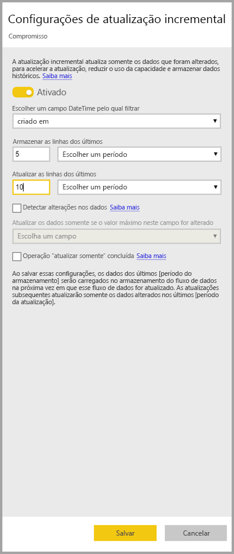
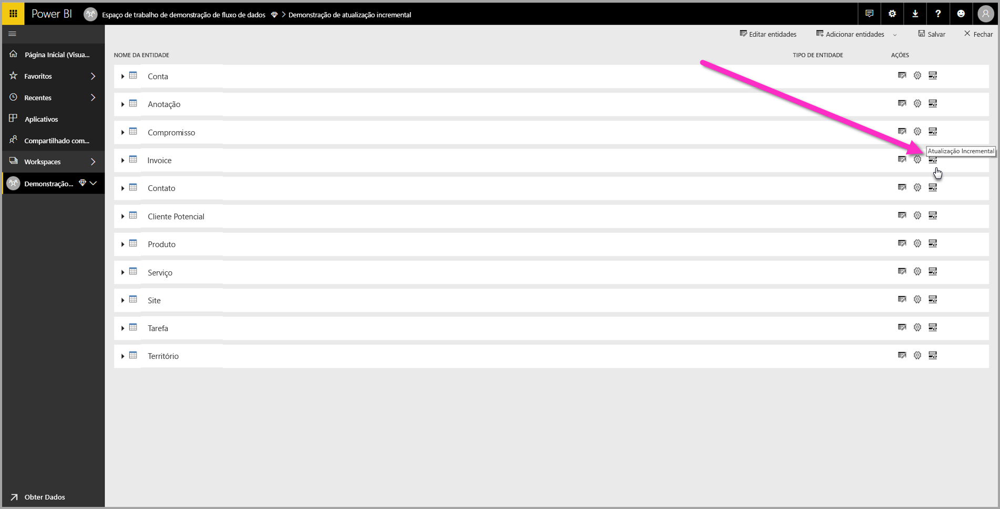
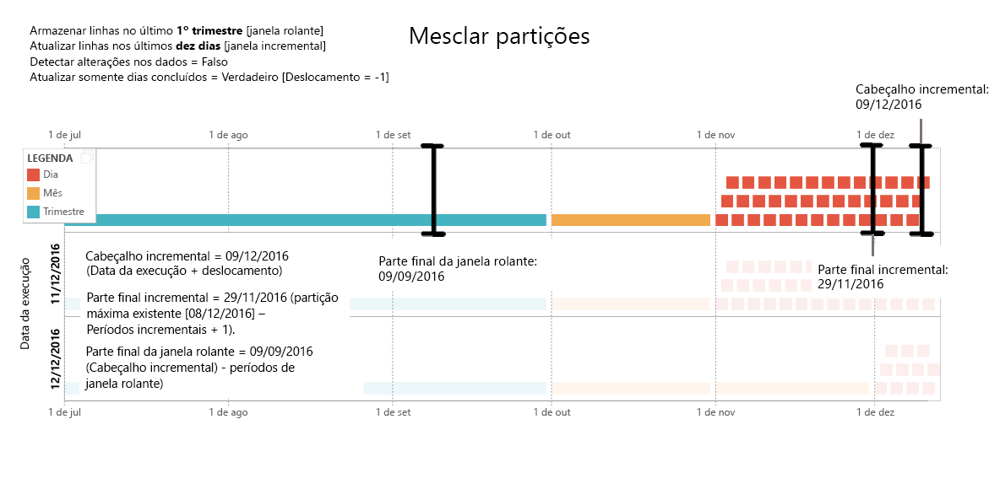
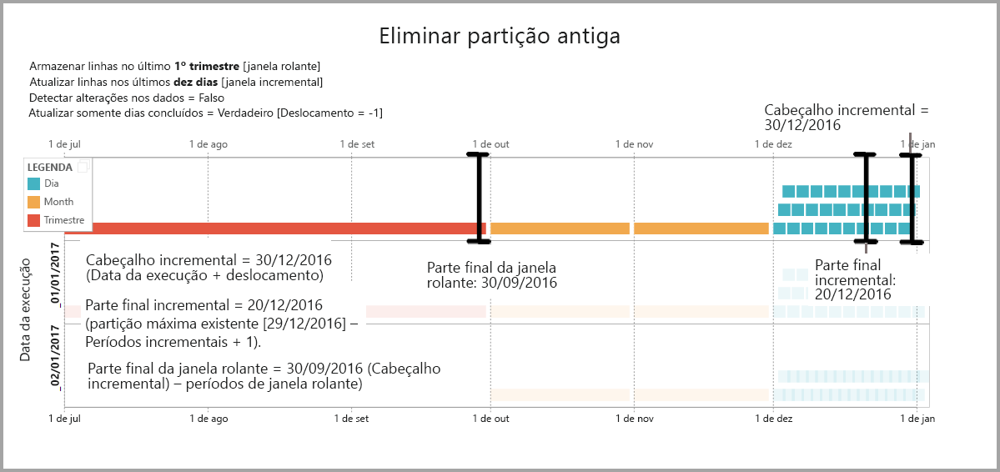
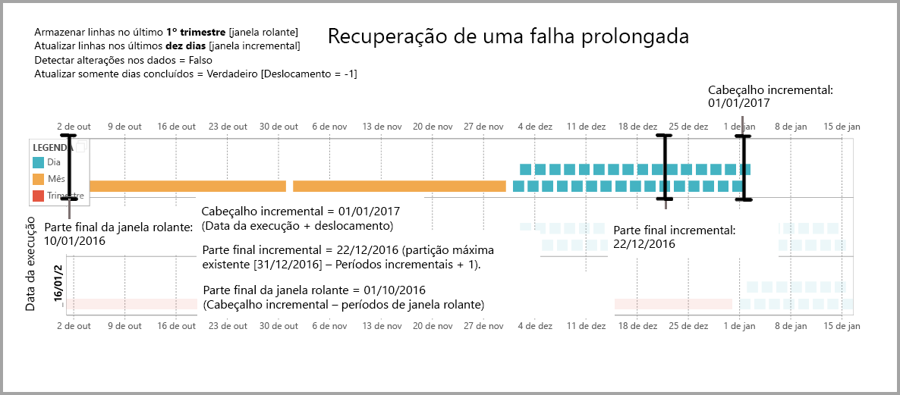

# Usar a atualização incremental com os fluxos de dados do Power BI (versão prévia)

Com os fluxos de dados, você pode trazer grandes quantidades de dados para o Power BI e criar análises e relatórios atrativos. Porém, em alguns casos não é muito prático atualizar uma cópia completa dos dados de origem em cada atualização. Uma boa alternativa é a **atualização incremental**, que oferece os seguintes benefícios para os fluxos de dados:

* **A atualização ocorre com mais rapidez**: somente os dados alterados precisam ser atualizados. Por exemplo, atualizar apenas os últimos cinco dias de um fluxo de dados de 10 anos.
* **A atualização é mais confiável**: por exemplo, não é necessário manter conexões longas com sistemas de origem voláteis.
* **O consumo de recursos é reduzido**: com menos dados para atualizar, o consumo geral da memória e de outros recursos é reduzido.

O uso da atualização incremental para os fluxos de dados do Power BI requer que o espaço de trabalho onde o fluxo de dados reside esteja em [capacidade Premium](service-premium.md) para ser executado, e a fonte de dados ingerida no fluxo de dados deve ter um campo de *datetime* em que a atualização incremental possa ser filtrada. 

## Configuração da atualização incremental para fluxos de dados

Um fluxo de dados pode conter várias entidades. A atualização incremental é configurada no nível da entidade, permitindo que um fluxo de dados armazene entidades totalmente atualizadas e entidades atualizadas incrementalmente.

Para configurar uma entidade incremental atualizada, comece configurando a entidade como faria com qualquer outra. Saiba mais sobre como configurar o fluxo de dados em [Preparação de dados de autoatendimento no Power BI (versão prévia)](service-dataflows-overview.md).

Após o fluxo de dados ser criado e salvo, selecione o ícone da **atualização incremental** na exibição de entidade, conforme mostrado na imagem a seguir:

Ao clicar no ícone, surgirá a janela das **configurações de atualização incremental**. Ao alternar a atualização incremental para a posição **Ativado**, você poderá configurar a atualização incremental.

A lista a seguir explica as configurações na janela **configurações de atualização incremental**. 

1. **Alternância ativar/desativar atualização incremental**: esse controle deslizante alterna a política de atualização incremental entre ativado/desativado para a entidade
2. **Menu suspenso do campo de filtragem**: seleciona o campo de consulta no qual a entidade deve ser filtrada para incrementos. Este campo contém apenas os campos *datetime*. Não é possível usar a atualização incremental se a entidade não contiver um campo *datetime*.
3. **Armazenar linhas do passado**: o exemplo a seguir ajuda a explicar as próximas configurações.

    Para este exemplo, definimos uma política de atualização para armazenar cinco anos de dados no total e atualizar incrementalmente 10 dias de dados. Se a entidade for atualizada diariamente, será realizado o seguinte para cada operação de atualização:

    * Adição de um novo dia de dados.
    * Atualização de 10 dias até a data atual.
    * Remoção de anos civis com mais de cinco anos antes da data atual. Por exemplo, se a data atual for 1º de janeiro de 2019, o ano de 2013 será removido.

    A primeira atualização de fluxo de dados pode demorar um pouco para importar todos os cinco anos, mas as atualizações subsequentes provavelmente serão concluídas em uma pequena fração do tempo de atualização inicial.

4. **Detectar alterações de dados**: a atualização incremental de dez dias é muito mais eficiente do que uma atualização completa de cinco anos, mas talvez possamos fazer ainda mais. Ao marcar a caixa de seleção **Detectar alterações nos dados**, será possível selecionar uma coluna de data/hora para identificar e atualizar somente os dias em que os dados foram alterados. Isso pressupõe que uma coluna dessa exista no sistema de origem, normalmente para fins de auditoria. O valor máximo dessa coluna é avaliado para cada um dos períodos no intervalo incremental. Se os dados não tiverem sido alterados desde a última atualização, não será necessário atualizar o período. No exemplo, isso poderia reduzir ainda mais os dias atualizados incrementalmente de dez para, talvez, dois.

> [!TIP]
> O projeto atual requer que a coluna que detecta as alterações nos dados seja persistente e fique armazenada em cache na memória. É interessante considerar uma das técnicas a seguir para reduzir a cardinalidade e o consumo de memória:
>
>    * Persista apenas o valor máximo dessa coluna no momento da atualização, talvez usando uma função do Power Query.
>    * Reduza a precisão a um nível aceitável considerando seus requisitos de frequência de atualização.

5. **Atualizar somente períodos concluídos**: imagine que a atualização esteja agendada para execução toda manhã às 4h. Caso apareçam dados no sistema de origem durante as primeiras quatro horas desse dia, talvez não seja necessário considerá-los. Não é muito prático nem faz muito sentido considerar algumas métricas comerciais com base em dias parciais, como barris de petróleo por dia no setor de petróleo e gás.

    Outro exemplo em que é mais apropriado fazer a atualização apenas para períodos concluídos diz respeito aos dados de um sistema financeiro. Imagine um sistema financeiro em que os dados do mês anterior sejam aprovados no dia 12 do mês em curso. Você pode definir o intervalo incremental para um mês e agendar a atualização para ser executada no dia 12 do mês. Com essa opção marcada, os dados de janeiro (o período mensal completo mais recente) seriam atualizados em 12 de fevereiro.

> [!NOTE]
> A atualização incremental do fluxo de dados determina as datas de acordo com a seguinte lógica: se uma atualização estiver agendada, a atualização incremental para os fluxos de dados usará o fuso horário definido na política de atualização. Se não existir qualquer cronograma de atualização, a atualização incremental usará a hora do computador que executa a atualização.

## A consulta de atualização incremental

Depois que a atualização incremental é configurada, o fluxo de dados altera automaticamente sua consulta para incluir o filtro por data. É possível editar a consulta gerada automaticamente usando o **Editor Avançado do Power Query** para ajuste ou personalização da atualização. Leia mais sobre a atualização incremental e seu funcionamento na próxima seção.

## A atualização incremental e as entidades computadas versus as vinculadas

Para as entidades *vinculadas*, a atualização incremental atualiza a entidade de origem. Como as entidades vinculadas são simplesmente um ponteiro para a entidade original, a atualização incremental não tem impacto sobre a entidade vinculada. Quando a entidade de origem é atualizada de acordo com a política de atualização que foi definida para ela, toda entidade vinculada deverá pressupor que os dados na origem serão atualizados.

As entidades *computadas* se baseiam em consultas em execução em um repositório de dados, que pode ser outro fluxo de dados. Como tal, as entidades computadas se comportam da mesma maneira que as vinculadas.

Como as entidades computadas e as vinculadas se comportam de maneira semelhante, os requisitos e as etapas de configuração são iguais para ambas. Uma diferença é que, para as entidades computadas, em determinadas configurações, a atualização incremental não pode ser executada de forma otimizada, devido à maneira como as partições são criadas. 

## Alteração entre atualização incremental e completa

Os fluxos de dados são compatíveis com a alteração da política de atualização entre a atualização incremental e a completa. Quando ocorre uma alteração em qualquer direção (de completa para incremental ou de atualização incremental para completa), ela afeta o fluxo de dados após a atualização seguinte.

Ao mover um fluxo de dados de uma atualização completa para uma incremental, a nova lógica de atualização atualiza o fluxo de dados que adota a janela de atualização e faz a incrementação conforme definido nas configurações de atualização incremental.

Ao mover um fluxo de dados de uma atualização incremental para completa, todos os dados acumulados na atualização incremental são substituídos pela política definida na atualização completa. Esta ação deve ser aprovada.

## Conjuntos de dados e fluxo de dados de atualização incremental

A atualização incremental do fluxo de dados e a do conjunto de dados foram desenvolvidas para trabalhar em conjunto. Há compatibilidade e é aceitável ter uma entidade de atualização incremental em um fluxo de dados, totalmente carregada em um conjunto de dados, ou uma entidade totalmente carregada em um fluxo de dados incrementalmente carregado para um conjunto de dados. 

Ambas as abordagens de acordo com as definições especificadas por você nas configurações de atualização.
Leia mais sobre a atualização incremental em [atualização incremental no Power BI Premium](service-premium-incremental-refresh.md).

## Suporte a fuso horário na atualização incremental

A atualização incremental do fluxo de dados depende do horário em que é executada. A filtragem da consulta depende do dia em que é executada.

Para acomodar essas dependências e garantir a consistência dos dados, a atualização incremental para fluxos de dados implementa o seguinte heurístico para os cenários *atualizar agora*:

* No caso de uma atualização agendada ser definida no sistema: a atualização incremental usará as configurações de fuso horário da atualização agendada. Isso garante que, independentemente do fuso horário em que se encontra a pessoa que está atualizando, será sempre consistente com a definição do sistema.

* Caso nenhuma atualização agendada seja definida, os fluxos de dados usarão o fuso horário do computador do usuário que atualiza.

A atualização incremental também pode ser invocada usando APIs. Nesse caso, a chamada à API pode manter uma configuração de fuso horário usada na atualização. O uso de APIs pode ser útil para fins de teste e validação.

## Detalhes de implementação de atualização incremental

Os fluxos de dados usam o particionamento para a atualização incremental. Quando os pontos de extremidade XMLA para o Power BI Premium ficam disponíveis, as partições se tornam visíveis. A atualização incremental nos fluxos de dados retém o número mínimo de partições para atender aos requisitos da política de atualização. As partições antigas que saem do intervalo são descartadas, mantendo uma janela rolante. As partições são mescladas oportunamente, reduzindo o número total de partições necessárias. Isso melhora a compactação e, em alguns casos, pode melhorar o desempenho da consulta.

Os exemplos nesta seção compartilham a política de atualização a seguir:

* Armazenar linhas no último um trimestre
* Atualizar linhas nos últimos dez dias
* Detectar alterações nos dados = Falso
* Atualizar somente dias concluídos = Verdadeiro

### Mesclar partições

Neste exemplo, as partições do dia são mescladas automaticamente com o nível mensal depois de extrapolarem o intervalo incremental. As partições no intervalo incremental precisam ser mantidas na granularidade diária para permitir que somente esses dias sejam atualizados.
A operação de atualização com *Data da Execução 11/12/2016* mescla os dias em novembro, por ficarem fora do intervalo incremental.

### Eliminar partições antigas

As partições antigas que ficam fora do intervalo total são removidas. A operação de atualização com *Data da Execução 2/1/2017* descarta a partição para o T3 de 2016 por ficar fora do intervalo total.

### Recuperação de uma falha prolongada

Este exemplo simula como o sistema se recupera bem de uma falha prolongada. Digamos que a atualização não seja executada com êxito porque as credenciais da fonte de dados expiraram e o problema leva 13 dias para ser resolvido. O intervalo incremental é de apenas 10 dias.

A próxima operação de atualização bem-sucedida, com *Data da Execução 15/01/2017* precisa preencher retroativamente os 13 dias faltante e atualizá-los. Ela também precisa atualizar os nove dias anteriores porque não foram atualizados de acordo com o cronograma normal. Em outras palavras, o intervalo incremental aumenta de dez para 22 dias.

A operação de atualização seguinte, com *Data da Execução 16/1/2017*, aproveita a oportunidade para mesclar os dias de dezembro e os meses no T4 de 2016.

## Próximas etapas

Este artigo descreveu a atualização incremental para fluxos de dados. Confira outros artigos que podem ser úteis.

* [Preparação de dados de autoatendimento com fluxos de dados](service-dataflows-overview.md)
* [Criação e uso de fluxos de dados no Power BI](service-dataflows-create-use.md)
* [Uso de fluxos de dados com fontes de dados locais (versão prévia)](service-dataflows-on-premises-gateways.md)
* [Recursos de desenvolvedor para fluxos de dados do Power BI (versão prévia)](service-dataflows-developer-resources.md)

Confira mais informações sobre o Power Query e a atualização agendada nestes artigos:
* [Visão geral da Consulta no Power BI Desktop](desktop-query-overview.md)
* [Configuração de atualização agendada](refresh-scheduled-refresh.md)

Leia este artigo de visão geral para saber mais sobre o Common Data Service:
* [Common Data Service - visão geral ](https://docs.microsoft.com/powerapps/common-data-model/overview)

