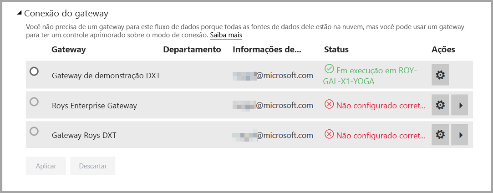
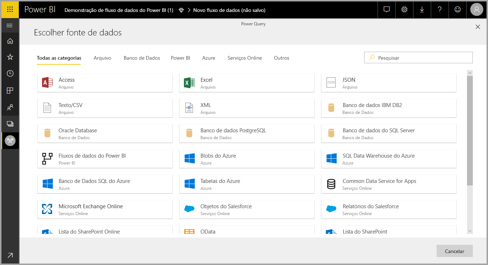
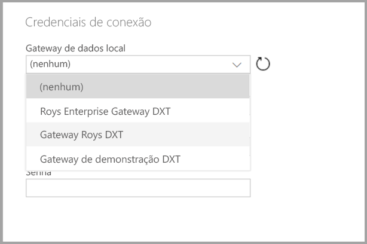

# Uso de fluxos de dados com fontes de dados locais (versão prévia)

Com **fluxos de dados**, você pode criar uma coleção de dados de várias fontes, limpar os dados, transformá-los e, em seguida, carregá-los para o armazenamento do Power BI. Ao criar o fluxo de dados, você pode querer usar fontes de dados locais. Este artigo esclarece os requisitos associados à criação de fluxos de dados e como o **Gateway Corporativo** precisa ser configurado para ativar essas conexões.

> [!NOTE]
> A funcionalidade de fluxo de dados está em versão prévia e está sujeita a alterações e atualizações antes da disponibilidade geral.
 
## Configurar um Gateway Corporativo para uso com fluxos de dados

Para usar uma fonte de dados local em um fluxo de dados, qualquer usuário que criar o fluxo de dados deve ter um **Gateway Corporativo** instalado e configurado. O usuário que cria o fluxo de dados também deve ser o administrador do Gateway Corporativo para usar esse gateway para um fluxo de dados.

> [!NOTE]
> Os fluxos de dados só têm suporte usando os Gateways Corporativos.

## Usar uma fonte de dados local em um fluxo de dados

Ao criar um fluxo de dados, selecione uma fonte de dados local na lista de fontes de dados, conforme mostrado na imagem a seguir.

Depois de fazer sua seleção, você é solicitado a fornecer os detalhes da conexão para o Gateway Corporativo que será usado para acessar os dados locais. Você deve selecionar o próprio gateway e fornecer credenciais para o gateway selecionado. Somente gateways para os quais o usuário é um administrador aparecem na lista suspensa.

## Monitorar seu gateway

Você pode monitorar seu Gateway Corporativo para um fluxo de dados da mesma maneira que monitora gateways para um conjunto de dados.

Na tela de configurações do fluxo de dados no Power BI, você pode monitorar o status do gateway de um fluxo de dados e atribuir um gateway ao fluxo de dados, conforme mostrado na imagem a seguir.

## Alterar um gateway

Você pode alterar o Gateway Corporativo usado para um determinado fluxo de dados de duas maneiras:

1. **Na ferramenta de autoria** – você pode alterar o gateway atribuído a todas as suas consultas usando a ferramenta de criação de fluxo de dados.

    > [!NOTE]
    > O fluxo de dados tentará localizar ou criar as fontes de dados necessárias usando o novo gateway. Se isso for impossível, você não poderá alterar o gateway até que todos os fluxos de dados necessários estejam disponíveis no gateway selecionado.

2. **Na tela de configurações** – você pode alterar o gateway atribuído usando a tela de configurações do fluxo de dados no serviço do Power BI.

Para saber mais sobre Gateways Corporativos, confira [Gateway de dados no local](service-gateway-onprem.md).

## Considerações e limitações

Existem algumas limitações conhecidas para o uso de Gateways Corporativos e fluxos de dados:

* Cada fluxo de dados pode usar apenas um gateway. Como tal, todas as consultas devem ser configuradas usando o mesmo gateway.
* A alteração do gateway afeta todo o fluxo de dados.
* Se vários gateways forem necessários, a melhor prática é criar vários fluxos de dados (um para cada gateway) e usar os recursos de referência de computação ou entidade para unificar os dados.
* Os fluxos de dados só têm suporte usando os gateways corporativos. Os gateways pessoais não estarão disponíveis para seleção nas telas de listas suspensas e configurações.

## Próximas etapas

Este artigo forneceu informações sobre como usar a fonte de dados local para fluxos de dados e como usar e configurar gateways para acessar esses dados. Os artigos a seguir também podem ser úteis

* [Preparação de dados de autoatendimento com fluxos de dados](service-dataflows-overview.md)
* [Criação e uso de fluxos de dados no Power BI](service-dataflows-create-use.md)
* [Uso de entidades computadas no Power BI Premium (versão prévia)](service-dataflows-computed-entities-premium.md)
* [Recursos de desenvolvedor para fluxos de dados do Power BI (versão prévia)](service-dataflows-developer-resources.md)

Confira mais informações sobre o Power Query e a atualização agendada nestes artigos:
* [Visão geral da Consulta no Power BI Desktop](desktop-query-overview.md)
* [Configuração de atualização agendada](refresh-scheduled-refresh.md)

Leia este artigo de visão geral para saber mais sobre o Common Data Service:
* [Common Data Service - visão geral ](https://docs.microsoft.com/powerapps/common-data-model/overview)

