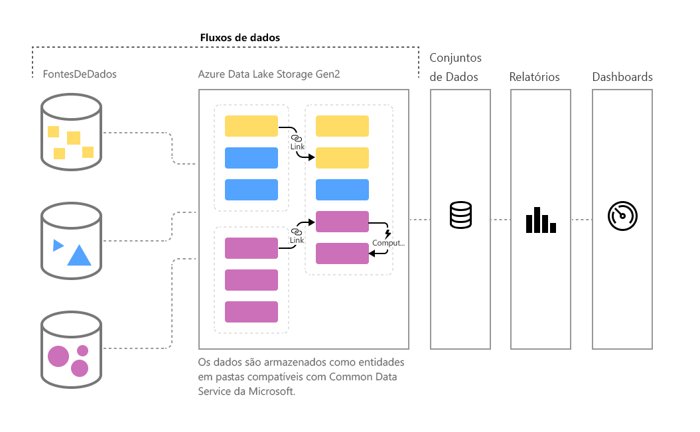

# Preparação de dados de autoatendimento no Power BI (versão prévia)

Conforme o volume de dados continua a crescer, aumenta o desafio de estruturar esses dados em informações práticas e bem formadas. Os dados precisam estar prontos para análise e para o preenchimento de elementos visuais, relatórios e painéis, para que possamos transformar rapidamente nossos volumes de dados em insights práticos. Com a **preparação de dados de autoatendimento** para Big Data no Power BI, é possível passar de dados para insights do Power BI com apenas alguns cliques.

O Power BI apresenta **fluxos de dados** para ajudar as organizações a unificar dados de diferentes fontes e prepará-los para serem modelados. Os analistas podem criar fluxos de dados facilmente, usando ferramentas conhecidas de autoatendimento. Os fluxos de dados são usados para ingerir, transformar, integrar e enriquecer Big Data definindo conexões de fonte de dados, lógica ETL, cronogramas de atualização e muito mais. Além disso, o novo mecanismo de cálculo controlado por modelos que faz parte dos fluxos de dados torna o processo de preparação de dados mais gerenciável, mais determinista e menos incômodo para analistas de dados e criadores de relatório. Do mesmo modo que as planilhas lidam com recálculos em todas as fórmulas afetadas, os fluxos de dados gerenciam as alterações de uma entidade ou elemento de dados em seu nome, automatizando atualizações e atenuando o que costumava incluir verificações de lógica tediosas e demoradas até mesmo em uma atualização básica de dados. Com os fluxos de dados, as tarefas que antes exigiam a supervisão de cientistas de dados (e muitas horas ou dias para serem concluídas) agora podem ser tratadas com alguns cliques por analistas e criadores de relatório. 

Os dados são armazenados como entidades no [**Common Data Service**](https://docs.microsoft.com/powerapps/common-data-model/overview) no Azure Data Lake Storage Gen2. Os fluxos de dados são criados e gerenciados em espaços de trabalho do aplicativo usando o serviço do Power BI.  

> [!NOTE]
> A funcionalidade de fluxo de dados está em versão prévia e está sujeita a alterações e atualizações antes da disponibilidade geral.

 
Os **fluxos de dados** são projetados para usar o **Common Data Service**uma coleção padronizada, modular e extensível de esquemas de dados publicados pela Microsoft que são projetados para facilitar a criação, o uso e a análise de dados. Com esse modelo, é possível passar de fonte de dados para painéis do Power BI com quase nenhum zero atrito.

Você pode usar fluxos de dados para a ingestão de dados de um conjunto grande e crescente de fontes de dados compatíveis locais e baseadas em nuvem, incluindo Dynamics 365, Salesforce, Banco de Dados SQL, Excel, SharePoint e muito mais.

Em seguida, pode mapear dados para entidades padrão no Common Data Service, modificar e ampliar as entidades existentes e criar entidades personalizadas. Usuários avançados podem criar fluxos de dados totalmente personalizados, usando uma experiência interna de criação do Power Query de autoatendimento, com pouco ou nenhum código, semelhante à experiência do Power Query que milhões de usuários do Power BI Desktop e do Excel já conhecem.  

Depois de criar um fluxo de dados, você pode usar o Power BI Desktop e o serviço do Power BI para criar conjuntos de dados, relatórios, painéis e aplicativos que aproveitem o poder do Common Data Service para gerar insights detalhados sobre suas atividades comerciais. 

O cronograma de atualização de dados é gerenciado diretamente no espaço de trabalho em que o fluxo de dados foi criado, assim como os conjuntos de dados. 

## Como os fluxos de dados funcionam

Veja aqui alguns exemplos de como os fluxos de dados podem funcionar para você:

* As organizações podem mapear seus dados para entidades padrão no Common Data Service ou criar suas próprias entidades personalizadas. Essas entidades podem ser usadas como blocos de construção para criar relatórios, painéis e aplicativos prontos para uso e distribuí-los aos usuários da organização. 

* Com a extensa coleção de conectores de dados da Microsoft, as organizações podem conectar suas próprias fontes de dados a fluxos de dados, usando o Power Query para mapear os dados desde a origem e levá-los para o Power BI. Depois que esses dados são importados por um fluxo de dados (e atualizados em uma frequência especificada), essas entidades de fluxo de dados podem ser usadas no aplicativo Power BI Desktop para criar relatórios e painéis atrativos. 

## Como usar fluxos de dados

A seção anterior descreveu várias maneiras de usar fluxos de dados para criar rapidamente análises avançadas no Power BI. Nesta seção, você verá como gerar insights rapidamente usando fluxos de dados em uma organização, além de obter uma exibição rápida de como os profissionais de BI podem criar seus próprios fluxos de dados e personalizar informações para sua própria organização.

### Estender o Common Data Service para suas necessidades comerciais
Em organizações que queiram estender o Common Data Service (CDM), os fluxos de dados permitem aos profissionais de business intelligence personalizar entidades padrão ou criar novas. Essa abordagem de autoatendimento para personalizar o modelo de dados pode ser usada com fluxos de dados para criar aplicativos e painéis do Power BI ajustados para uma organização.

### Definir fluxos de dados de forma programática
Talvez você queira desenvolver suas próprias soluções de programação para criar fluxos de dados. Com as APIs públicas e a capacidade de criar arquivos de definição de fluxo de dados personalizados (model.json) de forma programática, você cria uma solução personalizada que atende às necessidades de análise e de dados exclusivos da sua organização. 

As APIs públicas oferecem aos desenvolvedores maneiras simples e fáceis de interagir com o Power BI e com os fluxos de dados.

### Ampliar suas capacidades com o Azure
O Azure Data Lake Storage Gen2 vem incluído em cada assinatura paga do Power BI (10 GB por usuário, 100 TB por nó P1). Portanto, é fácil começar a preparação de dados de autoatendimento no Azure Data Lake. 

O Power BI pode ser configurado para armazenar dados de fluxo de dados na conta do Azure Data Lake Storage Gen2 da sua organização. Quando o Power BI é conectado à assinatura do Azure, os desenvolvedores e cientistas de dados podem aproveitar os produtos avançados do Azure, como o Azure Machine Learning, Azure Databricks, Azure Data Factory e muito mais.

O Power BI também pode se conectar a pastas com dados esquematizados no formato Common Data Service, que são armazenados na conta do Azure Data Lake Storage da sua organização. Essas pastas podem ser criadas por serviços como os serviços de dados do Azure. Ao se conectarem a essas pastas, os analistas podem trabalhar perfeitamente com esses dados no Power BI. 

Para obter mais informações sobre Azure Data Lake Storage Gen2 e integração de fluxos de dados, incluindo como criar fluxos de dados que residem no Azure Data Lake de sua organização, confira [fluxos de dados e a integração do Azure Data Lake (versão prévia)](service-dataflows-azure-data-lake-integration.md).

## Capacidades de fluxo de dados no Power BI Premium

Para que os recursos de fluxo de dados e as cargas de trabalho funcionem em uma assinatura do Power BI Premium, a carga de trabalho do fluxo de dados dessa capacidade Premium precisa ser ativada. Saiba mais sobre o Power BI Premium no artigo [O que é o Power BI Premium](service-premium.md). 

A tabela a seguir descreve os recursos de fluxo de dados e suas capacidades ao usar uma conta do Power BI Pro e como isso se compara ao uso do Power BI Premium.

|Capacidade do fluxo de dados | Power BI Pro |   Power BI Premium |
|---------|---------|---------|
|Atualização agendada| 8 por dia|  48|
|Armazenamento total| 10 GB/usuário  |100 TB/nó|
|Criação de fluxo de dados com o Power Query Online|    +   |+|
|Gerenciamento de fluxo de dados dentro do Power BI|   +|  +|
|Conector de dados de fluxos de dados no Power BI Desktop|  +|  +|
|Integração com o Azure|    +|  +|
|Entidades computadas (transformações no armazenamento via M) | |   +|
|Novos conectores|    +|  +|
|Atualização incremental do fluxo de dados|  |   +|
|Execução na capacidade do Power BI Premium / Execução paralela de transformações|   |   +|
|Entidades vinculadas de fluxo de dados| |        +|
|Esquema padronizado / Suporte interno para o Common Data Service|  +|  +|

## Resumo da preparação de dados de autoatendimento para Big Data no Power BI
Conforme mencionado anteriormente neste artigo, há vários cenários e exemplos em que os **fluxos de dados** permitem que você tenha um melhor controle – e insights mais rápidos – de seus dados comerciais. Com um modelo de dados padrão (esquema) definido pelo Common Data Service, os fluxos de dados podem importar seus dados comerciais valiosos e preparar os dados para modelagem e criação de insights de BI em um período muito curto... o que costumava demorar meses ou até mais. 

Ao armazenarem dados comerciais no formato padronizado do **Common Data Service**, os profissionais de BI (ou desenvolvedores) podem criar aplicativos que geram relatórios e elementos visuais rápidos, fáceis e automáticos. Isso inclui, entre outros:

* Mapear seus dados para entidades padrão no Common Data Service para unificar dados e aproveitar o esquema conhecido para gerar insights prontos para uso
* Criar suas próprias entidades personalizadas para unificar dados em toda a organização 
* Usar e atualizar **dados externos** como parte de um fluxo de dados e habilitar a importação desses dados para gerar insights
* Introdução aos fluxos de dados para desenvolvedores

## Próximas etapas

Este artigo ofereceu uma visão geral da preparação de dados de autoatendimento para big data no Power BI e muitas maneiras de utilizá-la. Os artigos a seguir oferecem mais detalhes sobre cenários de uso comuns para fluxos de dados. 

* [Criação e uso de fluxos de dados no Power BI](service-dataflows-create-use.md)
* [Uso de entidades computadas no Power BI Premium (versão prévia)](service-dataflows-computed-entities-premium.md)
* [Uso de fluxos de dados com fontes de dados locais (versão prévia)](service-dataflows-on-premises-gateways.md)
* [Recursos de desenvolvedor para fluxos de dados do Power BI (versão prévia)](service-dataflows-developer-resources.md)
* [Integração entre fluxos de dados e o Azure Data Lake (versão prévia)](service-dataflows-azure-data-lake-integration.md)

Confira mais informações sobre o Power Query e a atualização agendada nestes artigos:
* [Visão geral da Consulta no Power BI Desktop](desktop-query-overview.md)
* [Configuração de atualização agendada](refresh-scheduled-refresh.md)

Leia este artigo de visão geral para saber mais sobre o Common Data Service:
* [Common Data Service - visão geral ](https://docs.microsoft.com/powerapps/common-data-model/overview)

