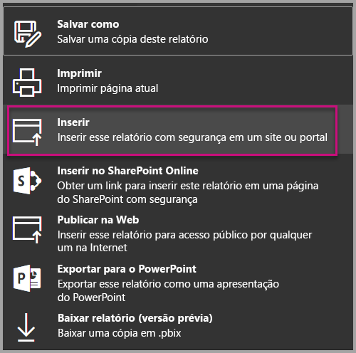
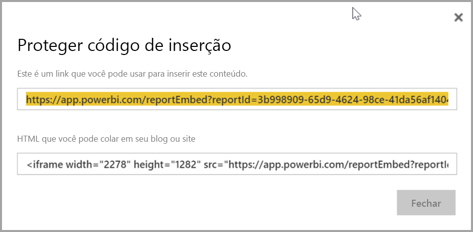
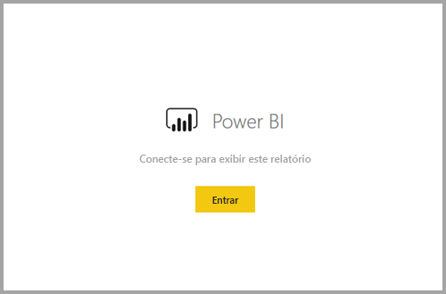
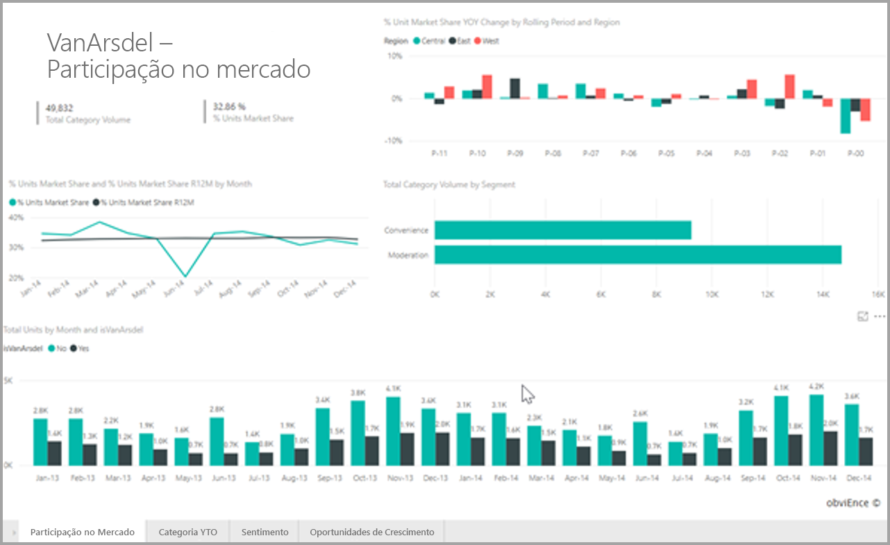

# <a name="embed-a-report-in-a-secure-portal-or-website"></a>Inserir um relatório em um site ou portal seguro

A nova opção **Inserir** segura para relatórios no Power BI permite que os usuários insiram relatórios de maneira fácil e segura em portais internos da Web, **baseados na nuvem** ou **hospedados no local**, como o SharePoint 2019. Os relatórios inseridos dessa maneira respeitam todas as permissões de itens e segurança de dados por meio da segurança em nível de linha (RLS). O recurso foi projetado para permitir a inserção sem código em qualquer portal que aceite uma URL ou iFrame para inserção.

A opção **Inserir** também é compatível com [Filtros de URL](service-url-filters.md) e configurações de URL. A opção **Inserir** permite a integração com portais usando uma abordagem de código baixo que requer conhecimentos básicos de HTML e JavaScript.

## <a name="how-to-embed-power-bi-reports-into-portals"></a>Como **Inserir** relatórios do Power BI em portais

1. A nova opção **Inserir** está disponível no menu **Arquivo** para relatórios no serviço do Power BI.

    

2. Escolha a opção Inserir para abrir uma caixa de diálogo que fornece um link e um iFrame que é usado para inserir o relatório com segurança.

    

3. Após você inserir sua URL em seu portal da Web ou se você abrir a URL diretamente, o usuário será autenticado antes de acessar o relatório. Abaixo, o usuário não entrou no Power BI na sessão do navegador. Ao pressionar **Entrar**, talvez seja necessário abrir uma nova janela ou guia do navegador. Se você não for solicitado a entrar, verifique se há bloqueadores de pop-up.

    

4. Depois que o usuário entrar, o relatório será aberto, mostrando os dados e permitindo que os usuários naveguem entre as páginas e definam filtros. O relatório é mostrado apenas para usuários que têm permissão para visualizar o relatório no Power BI. Todas as regras de RLS (segurança em nível de linha) também são aplicadas. Por último, o usuário precisa estar licenciado corretamente, ou precisa de uma licença do Power BI Pro ou o relatório deve estar em um espaço de trabalho que esteja em uma capacidade do Power BI Premium. O usuário precisa entrar sempre que abrir uma nova janela do navegador, mas, depois de ter entrado uma vez, os outros relatórios serão carregados automaticamente.

    

5. Ao usar a opção iFrame, convém editar o HTML fornecido para especificar a altura e a largura desejadas para se ajustar à página da Web de seu portal.

    

## <a name="granting-access-to-reports"></a>Conceder acesso aos relatórios

A opção Inserir não permite automaticamente que os usuários exibam o relatório. As permissões para exibir o relatório são definidas dentro do serviço do Power BI.

Para fornecer acesso ao relatório no serviço do Power BI, você pode compartilhar o relatório com os usuários que precisam ter acesso ao relatório inserido. Se estiver usando um grupo do Office 365, você pode listar o usuário como um membro do espaço de trabalho de aplicativo no serviço do Power BI. Para obter mais informações, consulte como [gerenciar um espaço de trabalho de aplicativo](service-manage-app-workspace-in-power-bi-and-office-365.md).

## <a name="licensing"></a>Licenças

Os usuários que exibem um relatório incorporado precisam de uma licença do Power BI Pro ou o conteúdo precisa estar em um espaço de trabalho que esteja em uma [capacidade do Power BI Premium (SKU EM ou P)](service-admin-premium-purchase.md).

## <a name="customize-your-embed-experience-using-url-settings"></a>Personalizar sua experiência de inserção usando configurações de URL

A URL de inserção oferece suporte a várias configurações de entrada que ajudam você a personalizar sua experiência do usuário. Se você estiver usando o iFrame fornecido, atualize a URL nas configurações de src do iFrame.

| Propriedade  | Descrição  |  |  |  |
|--------------|-----------------------------------------------------------------------------------------------------------------------------------------------------------------------------------------------------------------------|---|---|---|
| pageName  | Você pode usar o parâmetro de cadeia de caracteres de consulta **pageName** para definir qual página do relatório abrir. O valor **pageName** corresponde ao final da URL do relatório quando um relatório é exibido no serviço do Power BI, conforme mostrado abaixo. |  |  |  |
| Filtros de URL  | Você pode usar [Filtros de URL](service-url-filters.md) na URL de inserção recebida da interface do usuário do Power BI para filtrar o conteúdo da inserção. Dessa forma, você pode criar integrações de código baixo tendo apenas experiências básicas em HTML e JavaScript.  |  |  |  |

## <a name="set-which-page-opens-when-the-report-is-embedded"></a>Definir qual página será aberta quando o relatório for inserido

O valor fornecido na configuração *pageName* corresponde ao final da URL do relatório quando um relatório é exibido no serviço do Power BI.

1. Abra o relatório no serviço do Power BI em seu navegador da Web e copie a URL da barra de endereço.

    

2. Anexe a configuração *pageName* à URL.

    

## <a name="filter-report-content-using-url-filters"></a>Filtrar o conteúdo do relatório usando filtros de URL

Para alguns recursos avançados, você pode usar [Filtros de URL](service-url-filters.md) para criar mais experiências usando o relatório. Por exemplo, a URL a seguir filtra o relatório para mostrar dados ao setor de energia.

Usar a combinação de **pageName** e [Filtros de URL](service-url-filters.md) pode ser poderosa. Você pode criar experiências usando HTML e JavaScript básicos.

Por exemplo, veja como você pode adicionar um botão a uma página HTML:

```html
<button class="textLarge" onclick='show("ReportSection", "Energy");' style="display: inline-block;">Show Energy</button>
```

Ao ser pressionado, o botão chama uma função para atualizar o iFrame com uma URL atualizada, que inclui o filtro para o setor de energia.

```javascript
function show(pageName, filterValue)

{

var newUrl = baseUrl + "&pageName=" + pageName;

if(null != filterValue && "" != filterValue)

{

newUrl += "&$filter=Industries/Industry eq '" + filterValue + "'";

}

//Assumes there’s an iFrame on the page with id=”iFrame”

var report = document.getElementById("iFrame")

report.src = newUrl;

}
```


Você pode adicionar quantos botões desejar para criar uma experiência personalizada de código baixo. 

## <a name="considerations-and-limitations"></a>Considerações e limitações

* Não há suporte a usuários convidados externos com integração entre empresas (B2B) do Azure.

* A inserção segura funciona para relatórios publicados no serviço do Power BI.

* O usuário precisa entrar para visualizar o relatório sempre que abrir uma nova janela do navegador.

* Alguns navegadores exigem que você atualize a página após entrar, especialmente ao usar os modos InPrivate ou Incognito.

* Para obter uma experiência de logon único, use a opção Inserir no SharePoint Online ou crie uma integração personalizada usando a abordagem [o usuário possui dados](developer/embed-sample-for-your-organization.md). Saiba mais sobre a abordagem [o usuário possui dados](developer/embed-sample-for-your-organization.md).

* O recurso de autenticação automática fornecido com a opção **Inserir** não funciona com a API JavaScript do Power BI. Para a API JavaScript do Power BI, use a abordagem [o usuário possui dados](developer/embed-sample-for-your-organization.md) para inserção. Saiba mais sobre a abordagem [o usuário possui dados](developer/embed-sample-for-your-organization.md).

## <a name="next-steps"></a>Próximas etapas

* [Maneiras de compartilhar seu trabalho](service-how-to-collaborate-distribute-dashboards-reports.md)

* [Filtros de URL](service-url-filters.md)

* [Web part do relatório do SharePoint Online](service-embed-report-spo.md)

* [Publicar na Web](service-publish-to-web.md)