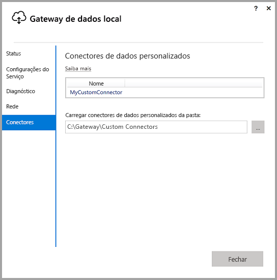
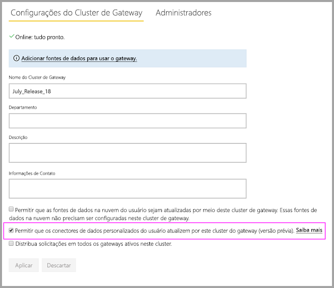
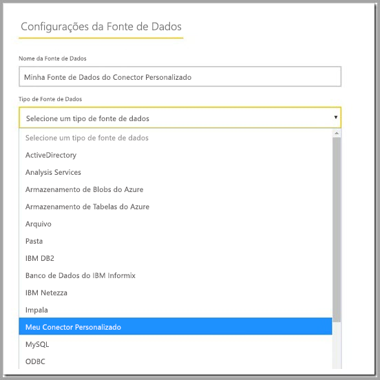

# Usar conectores de dados personalizados com o gateway de dados local

[!INCLUDE [gateway-rewrite](includes/gateway-rewrite.md)]

Os conectores de dados para o Power BI permitem que você se conecte dados e os acesse em um aplicativo, serviço ou fonte de dados. É possível desenvolver conectores de dados personalizados e usá-los no Power BI Desktop.

Para saber mais sobre como desenvolver conectores de dados personalizados para o Power BI, confira a [página do GitHub do SDK do Conector de Dados](http://aka.ms/dataconnectors). Este site inclui informações de introdução e exemplos para o Power BI e o Power Query.

Quando você cria relatórios no Power BI Desktop que usam conectores de dados personalizados, é possível usar o gateway de dados local para atualizar esses relatórios no serviço do Power BI.

## Como habilitar e usar essa funcionalidade

Quando você instala a versão de julho de 2018 do gateway de dados local ou uma versão mais recente, é possível ver uma guia **Conectores** no aplicativo de gateway de dados local com uma opção de escolher uma pasta da qual carregar conectores personalizados. Escolha uma pasta que pode ser acessada pelo usuário que executa o serviço de gateway (que é *NT SERVICE\PBIEgwService* por padrão). O gateway carrega automaticamente os arquivos de conector personalizados localizados nessa pasta e você deve vê-los na lista dos conectores de dados.

Se estiver usando a versão pessoal do gateway de dados local (modo pessoal), você deverá poder carregar seu relatório do Power BI para o serviço do Power BI e usar o gateway para atualizá-lo.

Para o gateway de dados local, ainda é necessário criar uma fonte de dados para seu conector personalizado. Na página de configurações do gateway no serviço do Power BI, você deve ver uma nova opção quando seleciona o cluster de gateway para permitir o uso de conectores personalizados com esse cluster. Certifique-se de que todos os gateways no cluster têm a versão da atualização de julho de 2018 ou posterior para que essa opção esteja disponível. Agora selecione essa opção para habilitar o uso de conectores personalizados com este cluster.

Quando essa opção estiver habilitada, você verá seus conectores personalizados como fontes de dados disponíveis que podem ser criadas neste cluster de gateway. Depois de criar uma fonte de dados usando seu novo conector personalizado, será possível atualizar os relatórios do Power BI usando esse conector personalizado no serviço do Power BI.

## Considerações e limitações

* Certifique-se de que a pasta criada está acessível para o serviço de gateway de tela de fundo. Normalmente, as pastas na pasta Windows ou em pastas do sistema do seu usuário não estarão acessíveis. O aplicativo de gateway de dados local mostrará uma mensagem se a pasta não estiver acessível (isso não se aplica à versão pessoal do gateway)
* Para os conectores personalizados funcionarem com o gateway de dados local, eles precisam implementar uma seção "TestConnection" no código do conector personalizado. Isso não é necessário ao usar conectores personalizados com o Power BI Desktop. Você pode ter um que funciona com a Área de trabalho, mas não com o gateway por esse motivo. Consulte [esta documentação](https://github.com/Microsoft/DataConnectors/blob/master/docs/m-extensions.md#implementing-testconnection-for-gateway-support) sobre como implementar uma seção TestConnection.

## Próximas etapas

* [Gerenciar sua fonte de dados – Analysis Services](service-gateway-enterprise-manage-ssas.md)  
* [Gerenciar sua fonte de dados – SAP HANA](service-gateway-enterprise-manage-sap.md)  
* [Gerenciar sua fonte de dados – SQL Server](service-gateway-enterprise-manage-sql.md)  
* [Gerenciar sua fonte de dados – Oracle](service-gateway-onprem-manage-oracle.md)  
* [Gerenciar sua fonte de dados – Importar/Atualização agendada](service-gateway-enterprise-manage-scheduled-refresh.md)  

* [Definir as configurações de proxy do gateway de dados local](/data-integration/gateway/service-gateway-proxy)  
* [Use o Kerberos para SSO (logon único) do Power BI para fontes de dados locais](service-gateway-sso-kerberos.md)  

Mais perguntas? [Experimente a Comunidade do Power BI](http://community.powerbi.com/)
