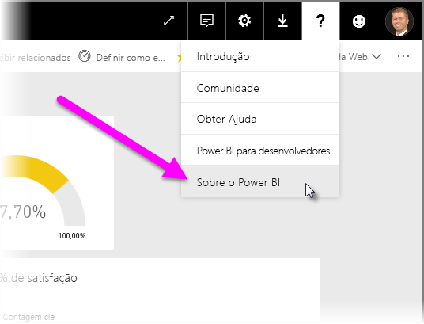

# Diretrizes para implantar um gateway de dados para o Power BI

[!INCLUDE [gateway-rewrite](includes/gateway-rewrite.md)]

Este artigo fornece diretrizes e considerações para implantar um gateway de dados do Power BI em seu ambiente de rede.

Para obter informações sobre como baixar, instalar, configurar e gerenciar o gateway de dados local, consulte [O que é um gateway de dados local](/data-integration/gateway/service-gateway-onprem). Você também pode saber mais sobre o gateway de dados local e o Power BI visitando o [Microsoft Power blog](https://powerbi.microsoft.com/blog/) e o site da [Comunidade do Power BI da Microsoft](https://community.powerbi.com/).

## Considerações de instalação para o gateway de dados local

Antes de instalar o gateway de dados local para seu serviço de nuvem do Power BI, há algumas considerações que você deve ter em mente. As seções a seguir descrevem essas considerações.

### Número de usuários

O número de usuários que consomem um relatório que está usando o gateway é uma métrica importante que decide onde instalar o gateway. Veja algumas perguntas a serem consideradas:

* Os usuários estão usando esses relatórios em diferentes momentos do dia?
* Que tipos de conexões eles estão usando (DirectQuery ou Importação)?
* Todos os usuários estão usando o mesmo relatório?

Se todos os usuários estiverem acessando um determinado relatório ao mesmo tempo todos os dias, instale o gateway em um computador capaz de tratar todas essas solicitações (consulte as seções a seguir para contadores de desempenho e os requisitos mínimos que podem ajudá-lo a determinar isso).

Há uma restrição no **Power BI** que permite apenas *um* gateway por *relatório*. Portanto, mesmo se um relatório basear-se em várias fontes de dados, todas essas fontes de dados devem passar por um único gateway. No entanto, se um dashboard basear-se em *vários* relatórios, será possível usar um gateway dedicado para cada relatório de contribuição e, assim, distribuir o carregamento do gateway entre esses vários relatórios que contribuem para um único dashboard.

### Tipo de conexão

O **Power BI** oferece dois tipos de conexão: **DirectQuery** e **Importação**. Nem todas as fontes de dados dão suporte aos dois tipos de conexão e muitos motivos podem contribuir para escolher um em vez do outro, como requisitos de segurança, desempenho, limites de dados e tamanhos de modelo de dados. Você pode saber mais sobre o tipo de conexão e as fontes de dados com suporte na seção [lista de tipos de fontes de dados disponíveis](service-gateway-data-sources.md#list-of-available-data-source-types).

Dependendo de qual tipo de conexão for usado, o uso do gateway poderá ser diferente. Por exemplo, você deve tentar experimentar separar as fontes de dados do **DirectQuery** das fontes de dados de **Atualização agendada** sempre que possível (supondo que eles estejam em relatórios diferentes e possam ser separadas). Fazer isso impede que o gateway tenha milhares de solicitações do DirectQuery em fila no mesmo tempo que a atualização agendada da manhã de um modelo de dados de tamanho grande usada para o dashboard principal da empresa. Veja o que considerar para cada uma:

* Para **Atualização agendada**: dependendo do tamanho da sua consulta e do número de atualizações que ocorrem diariamente, é possível escolher ficar entre os requisitos mínimos de hardware recomendados ou atualizar para um computador de melhor desempenho. Se uma determinada consulta não for fechada, ocorrem transformações no computador do gateway e, dessa forma, ele se beneficia de ter mais RAM disponível.

* Para **DirectQuery**: uma consulta deverá ser enviada sempre que um usuário abrir o relatório ou examinar dados. Portanto, se você previr que mais de 1.000 usuários acessarão os dados ao mesmo tempo, certifique-se de que seu computador tenha componentes de hardware robustos e compatíveis. Mais núcleos de CPU resultará em uma melhor taxa de transferência para uma conexão do **DirectQuery**.

Os [requisitos de instalação](/data-integration/gateway/service-gateway-install#requirements) de um computador para que seja possível instalar nele um gateway de dados local.

### Localização

O local da instalação do gateway pode ter um impacto significativo no desempenho da sua consulta, então tente certificar-se de que seu gateway, os locais de fonte de dados e o locatário do Power BI estejam o mais próximo possível uns dos outros para minimizar a latência de rede. Para determinar o local de locatário do seu Power BI no serviço do Power BI, selecione o ícone **?** no canto superior direito e, em seguida, selecione **Sobre o Power BI**.

Além disso, se você pretende usar o gateway de Power BI com o Azure Analysis Services, verifique se as regiões de dados em ambos correspondem. Para obter mais informações sobre como definir regiões de dados para vários serviços, assista a [este vídeo](https://guyinacube.com/2018/01/power-bi-azure-analysis-services-gateway-data-region/).

## Próximas etapas

* [Definindo as configurações de proxy](/data-integration/gateway/service-gateway-proxy)  
* [Solucionar problemas de gateways – Power BI](service-gateway-onprem-tshoot.md)  
* [Perguntas frequentes do gateway de dados local – Power BI](service-gateway-power-bi-faq.md)  

Mais perguntas? [Experimente a Comunidade do Power BI](http://community.powerbi.com/)

