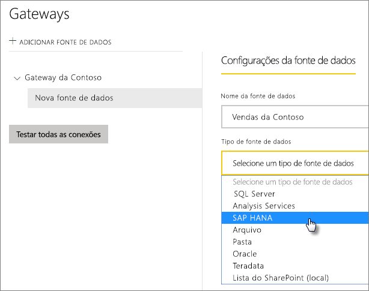
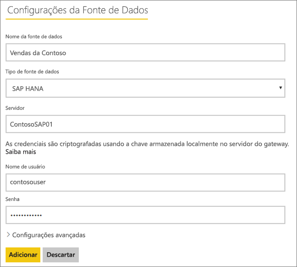
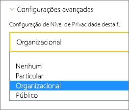

# Gerenciar sua fonte de dados – SAP HANA

[!INCLUDE [gateway-rewrite](includes/gateway-rewrite.md)]

Depois de [instalar o gateway de dados local](/data-integration/gateway/service-gateway-install), será necessário [adicionar fontes de dados](service-gateway-data-sources.md#add-a-data-source) que possam ser usadas com o gateway. Este artigo aborda como trabalhar com gateways e fontes de dados SAP HANA que são usadas para a atualização agendada ou para o DirectQuery.

## Adicionar uma fonte de dados

Para obter informações sobre como adicionar uma fonte de dados, consulte [Adicionar uma fonte de dados](service-gateway-data-sources.md#add-a-data-source). Selecione SAP HANA para o **Tipo de Fonte de Dados**.

Depois de selecionar o tipo de fonte de dados SAP HANA, você preencherá as informações de **Servidor**, **Nome de usuário** e **Senha** da fonte de dados.

> [!NOTE]
> Todas as consultas à fonte de dados serão executadas com essas credenciais. Para saber mais sobre como as credenciais são armazenadas, consulte [Armazenando credenciais criptografadas na nuvem](service-gateway-data-sources.md#storing-encrypted-credentials-in-the-cloud).

Selecione **Adicionar** depois de ter preenchido tudo. Agora você pode usar esta fonte de dados para a atualização agendada ou para o DirectQuery em um servidor SAP HANA local. Você verá *Conexão Bem-sucedida* se tiver êxito.

### Configurações avançadas

Opcionalmente, você pode configurar o nível de privacidade para sua fonte de dados. Ele controla como os dados podem ser combinados. É usado somente para a atualização agendada. Não se aplica ao DirectQuery. Para saber mais sobre os níveis de privacidade para sua fonte de dados, confira [Níveis de privacidade (Power Query)](https://support.office.com/article/Privacy-levels-Power-Query-CC3EDE4D-359E-4B28-BC72-9BEE7900B540).

## Usando a fonte de dados

Depois de criar a fonte de dados, ela estará disponível para uso com as conexões do DirectQuery ou por meio da atualização agendada.

> [!NOTE]
> Os nomes do servidor e do banco de dados devem corresponder entre o Power BI Desktop e a fonte de dados no gateway de dados local.

O vínculo entre o conjunto de dados e a fonte de dados no gateway baseia-se nos nomes do servidor e do banco de dados. Eles devem corresponder. Por exemplo, se você fornecer um Endereço IP como nome do servidor no Power BI Desktop, terá de usar o endereço IP como fonte de dados na configuração do gateway. Se usar *SERVIDOR\INSTÂNCIA* no Power BI Desktop, você precisará usar a mesma coisa na fonte de dados configurada para o gateway.

Isso acontece para o DirectQuery e a atualização agendada.

### Usando a fonte de dados com conexões do DirectQuery

É preciso verificar se os nomes do servidor e do banco de dados correspondem entre o Power BI Desktop e a fonte de dados configurada para o gateway. Para que seja possível publicar os conjuntos de dados do DirectQuery, você também precisará verificar se o usuário está listado na guia **Usuários** da fonte de dados. A seleção para o DirectQuery ocorre no Power BI Desktop quando você importa dados pela primeira vez. Para obter mais informações sobre o uso do DirectQuery, consulte [Usar o DirectQuery no Power BI Desktop](desktop-use-directquery.md).

Após a publicação, por meio do Power BI Desktop ou do recurso **Obter Dados**, seus relatórios deverão começar a funcionar. Pode levar vários minutos, após a criação da fonte de dados no gateway, para que a conexão seja utilizável.

### Usando a fonte de dados com a atualização agendada

Se você estiver listado na guia **Usuários** da fonte de dados configurada no gateway e houver a correspondência entre os nomes do servidor e do banco de dados, você verá o gateway como uma opção a ser usada com a atualização agendada.

## Próximas etapas

* [Solução de problemas do gateway de dados local](/data-integration/gateway/service-gateway-tshoot)
* [Solucionar problemas de gateways – Power BI](service-gateway-onprem-tshoot.md)  

Mais perguntas? [Experimente a Comunidade do Power BI](http://community.powerbi.com/)

