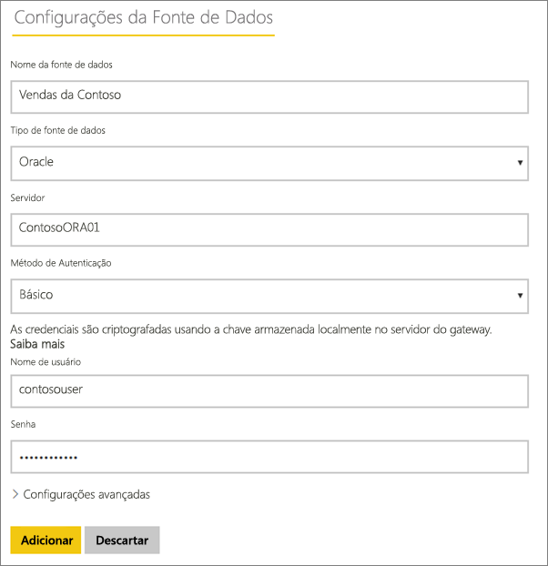

# Gerenciar sua fonte de dados – Importar/Atualização Agendada

[!INCLUDE [gateway-rewrite](includes/gateway-rewrite.md)]

Depois de [instalar o gateway de dados local](/data-integration/gateway/service-gateway-install), será necessário [adicionar fontes de dados](service-gateway-data-sources.md#add-a-data-source) que possam ser usadas com o gateway. Este artigo aborda como trabalhar com os gateways e fontes de dados que são usadas para a atualização agendada em vez das conexões dinâmicas ou do DirectQuery.

## Adicionar uma fonte de dados

Para obter informações sobre como adicionar uma fonte de dados, consulte [Adicionar uma fonte de dados](service-gateway-data-sources.md#add-a-data-source).

Todos os tipos de fontes de dados relacionadas podem ser usadas para atualização agendada com o gateway de dados local. O Analysis Services, o SQL Server e o SAP HANA podem ser usados para a atualização agendada ou para o DirectQuery/conexões dinâmicas.

Em seguida, é necessário preencher as informações sobre a fonte de dados, o que inclui as informações de origem e as credenciais usadas para acessar a fonte de dados.

> [!NOTE]
> Todas as consultas à fonte de dados serão executadas com essas credenciais. Para saber mais sobre como as credenciais são armazenadas, consulte [Armazenando credenciais criptografadas na nuvem](service-gateway-data-sources.md#storing-encrypted-credentials-in-the-cloud).

Para obter uma lista de tipos de fonte de dados que podem ser usados com a atualização agendada, consulte [Lista dos tipos de fonte de dados disponíveis](service-gateway-data-sources.md#list-of-available-data-source-types).

Selecione **Adicionar** depois de preencher tudo. Agora você pode usar esta fonte de dados para a atualização agendada com seus dados locais. Você verá *Conexão Bem-sucedida* se tiver êxito.

### Configurações avançadas

Opcionalmente, você pode configurar o nível de privacidade para sua fonte de dados. Ele controla como os dados podem ser combinados. É usado somente para a atualização agendada. Para saber mais sobre os níveis de privacidade para sua fonte de dados, confira [Níveis de privacidade (Power Query)](https://support.office.com/article/Privacy-levels-Power-Query-CC3EDE4D-359E-4B28-BC72-9BEE7900B540).

## Usando a fonte de dados para a atualização agendada

Depois de criar a fonte de dados, ela estará disponível para uso com as conexões do DirectQuery ou por meio da atualização agendada.

> [!NOTE]
> Os nomes do servidor e do banco de dados devem corresponder entre o Power BI Desktop e a fonte de dados no gateway de dados local.

O vínculo entre o conjunto de dados e a fonte de dados no gateway baseia-se nos nomes do servidor e do banco de dados. Eles devem corresponder. Por exemplo, se você fornecer um Endereço IP como nome do servidor no Power BI Desktop, terá de usar o endereço IP como fonte de dados na configuração do gateway. Se usar *SERVIDOR\INSTÂNCIA* no Power BI Desktop, você precisará usar a mesma coisa na fonte de dados configurada para o gateway.

Se estiver listado na guia **Usuários** da fonte de dados configurada no gateway e houver a correspondência entre os nomes do servidor e do banco de dados, você verá o gateway como uma opção a ser usada com a atualização agendada.

> [!WARNING]
> Se seu conjunto de dados contiver várias fontes de dados, cada uma delas deverá ser adicionada dentro do gateway. Se uma ou mais fontes de dados não forem adicionadas ao gateway, você não o verá como disponível para a atualização agendada.

## Limitações

O OAuth não é um esquema de autenticação compatível com o gateway de dados local. Você não pode adicionar fontes de dados que exigem o OAuth. Se seu conjunto de dados tiver uma fonte de dados que exija o OAuth, você não poderá usar o gateway para a atualização agendada.

## Próximas etapas

* [Solução de problemas do gateway de dados local](/data-integration/gateway/service-gateway-tshoot)
* [Solucionar problemas de gateways – Power BI](service-gateway-onprem-tshoot.md)

Mais perguntas? [Experimente a Comunidade do Power BI](http://community.powerbi.com/)
