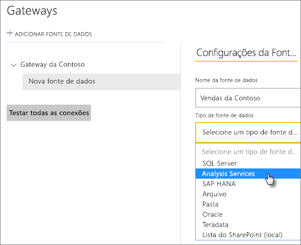
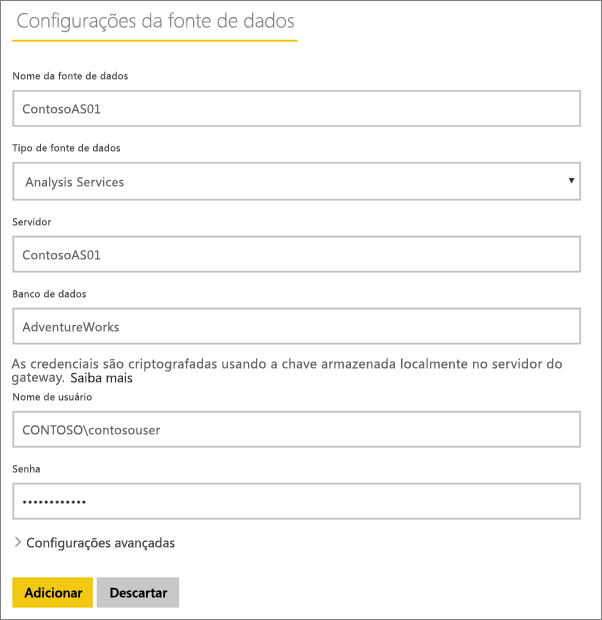
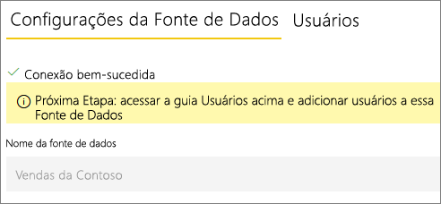
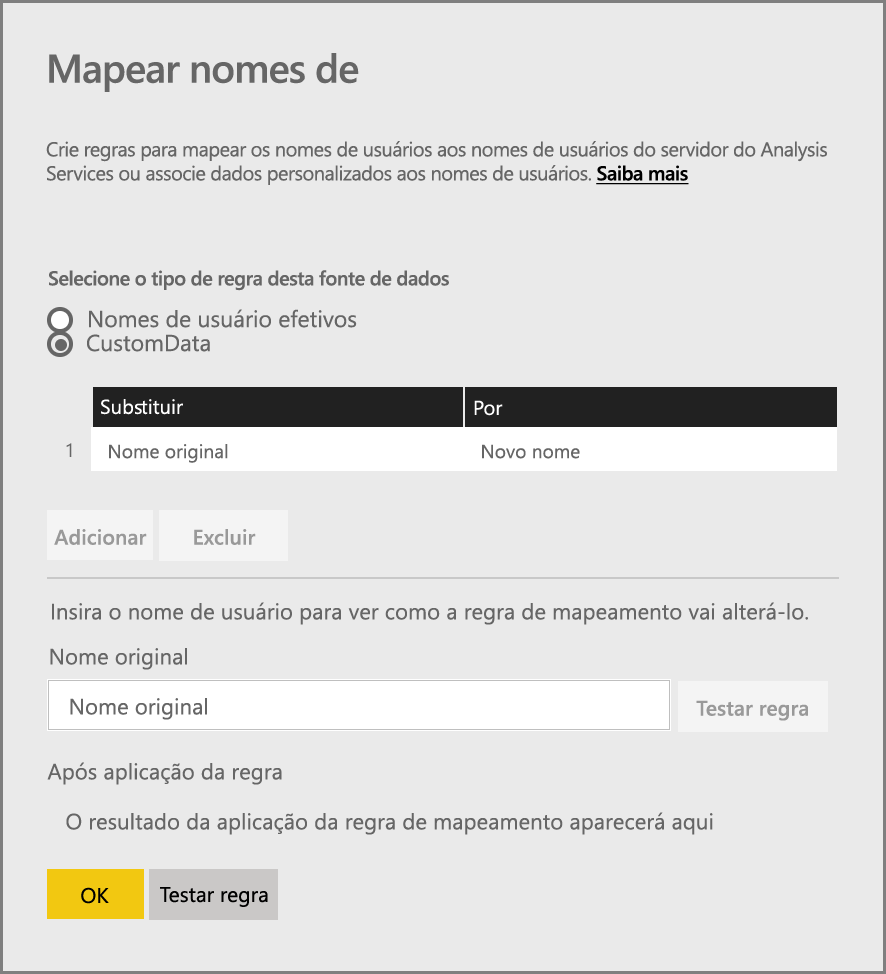
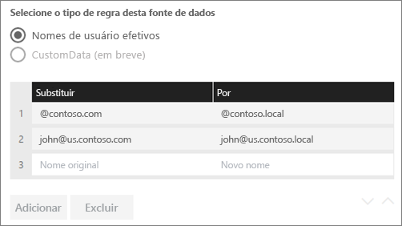
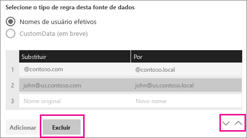
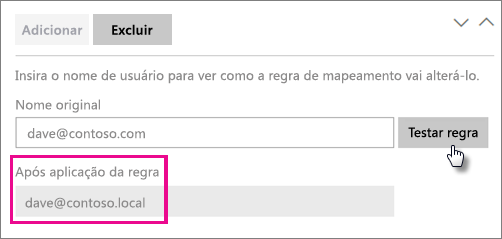
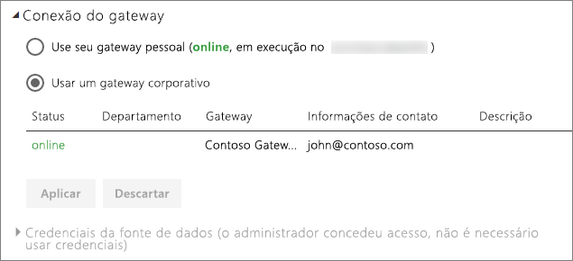

# <a name="manage-your-data-source---analysis-services"></a>Gerenciar sua fonte de dados – Analysis Services

[!INCLUDE [gateway-rewrite](includes/gateway-rewrite.md)]

Depois de [instalar o gateway de dados local](/data-integration/gateway/service-gateway-install), será necessário [adicionar fontes de dados](service-gateway-data-sources.md#add-a-data-source) que possam ser usadas com o gateway. Este artigo aborda como trabalhar com gateways e fontes de dados do Analysis Services que são usadas para a atualização agendada ou para conexões dinâmicas.

Para saber mais sobre como configurar uma conexão dinâmica com o Analysis Services, [assista a este vídeo](https://www.youtube.com/watch?v=GPf0YS-Xbyo&feature=youtu.be).

> [!NOTE]
> Se você tiver uma fonte de dados do Analysis Services, você precisará instalar o gateway em um computador associado ao mesmo domínio/floresta que o servidor do Analysis Services.

## <a name="add-a-data-source"></a>Adicionar uma fonte de dados

Para obter informações sobre como adicionar uma fonte de dados, consulte [Adicionar uma fonte de dados](service-gateway-data-sources.md#add-a-data-source). Se você estiver se conectando a um servidor de tabela ou multidimensional, selecione Analysis Services para o **Tipo da Fonte de Dados**.



Em seguida, você deverá preencher as informações sobre a fonte de dados, que incluem o **Servidor** e o **Banco de Dados**. O **Nome de usuário** e **Senha** que você inserir serão usados pelo gateway para se conectar à instância do Analysis Services.

> [!NOTE]
> A conta do Windows inserida deve ter permissões de Administrador do Servidor para a instância à qual você está se conectando. Se a senha dessa conta estiver configurada para expirar, os usuários poderão receber um erro de conexão se a senha não estiver atualizada para a fonte de dados. Para saber mais sobre como as credenciais são armazenadas, consulte [Armazenando credenciais criptografadas na nuvem](service-gateway-data-sources.md#storing-encrypted-credentials-in-the-cloud).



Selecione **Adicionar** depois de preencher tudo. Agora você pode usar esta fonte de dados para atualização agendada ou conexões dinâmicas em uma instância local do Analysis Services. Você verá *Conexão Bem-sucedida* se tiver êxito.



### <a name="advanced-settings"></a>Configurações avançadas

Opcionalmente, você pode configurar o nível de privacidade para sua fonte de dados. Ele controla como os dados podem ser combinados. É usado somente para a atualização agendada. Não é aplicável às conexões dinâmicas. Para saber mais sobre os níveis de privacidade para sua fonte de dados, confira [Níveis de privacidade (Power Query)](https://support.office.com/article/Privacy-levels-Power-Query-CC3EDE4D-359E-4B28-BC72-9BEE7900B540).


## <a name="usernames-with-analysis-services"></a>Nomes de usuário com o Analysis Services

<iframe width="560" height="315" src="https://www.youtube.com/embed/Qb5EEjkHoLg" frameborder="0" allowfullscreen></iframe>

Cada vez que um usuário interage com um relatório conectado ao Analysis Services, o nome de usuário efetivo é passado para o gateway e, em seguida, para seu servidor local do Analysis Services. O endereço de email com o qual você entra no Power BI é aquele que informaremos ao Analysis Services como o usuário efetivo. Isso é passado na propriedade de conexão [EffectiveUserName](https://msdn.microsoft.com/library/dn140245.aspx#bkmk_auth). Esse endereço de email deve corresponder a um nome UPN definido no Domínio do Active Directory local. O UPN é uma propriedade de uma conta do Active Directory. Essa conta do Windows deverá, então, estar presente em uma função do Analysis Services. Se uma correspondência não for encontrada, o logon no Active Directory não será bem-sucedido. Para saber mais sobre Active Directory e a nomenclatura de usuário, consulte [Atributos de nomenclatura de usuário](https://msdn.microsoft.com/library/ms677605.aspx).

Você também poderá [mapear seu nome de entrada do Power BI com um UPN do diretório local](service-gateway-enterprise-manage-ssas.md#mapping-usernames-for-analysis-services-data-sources).

## <a name="mapping-usernames-for-analysis-services-data-sources"></a>Mapeando nomes de usuário para fontes de dados do Analysis Services

<iframe width="560" height="315" src="https://www.youtube.com/embed/eATPS-c7YRU" frameborder="0" allowfullscreen></iframe>

O Power BI possibilita o mapeamento de nomes de usuário para fontes de dados do Analysis Services. É possível configurar regras para mapear um nome de usuário conectado com o Power BI para um nome passado para EffectiveUserName na conexão do Analysis Services. O recurso Mapear nomes de usuário é uma ótima maneira de solucionar problemas quando seu nome de usuário no AAD não corresponde a um UPN no Active Directory local. Por exemplo, se seu endereço de email fosse nancy@contoso.onmicrsoft.com, você poderia mapeá-lo para nancy@contoso.com e esse valor seria passado para o gateway.

É possível mapear nomes de usuário para o Analysis Services de duas maneiras diferentes:

* Remapeamento manual do usuário
* Consulta de propriedade do Active Directory local para remapear UPNs AAD para usuários do Active Directory (mapeamento de consulta de AD)

Embora seja possível executar o mapeamento manual usando a segunda abordagem, fazer isso seria um pouco demorado e difícil de manter. Isso é especialmente difícil quando a correspondência de padrões não é suficiente – por exemplo, quando os nomes de domínio são diferentes entre o AAD e o AD local ou quando os nomes de conta de usuário são diferentes entre o AAD e o AD. Sendo assim, não é recomendável realizar o mapeamento manual com a segunda abordagem.

Descrevemos essas duas abordagens, em ordem, nas duas seções a seguir.

### <a name="manual-user-name-re-mapping"></a>Remapeamento manual de nomes de usuário

Para fontes de dados do Analysis Services, é possível configurar regras personalizadas do nome UPN. Isso ajudará se seus nomes de logon do serviço do Power BI não corresponderem ao UPN do diretório local. Por exemplo, se você entrar no Power BI com john@contoso.com, mas seu UPN do diretório local for john@contoso.local, será possível configurar uma regra de mapeamento para fazer com que john@contoso.local seja passado para o Analysis Services.

Para chegar à tela de Mapeamento de UPN, faça o seguinte:

1. Vá para o **ícone de engrenagem** e selecione **Gerenciar Gateways**.
2. Expanda o gateway que contém a fonte de dados do Analysis Services. Caso contrário, se você ainda não tiver criado a fonte de dados do Analysis Services, poderá fazer isso agora.
3. Selecione a fonte de dados e, em seguida, selecione a guia **Usuários**.
4. Selecione **Mapear nomes de usuário**.

    

Em seguida, você verá opções para adicionar regras, bem como para testar determinado usuário.

> [!NOTE]
> Talvez você altere inadvertidamente um usuário que não pretendia alterar. Por exemplo, se **Substituir (valor original)** for <em>@contoso.com</em> e seu **Por (Novo nome)**  for <em>@contoso.local</em>, todos os usuários com uma entrada que contém <em>@contoso.com</em> serão substituídos por <em>@contoso.local</em>. Além disso, se **Substituir (Nome Original)** for <em>dave@contoso.com</em> e seu **Por (novo nome)** for <em>dave@contoso.local</em>, um usuário com a entrada de v-dave@contoso.com deve ser enviado como v-dave<em>@contoso.local</em>.

### <a name="ad-lookup-mapping"></a>Mapeamento de consulta do AD

Para realizar a consulta de propriedade do AD local para mapear os UPNs do ADD para usuários do Active Directory, siga as etapas nesta seção. Em primeiro lugar, vamos examinar como isso funciona.

No **serviço do Power BI** ocorre o seguinte:

* Para cada consulta feita por um usuário do AAD do Power BI para um servidor SSAS local, uma cadeia de caracteres UPN é passada, tal como: firstName.lastName@contoso.com

> [!NOTE]
> Quaisquer mapeamentos manuais de usuário UPN definidos na configuração de fonte de dados do Power BI ainda são aplicados *antes* de enviar a cadeia de caracteres de nome de usuário para o gateway de dados local.

No gateway de dados local com o mapeamento de usuário personalizado configurável, faça o seguinte:

1. Localize o Active Directory a ser pesquisado (automático ou configurável).
2. Consulte o atributo da Pessoa do AD (como *Email*) com base na cadeia de caracteres UPN (“firstName.lastName@contoso.com”) de entrada no **serviço do Power BI**.
3. Se a Consulta do AD falhar, ela tentará usar o UPN repassado como EffectiveUser para o SSAS.
4. Se a Consulta do AD for bem-sucedida, ela recuperará o *UserPrincipalName* dessa Pessoa do AD.
5. Ele passa o email *UserPrincipalName* como *EffectiveUser* para o SSAS, tal como <em>Alias@corp.on-prem.contoso</em>.

Como configurar o gateway para executar a Consulta do AD:

1. [Baixe e instale o gateway mais recente](/data-integration/gateway/service-gateway-install).

2. No gateway, é necessário alterar o **serviço do gateway de dados local** para ser executado com uma conta de domínio (em vez de uma conta de serviço local, caso contrário, a consulta do AD não funcionará corretamente no tempo de execução). Vá para o [aplicativo de gateway de dados local](/data-integration/gateway/service-gateway-app) em seu computador e vá para **Configurações de serviço > Alterar conta de serviço**. Certifique-se de ter a chave de recuperação para esse gateway, uma vez que será preciso restaurá-lo no mesmo computador, a menos que você deseje criar um novo gateway em vez disso. Será necessário reiniciar o serviço do gateway para que a alteração tenha efeito.

3. Navegue até a pasta de instalação do gateway, *C:\Arquivos de Programas\gateway de dados local* como administrador para garantir que você tenha permissões de gravação e abra o arquivo *Microsoft.PowerBI.DataMovement.Pipeline.GatewayCore.dll.config*.

4. Edite os dois valores de configuração a seguir de acordo com *suas* configurações de atributo do Active Directory para seus usuários do AD. Os valores de configuração mostrados abaixo são apenas exemplos – é necessário especificá-los com base em sua configuração do Active Directory. Essas configurações diferenciam maiúsculas de minúsculas, então garanta que elas correspondam aos valores no Active Directory.

    

    Se nenhum valor for fornecido para a configuração do ADServerPath, o gateway usará o Catálogo Global padrão. Você também pode especificar vários valores para o ADServerPath. Cada valor deve ser separado por ponto e vírgula como no exemplo a seguir.

    ```xml
    <setting name="ADServerPath" serializeAs="String">
        <value> >GC://serverpath1; GC://serverpath2;GC://serverpath3</value>
    </setting>
    ```

    O gateway analisa os valores para ADServerPath da esquerda para a direita até encontrar uma correspondência. Se nenhuma correspondência for encontrada, o UPN original será usado. Verifique se a conta que executa o serviço de gateway (PBIEgwService) tem permissões de consulta para todos os servidores do AD que você especifica no ADServerPath.

    O gateway dá suporte a dois tipos de ADServerPath, como nos exemplos a seguir.

    **WinNT**

    ```xml
    <value="WinNT://usa.domain.corp.contoso.com,computer"/>
    ```

    **GC**

    ```xml
    <value> GC://USA.domain.com </value>
    ```

5. Reinicie o serviço do **gateway de dados local** para que a alteração da configuração entre em vigor.

### <a name="working-with-mapping-rules"></a>Trabalhando com regras de mapeamento

Para criar uma regra de mapeamento, insira um valor para **Nome original** e **Novo Nome** e, em seguida, selecione **Adicionar**.

| Campo | Descrição |
| --- | --- |
| Substituir (Nome original) |O endereço de email com o qual você entrou no Power BI. |
| Com (Novo Nome) |O valor pelo qual você deseja substituí-lo. O resultado da substituição é o que será passado para a propriedade *EffectiveUserName* da conexão do Analysis Services. |



Ao selecionar um item na lista, você poderá optar por reordenar usando os **ícones de divisa** ou **Excluir** a entrada.



### <a name="using-wildcard-"></a>Usando curinga (\*)

Você pode usar um caractere curinga para sua cadeia de caracteres **Substituir (Nome Original)** . Ele só pode ser usado sozinho e não com qualquer outra parte da cadeia de caracteres. Isso permitirá que você tire todos os usuários e passe um único valor para a fonte de dados. Isso é útil quando você deseja que todos os usuários em sua organização usem o mesmo usuário no seu ambiente local.

### <a name="test-a-mapping-rule"></a>Testar uma regra de mapeamento

É possível validar o nome que substituirá um nome original inserindo um valor para **Nome original** e selecionando **Testar regra**.



> [!NOTE]
> Demorará alguns minutos para que o serviço comece a usar regras que acabaram de ser salvas. No navegador, a regra funcionará imediatamente.

### <a name="limitations-for-mapping-rules"></a>Limitações das regras de mapeamento

O mapeamento refere-se à fonte de dados específica que está sendo configurada. Não se trata de configurações globais. Caso você tenha várias fontes de dados do Analysis Services, será necessário mapear os usuários para cada fonte de dados.

## <a name="authentication-to-a-live-analysis-services-data-source"></a>Autenticação em uma fonte de dados dinâmica do Analysis Services

Cada vez que um usuário interage com o Analysis Services, o nome de usuário efetivo é passado para o gateway e, em seguida, para o servidor local do Analysis Services. O nome UPN, normalmente, o endereço de email que você usa para entrar na nuvem, é o que passaremos para o Analysis Services como o usuário efetivo. O nome UPN é passado na propriedade de conexão EffectiveUserName. Esse endereço de email deve corresponder a um UPN definido no domínio do Active Directory local. O UPN é uma propriedade de uma conta do Active Directory. Essa conta do Windows precisará estar presente em uma função do Analysis Services para que ela tenha acesso ao servidor. O logon não terá êxito se nenhuma correspondência for encontrada no Active Directory.

O Analysis Services também poderá fornecer a filtragem com base nessa conta. A filtragem pode ocorrer com a segurança baseada em função ou com a segurança em nível de linha.

## <a name="role-based-security"></a>Segurança baseada em função

Modelos fornecem segurança baseada em funções de usuário. Funções são definidas para um projeto de modelo específico durante a criação no SSDT-BI (SQL Server Data Tools – Business Intelligence), ou depois que um modelo é implantado usando o SSMS (SQL Server Management Studio). As funções contêm membros organizados por nome de usuário do Windows ou por grupo do Windows. As funções definem as permissões de que um usuário dispõe para consultar ou executar ações no modelo. A maioria dos usuários pertencerão a uma função com permissões de Leitura. Outras funções são destinadas a administradores com permissões para processar itens e gerenciar funções, tanto de banco de dados quanto de outros tipos.

## <a name="row-level-security"></a>Segurança em nível de linha

A segurança em nível de linha é específica para a segurança em nível de linha do Analysis Services. Os modelos podem fornecem segurança dinâmica no nível de linha. Em vez de ter pelo menos uma função à qual os usuários pertencem, a segurança dinâmica não é requerida para nenhum modelo de tabela. Em um nível elevado, a segurança dinâmica define o acesso de leitura de um usuário aos dados diretamente para uma linha específica em uma tabela específica. De modo similar ao que ocorre nas funções, a segurança dinâmica no nível de linha depende de um nome de usuário do Windows.

A capacidade de um usuário de consultar e ver dados de modelo é determinada, primeiramente, pelas funções das quais sua conta de usuário do Windows é membro e, em segundo lugar, pela segurança dinâmica em nível de linha, se estiver configurada.

A implementação de segurança dinâmica em nível de linha e a segurança baseada em função em modelos está além do escopo deste artigo. Saiba mais em [Funções (SSAS de tabela)](https://msdn.microsoft.com/library/hh213165.aspx) e [Funções de segurança (Analysis Services – dados multidimensionais)](https://msdn.microsoft.com/library/ms174840.aspx) no MSDN. Além disso, para obter uma compreensão mais profunda sobre a segurança do modelo de tabela, baixe e leia o [white paper Protegendo o modelo semântico de BI de tabela](https://msdn.microsoft.com/library/jj127437.aspx).

## <a name="what-about-azure-active-directory"></a>E quanto ao Azure Active Directory?

Os serviços em nuvem da Microsoft usam o [Azure Active Directory](/azure/active-directory/fundamentals/active-directory-whatis) para cuidar da autenticação de usuários. O Azure Active Directory é o locatário que contém nomes de usuário e grupos de segurança. Normalmente, um endereço de email usado para a entrada de um usuário é o mesmo que o UPN da conta.

Qual é a função do meu Active Directory local?

Para que o Analysis Services determine se um usuário que se conecta a ele pertence a uma função com permissões para leitura de dados, o servidor precisa converter o nome de usuário efetivo passado do ADD para o gateway e, em seguida, para o servidor do Analysis Services. O servidor do Analysis Services passa o nome de usuário efetivo para um DC (controlador de domínio) do Active Directory do Windows. Em seguida, o DC Active Directory valida o nome de usuário efetivo como um UPN válido, em uma conta local, e retorna esse nome de usuário do Windows do usuário de volta ao servidor do Analysis Services.

EffectiveUserName não pode ser usado em um servidor do Analysis Services que não foi ingressado em domínio. O servidor do Analysis Services deve ser ingressado em um domínio para evitar erros de logon.

### <a name="how-do-i-tell-what-my-upn-is"></a>Como saber qual é a minha UPN?

Talvez você não saiba o que é o UPN e talvez você não seja um administrador de domínio. Você pode usar o comando a seguir em sua estação de trabalho para descobrir o UPN para sua conta.

    whoami /upn

O resultado será semelhante a um endereço de email, mas esse é o UPN que está em sua conta de domínio. Se você estiver usando uma fonte de dados do Analysis Services para conexões dinâmicas e se ela não corresponder ao endereço de email com o qual você entra no Power BI, convém examinar como [mapear nomes de usuário](#mapping-usernames-for-analysis-services-data-sources).

## <a name="synchronize-an-on-premises-active-directory-with-azure-active-directory"></a>Sincronizar um Active Directory local com o Azure Active Directory

Se for usar conexões dinâmicas do Analysis Services, você desejará que suas contas do Active Directory local correspondam ao Azure Active Directory. já que o UPN deve ser correspondente entre as contas.

Os serviços de nuvem conhecem apenas as contas no Azure Active Directory. Não importa se você adicionou uma conta no Active Directory local, se ela não existir no AAD, não poderá ser usada. Há diferentes maneiras pelas quais você poderá corresponder suas contas do Active Directory local ao Azure Active Directory.

1. É possível adicionar contas manualmente ao Azure Active Directory.

   É possível criar uma conta no portal do Azure ou no Centro de administração do Microsoft 365 e o nome da conta corresponde ao UPN da conta do Active Directory local.

2. Você pode usar a ferramenta [Azure AD Connect](/azure/active-directory/hybrid/how-to-connect-sync-whatis) para sincronizar contas locais ao seu locatário do Azure Active Directory.

   A ferramenta Azure AD Connect fornece opções para sincronização de diretório e a configuração de autenticação, incluindo a sincronização de hash de senha, autenticação de pass-through e federação. Se você não for um administrador de locatários nem um administrador de domínio local, precisará entrar em contato com seu administrador de TI para obter essa configuração.

O uso do Azure AD Connect garante que o UPN corresponderá entre o AAD e o Active Directory local.

> [!NOTE]
> A sincronização de contas com a ferramenta Azure AD Connect criará novas contas em seu locatário do AAD.

## <a name="using-the-data-source"></a>Usando a fonte de dados

Depois de criar a fonte de dados, ela estará disponível para uso com as conexões dinâmicas ou por meio da atualização agendada.

> [!NOTE]
> Os nomes do servidor e do banco de dados devem corresponder entre o Power BI Desktop e a fonte de dados no gateway de dados local.

O vínculo entre o conjunto de dados e a fonte de dados no gateway baseia-se nos nomes do servidor e do banco de dados. Eles devem corresponder. Por exemplo, se você fornecer um Endereço IP como nome do servidor no Power BI Desktop, terá de usar o endereço IP como fonte de dados na configuração do gateway. Se usar *SERVIDOR\INSTÂNCIA* no Power BI Desktop, você precisará usar a mesma coisa na fonte de dados configurada para o gateway.

Esse é o caso para conexões dinâmicas e a atualização agendada.

### <a name="using-the-data-source-with-live-connections"></a>Usando a fonte de dados com conexões dinâmicas

É preciso verificar se os nomes do servidor e do banco de dados correspondem entre o Power BI Desktop e a fonte de dados configurada para o gateway. Você também precisará certificar-se de que o usuário está listado na guia **Usuários** da fonte de dados a fim de publicar os conjuntos de dados de conexão dinâmica. A seleção, para conexões dinâmicas, ocorre no Power BI Desktop quando você importa os dados pela primeira vez.

Após a publicação, por meio do Power BI Desktop ou do recurso **Obter Dados**, seus relatórios deverão começar a funcionar. Pode levar vários minutos, após a criação da fonte de dados no gateway, para que a conexão seja utilizável.

### <a name="using-the-data-source-with-scheduled-refresh"></a>Usando a fonte de dados com a atualização agendada

Se estiver listado na guia **Usuários** da fonte de dados configurada no gateway e houver a correspondência entre os nomes do servidor e do banco de dados, você verá o gateway como uma opção a ser usada com a atualização agendada.



### <a name="limitations-of-analysis-services-live-connections"></a>Limitações das conexões dinâmicas do Analysis Services

Você pode usar uma conexão dinâmica em instâncias de tabela ou multidimensionais.

| **Versão do servidor** | **SKU necessário** |
| --- | --- |
| 2012 SP1 CU4 ou posterior |Business Intelligence e SKU Enterprise |
| 2014 |Business Intelligence e SKU Enterprise |
| 2016 |SKU Standard ou superior |

* Não há suporte para a Formatação no Nível de Célula nem para recursos de conversão.
* Ações e Conjuntos Nomeados não são expostos no Power BI, mas você ainda pode se conectar a cubos multidimensionais que também contêm Ações ou Conjuntos Nomeados e criar visuais e relatórios.

## <a name="next-steps"></a>Próximas etapas

* [Solução de problemas do gateway de dados local](/data-integration/gateway/service-gateway-tshoot)
* [Solucionar problemas de gateways – Power BI](service-gateway-onprem-tshoot.md)

Mais perguntas? [Experimente a Comunidade do Power BI](http://community.powerbi.com/)

