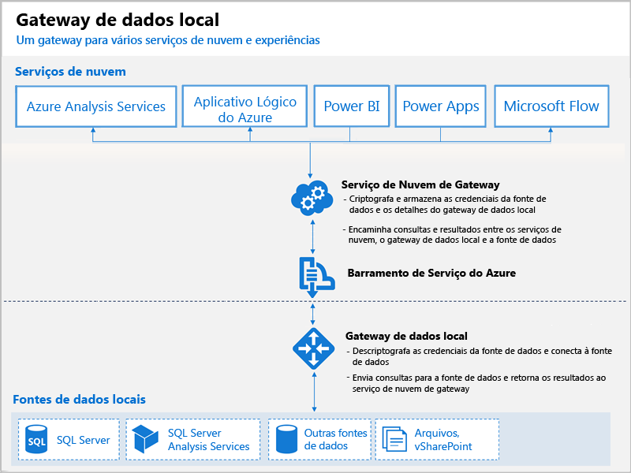

# O que é um Power BI Gateway?

Um Power BI Gateway é um software que você instala em uma rede local; ele facilita o acesso aos dados nessa rede. Ele é como um porteiro que escuta as solicitações de conexão e as concede somente quando as solicitações dos usuários atendem a certos critérios. Isso permite que as organizações mantenham bancos de dados e outras fontes de dados em suas redes locais, embora usem com segurança esses dados locais em relatórios e painéis do Power BI.

Um gateway pode ser usado para uma única fonte de dados ou para várias fontes de dados. O diagrama a seguir mostra uma exibição básica, com o gateway gerenciando solicitações da nuvem para três computadores locais. Vamos expandir isso posteriormente neste artigo.

## Tipos de gateway

O Power BI oferece dois gateways, cada um para um cenário diferente:

* **Gateway de dados local (modo pessoal)** – permite que um usuário se conecte às fontes e não pode ser compartilhado com outras pessoas. Só pode ser usado com o Power BI. Esse gateway é mais adequado para situações em que você é a única pessoa que cria relatórios e não precisa compartilhar as fontes de dados com outras pessoas.

* **Gateway de dados local**: permite que vários usuários se conectem a várias fontes de dados locais. Pode ser usado pelo Power BI, PowerApps, Flow, Azure Analysis Services e Aplicativos Lógicos do Azure, tudo com um único gateway instalado. Esse gateway é mais adequado para cenários mais complexos com várias pessoas acessando várias fontes de dados. 

## Usar um gateway

Há quatro etapas principais para usar um gateway:

1. **Instalar o gateway** em um computador local, usando o modo apropriado
2. **Adicionar usuários ao gateway**, para que possam acessar as fontes de dados locais
3. **Conectar-se a fontes de dados**, para que eles possam ser usados em relatórios e painéis
4. **Atualizar dados locais**, para que os relatórios do Power BI sejam atualizados

Você pode instalar um gateway autônomo ou adicionar um gateway a um *cluster*, que é recomendado para alta disponibilidade.

## Como funcionam os gateways

O gateway que você instalar é executado como um serviço Windows, o **Gateway de dados locais**. Esse serviço local está registrado no Serviço de Nuvem do Gateway por meio do Barramento de Serviço do Microsoft Azure. O diagrama a seguir mostra o fluxo entre dados locais e os serviços de nuvem que usam o gateway.

Consultas e fluxo de dados:

1. Uma consulta é criada pelo serviço de nuvem com as credenciais criptografadas para a fonte de dados local. Em seguida, ela é enviada para uma fila para o gateway processar.
2. O serviço de nuvem do gateway analisa a consulta e envia a solicitação para o Barramento de Serviço do Azure.
3. O Gateway de dados local pesquisa o Barramento de Serviço do Azure em busca de solicitações pendentes.
4. O gateway recebe a consulta, descriptografa as credenciais e conecta-se às fontes de dados com essas credenciais.
5. O gateway envia a consulta à fonte de dados para execução.
6. Os resultados são enviados da fonte de dados, de volta ao gateway e, em seguida, ao serviço de nuvem e seu servidor.

## Próximas etapas
[Instalar o gateway de dados local](service-gateway-install.md)

Mais perguntas? [Experimente a Comunidade do Power BI](http://community.powerbi.com/)

