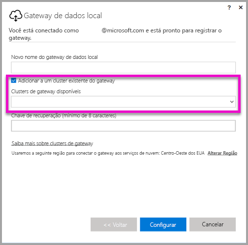
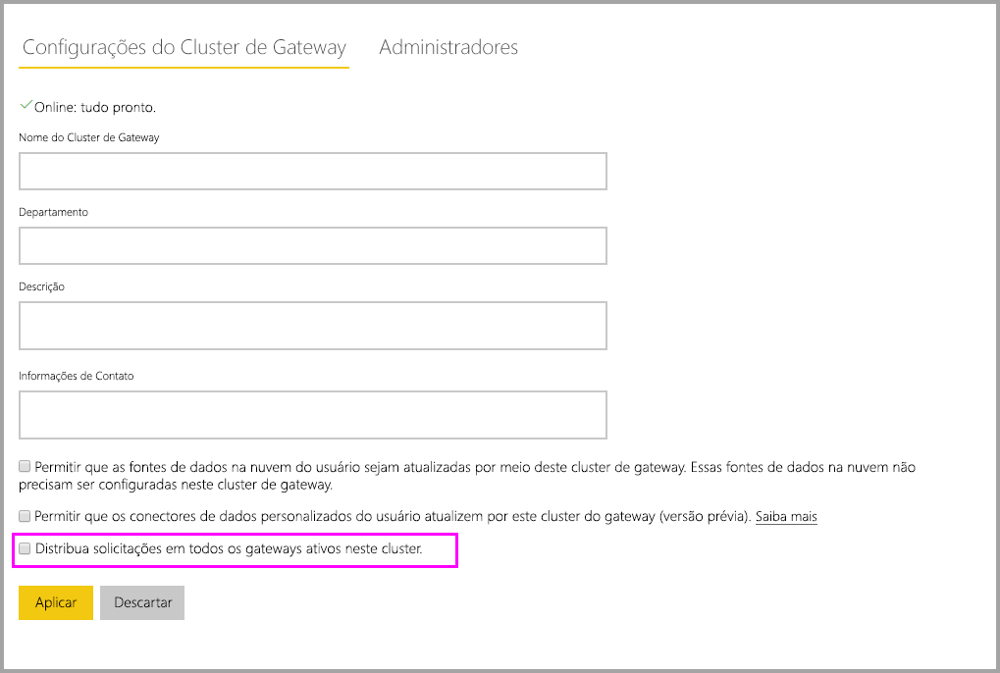

# <a name="high-availability-clusters-for-on-premises-data-gateway"></a>Clusters de alta disponibilidade para gateway de dados locais

Você pode criar **clusters de alta disponibilidade** de instalações de **gateway de dados locais**, para garantir que sua organização possa acessar recursos de dados locais usados em relatórios e painéis do Power BI. Esses clusters permitem que os administradores de gateway agrupem gateways para evitar pontos únicos de falha ao acessar os recursos de dados locais. O serviço do Power BI sempre usa o gateway primário do cluster, a menos que ele não esteja disponível. Nesse caso, o serviço muda para o próximo gateway do cluster e assim por diante.

Este artigo descreve as etapas a serem seguidas para criar um cluster de alta disponibilidade de gateways de dados locais e compartilha práticas recomendadas ao configurá-los. Os clusters de gateway de alta disponibilidade requerem a atualização de novembro de 2017 para o gateway de dados locais, ou posterior.

## <a name="setting-up-high-availability-clusters-of-gateways"></a>Configuração de clusters de alta disponibilidade de gateways

Durante o processo de instalação do **gateway de dados locais**, você pode especificar se o gateway deve ser adicionado a um cluster existente do gateway. 



Para adicionar um gateway a um cluster existente, é necessário fornecer a *Chave de recuperação* da instância de gateway primário para o cluster em que você deseja ingressar o novo gateway. O gateway primário para o cluster deve estar executando a atualização do gateway de novembro de 2017 ou posterior. 

## <a name="managing-a-gateway-cluster"></a>Gerenciar um cluster de gateway

Quando um cluster de gateway consiste em dois ou mais gateways, todas as operações de gerenciamento de gateway, como adicionar uma fonte de dados ou conceder permissões administrativas para um gateway, se aplicam a todos os gateways que fazem parte do cluster.

Quando os administradores usam o item do menu **Gerenciar gateways** encontrado sob o ícone de engrenagem no **Serviço do Power BI**, eles veem a lista de clusters registrados ou gateways individuais, mas não veem as instâncias individuais de gateway que são membros do cluster.

Todas as novas solicitações de **Atualização Agendada** e operações de DirectQuery são automaticamente direcionadas para a instância primária de um cluster de gateways específico. Se a instância do gateway primário não estiver online, a solicitação é encaminhada para outra instância de gateway no cluster.

## <a name="distribute-requests-traffic-across-all-gateways-in-a-cluster"></a>Distribuir o tráfego de solicitações entre todos os gateways em um cluster

É possível optar por permitir que o tráfego seja distribuído entre todos os gateways em um cluster. Na página **Gerenciar gateways** no **serviço do Power BI**, quando você clica em um cluster de gateway na lista na árvore de navegação à esquerda, é possível habilitar a opção para "Distribuir solicitações entre todos os gateways ativos neste cluster".



## <a name="powershell-support-for-gateway-clusters"></a>Suporte do PowerShell para clusters de gateway

Os scripts do PowerShell estão disponíveis na pasta de instalação do gateway de dados locais. Por padrão, esse arquivo está localizado em *C:\Arquivos de Programas\Gateway de dados locais*. É necessário estar usando o PowerShell versão 5 ou mais recente para que esses scripts funcionem corretamente. Os scripts do PowerShell permitem que os usuários executem as seguintes operações:

-   Recuperar a lista de clusters de gateway disponíveis para um usuário
-   Recuperar a lista de instâncias de gateway registradas em um cluster, bem como seu status online ou offline
-   Modificar o status habilitar/desabilitar para uma instância de gateway em um cluster, bem como outras propriedades do gateway
-   Excluir um gateway

Para executar os comandos do PowerShell na tabela, primeiro é necessário seguir as etapas abaixo:

1. Abra uma janela de comando do PowerShell como Administrador
2. Em seguida, execute o seguinte comando do PowerShell que deve ser executado somente uma vez (isso pressupõe que você nunca executou comandos do PowerShell no computador atual):

    ```
    Set-ExecutionPolicy -ExecutionPolicy Unrestricted -Force
    ```

3. Em seguida, navegue até a pasta de instalação do gateway de dados local na janela do PowerShell e importe o módulo necessário usando o seguinte comando:

    ```
    Import-Module .\OnPremisesDataGatewayHAMgmt.psm1
    ```

Quando essas etapas forem concluídas, é possível usar os comandos na tabela a seguir para gerenciar os clusters do gateway.

| **Comando** | **Descrição** | **Parâmetros** |
| --- | --- | --- |
| *Login-OnPremisesDataGateway* |Este comando permite que um usuário faça logon para gerenciar seus clusters de gateway de dados locais.  Você deve executar este comando e entrar *antes* que outros comandos de alta disponibilidade possam funcionar corretamente. Observação: o token de autenticação do AAD adquirido como parte de uma chamada de logon é válido somente por 1 hora, após a qual ele expira. Você pode executar novamente o comando de logon para adquirir um novo token.| Nome e senha do usuário do AAD (fornecidos como parte da execução do comando, invocação não inicial)|
| *Get-OnPremisesDataGatewayClusters* | Recupera a lista de clusters do gateway para o usuário conectado. | Ou é possível passar parâmetros de formatação para esse comando para ter melhor legibilidade, como *Format-Table -AutoSize -Wrap* |
| *Get-OnPremisesDataClusterGateways* | Recupera a lista de gateways dentro do cluster especificado, bem como informações adicionais para cada gateway (status online/offline, nome do computador, etc.) | *-ClusterObjectID xyz* (onde *xyz* é substituído por um valor de ID de objeto do cluster real, que pode ser recuperado usando o comando *Get-OnPremisesDataGatewayClusters*)|
| *Set-OnPremisesDataGateway* | Permite que você defina valores de propriedade para um determinado gateway em um cluster, incluindo a capacidade de habilitar/desabilitar uma instância de gateway específica  | *-ClusterObjectID xyz* (*xyz* deve ser substituído por um valor de ID de objeto do cluster real, que pode ser recuperado usando o comando *Get-OnPremisesDataGatewayClusters*) *-GatewayObjectID abc* (*abc* deve ser substituído por um valor de ID de objeto do gateway real, que pode ser recuperado usando o comando *Get-OnPremisesDataClusterGateways*, dada uma ID de objeto do cluster) |
| *Get-OnPremisesDataGatewayStatus* | Permite que você recupere o status de uma instância de gateway específica em um cluster  | *-ClusterObjectID xyz* (*xyz* deve ser substituído por um valor de ID de objeto do cluster real, que pode ser recuperado usando o comando *Get-OnPremisesDataGatewayClusters*) *-GatewayObjectID abc* (*abc* deve ser substituído por um valor de ID de objeto do gateway real, que pode ser recuperado usando o comando *Get-OnPremisesDataClusterGateways*, dada uma ID de objeto do cluster) |
| *Remove-OnPremisesDataGateway*  | Permite que você remova uma instância de gateway de um cluster – observe que o gateway primário no cluster não pode ser removido até que todos os outros gateways no cluster sejam removidos.| *-ClusterObjectID xyz* (*xyz* deve ser substituído por um valor de ID de objeto do cluster real, que pode ser recuperado usando o comando *Get-OnPremisesDataGatewayClusters*) *-GatewayObjectID abc* (*abc* deve ser substituído por um valor de ID de objeto do gateway real, que pode ser recuperado usando o comando *Get-OnPremisesDataClusterGateways*, dada uma ID de objeto do cluster) |

## <a name="next-steps"></a>Próximas etapas

-   [Gerenciar sua fonte de dados – Analysis Services](service-gateway-enterprise-manage-ssas.md)  
-   [Gerenciar sua fonte de dados – SAP HANA](service-gateway-enterprise-manage-sap.md)  
-   [Gerenciar sua fonte de dados – SQL Server](service-gateway-enterprise-manage-sql.md)  
-   [Gerenciar sua fonte de dados – Oracle](service-gateway-onprem-manage-oracle.md)  
-   [Gerenciar sua fonte de dados – Importar/Atualização agendada](service-gateway-enterprise-manage-scheduled-refresh.md)  
-   [Detalhes sobre o gateway de dados local](service-gateway-onprem-indepth.md)  
-   [Gateway de dados local (modo pessoal)](service-gateway-personal-mode.md)
-   [Definindo as configurações de proxy do gateway de dados locais](service-gateway-proxy.md)  
-   [Use o Kerberos para SSO (logon único) do Power BI para fontes de dados locais](service-gateway-sso-kerberos.md)  

Mais perguntas? [Experimente a Comunidade do Power BI](http://community.powerbi.com/)
