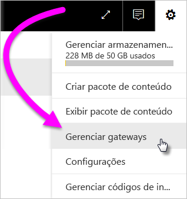
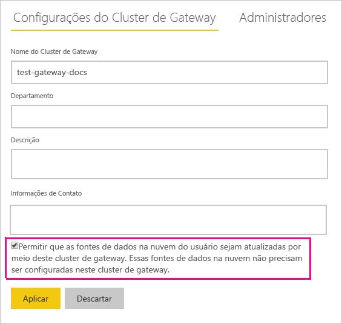
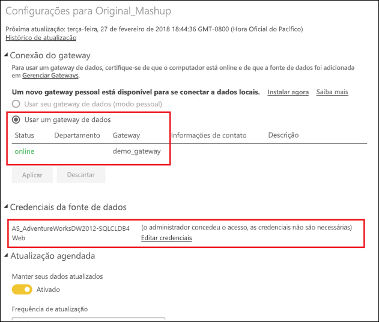

# Mesclar ou acrescentar fontes de dados locais e na nuvem

[!INCLUDE [gateway-rewrite](includes/gateway-rewrite.md)]

O gateway de dados local permite mesclar ou acrescentar fontes de dados locais e na nuvem na mesma consulta. Isso é útil quando você deseja combinar dados de várias fontes sem precisar usar consultas separadas.

>[!NOTE]
>Este artigo aplica-se somente a conjuntos de dados que têm fontes de dados locais e em nuvem mescladas ou acrescentadas em uma única consulta. Para conjuntos de dados que incluem consultas separadas, uma conectando-se a um local e outra conectando-se a uma fonte de dados de nuvem, a consulta que usa a fonte de dados de nuvem não será executada usando o gateway.

## Pré-requisitos

- Um [gateway instalado](/data-integration/gateway/service-gateway-install) em um computador local.
- Um arquivo do Power BI Desktop com consultas que combinam fontes de dados locais e na nuvem.

>[!NOTE]
>Para acessar qualquer fonte de dados de nuvem, você deve garantir que o gateway tenha acesso a essas fontes de dados.

1. No canto superior direito do serviço do Power BI, selecione o ícone de engrenagem   >  **Gerenciar gateways**.

    

2. Selecione o gateway que você deseja configurar.

3. Em **Configurações do Cluster de Gateway**, selecione **Permitir que as fontes de dados na nuvem do usuário sejam atualizadas por meio deste cluster de gateway** > **Aplicar**.

    

4. Nesse cluster de gateway, adicione alguma [fonte de dados local](service-gateway-enterprise-manage-scheduled-refresh.md#add-a-data-source) usada em suas consultas. Você não precisa adicionar as fontes de dados na nuvem aqui.

5. Carregue no serviço do Power BI o seu arquivo do Power BI Desktop com as consultas que combinam fontes de dados locais e na nuvem.

6. Na página **Configurações do conjunto de dados** do novo conjunto de dados:

   - Para a fonte local, selecione o gateway associado a essa fonte de dados.

   - Em **Credenciais da fonte de dados**, edite as credenciais da fonte de dados na nuvem, conforme o necessário.

    Verifique se os níveis de privacidade para fontes de dados locais e na nuvem estão definidos adequadamente para garantir que as junções sejam tratadas com segurança.

     

7. Com o conjunto de credenciais de nuvem, agora você pode atualizar o conjunto de dados usando a opção **Atualizar agora** ou agendá-la para atualizar periodicamente.

## Próximas etapas

Para saber mais sobre a atualização dados para gateways, confira [Usando a fonte de dados para atualização agendada](service-gateway-enterprise-manage-scheduled-refresh.md#using-the-data-source-for-scheduled-refresh).
