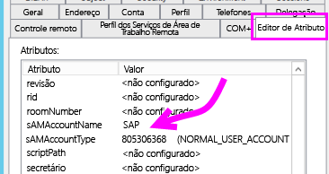
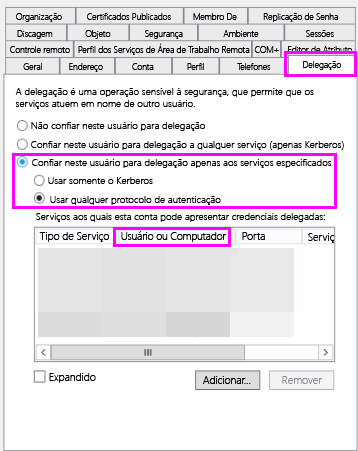
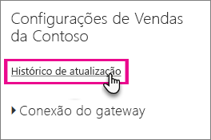
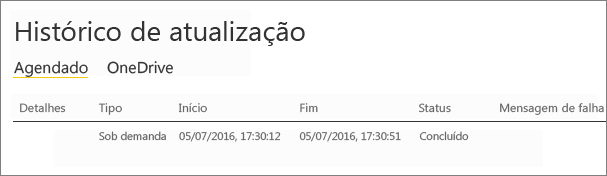

# <a name="troubleshoot-gateways---power-bi"></a>Solucionar problemas de gateways – Power BI

[!INCLUDE [gateway-rewrite](includes/gateway-rewrite.md)]

Este artigo aborda alguns problemas comuns ao usar o **gateway de dados local** com o Power BI. Caso encontre um problema que não esteja listado abaixo, é possível usar o site de [comunidades](http://community.powerbi.com) do Power BI ou criar um [tíquete de suporte](http://powerbi.microsoft.com/support).

## <a name="configuration"></a>Configuração

### <a name="error-power-bi-service-reported-local-gateway-as-unreachable-restart-the-gateway-and-try-again"></a>Erro: O serviço do Power BI relatou o gateway local como inacessível. Reinicie o gateway e tente novamente

No final da configuração, o serviço do Power BI é chamado novamente para validar o gateway. O serviço do Power BI não relata o gateway como dinâmico. Reiniciar o serviço do Windows pode permitir que a comunicação seja bem-sucedida. Você pode coletar e examinar os logs, conforme descrito em [Coletar logs do aplicativo de gateway de dados local](/data-integration/gateway/service-gateway-tshoot#collect-logs-from-the-on-premises-data-gateway-app), para obter mais detalhes.

## <a name="data-sources"></a>Fontes de dados

### <a name="error-unable-to-connect-details-invalid-connection-credentials"></a>Erro: Não é possível estabelecer conexão. Detalhes: "Credenciais de conexão inválidas"

Em **Mostrar detalhes**, a mensagem de erro recebida da fonte de dados é exibida. Para o SQL Server, você verá algo semelhante ao seguinte.

    Login failed for user 'username'.

Verifique se você tem o nome de usuário correto e a senha. Além disso, verifique se essas credenciais podem se conectar à fonte de dados com êxito. Verifique se a conta que está sendo usada corresponde ao **Método de Autenticação**.

### <a name="error-unable-to-connect-details-cannot-connect-to-the-database"></a>Erro: Não é possível estabelecer conexão. Detalhes: "Não é possível se conectar ao banco de dados"

Conseguimos nos conectar ao servidor, mas não ao banco de dados fornecido. Verifique o nome do banco de dados e se as credenciais do usuário têm a permissão apropriada para acessar esse banco de dados.

Em **Mostrar detalhes**, a mensagem de erro recebida da fonte de dados é exibida. Para o SQL Server, você verá algo semelhante ao seguinte.

    Cannot open database "AdventureWorks" requested by the login. The login failed. Login failed for user 'username'.

### <a name="error-unable-to-connect-details-unknown-error-in-data-gateway"></a>Erro: Não é possível estabelecer conexão. Detalhes: "Erro desconhecido no gateway de dados"

Esse erro pode ocorrer por diferentes motivos. Não se esqueça de validar que você pode se conectar à fonte de dados do computador que hospeda o gateway. Isso pode ocorrer devido ao fato de o servidor não estar acessível.

Em **Mostrar detalhes**, é possível ver um código de erro **DM_GWPipeline_UnknownError**.

Você também pode examinar os Logs de Eventos > **Logs de Aplicativos e Serviços** > **Serviço do gateway de dados local** para obter mais detalhes.

### <a name="error-we-encountered-an-error-while-trying-to-connect-to-server-details-we-reached-the-data-gateway-but-the-gateway-cant-access-the-on-premises-data-source"></a>Erro: Erro: encontramos um erro ao tentar conectar-se com o \<servidor\>. Detalhes: "Acessamos o gateway de dados, mas o gateway não pode acessar a fonte de dados local."

Não é possível se conectar à fonte de dados especificada. Certifique-se de validar as informações fornecidas para essa fonte de dados.

Em **Mostrar detalhes**, é possível ver um código de erro de **DM_GWPipeline_Gateway_DataSourceAccessError**.

Se a mensagem de erro subjacente for semelhante à seguinte, isso significa que a conta que você está usando para a fonte de dados não é um administrador do servidor para essa instância do Analysis Services. [Saiba mais](https://docs.microsoft.com/sql/analysis-services/instances/grant-server-admin-rights-to-an-analysis-services-instance)

    The 'CONTOSO\account' value of the 'EffectiveUserName' XML for Analysis property is not valid.

Caso a mensagem de erro subjacente seja semelhante à seguinte, isso pode indicar que a conta de serviço do Analysis Services pode não ter o atributo de diretório TGGAU ([token-groups-global-and-universal](https://msdn.microsoft.com/library/windows/desktop/ms680300.aspx)).

    The username or password is incorrect.

Os domínios com acesso de compatibilidade anterior ao Windows 2000 têm o atributo TGGAU habilitado. No entanto, os domínios criados mais recentemente não habilitam esse atributo por padrão. Leia mais sobre isso [aqui](https://support.microsoft.com/kb/331951).

Confirme isso fazendo o seguinte:

1. Conecte-se ao computador do Analysis Services no SQL Server Management Studio. Nas propriedades de conexão Avançada, inclua EffectiveUserName para o usuário em questão e veja se isso reproduz o erro.
2. Você pode usar a ferramenta dsacls do Active Directory para validar se o atributo está listado. Essa é uma ferramenta encontrada em um controlador de domínio. É necessário saber o que é o nome de domínio diferenciado para a conta e passá-lo para a ferramenta.

        dsacls "CN=John Doe,CN=UserAccounts,DC=contoso,DC=com"

    Você deseja ver algo semelhante ao mostrado a seguir nos resultados.

            Allow BUILTIN\Windows Authorization Access Group
                                          SPECIAL ACCESS for tokenGroupsGlobalAndUniversal
                                          READ PROPERTY

Para corrigir esse problema, é necessário habilitar o TGGAU na conta usada para o serviço Windows do Analysis Services.

#### <a name="another-possibility-for-username-or-password-incorrect"></a>Outra possibilidade de nome de usuário ou senha incorretos

Esse erro também poderá ser causado se o servidor do Analysis Services estiver em um domínio diferente dos usuários e não houver uma relação de confiança bidirecional estabelecida.

É necessário trabalhar com seus administradores de domínio para verificar a relação de confiança entre os domínios.

#### <a name="unable-to-see-the-data-gateway-data-sources-in-the-get-data-experience-for-analysis-services-from-the-power-bi-service"></a>Não é possível ver as fontes de dados do gateway de dados na experiência "Obter dados" do Analysis Services por meio do serviço do Power BI

Confira se sua conta está listada na guia **Usuários** da fonte de dados na configuração do gateway. Se não tiver acesso ao gateway, verifique com o administrador do gateway e solicite a verificação. Somente as contas na lista **Usuários** podem ver a fonte de dados relacionada na lista do Analysis Services.

### <a name="error-you-dont-have-any-gateway-installed-or-configured-for-the-data-sources-in-this-dataset"></a>Erro: Você não tem nenhum gateway instalado ou configurado para as fontes de dados neste conjunto de dados

Verifique se você adicionou uma ou mais fontes de dados para o gateway, conforme está descrito em [Adicionar uma fonte de dados](service-gateway-data-sources.md#add-a-data-source). Se o gateway não aparecer no portal de administração em **Gerenciar gateways**, tente limpar o cache do navegador ou sair do serviço e entrar novamente.

## <a name="datasets"></a>Conjuntos de dados

### <a name="error-there-is-not-enough-space-for-this-row"></a>Erro: Não há espaço suficiente para esta linha

Isso ocorrerá se você tiver uma única linha com um tamanho maior que 4 MB. É necessário determinar qual linha é proveniente da fonte de dados e tentar filtrá-la ou reduzir seu tamanho.

### <a name="error-the-server-name-provided-doesnt-match-the-server-name-on-the-sql-server-ssl-certificate"></a>Erro: O nome do servidor fornecido não corresponde ao nome do servidor no certificado SSL do SQL Server

Isso pode ocorrer quando o certificado CN é para o FQDN (nome de domínio totalmente qualificado) do servidor, mas você somente forneceu o nome NetBIOS do servidor. Isso causa uma incompatibilidade para o certificado. Para resolver esse problema, é necessário criar o nome do servidor na fonte de dados do gateway e no arquivo PBIX para usar o FQDN do servidor.

### <a name="i-dont-see-the-on-premises-data-gateway-present-when-configuring-scheduled-refresh"></a>Não consigo ver o gateway de dados local presente ao configurar a atualização agendada

Isso pode ser devido a alguns cenários diferentes.

1. O nome do servidor e do banco de dados não corresponde entre o que foi inserido no Power BI Desktop e a fonte de dados configurada para o gateway. Eles precisam ter os mesmos valores. Eles não diferenciam maiúsculas de minúsculas.
2. Sua conta não está listada na guia **Usuários** da fonte de dados na configuração do gateway. É necessário solicitar ao administrador do gateway para ser adicionado à lista.
3. O arquivo do Power BI Desktop contém dados de várias fontes e nem todas as fontes de dados estão configuradas com o gateway. É necessário ter cada fonte de dados definida com o gateway para que ele seja exibido na Atualização agendada.

### <a name="error-the-received-uncompressed-data-on-the-gateway-client-has-exceeded-the-limit"></a>Erro: Os dados descompactados recebidos no cliente de gateway excederam o limite

A limitação exata é de 10 GB de dados descompactados por tabela. Se você estiver tendo esse problema, há boas opções para otimizá-lo e evitá-lo. Especificamente, será útil reduzir o uso de valores de cadeias de caracteres longas e altamente repetitivas e, em vez disso, usar uma chave normalizada ou remover a coluna (se ela não estiver em uso).

## <a name="reports"></a>Relatórios

### <a name="report-could-not-access-the-data-source-because-you-do-not-have-access-to-our-data-source-via-an-on-premises-data-gateway"></a>O relatório não pôde acessar a fonte de dados porque você não tem acesso à nossa fonte de dados por meio de um gateway de dados local

Isso geralmente é causado por um dos motivos a seguir.

1. As informações da fonte de dados não correspondem às que estão no conjunto de dados subjacente. O servidor e o nome do banco de dados precisam corresponder à fonte de dados definida para o gateway de dados local e às informações fornecidas no Power BI Desktop. Se você usar um Endereço IP no Power BI Desktop, a fonte de dados do gateway de dados local também precisará usar um Endereço IP.
2. Não há nenhuma fonte de dados disponível em nenhum gateway de sua organização. É possível configurar a fonte de dados em um gateway de dados local novo ou existente.

### <a name="error-data-source-access-error-please-contact-the-gateway-administrator"></a>Erro: Erro de acesso à fonte de dados. Contate o administrador do gateway

Se este relatório estiver usando uma conexão dinâmica do Analysis Services, talvez você tenha problemas ao passar um valor para EffectiveUserName que não seja válido ou que não tenha permissões no computador do Analysis Services. Normalmente, um problema de autenticação ocorre devido ao fato de que o valor passado para EffectiveUserName não corresponde a um nome UPN local.

Para confirmar isso, faça o seguinte:

1. Encontre o nome de usuário efetivo nos [logs do gateway](/data-integration/gateway/service-gateway-tshoot#collect-logs-from-the-on-premises-data-gateway-app).
2. Depois de obter o valor que está sendo passado, valide se ele está correto. Se ele for seu usuário, será possível usar o comando a seguir em um prompt de comando para ver o UPN. O UPN tem a aparência de um endereço de email.

        whoami /upn

Se preferir, é possível ver o que o Power BI obtém do Azure Active Directory.

1. Navegue até [https://developer.microsoft.com/graph/graph-explorer](https://developer.microsoft.com/graph/graph-explorer).
2. Selecione **Entrar** no canto superior direito.
3. Execute a consulta a seguir. Você verá uma resposta JSON bem grande.

        https://graph.windows.net/me?api-version=1.5
4. Procure **userPrincipalName**.

Se o UPN do Azure Active Directory não corresponder ao UPN local do Active Directory, você poderá usar o recurso [Mapear nomes de usuário](service-gateway-enterprise-manage-ssas.md#mapping-usernames-for-analysis-services-data-sources) para substituí-lo por um valor válido. Ou será possível trabalhar com seu administrador de locatários ou com o administrador local do Active Directory para alterar o UPN.

## <a name="kerberos"></a>Kerberos

Se o servidor de banco de dados subjacente e o gateway de dados local não estiverem devidamente configurados para [Delegação Restrita de Kerberos](service-gateway-sso-kerberos.md), habilite o [log detalhado](/data-integration/gateway/service-gateway-performance#slow-performing-queries) no gateway e investigue com base nos erros/rastreamentos em arquivos de log do gateway como um ponto de partida para solução de problemas. Para coletar os logs de gateway para exibição, confira [Coletar logs do aplicativo de gateway de dados local](/data-integration/gateway/service-gateway-tshoot#collect-logs-from-the-on-premises-data-gateway-app).

### <a name="impersonationlevel"></a>ImpersonationLevel

O ImpersonationLevel está relacionado à configuração de SPN ou à configuração de política local.

```
[DataMovement.PipeLine.GatewayDataAccess] About to impersonate user DOMAIN\User (IsAuthenticated: True, ImpersonationLevel: Identification)
```

**Solução**

Execute estas etapas para resolver o problema:

1. Configurar um SPN para o gateway local.
2. Configurar a delegação restrita em seu AD (Active Directory).

### <a name="failedtoimpersonateuserexception-failed-to-create-windows-identity-for-user-userid"></a>FailedToImpersonateUserException: falha ao criar a identidade do Windows para a ID do usuário

O FailedToImpersonateUserException ocorrerá se você não puder representar em nome de outro usuário. Isso também pode ocorrer se a conta que você está tentando representar for de um domínio diferente do domínio no qual o domínio do serviço de gateway está (isso é uma limitação).

**Solução**

* Verifique se a configuração está correta de acordo com as etapas na seção ImpersonationLevel acima.
* Verifique se a userid que ele está tentando representar é de uma conta válida do AD.

### <a name="general-error-1033-error-while-parsing-the-protocol"></a>Erro geral; erro 1033 ao analisar o protocolo

Você receberá o erro 1033 quando sua ID externa configurada no SAP HANA não corresponder ao logon se o usuário for representado usando o UPN (alias@domain.com). Nos logs, você verá o "UPN Original 'alias@domain.com' substituído por um novo UPN 'alias@domain.com'" na parte superior dos logs de erro, conforme mostrado abaixo.

```
[DM.GatewayCore] SingleSignOn Required. Original UPN 'alias@domain.com' replaced with new UPN 'alias@domain.com.'
```

**Solução**

* O SAP HANA exige que o usuário representado use o atributo sAMAccountName no AD (alias do usuário). Se não estiver correto, você verá o erro 1033.

    

* Nos logs, você vê sAMAccountName (alias) e não o UPN, que é o alias seguido pelo domínio (alias@doimain.com).

    

```xml
      <setting name="ADUserNameReplacementProperty" serializeAs="String">
        <value>sAMAccount</value>
      </setting>
      <setting name="ADServerPath" serializeAs="String">
        <value />
      </setting>
      <setting name="CustomASDataSource" serializeAs="String">
        <value />
      </setting>
      <setting name="ADUserNameLookupProperty" serializeAs="String">
        <value>AADEmail</value>
```

### <a name="sap-aglibodbchdb-dllhdbodbc-communication-link-failure-10709-connection-failed-rte-1-kerberos-error-major-miscellaneous-failure-851968-minor-no-credentials-are-available-in-the-security-package"></a>[SAP AG] [LIBODBCHDB DLL] [HDBODBC] Falha do link de comunicação; –10709 Falha de conexão (RTE:[-1] erro de Kerberos. Principal: "Falhas diversas [851968]", secundária: "Nenhuma credencial disponível no pacote de segurança

Você receberá a mensagem de erro –10709 Falha na conexão se sua delegação não estiver configurada corretamente no AD.

**Solução**

* Verifique se você tem o servidor SAP Hana na guiaDelegação no AD para a conta de serviço do gateway.

   

## <a name="refresh-history"></a>Histórico de atualização

Ao usar o gateway para uma atualização agendada, o **Histórico de Atualizações** pode ajudá-lo a ver quais erros ocorreram, além de fornecer dados úteis caso precise criar uma solicitação de suporte. É possível exibir atualizações agendadas e sob demanda. As etapas a seguir mostram como você pode acessar o **Histórico de atualização**.

1. No painel de navegação do Power BI, em **Conjuntos de Dados**, selecione um conjunto de dados &gt; Abrir Menu &gt; **Agendar Atualização**.

    

2. Em **Configurações de...** &gt; **Agendar Atualização**, selecione **Histórico de Atualização**.

    

    

Para obter informações adicionais sobre como solucionar problemas de cenários de atualização, examine o artigo [Solução de problemas de cenários de atualização](refresh-troubleshooting-refresh-scenarios.md).

## <a name="fiddler-trace"></a>Rastreamento do Fiddler

[Fiddler](http://www.telerik.com/fiddler) é uma ferramenta gratuita da Telerik que monitora o tráfego HTTP. Você pode ver a parte de trás e frente com o serviço do Power BI do computador cliente. Isso pode mostrar erros e outras informações relacionadas.


## <a name="next-steps"></a>Próximas etapas

* [Solucionar problemas do gateway de dados local](/data-integration/gateway/service-gateway-tshoot)
* [Definindo as configurações de proxy do gateway de dados locais](/data-integration/gateway/service-gateway-proxy)  
* [Gerenciar sua fonte de dados – Analysis Services](service-gateway-enterprise-manage-ssas.md)  
* [Gerenciar sua fonte de dados – SAP HANA](service-gateway-enterprise-manage-sap.md)  
* [Gerenciar sua fonte de dados – SQL Server](service-gateway-enterprise-manage-sql.md)  
* [Gerenciar sua fonte de dados – Importar/Atualização agendada](service-gateway-enterprise-manage-scheduled-refresh.md)  

Mais perguntas? [Experimente a Comunidade do Power BI](http://community.powerbi.com/)
