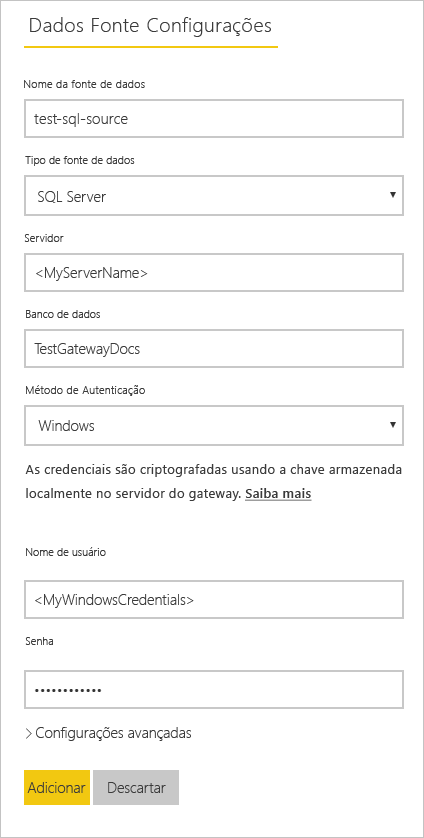
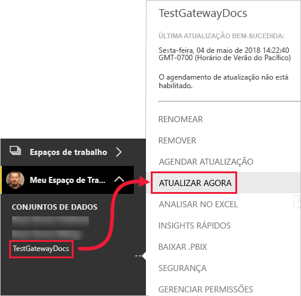

# <a name="refresh-data-from-an-on-premises-sql-server-database"></a>Atualizar os dados de um banco de dados do SQL Server local

Neste tutorial, você explora como atualizar um conjunto de dados do Power BI de um banco de dados relacional que existe no local em sua rede local. Especificamente, este tutorial usa um exemplo do banco de dados do SQL Server, que o Power BI deve acessar por meio de um gateway de dados local.

Neste tutorial, você concluirá as etapas a seguir:

> [!div class="checklist"]
> * Criar e publicar um arquivo (.pbix) do Power BI Desktop que importa dados de um banco de dados do SQL Server local.
> * Definir configurações de fonte de dados e de conjunto de dados no Power BI para conectividade do SQL Server por meio de um gateway de dados.
> * Configurar uma agenda de atualização para garantir que seu conjunto de dados do Power BI tenha dados recentes.
> * Executar uma atualização sob demanda do seu conjunto de dados.
> * Examinar o histórico de atualização para analisar os resultados dos últimos ciclos de atualização.
> * Limpar recursos excluindo os artefatos criados neste tutorial.

## <a name="prerequisites"></a>Pré-requisitos

- Se você não tiver uma, inscreva-se em uma [avaliação gratuita do Power BI](https://app.powerbi.com/signupredirect?pbi_source=web) antes de começar.
- [Instalar o Power BI Desktop](https://powerbi.microsoft.com/desktop/) em um computador local.
- [Instalar o SQL Server](/sql/database-engine/install-windows/install-sql-server) em um computador local e restaure o [banco de dados de exemplo de um backup]((https://github.com/Microsoft/sql-server-samples/releases/download/adventureworks/AdventureWorksDW2017.bak)). Para obter mais informações sobre a AdventureWorks, consulte [Instalação e configuração da AdventureWorks](/sql/samples/adventureworks-install-configure).
- [Instalar um gateway de dados local](service-gateway-install.md) no mesmo computador local como SQL Server (na produção, normalmente seria em um computador diferente).

> [!NOTE]
> Se você não for um administrador de gateway e não quiser instalar um gateway por conta própria, contate um administrador de gateway em sua organização. Ele pode criar a definição de fonte de dados necessária para conectar a seu conjunto de dados ao seu banco de dados do SQL Server.

## <a name="create-and-publish-a-power-bi-desktop-file"></a>Criar e publicar um arquivo do Power BI Desktop

Use o procedimento a seguir para criar um relatório básico do Power BI usando o banco de dados AdventureWorksDW. Publique o relatório no serviço do Power BI, para que você obtenha um conjunto de dados no Power BI, que, em seguida, você pode configurar e atualizar nas etapas seguintes.

1. No Power BI Desktop, na guia **Início**, selecione **Obter Dados** \> **SQL Server**.

2. Na caixa de diálogo, **Banco de dados do SQL Server**, digite os nomes do **Servidor** e do **Banco de dados (opcional)** , verifique se o **modo de Conectividade de Dados** é **Importar** e, em seguida, selecione **OK**.

    

3. Verifique suas **credenciais** e selecione **Conectar**.

    > [!NOTE]
    > Se não puder autenticar, verifique se você selecionou o método de autenticação correto e use uma conta com acesso de banco de dados. Em ambientes de teste, você pode usar a autenticação de banco de dados com uma senha e nome de usuário explícitos. Em ambientes de produção, você normalmente usa a autenticação do Windows. Consulte [Solucionar problemas de atualização](refresh-troubleshooting-refresh-scenarios.md) e entre em contato com seu administrador de banco de dados para obter assistência adicional.

1. Se uma caixa de diálogo **Suporte à Criptografia** for exibida, selecione **OK**.

2. Na caixa de diálogo **Navegador**, selecione a tabela **DimProduct** e, em seguida, selecione **Carregar**.

    

3. Na exibição de **Relatório** do Power BI Desktop, no painel **Visualizações**, selecione o **Gráfico de colunas empilhadas**.

    

4. Com o gráfico de colunas selecionado na tela do relatório, no painel **Campos**, selecione os campos **EnglishProductName** e **ListPrice**.

    

5. Arraste **EndDate** até **filtros de nível de relatório** e, em **Filtragem básica**, marque somente a caixa de seleção para **(Em branco)** .

    

    Agora, o gráfico deve ser semelhante ao seguinte.

    

    Observe que os cinco produtos **Road-250** são listados com o maior preço de lista. Isso mudará quando você atualizar os dados e atualizar o relatório posteriormente neste tutorial.

6. Salve o relatório com o nome "AdventureWorksProducts.pbix".

7. Na guia **Início**, selecione **Publicar** \> **Meu Workspace** \> **Selecionar**. Entre no serviço do Power BI se for solicitado que você faça isso.

8. Na tela **Êxito**, selecione **Abrir 'AdventureWorksProducts.pbix' in Power BI**.

    [Publicar no Power BI](./media/service-gateway-sql-tutorial/publish-to-power-bi.png)

## <a name="connect-a-dataset-to-a-sql-server-database"></a>Conectar um conjunto de dados a um banco de dados do SQL Server

No Power BI Desktop, você se conectou diretamente ao banco de dados do SQL Server local, mas o serviço do Power BI requer um gateway de dados para atuar como uma ponte entre a nuvem e sua rede local. Siga estas etapas para adicionar seu banco de dados do SQL Server local como uma fonte de dados a um gateway e, em seguida, conecte o seu conjunto de dados a esta fonte de dados.

1. Entre no Power BI. No canto superior direito, selecione o ícone de engrenagem de configurações, em seguida, selecione **Configurações**.

    

2. Na guia **Conjuntos de dados**, selecione o conjunto de dados **AdventureWorksProducts**, para que você possa se conectar ao seu banco de dados do SQL Server local por meio de um gateway de dados.

3. Expanda **Gateway de conexão** e verifique se pelo menos um gateway está listado. Se você não tiver um gateway, consulte a seção [Pré-requisitos](#prerequisites) anteriormente neste tutorial para ver um link para a documentação do produto sobre como instalar e configurar um gateway.

    

4. Em **Ações**, expanda o botão de alternância para exibir as fontes de dados e selecione o link **Adicionar ao gateway**.

    

    > [!NOTE]
    > Se você não for um administrador de gateway e não quiser instalar um gateway por conta própria, contate um administrador de gateway em sua organização. Ele pode criar a definição de fonte de dados necessária para conectar a seu conjunto de dados ao seu banco de dados do SQL Server.

5. Na página de gerenciamento **Gateways**, na guia **Configurações de Fonte de Dados**, insira e verifique as informações a seguir e selecione **Adicionar**.

    | Opção | Valor |
    | --- | --- |
    | Nome da Fonte de Dados | AdventureWorksProducts |
    | Tipo de Fonte de Dados | SQL Server |
    | Servidor | O nome de sua instância do SQL Server, SQLServer01 (deve ser idêntico ao que você especificou no Power BI Desktop). |
    | Banco de dados | O nome do seu banco de dados do SQL Server, AdventureWorksDW (deve ser idêntico ao que você especificou no Power BI Desktop). |
    | Método de Autenticação | Windows ou Basic (normalmente Windows). |
    | Nome de usuário | A conta de usuário que você usa para se conectar ao SQL Server. |
    | Senha | A senha da conta usada para se conectar ao SQL Server. |

    

6. Na guia **Conjuntos de dados**, expanda a seção **Gateway de conexão** novamente. Selecione o gateway de dados configurado, que mostra um **Status** de execução no computador onde você o instalou, e selecione **Aplicar**.

    

## <a name="configure-a-refresh-schedule"></a>Configurar um agendamento de atualização

Agora que você conectou seu conjunto de dados no Power BI ao seu banco de dados do SQL Server local por meio de um gateway de dados, siga estas etapas para configurar uma agenda de atualização. Atualizar seu conjunto de dados de forma programada ajuda a garantir que seus relatórios e dashboards tenham os dados mais recentes.

1. No painel de navegação à esquerda, abra **Meu Workspace** \> **Conjuntos de dados**. Selecione as reticências ( **...** ) para o conjunto dedados **AdventureWorksProducts**, em seguida, selecione **Agendar a atualização**.

    > [!NOTE]
    > Selecione as reticências para o conjunto de dados **AdventureWorksProducts** e não as reticências para o relatório com o mesmo nome. O menu de contexto do relatório **AdventureWorksProducts** não inclui uma opção **Agendar atualização**.

2. Na seção **Atualização agendada**, em **Manter seus dados atualizados**, defina atualizar como **Ativado**.

3. Selecione uma **Frequência de atualização** apropriada, (**Diária** neste exemplo) e, em seguida, em **Hora**, selecione **Adicionar outra hora** para especificar o horário de atualização desejado (6h30 e 18h30 para este exemplo).

    

    > [!NOTE]
    > Você poderá configurar até oito slots de tempo diários se o seu conjunto de dados estiver na capacidade compartilhada ou 48 slots no Power BI Premium.

4. Deixe a caixa de seleção **Enviar-me emails de notificação de falha na atualização** habilitada e selecione **Aplicar**.

## <a name="perform-an-on-demand-refresh"></a>Executar uma atualização sob demanda

Agora que você configurou uma agenda de atualização, o Power BI atualiza o conjunto de dados no próximo horário agendado, dentro de uma margem de 15 minutos. Se você quiser atualizar os dados mais cedo, por exemplo, para testar sua configuração de gateway e fonte de dados, execute uma atualização sob demanda usando a opção **Atualizar agora** no menu de conjunto de dados no painel de navegação esquerdo. Atualizações sob demanda não afetam o horário da próxima atualização agendada, mas são contabilizadas com relação ao limite de atualizações diárias, mencionado na seção anterior.

Para fins ilustrativos, simule uma alteração nos dados de exemplo atualizando a tabela DimProduct no banco de dados AdventureWorksDW usando o SSMS (SQL Server Management Studio).

```sql

UPDATE [AdventureWorksDW].[dbo].[DimProduct]
SET ListPrice = 5000
WHERE EnglishProductName ='Road-250 Red, 58'

```

Agora, siga estas etapas para que os dados atualizados possam fluir por meio da conexão de gateway para o conjunto de dados e para os relatórios no Power BI.

1. No serviço do Power BI, no painel de navegação esquerdo, selecione e expanda **Meu Workspace**.

2. Em **Conjuntos de dados**, para o conjunto de dados **AdventureWorksProducts**, selecione as reticências ( **...** ) e selecione **Atualizar agora**.

    

    No canto superior direito, observe que o Power BI está se preparando para executar a atualização solicitada.

3. Selecione **Meu Workspace \> Relatórios \> AdventureWorksProducts**. Veja como os dados atualizados fluem, e o produto com o maior preço de lista agora é **Road-250 vermelho, 58**.

    

## <a name="review-the-refresh-history"></a>Examine o histórico de atualização

É uma boa ideia verificar os resultados dos últimos ciclos de atualização periodicamente no histórico de atualização. As credenciais de banco de dados podem ter expirado ou o gateway selecionado pode ter ficado offline no momento de uma atualização agendada. Siga estas etapas para examinar o histórico de atualização e verificar se há problemas.

1. No canto superior direito da interface do usuário do Power BI, selecione o ícone de engrenagem de configurações, em seguida, selecione **Configurações**.

2. Alterne para **Conjuntos de dados** e selecione o conjunto de dados, como **AdventureWorksProducts**, que você deseja examinar.

3. Selecione o link **Histórico de atualização** para abrir a caixa de diálogo **Histórico de atualização**.

    

4. Na guia **Agendado**, observe as últimas atualizações agendadas e sob demanda com seus horários de **Início** e **Término** e um **Status** de **Concluído**, que indica que o Power BI executou as atualizações com êxito. Para obter atualizações com falha, você pode ver a mensagem de erro e examinar os detalhes do erro.

    

    > [!NOTE]
    > A guia OneDrive só é relevante para conjuntos de dados conectados a arquivos do Power BI Desktop, pastas de trabalho do Excel ou arquivos CSV no OneDrive ou SharePoint Online, conforme explicado mais detalhadamente em [Atualização de dados no Power BI](refresh-data.md).

## <a name="clean-up-resources"></a>Limpar recursos

Se você não quiser mais usar os dados de exemplo, descarte o banco de dados no SSMS (SQL Server Management Studio). Se não quiser usar a fonte de dados do SQL Server, remova a fonte de dados do seu gateway de dados. Além disso, considere desinstalar o gateway de dados se você o instalou apenas para fins de concluir este tutorial. Você também deve excluir o conjunto de dados AdventureWorksProducts e o relatório de AdventureWorksProducts criado pelo Power BI quando você carregou o arquivo AdventureWorksProducts.pbix.

## <a name="next-steps"></a>Próximas etapas

Neste tutorial, você explorou como importar dados de um banco de dados do SQL Server local para um conjunto de dados do Power BI e como atualizar esse conjunto de dados por agendamento e sob demanda para manter os relatórios e dashboards que usam esse conjunto de dados atualizados no Power BI. Agora você pode aprender mais sobre como gerenciar gateways de dados e fontes de dados no Power BI. Também pode ser uma boa ideia examinar o artigo conceitual de atualização de dados no Power BI.

- [Gerenciar um gateway local do Power BI](service-gateway-manage.md)
- [Gerenciar sua fonte de dados – Importar/Atualização agendada](service-gateway-enterprise-manage-scheduled-refresh.md)
- [Atualizar dados no Power BI](refresh-data.md)
