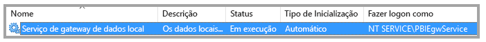
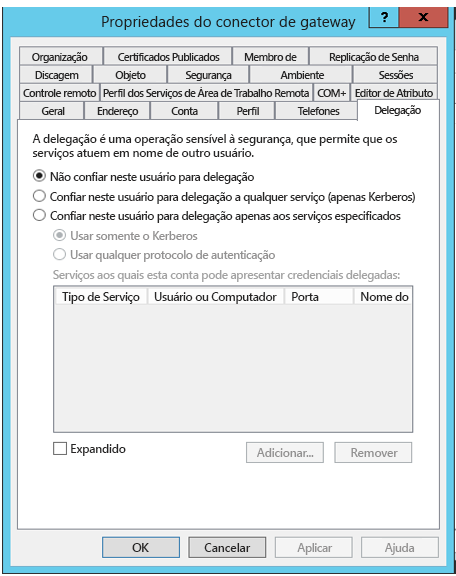
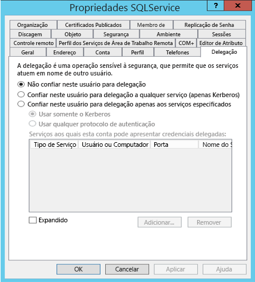
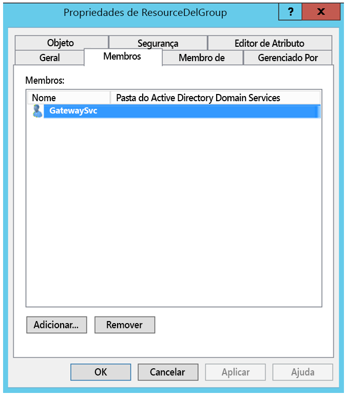
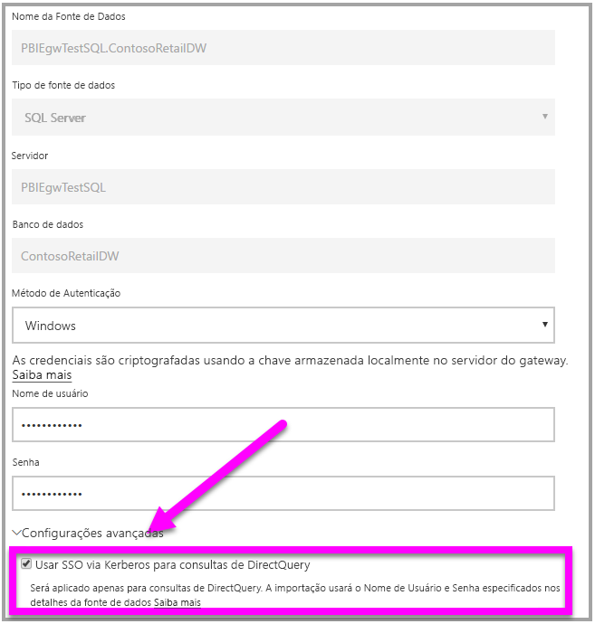

# <a name="use-resource-based-kerberos-for-single-sign-on-sso-from-power-bi-to-on-premises-data-sources"></a>Use o Kerberos baseado em recurso para logon único (SSO) do Power BI para fontes de dados locais

Use a [delegação restrita de Kerberos baseada em recursos](/windows-server/security/kerberos/kerberos-constrained-delegation-overview) para habilitar a conectividade de logon único no Windows Server 2012 e versões posteriores, permitindo que os serviços de front-end e back-end estejam em domínios diferentes. Para que isso funcione, o domínio de serviço de back-end precisa confiar no domínio do serviço de front-end.

## <a name="preparing-for-resource-based-kerberos-constrained-delegation"></a>Preparar para delegação restrita de Kerberos baseada em recursos

Vários itens devem ser configurados para que a delegação restrita de Kerberos funcione corretamente, incluindo os _SPNs_ (nomes das entidades de serviço) e as configurações de delegação nas contas de serviço. 

### <a name="prerequisite-1-operating-system-requirements"></a>Pré-requisito 1: requisitos do sistema operacional

A delegação restrita baseada em recursos só pode ser configurada em um controlador de domínio executando o Windows Server 2012 R2, o Windows Server 2012 ou posterior.

### <a name="prerequisite-2-install-and-configure-the-on-premises-data-gateway"></a>Pré-requisito 2: instalar e configurar o gateway de dados local

Essa versão do gateway de dados local é compatível com atualização in-loco e com o _controle das configurações_ de gateway existentes.

### <a name="prerequisite-3-run-the-gateway-windows-service-as-a-domain-account"></a>Pré-requisito 3: executar o serviço Windows do gateway como uma conta de domínio

Em uma instalação padrão, o gateway é executado como uma conta de serviço de computador local (especificamente, _NT Service\PBIEgwService_), conforme mostrado na imagem a seguir:



Para habilitar a **delegação restrita de Kerberos, o gateway deve ser executado como uma conta de domínio, a menos que o Azure AD já esteja sincronizado com o Active Directory local (usando o DirSync/Connect do Azure AD). Caso precise alternar a conta para uma conta de domínio, confira [Alternando o gateway para uma conta de domínio](service-gateway-sso-kerberos.md).

Se o Azure AD DirSync/Connect estiver configurado e as contas de usuário estiverem sincronizadas, o serviço de gateway não precisará executar pesquisas no AD local no tempo de execução. Você poderá usar o SID de Serviço local (em vez de uma conta de domínio) para o serviço do gateway. As etapas de configuração de delegação restrita de Kerberos descritas neste artigo são as mesmas que dessa configuração (elas são simplesmente aplicadas ao objeto de computador do gateway no Active Directory e não na conta de domínio).

### <a name="prerequisite-4-have-domain-admin-rights-to-configure-spns-setspn-and-kerberos-constrained-delegation-settings"></a>Pré-requisito 4: ter direitos de administrador de domínio para configurar definições de SPNs (SetSPN) e da delegação restrita de Kerberos

Embora seja tecnicamente possível que um administrador de domínio conceda direitos temporários ou permanentes para alguém configurar a delegação de Kerberos e os SPNs sem exigir direitos de administrador de domínio, essa não é a abordagem recomendada. Na seção a seguir, cobrimos as etapas de configuração necessárias para o **Pré-requisito 3** em detalhes.

## <a name="configuring-kerberos-constrained-delegation-for-the-gateway-and-data-source"></a>Configurando a delegação restrita de Kerberos para o gateway e a fonte de dados

Para configurar o sistema corretamente, é preciso configurar ou validar os dois itens a seguir:

1. Se necessário, configure um SPN para a conta de domínio do serviço de gateway.

1. Defina as configurações de delegação na conta de domínio do serviço do gateway.

Observe que é preciso ser administrador de domínio para executar as duas etapas de configuração.

As seções a seguir descrevem essas etapas individualmente.

### <a name="configure-an-spn-for-the-gateway-service-account"></a>Configurar um SPN para a conta de serviço do gateway

Primeiro, determine se um SPN já foi criado para a conta de domínio usada como a conta de serviço do gateway, mas seguindo estas etapas:

1. Como administrador de domínio, inicialize **Usuários e Computadores do Active Directory**.

1. Clique com o botão direito do mouse no domínio, selecione **Localizar** e digite o nome da conta de serviço do gateway

1. No resultado da pesquisa, clique com o botão direito do mouse na conta de serviço do gateway e selecione **Propriedades**.

1. Se a guia **Delegação** estiver visível na caixa de diálogo **Propriedades**, será a indicação que um SPN já foi criado e que você poderá pular para a próxima subseção sobre como definir as configurações de Delegação.

    Se não houver nenhuma guia **Delegação** na caixa de diálogo **Propriedades**, você poderá criar manualmente um SPN nessa conta para adicionar a guia **Delegação** (que é a maneira mais fácil de definir as configurações de delegação). A criação de um SPN pode ser executada usando a [ferramenta setspn](https://technet.microsoft.com/library/cc731241.aspx) fornecida com o Windows (você precisa de direitos de administrador de domínio para criar o SPN).

    Por exemplo, imagine que a conta de serviço do gateway seja "PBIEgwTest\GatewaySvc" e o nome do computador com o serviço do gateway em execução tenha o nome de **Machine1**. Para definir o SPN para a conta de serviço do gateway desse computador do exemplo, você precisará executar o seguinte comando:

      

    Com a etapa concluída, podemos prosseguir para as configurações de delegação.

### <a name="configure-delegation-settings"></a>Definir configurações de delegação

Nas etapas a seguir, presumimos um ambiente local com dois computadores em domínios diferentes: um computador do gateway e um servidor de banco de dados executando o SQL Server. Para este exemplo, vamos também supor as configurações e os nomes a seguir:

- Nome do computador do gateway: **PBIEgwTestGW**
- Conta de serviço de gateway: **PBIEgwTestFrontEnd\GatewaySvc** (nome de exibição da conta: Conector de gateway)
- Nome do computador da fonte de dados do SQL Server: **PBIEgwTestSQL**
- Conta de serviço da fonte de dados do SQL Server: **PBIEgwTestBackEnd\SQLService**

Considerando os nomes e as configurações do exemplo, use as seguintes etapas de configuração:

1. Usando o **Usuários e computadores do Active Directory**, que é um snap-in MMC (Console de gerenciamento Microsoft), no controlador de domínio para o domínio **PBIEgwTestFront-end**, certifique-se de que não há nenhuma configuração de delegação aplicada na conta de serviço do gateway.

    

1. Usando o **Usuários e computadores do Active Directory**, no controlador de domínio para o domínio **PBIEgwTestBack-end**, certifique-se de que não há nenhuma configuração de delegação aplicada na conta de serviço de back-end. Além disso, certifique-se de que o atributo "msDS-AllowedToActOnBehalfOfOtherIdentity" dessa conta também não está definido. Você pode encontrar esse atributo no "Editor de atributo", como mostrado na imagem a seguir:

    

1. Crie um grupo no **Usuários e computadores do Active Directory**, no controlador de domínio para o domínio **PBIEgwTestBack-end**. Adicione a conta de serviço do gateway a esse grupo, como mostrado na imagem a seguir. A imagem mostra um novo grupo chamado _ResourceDelGroup_ e a conta de serviço do gateway **GatewaySvc** adicionada a esse grupo.

    

1. Abra o prompt de comando e execute os seguintes comandos no controlador de domínio para o domínio **PBIEgwTestBack-end** para atualizar o atributo msDS-AllowedToActOnBehalfOfOtherIdentity da conta de serviço de back-end:

    ```powershell
    $c = Get-ADGroup ResourceDelGroup
    Set-ADUser SQLService -PrincipalsAllowedToDelegateToAccount $c
    ```

1. Você pode verificar que a atualização será refletida na guia "Editor de atributo", nas propriedades da conta de serviço de back-end em **Usuários e computadores do Active Directory.**

Por fim, no computador que executa o serviço do gateway (**PBIEgwTestGW** em nosso exemplo), a conta de serviço do gateway deverá receber a política local "Representar um cliente após autenticação". Você poderá executar/verificar isso com o Editor de Política de Grupo Local (**gpedit**).

1. No computador do gateway, execute: _gpedit.msc_.

1. Navegue até **Política de Computador Local > Configuração do Computador > Configurações do Windows > Configurações de Segurança > Políticas Locais > Atribuição de Direitos de Usuário**, conforme mostrado na imagem a seguir.

    

1. Na lista de políticas em **Atribuição de Direitos de Usuário**, selecione **Representar um cliente após autenticação**.

    

1. Clique com o botão direito do mouse e abra as **Propriedades** para **Representar um cliente após autenticação** e verifique a lista de contas. A conta de serviço do gateway (**PBIEgwTestFront-end** **\GatewaySvc**). deverá estar incluída nela.

1. Na lista de políticas em **Atribuição de Direitos de Usuário**, selecione **Atuar como parte do sistema operacional (SeTcbPrivilege)**. Verifique se a conta de serviço do gateway também está incluída na lista de contas.

1. Reinicie o processo do serviço do **gateway de dados local**.

## <a name="running-a-power-bi-report"></a>Executando um relatório do Power BI

Depois de concluir todas as etapas de configuração descritas anteriormente neste artigo, você pode usar a página **Gerenciar Gateway** no Power BI para configurar a fonte de dados. Em seguida, em **Configurações Avançadas**, habilite SSO e publique relatórios e conjuntos de dados associados a essa fonte de dados.



Essa configuração funcionará na maioria dos casos. No entanto, dependendo do ambiente, pode haver configurações diferentes com o Kerberos. Se ainda não for possível carregar o relatório, você precisará contatar o administrador de domínio para investigar o caso.

## <a name="next-steps"></a>Próximas etapas

Para obter mais informações sobre o **Gateway de dados local** e o **DirectQuery**, confira os seguintes recursos:

- [Gateway de dados local](service-gateway-onprem.md)
- [DirectQuery no Power BI](desktop-directquery-about.md)
- [Fontes de dados com suporte do DirectQuery](desktop-directquery-data-sources.md)
- [DirectQuery e SAP BW](desktop-directquery-sap-bw.md)
- [DirectQuery e SAP HANA](desktop-directquery-sap-hana.md)