# <a name="use-kerberos-for-single-sign-on-sso-from-power-bi-to-on-premises-data-sources"></a>Use o Kerberos para logon único (SSO) do Power BI para fontes de dados locais

Use a [delegação restrita de Kerberos](/windows-server/security/kerberos/kerberos-constrained-delegation-overview) para habilitar a conectividade ininterrupta de SSO (logon único). Habilitar SSO torna mais fácil para relatórios e dashboards do Power BI atualizar os dados de fontes locais.

## <a name="supported-data-sources"></a>Fontes de dados para as quais há suporte

No momento, damos suporte para as seguintes fontes de dados:

* SQL Server
* SAP HANA
* SAP BW
* Teradata
* Spark
* Impala

Também damos suporte a SAP HANA com [SAML (Security Assertion Markup Language)](service-gateway-sso-saml.md).

### <a name="sap-hana"></a>SAP HANA

Para habilitar SSO para o SAP HANA, siga estas etapas primeiro:

* Verifique se o servidor SAP HANA está executando a versão mínima necessária, que depende do nível de plataforma de servidor SAP HANA:
  * [HANA 2 SPS 01 Rev 012.03](https://launchpad.support.sap.com/#/notes/2557386)
  * [HANA 2 SPS 02 Rev 22](https://launchpad.support.sap.com/#/notes/2547324)
  * [HANA 1 SP 12 Rev 122.13](https://launchpad.support.sap.com/#/notes/2528439)
* No computador do gateway, instale o driver ODBC do HANA mais recente do SAP.  A versão mínima é o HANA ODBC versão 2.00.020.00 de agosto de 2017.

Para obter mais informações sobre como configurar o SSO para o SAP HANA usando o Kerberos, confira [Logon único usando o Kerberos](https://help.sap.com/viewer/b3ee5778bc2e4a089d3299b82ec762a7/2.0.03/1885fad82df943c2a1974f5da0eed66d.html) no Guia de Segurança do SAP HANA. Confira também os links dessa página, particularmente a Nota SAP 1837331 – INSTRUÇÕES de SSO do BD HANA Kerberos/Active Directory.

## <a name="prepare-for-kerberos-constrained-delegation"></a>Preparar a delegação restrita de Kerberos

É necessário configurar vários itens para que a delegação restrita de Kerberos funcione corretamente, incluindo os *SPNs* (nomes das entidades de serviço) e as configurações de delegação nas contas de serviço.

### <a name="prerequisite-1-install-and-configure-the-microsoft-on-premises-data-gateway"></a>Pré-requisito 1: Instalar e configurar o gateway de dados local da Microsoft

Essa versão do gateway de dados local é compatível com atualização in-loco, bem como com o controle das configurações de gateway existentes.

### <a name="prerequisite-2-run-the-gateway-windows-service-as-a-domain-account"></a>Pré-requisito 2: executar o serviço Windows do gateway como uma conta de domínio

Em uma instalação padrão, o gateway é executado como uma conta de serviço local do computador (especificamente, *NT Service\PBIEgwService*).

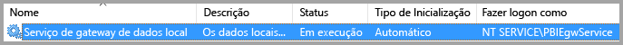

Para habilitar a delegação restrita de Kerberos, o gateway precisa ser executado como uma conta de domínio, a menos que a instância do Azure AD (Azure Active Directory) já esteja sincronizada com a instância do Active Directory local (usando o Azure AD DirSync/Connect). Para alternar para uma conta de domínio, confira [Alternar o gateway para uma conta de domínio](#switch-the-gateway-to-a-domain-account) mais adiante neste artigo.

> [!NOTE]
> Se o Azure AD Connect estiver configurado e as contas de usuário estiverem sincronizadas, o serviço de gateway não precisará executar pesquisas no Azure AD local em tempo de execução. Você pode usar o SID de serviço local (em vez de uma conta de domínio) para o serviço do gateway. As etapas de configuração da delegação restrita de Kerberos descritas neste artigo são as mesmas que a configuração. Elas são simplesmente aplicadas ao objeto de computador do gateway no Azure AD, em vez de na conta de domínio.

### <a name="prerequisite-3-have-domain-admin-rights-to-configure-spns-setspn-and-kerberos-constrained-delegation-settings"></a>Pré-requisito 3: ter direitos de administrador de domínio para configurar definições de SPNs (SetSPN) e da delegação restrita de Kerberos

Não é recomendado que um administrador de domínio conceda direitos temporária ou permanentemente para alguém configurar SPNs e a delegação de Kerberos sem exigir direitos de administrador de domínio. Na seção a seguir, abordaremos as etapas de configuração recomendadas mais detalhadamente.

## <a name="configure-kerberos-constrained-delegation-for-the-gateway-and-data-source"></a>Configurar a delegação restrita de Kerberos para o gateway e a fonte de dados

Como administrador de domínio, configure um SPN para a conta de domínio do serviço do gateway e defina configurações de delegação na conta de domínio do serviço do gateway.

### <a name="configure-an-spn-for-the-gateway-service-account"></a>Configurar um SPN para a conta de serviço do gateway

Primeiro, determine se um SPN já foi criado para a conta de domínio usada como a conta de serviço do gateway:

1. Como administrador de domínio, abra **Usuários e Computadores do Active Directory**.

2. Clique com o botão direito do mouse no domínio, selecione **Localizar** e insira o nome da conta de serviço do gateway.

3. No resultado da pesquisa, clique com o botão direito do mouse na conta de serviço do gateway e selecione **Propriedades**.

4. Se a guia **Delegação** estiver visível na caixa de diálogo **Propriedades**, isso indicará que um SPN já foi criado. Vá para as definições de configuração de delegação.

    Se não houver nenhuma guia **Delegação** na caixa de diálogo **Propriedades**, crie manualmente um SPN nessa conta. Isso adicionará a guia **Delegação**. Use a [ferramenta setspn](https://technet.microsoft.com/library/cc731241.aspx) fornecida com o Windows (é necessário ter direitos de administrador de domínio para criar o SPN).

    Por exemplo, imagine que a conta de serviço do gateway seja “PBIEgwTest\GatewaySvc” e o nome do computador com o serviço do gateway em execução tenha o nome de **Machine1**. Para definir o SPN para a conta de serviço do gateway desse computador neste exemplo, execute o seguinte comando:

    

    Com a etapa concluída, podemos prosseguir para as configurações de delegação.

### <a name="configure-delegation-settings-on-the-gateway-service-account"></a>Definir as configurações de delegação na conta de serviço do gateway

O segundo requisito de configuração são as configurações de delegação na conta de serviço do gateway. Há diversas ferramentas que podem ser usadas para realizar essas etapas. Aqui, usaremos Usuários e Computadores do Active Directory, que é um snap-in do MMC (Console de Gerenciamento Microsoft) para administrar e publicar informações no diretório. Ele está disponível nos controladores de domínio por padrão. Habilite-o também pela configuração do Recurso do Windows em outros computadores.

Precisamos configurar a delegação restrita de Kerberos com o trânsito de protocolos. Com a delegação restrita, é preciso ser explícito sobre para quais serviços você deseja delegar. Por exemplo, somente o SQL Server ou o servidor SAP HANA aceita chamadas de delegação da conta de serviço do gateway.

Esta seção pressupõe que você já tenha configurado SPNs para as fontes de dados subjacentes (como SQL Server, SAP HANA, Teradata e Spark). Para saber como configurar os SPNs do servidor de fonte de dados, confira a documentação técnica do respectivo servidor de banco de dados. Confira também a postagem no blog [De qual SPN seu aplicativo precisa?](https://blogs.msdn.microsoft.com/psssql/2010/06/23/my-kerberos-checklist/)

Nas etapas a seguir, presumimos um ambiente local com dois computadores: um computador do gateway e um servidor de banco de dados executando o SQL Server. Para este exemplo, vamos também supor as configurações e os nomes a seguir:

* Nome do computador do gateway: **PBIEgwTestGW**
* Conta de serviço do gateway: **PBIEgwTest\GatewaySvc** (nome de exibição da conta: Gateway Connector)
* Nome do computador da fonte de dados do SQL Server: **PBIEgwTestSQL**
* Conta de serviço da fonte de dados do SQL Server: **PBIEgwTest\SQLService**

Defina as configurações de delegação da seguinte maneira:

1. Com direitos de administrador de domínio, abra **Usuários e Computadores do Active Directory**.

2. Clique com o botão direito do mouse na conta de serviço do gateway (**PBIEgwTest\GatewaySvc**) e selecione **Propriedades**.

3. Selecione a guia **Delegação**.

4. Selecione **Confiar neste computador para delegação apenas a serviços especificados** > **Usar qualquer protocolo de autenticação**.

6. Em **Serviços aos quais esta conta pode apresentar credenciais delegadas**, selecione **Adicionar**.

7. Na nova caixa de diálogo, selecione **Usuários ou Computadores**.

8. Insira a conta de serviço da fonte de dados do SQL Server (**PBIEgwTest\SQLService**) e selecione **OK**.

9. Selecione o SPN que você criou para o servidor de banco de dados. Em nosso exemplo, o SPN começa com **MSSQLSvc**. Se você tiver adicionado o SPN NetBIOS e o FQDN para o serviço de banco de dados, selecione ambos. Talvez você veja apenas um.

10. Selecione **OK**. Agora você verá o SPN na lista.

    Como opção, é possível selecionar **Expandido** para mostrar o SPN do NetBIOS e o FQDN. A caixa de diálogo é semelhante à mostrada a seguir se você seleciona **Expandido**. Selecione **OK**.

    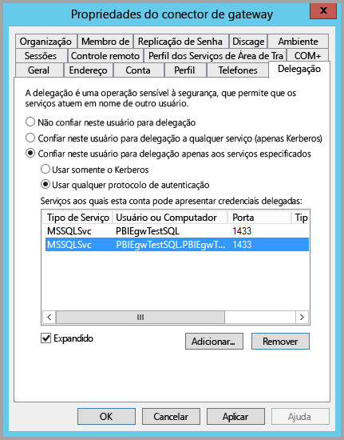

Por fim, no computador que executa o serviço do gateway (**PBIEgwTestGW** em nosso exemplo), é necessário conceder à conta de serviço do gateway a política local **Representar um cliente após a autenticação**. Execute e verifique isso com o Editor de Política de Grupo Local (**gpedit**).

1. No computador do gateway, execute: *gpedit.msc*.

1. Acesse **Política do Computador Local** > **Configuração do Computador** > **Configurações do Windows** > **Configurações de Segurança** > **Políticas Locais** > **Atribuição de Direitos do Usuário**.

    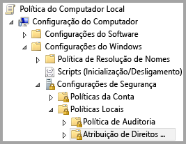

1. Em **Atribuição de Direitos de Usuário**, na lista de políticas, selecione **Representar um cliente após a autenticação**.

    

    Clique com o botão direito do mouse e abra **Propriedades**. Verifique a lista de contas. A conta de serviço do gateway (**PBIEgwTest\GatewaySvc**) deverá estar incluída nela.

1. Em **Atribuição de Direitos de Usuário**, na lista de políticas, selecione **Atuar como parte do sistema operacional (SeTcbPrivilege)**. Verifique se a conta de serviço do gateway também está incluída na lista de contas.

1. Reinicie o processo do serviço do **gateway de dados local**.

Se você está usando o SAP HANA, recomendamos seguir estas etapas adicionais, que podem produzir uma pequena melhoria de desempenho.

1. No diretório de instalação do gateway, localize e abra este arquivo de configuração: *Microsoft.PowerBI.DataMovement.Pipeline.GatewayCore.dll.config*.

1. Localize a propriedade *FullDomainResolutionEnabled* e altere seu valor para *True*.

    ```xml
    <setting name=" FullDomainResolutionEnabled " serializeAs="String">
          <value>True</value>
    </setting>
    ```

## <a name="run-a-power-bi-report"></a>Executar um relatório do Power BI

Depois de concluir todas as etapas de configuração, use a página **Gerenciar Gateway** no Power BI para configurar a fonte de dados. Em seguida, em **Configurações Avançadas**, habilite o SSO e publique relatórios e conjuntos de dados associados a essa fonte de dados.

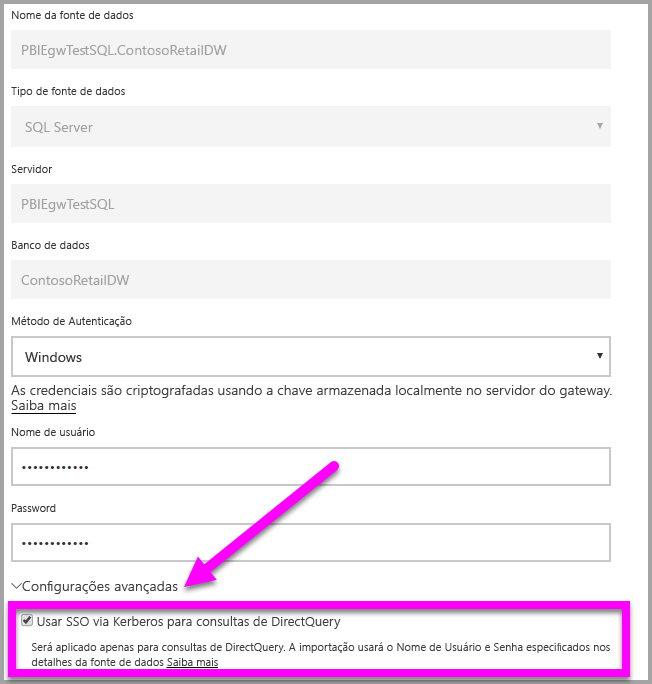

Essa configuração funciona na maioria dos casos. No entanto, dependendo do ambiente, pode haver configurações diferentes com o Kerberos. Se o relatório ainda não for carregado, contate o administrador de domínio para investigar o caso.

## <a name="switch-the-gateway-to-a-domain-account"></a>Alternar o gateway para uma conta de domínio

Se necessário, alterne o gateway de uma conta de serviço local para ser executado como uma conta de domínio usando a interface do usuário do **gateway de dados local**. Aqui está como:

1. Abra a ferramenta de configuração do **gateway de dados local**.

   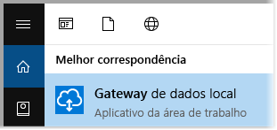

2. Selecione o botão **Entrar** na página principal e entre usando sua conta do Power BI.

3. Em seguida, selecione a guia **Configurações do Serviço**.

4. Selecione **Alterar conta** para iniciar o passo a passo guiado.

   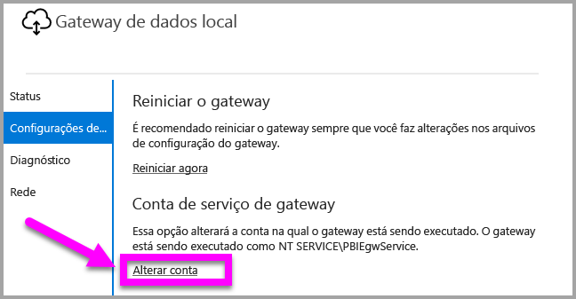

## <a name="configure-sap-bw-for-sso"></a>Configurar o SAP BW para SSO

Agora que você entende como o Kerberos funciona com um gateway, pode configurar o SSO para seu SAP BW (SAP Business Warehouse). As etapas a seguir pressupõem que você já [se preparou para a delegação restrita do Kerberos](#prepare-for-kerberos-constrained-delegation), conforme descrito anteriormente neste artigo.

Este guia tenta ser o mais abrangente possível. Se você já concluiu algumas destas etapas, ignore-as. Por exemplo, você já pode ter criado um usuário de serviço para o servidor SAP BW e mapeado um SPN para ele ou já ter instalado a biblioteca `gsskrb5`.

### <a name="set-up-gsskrb5-on-client-machines-and-the-sap-bw-server"></a>Configurar o gsskrb5 em computadores cliente e no servidor SAP BW

> [!NOTE]
> Não há mais suporte ativo para o `gsskrb5` pela SAP. Para saber mais, veja [Nota SAP 352295](https://launchpad.support.sap.com/#/notes/352295). Observe também que `gsskrb5` não permite conexões de SSO do gateway de dados com Servidores de Mensagens do SAP BW. Apenas as conexões com Servidores de Aplicativos do SAP BW são possíveis.

O `gsskrb5` precisa estar em uso pelo cliente e pelo servidor para concluir uma conexão de SSO por meio do gateway. Atualmente, não há suporte para a Biblioteca de Criptografia Comum (sapcrypto).

1. Baixe `gsskrb5` - `gx64krb5` em [Nota SAP 2115486](https://launchpad.support.sap.com/) (é necessário ser um usuário s do SAP). Verifique se você tem pelo menos a versão 1.0.11.x de gsskrb5.dll e gx64krb5.dll.

1. Coloque a biblioteca em uma localização no computador do gateway que seja acessível pela instância do gateway (e também pela GUI do SAP, caso deseje testar a conexão de SSO usando o Logon do SAP).

1. Coloque outra cópia no computador do servidor SAP BW em uma localização acessível pelo servidor SAP BW.

1. Nos computadores cliente e de servidor, defina as variáveis de ambiente `SNC\_LIB` e `SNC\_LIB\_64` para que apontem para as localizações de gsskrb5.dll e gx64krb5.dll, respectivamente.

### <a name="create-a-sap-bw-service-user-and-enable-snc-communication"></a>Criar um usuário do serviço do SAP BW e habilitar a comunicação SNC

Além da configuração de gateway que você já fez, há algumas etapas adicionais específicas do SAP BW. A seção [Definir as configurações de delegação na conta de serviço do gateway](#configure-delegation-settings-on-the-gateway-service-account) da documentação pressupõe que você já tenha configurado SPNs para as fontes de dados subjacentes. Para concluir essa configuração para SAP BW:

1. Em um servidor do Controlador de Domínio do Active Directory, crie um usuário de serviço (inicialmente, apenas um usuário básico do Active Directory) para o Servidor de Aplicativos do SAP BW no ambiente do Active Directory. Em seguida, atribua um SPN a ele.

    A SAP recomenda iniciar o SPN com `SAP/`, mas também deve ser possível usar outros prefixos, como `HTTP/`. Você decide o que colocar depois de `SAP/`; uma opção é usar o nome do usuário de serviço do servidor SAP BW. Por exemplo, se você criar `BWServiceUser@\<DOMAIN\>` como o usuário de serviço, poderá usar o SPN `SAP/BWServiceUser`. Uma maneira de definir o mapeamento de SPN é o comando setspn. Por exemplo, para definir o SPN no usuário de serviço que acabamos de criar, você executará o seguinte comando em uma janela cmd em um computador do Controlador de Domínio: `setspn -s SAP/ BWServiceUser DOMAIN\ BWServiceUser`. Para obter mais informações, confira a documentação do SAP BW.

1. Permita acesso ao usuário de serviço ao Servidor de Aplicativos do SAP BW:

    1. No computador do servidor SAP BW, adicione o usuário de serviço ao grupo Administrador Local do servidor SAP BW. Abra o programa Gerenciamento de Computador e clique duas vezes no grupo Administrador Local do servidor.

        

    1. Clique duas vezes no grupo Administrador Local e selecione **Adicionar** para adicionar o usuário de serviço ao grupo. Selecione **Verificar Nomes** para garantir que você inseriu o nome corretamente. Selecione **OK**.

1. Defina o usuário de serviço do servidor SAP BW como o usuário que inicia o serviço do servidor SAP BW no computador do servidor SAP BW.

    1. Abra **Executar** e insira "Services.msc". Procure o serviço correspondente à instância do Servidor de Aplicativos do SAP BW. Clique com o botão direito do mouse nele e selecione **Propriedades**.

        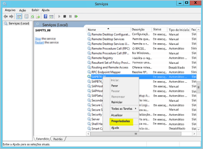

    1. Alterne para a guia **Fazer logon** e altere o usuário para o usuário de serviço do SAP BW. Insira a senha do usuário e selecione **OK**.

1. Entre no servidor no Logon do SAP e defina os seguintes parâmetros de perfil usando a transação RZ10:

    1. Defina o parâmetro de perfil snc/identity/as como p:\<o usuário de serviço do SAP BW criado\>, por exemplo, p:BWServiceUser@MYDOMAIN.COM. Observe o p: que precede o UPN do usuário de serviço. Ele não é p:CN= como quando a Biblioteca de Criptografia Comum é usada como a biblioteca SNC.

    1. Defina o parâmetro de perfil snc/gssapi\_lib como \<caminho para gsskrb5.dll/gx64krb5.dll no computador do servidor (a biblioteca que você usará depende do número de bits do SO)\>. Lembre-se de colocar a biblioteca em uma localização que o Servidor de Aplicativos do SAP BW possa acessar.

    1. Também defina os seguintes parâmetros de perfil adicionais, alterando os valores conforme necessário para atender às suas necessidades. Observe que as últimas cinco opções permitem que os clientes se conectem ao servidor SAP BW usando o Logon do SAP, sem a necessidade de ter o SNC configurado.

        | **Configuração** | **Valor** |
        | --- | --- |
        | snc/data\_protection/max | 3 |
        | snc/data\_protection/min | 1 |
        | snc/data\_protection/use | 9 |
        | snc/accept\_insecure\_cpic | 1 |
        | snc/accept\_insecure\_gui | 1 |
        | snc/accept\_insecure\_r3int\_rfc | 1 |
        | snc/accept\_insecure\_rfc | 1 |
        | snc/permit\_insecure\_start | 1 |

    1. Defina a propriedade snc/enable como 1.

1. Depois de definir esses parâmetros de perfil, abra o Console de Gerenciamento do SAP no computador do servidor e reinicie a instância do SAP BW. Se o servidor não for iniciado, confirme se você definiu os parâmetros de perfil corretamente. Para obter mais informações sobre configurações de perfil de parâmetro, confira a [documentação da SAP](https://help.sap.com/saphelp_nw70ehp1/helpdata/en/e6/56f466e99a11d1a5b00000e835363f/frameset.htm). Consulte também as informações sobre solução de problemas mais adiante nesta seção caso tenha problemas.

### <a name="map-a-sap-bw-user-to-an-active-directory-user"></a>Mapear um usuário do SAP BW para um usuário do Active Directory

Mapeie um usuário do Active Directory para um usuário do Servidor de Aplicativos do SAP BW e teste a conexão de SSO no Logon do SAP.

1. Entre no servidor SAP BW usando o Logon do SAP. Execute a transação SU01.

1. Para **Usuário**, insira o usuário do SAP BW para o qual deseja habilitar conexões de SSO (na captura de tela anterior, definimos permissões para BIUSER). Selecione o ícone **Editar** (imagem de uma caneta) próximo ao canto superior esquerdo da janela Logon do SAP.

    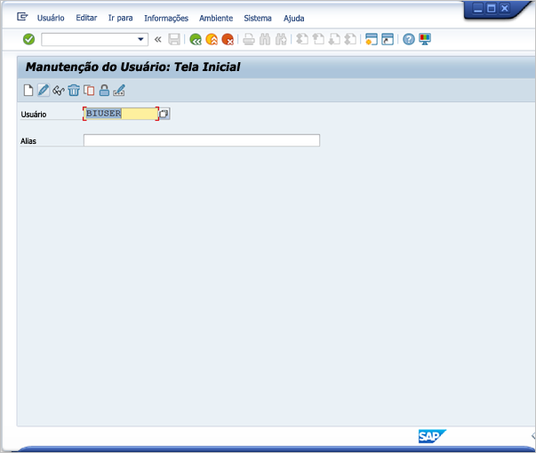

1. Selecione a guia **SNC**. Na caixa de entrada do nome SNC, insira p:\<seu usuário do Active Directory\>@\<seu domínio\>. Observe o p: obrigatório que deve preceder o UPN do usuário do Active Directory. O usuário do Active Directory especificado deve pertencer à pessoa ou à organização para a qual você deseja habilitar o acesso SSO ao Servidor de Aplicativos do SAP BW. Por exemplo, se você quiser habilitar o acesso SSO para o usuário [testuser@TESTDOMAIN.COM](mailto:testuser@TESTDOMAIN.COM), insira p:testuser@TESTDOMAIN.COM.

    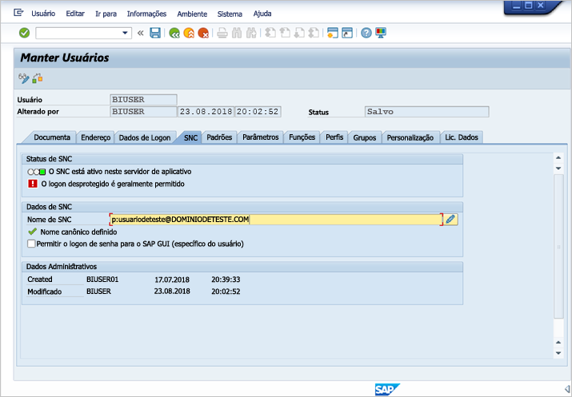

1. Selecione o ícone **Salvar** (a imagem de um disquete) próximo ao canto superior esquerdo da tela.

### <a name="test-sign-in-by-using-sso"></a>Testar a entrada usando o SSO

Verifique se você pode entrar no servidor. Use o Logon do SAP por meio do SSO como o usuário do Active Directory para o qual você acabou de habilitar o acesso SSO.

1. Como o usuário do Active Directory para o qual você acabou de habilitar o acesso SSO, entre em um computador no qual o Logon do SAP esteja instalado. Inicie o Logon do SAP e crie uma conexão.

1. Na tela **Criar Entrada do Sistema**, selecione **Sistema Especificado pelo Usuário** > **Avançar**.

    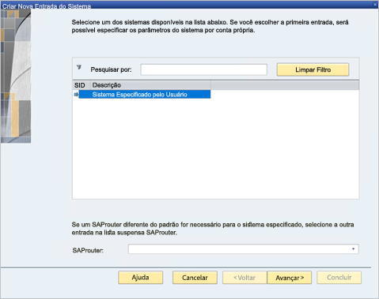

1. Preencha os detalhes apropriados na próxima tela, incluindo o servidor de aplicativos, o número da instância e a ID do sistema. Em seguida, selecione **Concluir**.

1. Clique com o botão direito do mouse na nova conexão e selecione **Propriedades**. Selecione a guia **Rede**. Na caixa de texto **Nome SNC**, insira p:\<o UPN do usuário de serviço do SAP BW\>, como p:BWServiceUser@MYDOMAIN.COM. Selecione **OK**.

    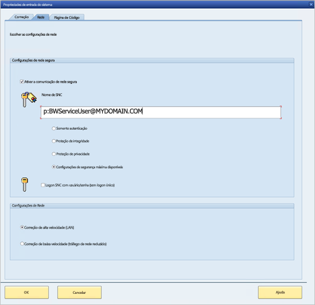

1. Clique duas vezes na conexão recém-criada para tentar uma conexão de SSO com o servidor SAP BW. Se essa conexão for bem-sucedida, vá para a próxima etapa. Caso contrário, examine as etapas anteriores neste documento para garantir que foram concluídas corretamente, ou examine a seção de solução de problemas abaixo. Observe que, se você não conseguir se conectar ao servidor SAP BW por meio do SSO neste contexto, você não poderá se conectar ao servidor SAP BW usando o SSO no contexto do gateway.

### <a name="troubleshoot-installation-and-connections"></a>Solucionar problemas de instalação e conexões

Caso tenha problemas, siga estas etapas para solucionar problemas da instalação do gsskrb5 e de conexões de SSO no Logon do SAP.

- A exibição dos logs do servidor (…work\dev\_w0 no computador do servidor) pode ser útil para solucionar os erros encontrados na conclusão das etapas de instalação do gsskrb5. Isso se aplica especialmente se o servidor SAP BW não é iniciado após a alteração dos parâmetros de perfil.

- Se você não puder iniciar o serviço SAP BW devido a uma falha de logon, talvez você tenha fornecido a senha incorreta ao definir o usuário "iniciar como" do SAP BW. Verifique a senha fazendo logon em um computador no ambiente do Active Directory como o usuário de serviço do SAP BW.

- Se você receber erros sobre as credenciais do SQL impedindo a inicialização do servidor, verifique se você permitiu acesso ao usuário de serviço ao banco de dados do SAP BW.

- Você poderá receber a seguinte mensagem: "(GSS-API) O destino especificado é desconhecido ou inacessível". Isso geralmente significa que o nome SNC incorreto foi especificado. Use apenas "p", não "p:CN =" nem qualquer outro valor no aplicativo cliente que não seja o UPN do usuário de serviço.

- Você poderá receber a seguinte mensagem: "(GSS-API) Um nome inválido foi fornecido". Garanta que "p:" esteja no valor do parâmetro de perfil da identidade SNC do servidor.

- Você poderá receber a seguinte mensagem: "(Erro do SNC) O módulo especificado não pôde ser encontrado". Isso geralmente é causado pela colocação do `gsskrb5.dll/gx64krb5.dll` em um lugar que exija privilégios elevados (direitos de administrador) para o acesso.

### <a name="add-registry-entries-to-the-gateway-machine"></a>Adicionar entradas de registro ao computador do gateway

Adicione entradas de Registro necessárias para o Registro do computador em que o gateway está instalado. Estes são os comandos para execução:

1. REG ADD HKLM\SOFTWARE\Wow6432Node\SAP\gsskrb5 /v ForceIniCredOK /t REG\_DWORD /d 1 /f

1. REG ADD HKLM\SOFTWARE\SAP\gsskrb5 /v ForceIniCredOK /t REG\_DWORD /d 1 /f

### <a name="set-configuration-parameters-on-the-gateway-machine"></a>Definir parâmetros de configuração no computador do gateway

Há duas opções para definir os parâmetros de configuração, dependendo se você tem o Azure AD Connect configurado, de modo que os usuários possam entrar no serviço do Power BI como um usuário do Azure AD.

Caso você tenha o Azure AD Connect configurado, siga estas etapas.

1. Abra o arquivo de configuração do gateway principal, `Microsoft.PowerBI.DataMovement.Pipeline.GatewayCore.dll`. Por padrão, esse arquivo é armazenado em C:\Arquivos de Programas\On-premises data gateway.

1. Verifique se a propriedade **FullDomainResolutionEnabled** está definida **True** e que **SapHanaSsoRemoveDomainEnabled**, como **False**.

1. Salve o arquivo de configuração.

1. Na guia **Serviços** do Gerenciador de Tarefas, clique com o botão direito do mouse no serviço do gateway e selecione **Reiniciar**.

    

Caso você não tenha o Azure AD Connect configurado, siga estas etapas para todos os usuários do serviço do Power BI que deseja mapear para um usuário do Azure AD. Essas etapas vinculam manualmente um usuário do serviço do Power BI a um usuário do Active Directory com permissão para entrar no SAP BW.

1. Abra o arquivo de configuração do gateway principal, `Microsoft.PowerBI.DataMovement.Pipeline.GatewayCore.dll`. Por padrão, esse arquivo é armazenado em C:\Arquivos de Programas\On-premises data gateway.

1. Defina a **ADUserNameLookupProperty** como `msDS-cloudExtensionAttribute1` e a **ADUserNameReplacementProperty** como `SAMAccountName`. Salve o arquivo de configuração.

1. Na guia **Serviços** do Gerenciador de Tarefas, clique com o botão direito do mouse no serviço do gateway e selecione **Reiniciar**.

    

1. Defina a propriedade `msDS-cloudExtensionAttribute1` do usuário do Active Directory. Esse é o usuário que foi mapeado para um usuário do SAP BW. Defina a propriedade como o usuário do serviço do Power BI para o qual deseja habilitar o SSO via Kerberos. Uma maneira de definir a propriedade `msDS-cloudExtensionAttribute1` é usar o snap-in do MMC Usuários e Computadores do Active Directory. (Você também pode usar outros métodos).

    1. Entre em um computador do Controlador de Domínio como um usuário administrador.

    1. Abra a pasta **Usuários** na janela do snap-in e clique duas vezes no usuário do Active Directory mapeado para um usuário do SAP BW.

    1. Selecione a guia **Editor de Atributo**.

        Caso você não veja essa guia, precisará pesquisar para obter instruções sobre como habilitá-la ou usar outro método para definir a propriedade. Selecione um dos atributos e, em seguida, a tecla M para acessar as propriedades do Active Directory que começam com a letra m. Localize a propriedade `msDS-cloudExtensionAttribute1` e clique duas vezes nela. Defina o valor para o nome de usuário que você usa para fazer login no serviço do Power BI, no formulário YourUser@YourDomain.

    1. Selecione **OK**.

        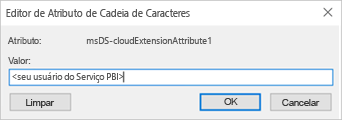

    1. Selecione **Aplicar**. Verifique se o valor correto foi definido na coluna **Valor**.

### <a name="add-a-new-sap-bw-application-server-data-source-to-the-power-bi-service"></a>Adicionar uma nova fonte de dados do Servidor de Aplicativos do SAP BW ao serviço do Power BI

Adicione a fonte de dados do SAP BW ao gateway seguindo as instruções descritas anteriormente neste artigo sobre como [executar um relatório](#run-a-power-bi-report).

1. Na janela de configuração da fonte de dados, insira o **Nome do host**, o **Número do Sistema** e a **ID do cliente** do Servidor de Aplicativos, como faria para entrar no servidor SAP BW por meio do Power BI Desktop. Como o **Método de Autenticação**, selecione **Windows**.

1. No campo **Nome do Parceiro SNC**, insira p: \<o SPN mapeado para o usuário de serviço do SAP BW\>. Por exemplo, se o SPN for SAP/BWServiceUser@MYDOMAIN.COM, você deve inserir p:SAP/BWServiceUser@MYDOMAIN.COM no campo **Nome do Parceiro SNC**.

1. Para a biblioteca SNC, selecione **SNC\_LIB** ou **SNC\_LIB\_64**.

1. O **Nome de usuário** e a **Senha** devem ser o nome de usuário e a senha de um usuário do Active Directory com permissão para entrar no servidor SAP BW com o SSO. Em outras palavras, eles devem pertencer a um usuário do Active Directory que foi mapeado para um usuário do SAP BW por meio da transação SU01. Essas credenciais são usadas apenas se a caixa **Usar SSO via Kerberos para consultas do DirectQuery** não está marcada.

1. Marque a caixa **Usar SSO via Kerberos para consultas do DirectQuery** e selecione **Aplicar**. Se a conexão de teste não for bem-sucedida, verifique se as etapas de instalação e de configuração anteriores foram concluídas corretamente.

    O gateway sempre usa as credenciais digitadas para estabelecer uma conexão de teste com o servidor e para fazer atualizações agendadas de relatórios baseados em importação. O gateway tenta apenas estabelecer uma conexão SSO se a caixa **Usar SSO via Kerberos para consultas do DirectQuery** for selecionada e o usuário estiver acessando um relatório ou conjunto de dados direto baseado em consulta.

### <a name="test-your-setup"></a>Testar a configuração

Para testar a configuração, publique um relatório do DirectQuery por meio do Power BI Desktop no serviço do Power BI. Verifique se você está conectado ao serviço do Power BI como um usuário do Azure AD ou um usuário mapeado para a propriedade `msDS-cloudExtensionAttribute1` de um usuário do Azure AD. Se a configuração for concluída com êxito, você deverá conseguir criar um relatório com base no conjunto de dados publicado no serviço do Power BI. Você também deverá conseguir efetuar pull de dados por meio de visuais no relatório.

### <a name="troubleshoot-gateway-connectivity-issues"></a>Solucionar problemas de conectividade do gateway

1. Verifique os logs de gateway. Abra o aplicativo de configuração do gateway e selecione **Diagnóstico** > **Exportar logs**. Os erros mais recentes são mostrados na parte inferior de qualquer arquivo de log examinado.

    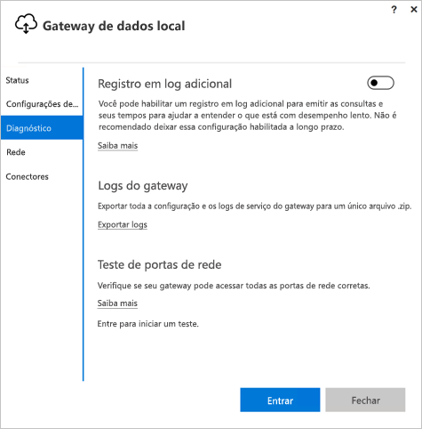

1. Ative o rastreamento do SAP BW e examine os arquivos de log gerados. Há vários tipos diferentes de rastreamento do SAP BW disponíveis. Veja a documentação da SAP para obter mais informações.

## <a name="errors-from-an-insufficient-kerberos-configuration"></a>Erros de configuração insuficiente do Kerberos

Se o gateway e o servidor do banco de dados subjacente não forem configurados corretamente para a delegação restrita de Kerberos, você poderá receber a seguinte mensagem de erro sobre a falha no carregamento de dados:


Os detalhes técnicos associados à mensagem de erro (DM_GWPipeline_Gateway_ServerUnreachable) podem ser semelhantes aos seguintes:

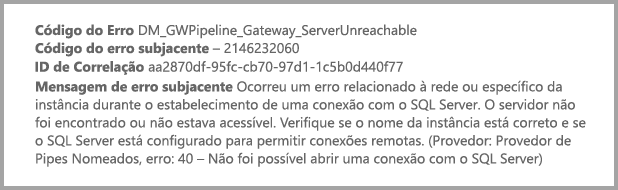

O resultado é que o gateway não consegue representar o usuário de origem corretamente e a tentativa de conexão de banco de dados falhou.

## <a name="next-steps"></a>Próximas etapas

Para obter mais informações sobre o **Gateway de dados local** e o **DirectQuery**, confira os seguintes recursos:

* [Gateway de dados local](service-gateway-onprem.md)
* [DirectQuery no Power BI](desktop-directquery-about.md)
* [Fontes de dados com suporte do DirectQuery](desktop-directquery-data-sources.md)
* [DirectQuery e SAP BW](desktop-directquery-sap-bw.md)
* [DirectQuery e SAP HANA](desktop-directquery-sap-hana.md)
