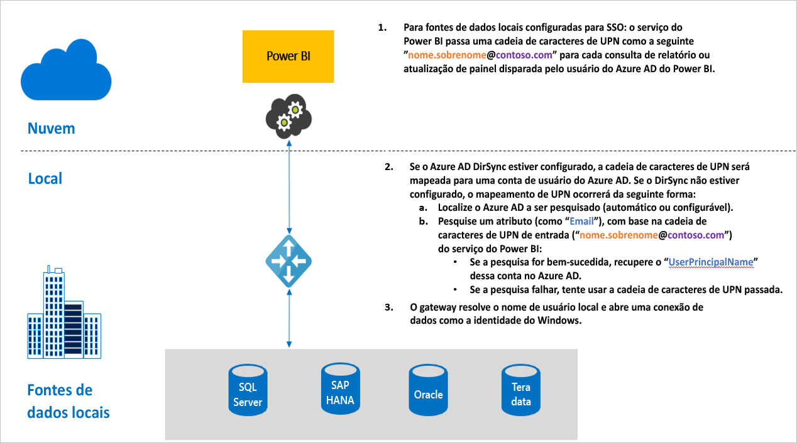

# Visão geral de SSO (logon único) para gateways no Power BI

Você pode obter conectividade ininterrupta de logon único, habilitando relatórios do Power BI e dashboards para serem atualizados com base em dados locais, configurando o gateway de dados local tanto com delegação restrita do Kerberos quanto com SAML (Security Assertion Markup Language). O gateway de dados local facilita SSO com o DirectQuery, que é usado para a conexão às fontes de dados locais.

No momento, damos suporte para as seguintes fontes de dados:

* SQL Server ([Kerberos](service-gateway-sso-kerberos.md))
* SAP HANA ([Kerberos](service-gateway-sso-kerberos.md) e [SAML](service-gateway-sso-saml.md)
* SAP BW ([Kerberos](service-gateway-sso-kerberos.md)
* Teradata ([Kerberos](service-gateway-sso-kerberos.md))
* Spark ([Kerberos](service-gateway-sso-kerberos.md))
* Impala ([Kerberos](service-gateway-sso-kerberos.md))
* O SSO também é possível [outras fontes de dados](desktop-directquery-data-sources.md#single-sign-on-sso-for-directquery-sources) sem usar um gateway de dados

Quando um usuário interage com um relatório do DirectQuery no serviço do Power BI, cada operação de filtro cruzado, de fatia, de classificação e de edição de relatório pode resultar em consultas de execução dinâmica com relação à fonte de dados local subjacente.  Quando o SSO é configurado para a fonte de dados, as consultas são executadas na identidade do usuário que interage com o Power BI (isto é, por meio da experiência na Web ou de aplicativos móveis do Power BI). Dessa forma, cada usuário vê precisamente os dados para os quais têm permissões na fonte de dados subjacente. Com o logon único configurado, não há cache de dados compartilhados entre usuários diferentes.

## Etapas de consulta ao executar SSO

Uma consulta executada com SSO é formada por três etapas, conforme mostrado no diagrama a seguir.

> [!NOTE]
> SSO para Oracle ainda não está habilitado, mas está em desenvolvimento e será lançado em breve.

Veja abaixo mais detalhes sobre essas etapas:

1. Para cada consulta, o **serviço do Power BI** inclui o *nome UPN* ao enviar uma solicitação de consulta ao gateway configurado.

2. O gateway precisa mapear o UPN do Azure Active Directory para uma identidade do Active Directory local.

   a.  Se o Azure AD DirSync (também conhecido como *Azure AD Connect*) for configurado, o mapeamento funcionará automaticamente no gateway.

   b.  Caso contrário, o gateway pode pesquisar e mapear o UPN do Azure AD para um usuário local ao executar uma pesquisa em relação ao domínio do Active Directory local.

3. O processo do serviço do gateway representa o usuário local mapeado, abre a conexão ao banco de dados subjacente e envia a consulta. O gateway não precisa estar instalado no mesmo computador que o banco de dados.

## Próximas etapas

Agora que você entende as noções básicas de SSO, leia informações mais detalhadas sobre Kerberos e SAML:

* [Logon único (SSO) – Kerberos](service-gateway-sso-kerberos.md)
* [Logon único (SSO) – SAML](service-gateway-sso-saml.md)
