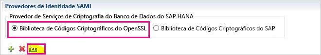
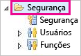
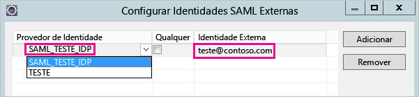
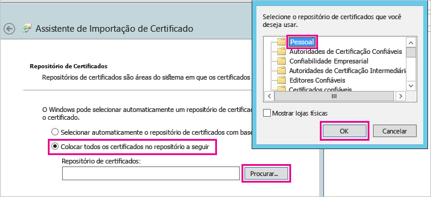
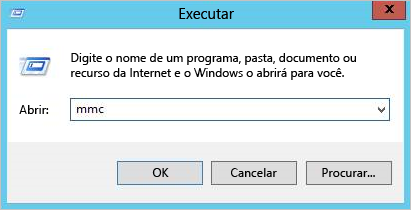
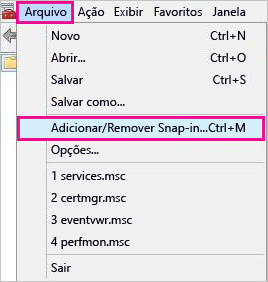
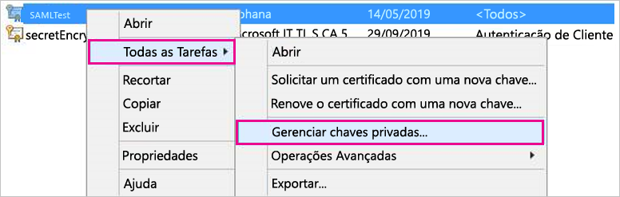
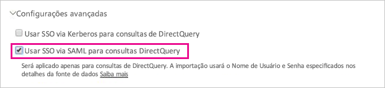

# <a name="use-security-assertion-markup-language-saml-for-single-sign-on-sso-from-power-bi-to-on-premises-data-sources"></a>Use SAML (Security Assertion Markup Language) para SSO (logon único) do Power BI para fontes de dados locais

Use [SAML (Security Assertion Markup Language)](https://www.onelogin.com/pages/saml) para habilitar a conectividade ininterrupta de logon único. Habilitar SSO torna mais fácil para relatórios e dashboards do Power BI atualizar os dados de fontes locais.

## <a name="supported-data-sources"></a>Fontes de dados para as quais há suporte

Atualmente, há suporte para SAP HANA com SAML. Para obter mais informações sobre como configurar e definir logon único para SAP HANA usando SAML, confira o tópico [SSO do SAML para a Plataforma BI para HANA](https://wiki.scn.sap.com/wiki/display/SAPHANA/SAML+SSO+for+BI+Platform+to+HANA) na documentação do SAP HANA.

Damos suporte a fontes de dados adicionais com [Kerberos](service-gateway-sso-kerberos.md).

Observe que, para o HANA, é **altamente** recomendável que a criptografia seja habilitada antes de estabelecer uma conexão de logon único do SAML (ou seja, você deve configurar o servidor do HANA para aceitar conexões criptografadas e também configurar o gateway para usar criptografia ao comunicar-se com o servidor HANA). O driver ODBC do HANA **não** é capaz de criptografar declarações SAML por padrão e, sem criptografia ativada, a asserção SAML assinada será enviada do gateway para o servidor do HANA "às claras" e estará vulnerável a interceptação e reutilização por terceiros.

## <a name="configuring-the-gateway-and-data-source"></a>Como configurar a fonte de dados e o gateway

Para usar SAML, você precisa estabelecer uma relação de confiança entre os servidores do HANA para os quais você deseja habilitar o SSO e o Gateway, que serve como o IdP (provedor de identidade) SAML nesse cenário. Há várias maneiras para estabelecer essa relação, tais como importar o certificado x509 do IdP do gateway para o repositório de confiança dos servidores HANA ou fazer com que o certificado x509 do gateway seja assinado por uma AC (autoridade de certificação) raiz considerada confiável pelos servidores do HANA. Descrevemos a segunda abordagem neste guia, mas você poderá usar outra abordagem se preferir.

Observe também que embora este guia use OpenSSL como provedor de criptografia do servidor do HANA, também é possível usar a biblioteca criptográfica do SAP (também conhecida como CommonCryptoLib ou sapcrypto) em vez de OpenSSL para concluir as etapas de configuração em que podemos estabelecer a relação de confiança. Para obter mais informações, consulte a documentação oficial do SAP.

As etapas a seguir descrevem como estabelecer uma relação de confiança entre um servidor do HANA e o IdP do gateway assinando o certificado x509 do IdP do gateway usando uma AC raiz considerada confiável pelo servidor do HANA.

1. Crie a chave privada e o certificado X509 da AC raiz. Por exemplo, para criar o certificado X509 da AC raiz e a chave privada no formato .pem:

```
openssl req -new -x509 -newkey rsa:2048 -days 3650 -sha256 -keyout CA_Key.pem -out CA_Cert.pem -extensions v3_ca
```

Adicione o certificado (por exemplo, CA_Cert.pem) ao repositório de confiança do servidor do HANA para que o servidor do HANA confie em todos os certificados assinados pela AC raiz que você acabou de criar. O local do repositório de confiança do seu servidor do HANA pode ser encontrado examinando a definição de configuração **ssltruststore**. Se você seguiu a documentação do SAP que aborda como configurar o OpenSSL, o servidor do HANA talvez já confie em uma AC raiz que você pode reutilizar. [Veja como configurar o Open SSL para SAP HANA Studio para o servidor do SAP HANA](https://archive.sap.com/documents/docs/DOC-39571) para obter detalhes. Se você tiver vários servidores do HANA para os quais deseja habilitar o logon único do SAML, verifique se cada um dos servidores confia nessa AC raiz.

1. Crie o certificado x509 do IdP do gateway. Por exemplo, para criar uma solicitação de assinatura de certificado (IdP_Req.pem) e uma chave privada (IdP_Key.pem) válidas por um ano, execute o seguinte comando:

```
 openssl req -newkey rsa:2048 -days 365 -sha256 -keyout IdP_Key.pem -out IdP_Req.pem -nodes
```


Assine a solicitação de assinatura de certificado usando a AC raiz que você configurou como confiável pelos servidores do HANA. Por exemplo, para assinar IdP_Req.pem usando CA_Cert.pem e CA_Key.pem (o certificado e a chave da AC raiz), execute o seguinte comando:

  ```
openssl x509 -req -days 365 -in IdP_Req.pem -sha256 -extensions usr_cert -CA CA_Cert.pem -CAkey CA_Key.pem -CAcreateserial -out IdP_Cert.pem
```
O certificado de IdP resultante será válido por um ano (consulte a opção -days). Agora, importe certificado do IdP no HANA Studio para criar um novo provedor de identidade SAML.

1. No SAP HANA Studio, clique com o botão direito do mouse no servidor SAP HANA e, em seguida, navegue até **Segurança** > **Abrir Console de Segurança** > **Provedor de Identidade SAML**  >  **Biblioteca Criptográfica do OpenSSL**.

    

1. Selecione **Importar**, navegue até IdP_Cert.pem e importe-o.

1. No SAP HANA Studio, selecione a pasta **Segurança**.

    

1. Expanda **Usuários** e, em seguida, selecione o usuário para o qual você deseja mapear o usuário do Power BI.

1. Selecione **SAML** e, em seguida, **Configurar**.

    

1. Selecione o provedor de identidade que você criou na etapa 2. Para **Identidade Externa**, insira o nome UPN do usuário do Power BI e selecione **Adicionar**.

    

Agora que você tem o certificado e a identidade configurados, converta o certificado em um formato pfx e configure o computador do gateway para usar o certificado.

1. Converta o certificado para o formato pfx executando o comando a seguir. Observe que esse comando define "raiz" como a senha do arquivo pfx.

    ```
    openssl pkcs12 -export -out samltest.pfx -in IdP_Cert.pem -inkey IdP_Key.pem -passin pass:root -passout pass:root
    ```

1. Copie o arquivo pfx para o computador do gateway:

    1. Clique duas vezes em samltest.pfx e, em seguida, selecione **Computador Local** > **Avançar**.

    1. Insira a senha e, em seguida, selecione **Próximo**.

    1. Selecione **Colocar todos os certificados no repositório a seguir**, então **Procurar** > **Pessoal** > **OK**.

    1. Selecione **Próximo** e, em seguida, **Concluir**.

    

1. Conceda à conta de serviço de gateway acesso à chave privada do certificado:

    1. No computador do gateway, execute o MMC (Console de Gerenciamento Microsoft).

        

    1. Em **Arquivo**, selecione **Adicionar/Remover Snap-in**.

        

    1. Selecione **Certificados** > **Adicionar** e, em seguida, selecione **Conta de computador** > **Avançar**.

    1. Selecione **Computador Local** > **Concluir** > **OK**.

    1. Expandir **Certificados** > **Pessoal** > **Certificados** e localize o certificado.

    1. Clique com o botão direito do mouse no certificado e navegue até **Todas as Tarefas** > **Gerenciar Chaves Privadas**.

        

    1. Adicione a conta de serviço de gateway à lista. Por padrão, a conta é **NT SERVICE\PBIEgwService.** Você pode descobrir qual conta está executando o serviço de gateway executando **services.msc** e localizando **Serviço de gateway de dados local**.

        

Por fim, siga estas etapas para adicionar a impressão digital do certificado para a configuração do gateway.

1. Execute o seguinte comando do PowerShell para listar os certificados em seu computador.

    ```powershell
    Get-ChildItem -path cert:\LocalMachine\My
    ```
1. Copie a impressão digital do certificado criado.

1. Navegue até o diretório de gateway, que assume como padrão C:\Arquivos de Programas\On-premises data gateway.

1. Abra PowerBI.DataMovement.Pipeline.GatewayCore.dll.config e localize a seção \*SapHanaSAMLCertThumbprint\*. Cole a impressão digital copiada.

1. Reinicie o serviço de gateway.

## <a name="running-a-power-bi-report"></a>Executando um relatório do Power BI

Agora você pode usar a página **Gerenciar Gateway** no Power BI para configurar a fonte de dados e, em **Configurações Avançadas**, habilitar o SSO. Em seguida, você pode publicar relatórios e conjuntos de dados associados àquela fonte de dados.



## <a name="troubleshooting"></a>Solução de problemas

Depois de configurar o SSO, talvez você veja o seguinte erro no portal do Power BI: "As credenciais fornecidas não podem ser usadas para a fonte SAP HANA". Esse erro indica que a credencial do SAML foi rejeitada pelo SAP HANA.

Os rastreamentos de autenticação fornecem informações detalhadas para solução de problemas com credenciais no SAP HANA. Siga estas etapas para configurar o rastreamento no servidor SAP HANA.

1. No servidor SAP HANA, ative o rastreamento de autenticação executando a consulta a seguir.

    ```
    ALTER SYSTEM ALTER CONFIGURATION ('indexserver.ini', 'SYSTEM') set ('trace', 'authentication') = 'debug' with reconfigure 
    ```

1. Reproduza o problema que você está enfrentando.

1. No HANA Studio, abra o console de administração e vá para a guia **Arquivos de diagnóstico**.

1. Abra o rastreamento mais recente do servidor de indexação e procure por SAMLAuthenticator.cpp.

    Você encontrará uma mensagem de erro detalhada indicando a causa raiz, como no exemplo a seguir.

    ```
    [3957]{-1}[-1/-1] 2018-09-11 21:40:23.815797 d Authentication   SAMLAuthenticator.cpp(00091) : Element '{urn:oasis:names:tc:SAML:2.0:assertion}Assertion', attribute 'ID': '123123123123123' is not a valid value of the atomic type 'xs:ID'.
    [3957]{-1}[-1/-1] 2018-09-11 21:40:23.815914 i Authentication   SAMLAuthenticator.cpp(00403) : No valid SAML Assertion or SAML Protocol detected
    ```

1. Depois de solucionar os problemas, desative o rastreamento de autenticação executando a consulta a seguir.

    ```
    ALTER SYSTEM ALTER CONFIGURATION ('indexserver.ini', 'SYSTEM') UNSET ('trace', 'authentication');
    ```

## <a name="next-steps"></a>Próximas etapas

Para obter mais informações sobre o **Gateway de dados local** e o **DirectQuery**, confira os seguintes recursos:

* [Gateway de dados local](service-gateway-onprem.md)
* [DirectQuery no Power BI](desktop-directquery-about.md)
* [Fontes de dados com suporte do DirectQuery](desktop-directquery-data-sources.md)
* [DirectQuery e SAP BW](desktop-directquery-sap-bw.md)
* [DirectQuery e SAP HANA](desktop-directquery-sap-hana.md)
