# Machine Learning Automatizada no Power BI (Versão Prévia)

(AutoML) de aprendizado automatizado para fluxos de dados permite que os analistas de negócios treinar, validar e invocar os modelos de Machine Learning diretamente no Power BI. Ele inclui uma experiência simple para criar um novo modelo de ML, em que os analistas podem usar seus fluxos de dados para especificar os dados de entrada para treinar o modelo. O serviço extrai automaticamente os recursos mais relevantes, seleciona um algoritmo apropriado e ajusta e valida o modelo de ML. Depois que um modelo é treinado, o Power BI gera automaticamente um relatório que inclui os resultados de validação que explica o desempenho e os resultados para os analistas. O modelo pode ser invocado em quaisquer dados novos ou atualizados dentro do fluxo de dados.

Aprendizado de máquina automatizada está disponível para fluxos de dados que são hospedados em apenas capacidades do Power BI Premium e inserido. Nesta visualização, AutoML permite que você Treine modelos de aprendizado de máquina para modelos de previsão binária, classificação e regressão.

## Trabalhando com AutoML

[Fluxos de dados de BI do Power](service-dataflows-overview.md) oferecem a preparação de dados de autoatendimento para big data. AutoML permite que você aproveite seu esforço de preparação de dados para a criação de modelos de aprendizado de máquina, diretamente no Power BI.

AutoML no Power BI permite que analistas de dados usar fluxos de dados para criar modelos de aprendizado de máquina com uma experiência simplificada, usando apenas as habilidades do Power BI. A maioria de ciência de dados por trás da criação de modelos de ML é automatizado pelo Power BI, com as grades de proteção para garantir que o modelo produzido tenha boa qualidade e visibilidade para fornecer a você com total conhecimento sobre o processo usado para criar seu modelo de ML.

AutoML dá suporte à criação de **previsão binária**, **classificação**, e **regressão** modelos para fluxos de dados. Estes são tipos de modelos de aprendizado de máquina supervisionado, o que significa que eles aprenderam com os resultados conhecidos de observações passadas para prever os resultados de outras observações. O conjunto de dados de entrada para treinar um modelo de AutoML é um conjunto de registros que são **rotulado** com os resultados conhecidos.

AutoML no Power BI integra-se [automatizada ML](https://docs.microsoft.com/azure/machine-learning/service/concept-automated-ml) da [serviço do Azure Machine Learning](https://docs.microsoft.com/azure/machine-learning/service/overview-what-is-azure-ml) para criar seus modelos de ML. No entanto, não é necessário uma assinatura do Azure para usar AutoML no Power BI. O processo de treinamento e os modelos de AM de hospedagem é gerenciado totalmente pelo serviço do Power BI.

Depois que um modelo de AM é treinado, AutoML gera automaticamente um relatório do Power BI que explica o probabilidade de desempenho do seu modelo de ML. AutoML enfatiza explainability, realçando os influenciadores principais entre suas entradas que influenciam as previsões retornadas pelo seu modelo. O relatório também inclui as principais métricas para o modelo, dependendo do tipo de modelo ML.

Outras páginas do relatório gerado mostram o resumo de estatístico do modelo e os detalhes de treinamento. O resumo de estatístico é de interesse para os usuários que gostariam de ver as medidas de ciência de dados padrão de desempenho para o modelo. Os detalhes de treinamento resumem todas as iterações que foram executadas para criar seu modelo, com os parâmetros de modelagem associados. Ele também descreve como cada entrada foi usada para criar o modelo de ML.

Em seguida, você pode aplicar seu modelo ML aos seus dados para pontuação. Quando o fluxo de dados for atualizado, as previsões do seu modelo ML são aplicadas automaticamente aos seus dados. Power BI também inclui uma explicação individualizada para cada pontuação de previsão específica que gera o modelo do ML.

## Criando um modelo de aprendizado de máquina

Esta seção descreve como criar um modelo de aprendizado AutoML. 

### Preparação de dados para a criação de um modelo de AM

Para criar um modelo de aprendizado de máquina no Power BI, primeiro você deve criar um fluxo de dados para os dados com as informações históricas de resultado, que são usadas para treinar o modelo de ML. Para obter detalhes sobre como configurar seu fluxo de dados, consulte [preparação de dados de autoatendimento no Power BI](service-dataflows-overview.md).

Na versão atual, o Power BI usa os dados de apenas uma única entidade para treinar o modelo de ML. Então, se seus dados históricos de várias entidades, você deve associar manualmente os dados em uma único fluxo de dados entidade. Você também deve adicionar colunas calculadas para quaisquer métricas de negócios que podem ser indicadores forte para o resultado que você está tentando prever.

AutoML tem requisitos específicos de dados para treinar um modelo de aprendizado de máquina. Esses requisitos são descritos nas seções abaixo, com base nos tipos do respectivo modelo.

### Configurando as entradas de modelo do ML

Para criar um modelo de AutoML, selecione o ícone de ML na **ações** coluna da entidade do fluxo de dados com os dados históricos e selecione **adicionar um modelo de aprendizado de máquina**.

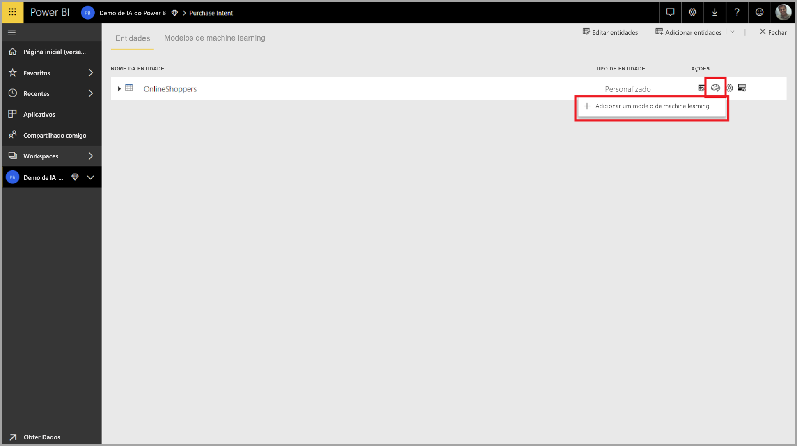

Uma experiência simplificada é iniciada, consistindo de um assistente que orienta você pelo processo de criação do modelo de ML. O assistente inclui as seguintes etapas simples.

1. Selecione a entidade com os dados históricos de resultado e o campo para o qual você deseja uma previsão
2. Escolha um tipo de modelo com base no tipo de previsão que você gostaria de ver
3. Selecione as entradas que você deseja que o modelo a ser usado como sinais de previsão
4. Nomeie seu modelo e salvar sua configuração

O campo de resultado históricos identifica o atributo de rótulo para treinar o modelo de ML, mostrado na imagem a seguir.

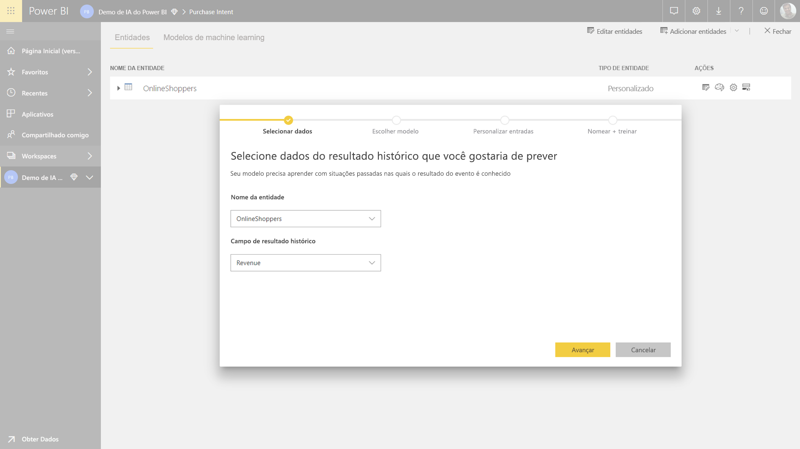

Quando você especifica o campo de resultado históricos, AutoML analisa os dados do rótulo para identificar os tipos de modelos de ML podem ser treinados para que os dados e sugere o tipo de modelo ML mais provável que pode ser treinado. 

> [!NOTE]
> Alguns tipos de modelo podem não ter suporte para os dados que você selecionou.

AutoML também analisa todos os campos na entidade selecionada para sugerir as entradas que podem ser usadas para treinar o modelo de ML. Esse processo é aproximado e se baseia em análise estatística, portanto, você deve examinar as entradas usadas. Quaisquer entradas que são dependentes do campo de resultado históricos (ou o campo de rótulo) não devem ser usadas para treinar o modelo de ML, já que elas afetarão o desempenho.

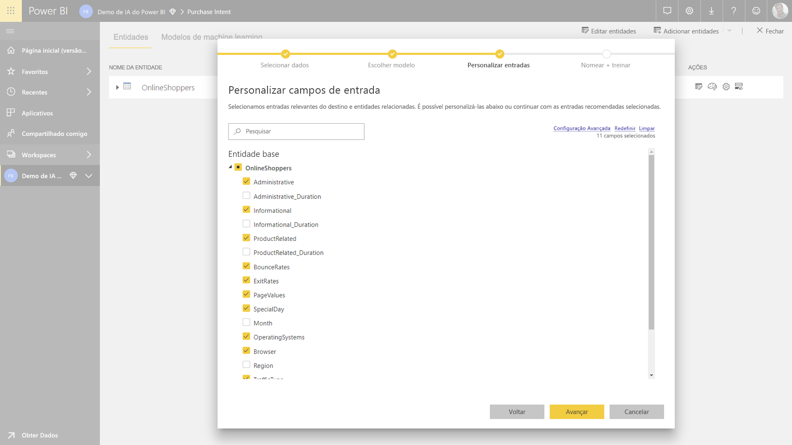

Na etapa final, você pode nomear o modelo e salvar suas configurações.

Nesse estágio, você precisará atualizar o fluxo de dados, que inicia o processo de treinamento para o modelo de ML.

### Treinamento do modelo de ML

Treinamento de modelos de AutoML é uma parte da atualização de fluxo de dados. AutoML primeiro prepara os dados para treinamento.

AutoML divide os dados históricos fornecidos em conjuntos de dados de teste e treinamento. O conjunto de dados de teste é um conjunto de validação que é usado para validar o desempenho do modelo após o treinamento. Esses são realizados como **de treinamento e teste** entidades no fluxo de dados. AutoML utiliza a validação cruzada para a validação do modelo.

Em seguida, cada campo de entrada é analisado e imputação for aplicada, que substitui valores ausentes por valores substituídos. Algumas das estratégias de imputação diferentes são usados pelo AutoML. Em seguida, qualquer amostragem necessária e a normalização são aplicadas aos seus dados.

AutoML aplica-se várias transformações são cada campo de entrada selecionado com base em seu tipo de dados e as propriedades de estatísticas. AutoML usa essas transformações para extrair recursos para uso no treinamento de seu modelo ML.

O processo de treinamento para modelos de AutoML consiste em até 50 iterações com algoritmos de modelagem diferentes e as configurações de hiperparâmetro para encontrar o modelo com o melhor desempenho. O desempenho de cada um desses modelos é avaliado pela validação com o conjunto de dados de teste de validação. Durante essa etapa de treinamento, AutoML cria vários pipelines para treinamento e validação dessas iterações. O processo de avaliar o desempenho dos modelos pode levar tempo, em qualquer lugar de alguns minutos a algumas horas, dependendo do tamanho do seu conjunto de dados e os recursos de capacidade dedicada disponíveis.

Em alguns casos, o modelo final gerado pode usar o aprendizado, onde vários modelos são usados para fornecer melhor desempenho de previsão de ensemble.

### AutoML explainability de modelo

Depois que o modelo foi treinado, AutoML analisa a relação entre os recursos de entrada e a saída do modelo. Ele avalia a magnitude e a direção de alteração para a saída de modelo para o conjunto de dados de teste de validação para cada recurso de entrada. Isso é conhecido como o *importância de recursos*.

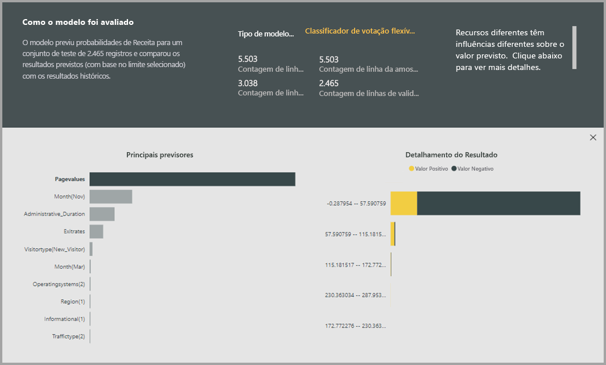

### Relatório de modelo AutoML

AutoML gera um relatório do Power BI que resume o desempenho do modelo durante a validação, juntamente com a importância do recurso global. O relatório resume os resultados de aplicar o modelo de ML para dados de teste de validação e comparar as previsões com os valores de resultado conhecidos.

Você pode examinar o relatório de modelo para entender seu desempenho. Você também pode validar que os influenciadores principais do modelo se alinham com as informações de negócios sobre os resultados conhecidos.

Os gráficos e as medidas usadas para descrever o desempenho do modelo no relatório dependem do tipo de modelo. Essas medidas e gráficos de desempenho são descritas nas seções a seguir.

Páginas adicionais no relatório podem descrever medidas estatísticas sobre o modelo de uma perspectiva de ciência de dados. Por exemplo, o **previsão binária** relatório inclui um gráfico de ganho e a curva ROC para o modelo.

Os relatórios também incluem uma **detalhes de treinamento** página que inclui uma descrição de como o modelo foi treinado e inclui um gráfico que descreve o desempenho do modelo ao longo de cada uma das iterações é executada.

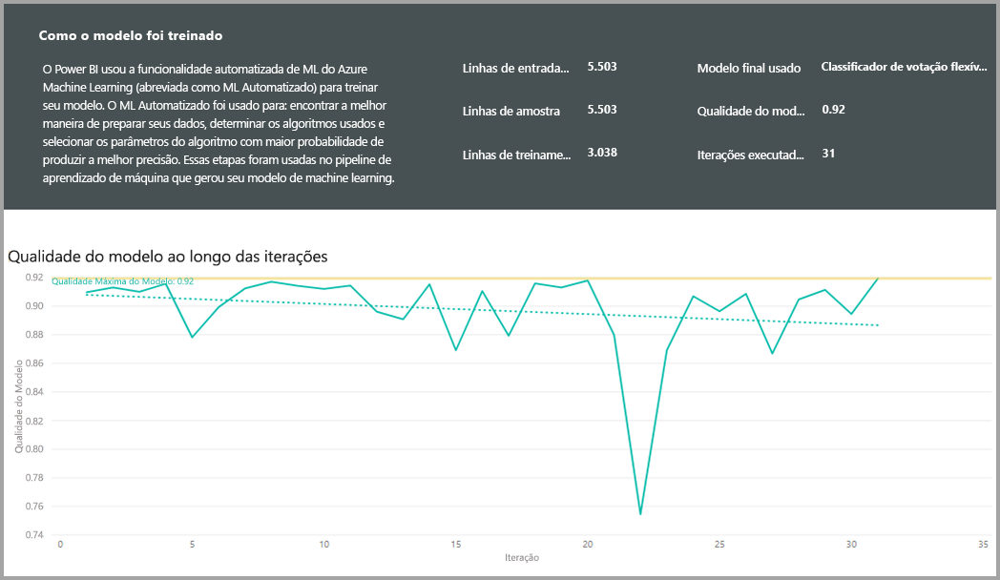

Outra seção nesta página descreve como o método de atribuição usado para preencher valores ausentes para os campos de entrada, bem como a cada campo de entrada foi transformado para extrair os recursos usados no modelo. Ele também inclui os parâmetros usados pelo modelo final.

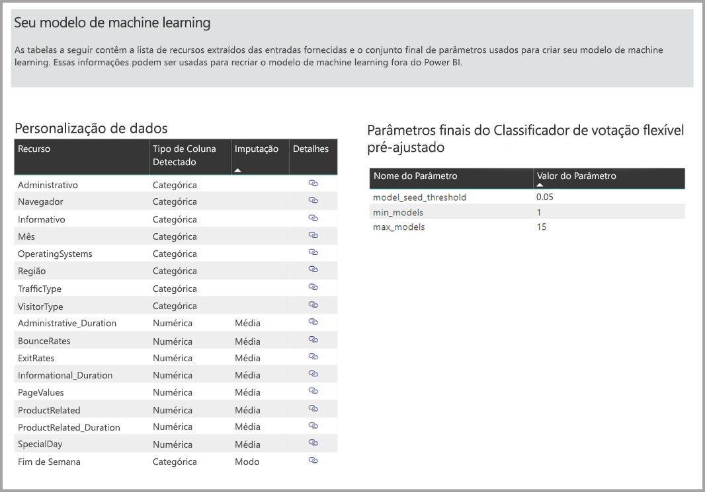

Se o modelo produzido usa aprendizado de ensemble, em seguida, a **detalhes de treinamento** página também inclui uma seção que descreve o peso de cada modelo constituinte em ensemble, bem como seus parâmetros.

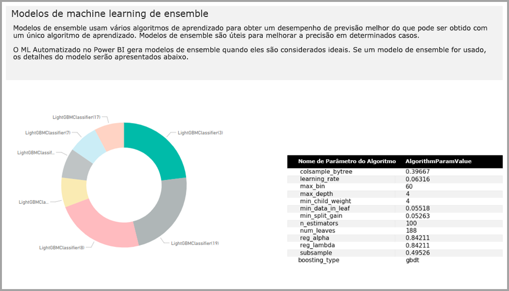

## Aplicar o modelo AutoML

Se você estiver satisfeito com o desempenho do modelo de AM criado, você pode aplicá-lo aos dados novos ou atualizados quando seu fluxo de dados é atualizado. Você pode fazer isso do relatório de modelo, selecionando o **aplicar** botão no canto superior direito.

Para aplicar o modelo de ML, você deve especificar o nome da entidade à qual ele deve ser aplicado e um prefixo para as colunas que serão adicionados a essa entidade para a saída do modelo. O prefixo padrão para nomes de coluna é o nome do modelo. O *aplicar* função pode incluir parâmetros adicionais específicos para o tipo de modelo.

Aplicar o modelo de ML cria uma nova entidade de fluxo de dados com o sufixo **enriquecida < model_name >** . Por exemplo, se você aplicar a _PurchaseIntent_ modelo para o _OnlineShoppers_ entidade, a saída irá gerar o **OnlineShoppers enriquecida PurchaseIntent**.

Atualmente, a entidade de saída não pode ser usada para visualizar os resultados do modelo de ML no editor do Power Query. As colunas de saída sempre mostram nulas como o resultado. Para exibir os resultados, uma segunda saída entidade com o sufixo **enriquecida < model_name > visualização** é criado quando o modelo é aplicado.

Você deve atualizar o fluxo de dados, para visualizar os resultados no Editor de consultas.

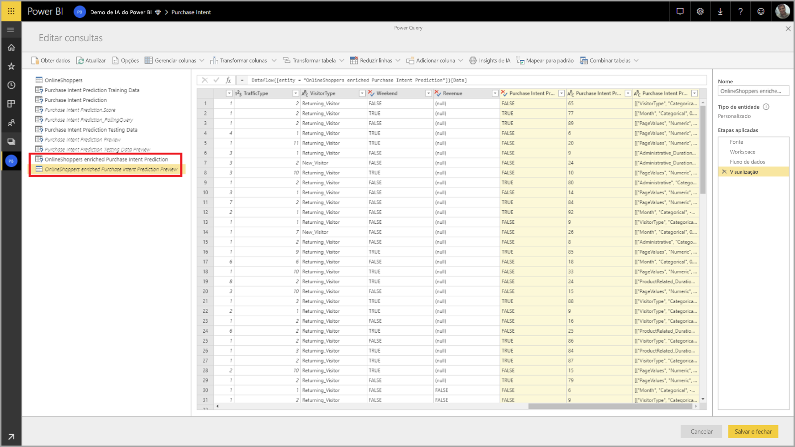

Quando você aplica o modelo, AutoML sempre manterá suas previsões serão atualizados quando o fluxo de dados é atualizado.

AutoML também inclui uma explicação individualizada para cada linha que ele marca da entidade de saída.

Para usar os insights e previsões do modelo de ML em um relatório do Power BI, você pode conectar-se para a entidade de saída do Power BI Desktop usando o **fluxos de dados** conector.

## Modelos de previsão binária

Modelos de previsão binários, mais formalmente conhecidos como **modelos de classificação binária**, são usados para classificar um conjunto de dados em dois grupos. Eles são usados para prever eventos que podem ter um resultado binário, como se converterá uma oportunidade de vendas, se uma conta será de variação, se uma nota fiscal será paga no tempo; Se uma transação é fraudulentas e assim por diante.

Como o resultado é binário, Power BI espera que o rótulo para um modelo de previsão binária ser um booliano, com resultados conhecidos sendo rotulado **verdadeira** ou **falso**. Por exemplo, em um modelo de conversão de oportunidade de vendas, oportunidades de vendas conquistadas são rotulados como true, aqueles que foram perdidas são rotulados como falsos e as oportunidades de vendas abertas são rotulados como nulas.

A saída de um modelo de previsão binária é uma pontuação de probabilidade, que identifica a probabilidade de que o resultado correspondente ao valor de rótulo que está sendo true será obtido.

### Treinar um modelo de previsão binária

Para criar um modelo de previsão binária, a entidade de entrada que contém seus dados de treinamento deve ter um campo booliano como o campo de resultado históricos para identificar os últimos resultados conhecidos.

Pré-requisitos:

* Um campo booliano deve ser usado como o campo de resultado históricos
* Um mínimo de 50 linhas de dados de histórico é necessário para cada classe de resultados

Em geral, se os resultados anteriores são identificados por campos de um tipo de dados diferentes, você pode adicionar uma coluna calculada para transformar isso em um valor booliano usando o Power Query.

O processo de criação de um modelo de previsão binária segue o mesmo etapas como outros modelos AutoML, descritos na seção **Configurando as entradas de modelo ML** acima.

### Relatório de modelo de previsão binário

O modelo de previsão binária produz como saída uma probabilidade de que um registro obterá o resultado definido pelo valor de rótulo Boolean como verdadeiro. O relatório inclui uma segmentação de dados para o limite de probabilidade, o que influencia como as pontuações acima e abaixo do limite de probabilidade são interpretadas.

O relatório descreve o desempenho do modelo em termos de *verdadeiros positivos*, *falsos positivos*, *verdadeiros negativos* e *falsos negativos*. True positivos e negativos verdadeiro são os resultados previstos corretamente para as duas classes nos dados de resultado. Falsos positivos são os resultados que tinham o rótulo de booliano real do valor False, mas foram previstos como True. Por outro lado, falsos negativos são os resultados em que o valor booliano de rótulo real era True, mas foram previstos como False.

Medidas, como a precisão e a recuperação, descrevem o efeito do limite de probabilidade dos resultados previstos. Você pode usar a segmentação de dados de limite de probabilidade para selecionar um limite que atinja um comprometimento equilibrado entre a precisão e a recuperação.

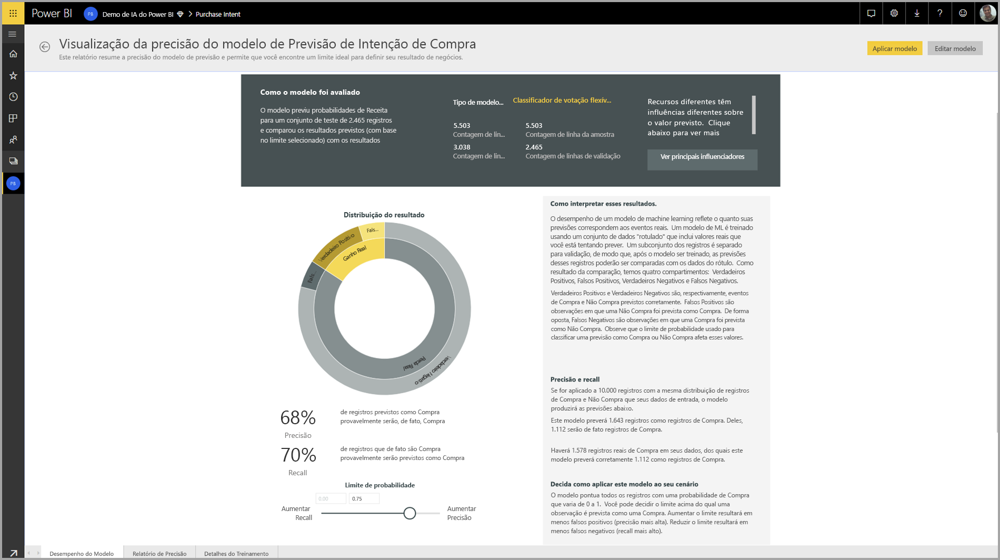

O **relatório de precisão** página do relatório modelo inclui as *ganhos cumulativos* curva de gráfico e o ROC para o modelo. Essas são medidas estatísticas de desempenho do modelo. Os relatórios incluem descrições dos gráficos mostrados.

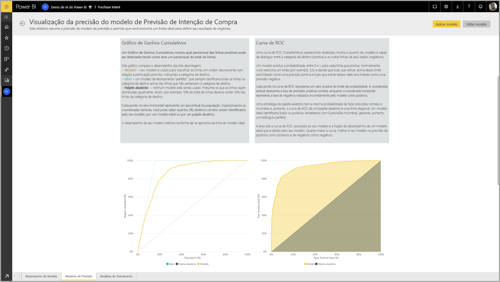

### Aplicando um modelo de previsão binária

Para aplicar um modelo de previsão binária, você deve especificar a entidade com os dados para o qual você deseja aplicar as previsões do modelo de ML. Outros parâmetros incluem o prefixo de nome de coluna de saída e o limite de probabilidade para classificar o resultado previsto.

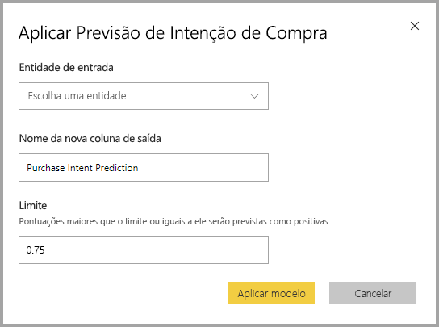

Quando um modelo de previsão binária for aplicado, ele adiciona três colunas de saída para a entidade enriquecidos de saída. Essas são as **PredictionScore**, **PredictionOutcome** e **PredictionExplanation**. Os nomes de coluna na entidade têm o prefixo especificado quando o modelo é aplicado.

O **PredictionOutcome** coluna contém o rótulo de resultado previsto. Registros com as probabilidades que excedem o limite são previstos como prováveis alcançar o resultado e aquelas abaixo são previstas como improvável que atinja o resultado.

O **PredictionExplanation** coluna contém uma explicação com a influência específica que os recursos de entrada tinham sobre o **PredictionScore**. Esta é uma coleção de formatados em JSON de pesos de recursos de entrada para a previsão.

## Modelos de classificação

Modelos de classificação são usados para classificar um conjunto de dados em vários grupos ou classes.  Eles são usados para prever eventos que podem ter um dos vários resultados possíveis, por exemplo, se um cliente é provavelmente terá um muito alto, alto, médio ou baixo valor de tempo de vida; Se o risco para o padrão é alta, moderada, baixa ou muito baixa; e assim por diante.

A saída de um modelo de classificação é uma pontuação de probabilidade, que identifica a probabilidade de que um registro obterão os critérios para uma determinada classe.

### Treinar um modelo de classificação

A entidade de entrada que contém seus dados de treinamento para um modelo de classificação deve ter uma cadeia de caracteres ou um campo numérico, como o campo de resultado históricos, que identifica os últimos resultados conhecidos.

Pré-requisitos:

* Um mínimo de 50 linhas de dados de histórico é necessário para cada classe de resultados

O processo de criação de um modelo de classificação segue o mesmo etapas como outros modelos AutoML, descritos na seção **Configurando as entradas de modelo ML** acima.

### Relatório de modelo de classificação

A classificação de relatório de modelo é produzido aplicando o modelo do ML para o controle de teste de dados e comparando a classe prevista para um registro com a real classe conhecida.

O relatório de modelo inclui um gráfico que inclui a análise dos registros classificados corretamente e incorretamente para cada classe conhecido.

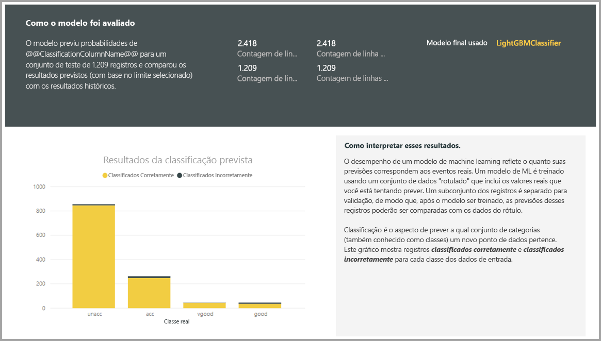

Uma análise ainda mais específicos da classe permite uma análise de como as previsões para uma classe conhecida são distribuídas. Isso inclui as outras classes em que registros do que conhecida classe têm probabilidade de ser classificado incorretamente.

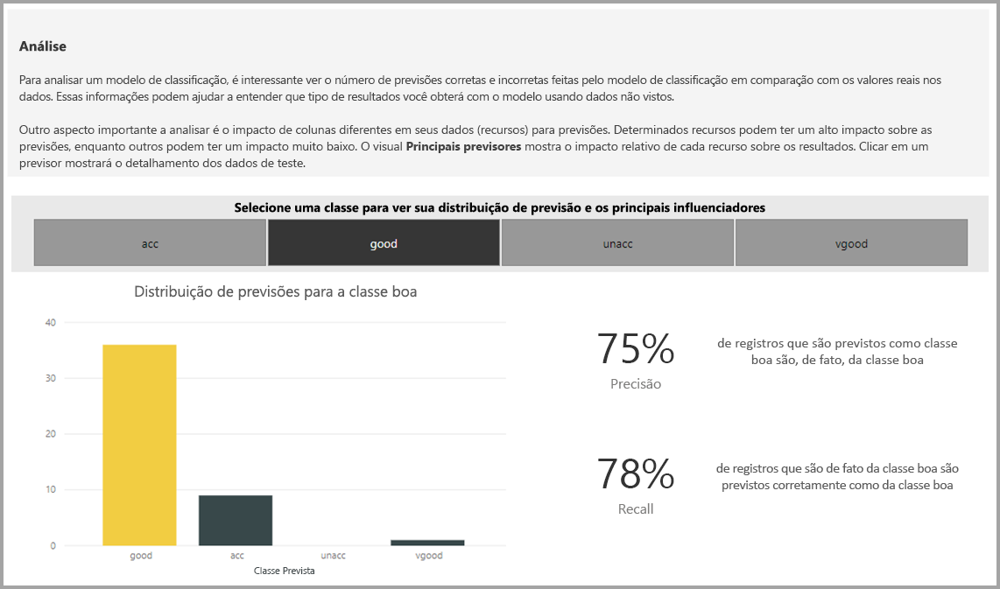

A explicação do modelo no relatório também inclui as principais previsões para cada classe.

O relatório de modelo de classificação também inclui uma página de detalhes de treinamento semelhante às páginas para outros tipos de modelo, conforme descrito na seção **relatório de modelo AutoML** anteriormente neste artigo.

### Aplicando um modelo de classificação

Para aplicar um modelo de classificação ML, você deve especificar a entidade com os dados de entrada e o prefixo de nome de coluna de saída.

Quando um modelo de classificação é aplicado, ele adiciona que três colunas de saída para a entidade enriquecidos de saída. Essas são as **PredictionScore**, **PredictionClass** e **PredictionExplanation**. Os nomes de coluna na entidade têm o prefixo especificado quando o modelo é aplicado.

O **PredictionClass** coluna contém a classe prevista mais provável para o registro. O **PredictionScore** coluna contém a lista de pontuações de probabilidade para o registro para cada classe possíveis.

O **PredictionExplanation** coluna contém uma explicação com a influência específica que os recursos de entrada tinham sobre o **PredictionScore**. Esta é uma coleção de formatados em JSON de pesos de recursos de entrada para a previsão.

## Modelos de regressão

Modelos de regressão são usados para prever um valor, como a probabilidade de ser obtido com uma quantidade de vendas, o valor de tempo de vida de uma conta, a quantidade de uma fatura a receber que é provável que a ser pago, a data em que uma fatura pode ser paga da receita , e assim por diante.

A saída de um modelo de regressão é o valor previsto.

### Treinar um modelo de regressão

A entidade de entrada que contém os dados de treinamento para um modelo de regressão deve ter um campo numérico que o campo de resultado históricos, que identifica os últimos valores de resultado conhecidos.

Pré-requisitos:

* Um mínimo de 100 linhas de dados de histórico é necessário para um modelo de regressão

O processo de criação de um modelo de regressão segue o mesmo etapas como outros modelos AutoML, descritos na seção **Configurando as entradas de modelo ML** acima.

### Relatório de modelo de regressão

Como os outros relatórios de modelo de AutoML, o relatório de regressão com base nos resultados da aplicação do modelo para os dados de teste de validação.

O relatório de modelo inclui um gráfico que compara os valores previstos para o valor real. Neste gráfico, a distância da diagonal indica o erro na previsão.

O gráfico de erro residual mostra a distribuição do percentual de erro médio para diferentes valores no conjunto de dados de teste de validação. O eixo horizontal representa a média do valor real para o grupo, com o tamanho da bolha mostrando a frequência ou contagem de valores nesse intervalo. O eixo vertical é o erro residual médio.

O relatório de modelo de regressão também inclui uma página de detalhes de treinamento como os relatórios para outros tipos de modelo, conforme descrito na seção **relatório de modelo AutoML** acima.

### Aplicando um modelo de regressão

Para aplicar um modelo de regressão ML, você deve especificar a entidade com os dados de entrada e o prefixo de nome de coluna de saída.

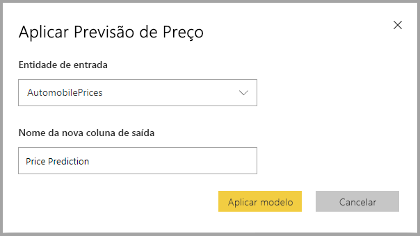

Quando um modelo de regressão é aplicado, ele adiciona duas colunas de saída para a entidade enriquecidos de saída. Essas são as **PredictionValue**, e **PredictionExplanation**. Os nomes de coluna na entidade têm o prefixo especificado quando o modelo é aplicado.

O **PredictionValue** coluna contém o valor previsto para o registro com base em campos de entrada. O **PredictionExplanation** coluna contém uma explicação com a influência específica que os recursos de entrada tinham sobre o **PredictionValue**. Esta é uma coleção de formatados em JSON de pesos de recursos de entrada.

## Próximas etapas

Este artigo forneceu uma visão geral do aprendizado de máquina automatizada para fluxos de dados no serviço do Power BI. Os artigos a seguir também podem ser úteis.

* [Tutorial: Criar um modelo de aprendizado de máquina no Power BI (visualização)](service-tutorial-build-machine-learning-model.md)
* [Tutorial: Como usar os Serviços Cognitivos no Power BI](service-tutorial-use-cognitive-services.md)
* [Tutorial: Invocar um modelo de Machine Learning Studio no Power BI (versão prévia)](service-tutorial-invoke-machine-learning-model.md)
* [Serviços Cognitivos no Power BI (versão prévia)](service-cognitive-services.md)
* [Integração do Azure Machine Learning no Power BI (versão prévia)](service-machine-learning-integration.md)

Para saber mais sobre os fluxos de dados, leia estes artigos:
* [Criação e uso de fluxos de dados no Power BI](service-dataflows-create-use.md)
* [Usando entidades computadas no Power BI Premium](service-dataflows-computed-entities-premium.md)
* [Usando fluxos de dados com fontes de dados locais](service-dataflows-on-premises-gateways.md)
* [Recursos do desenvolvedor para fluxos de dados do Power BI](service-dataflows-developer-resources.md)
* [Integração entre fluxos de dados e o Azure Data Lake (versão prévia)](service-dataflows-azure-data-lake-integration.md)

