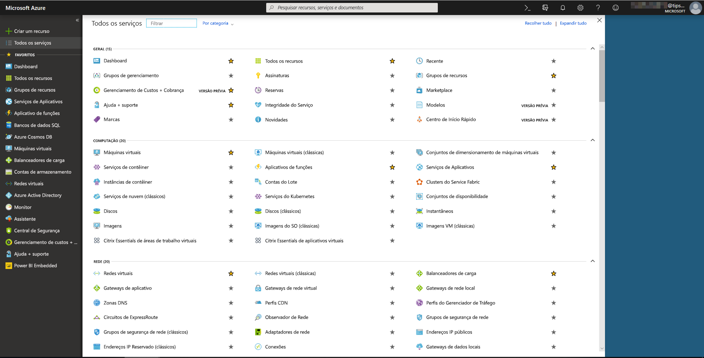
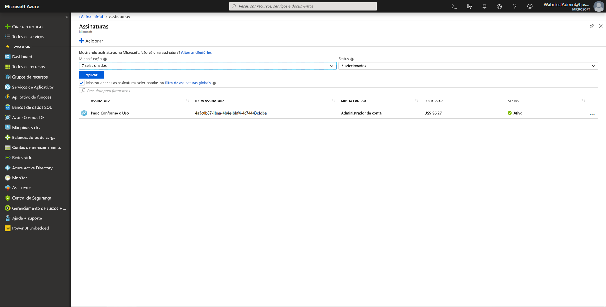
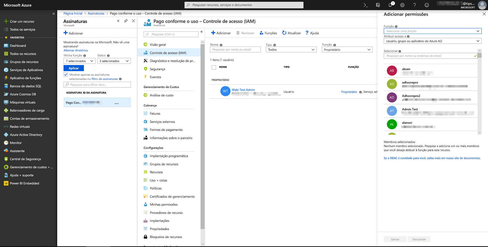
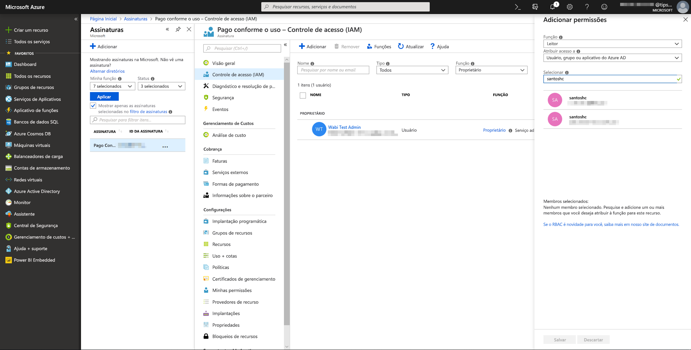
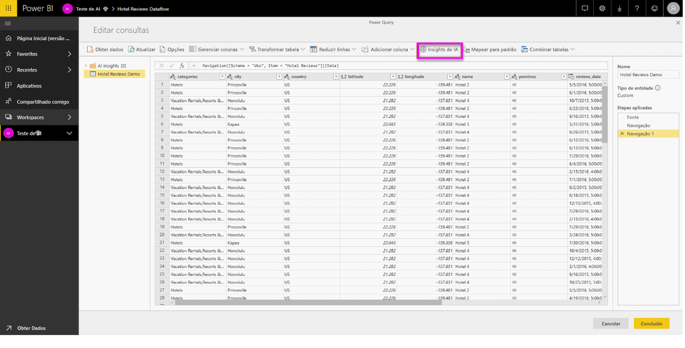
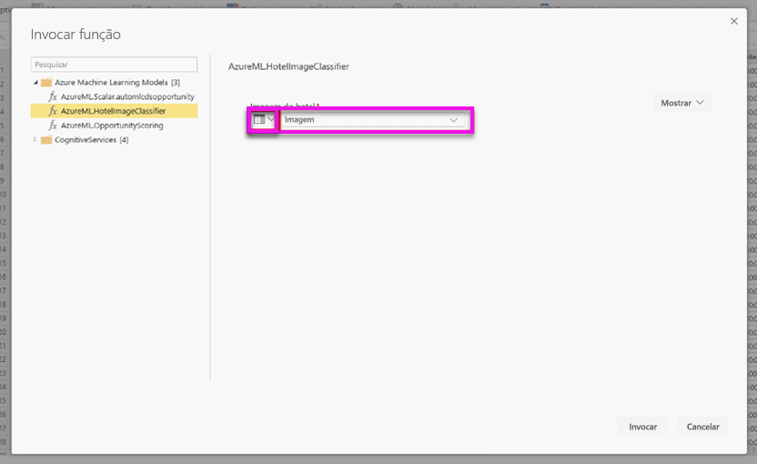
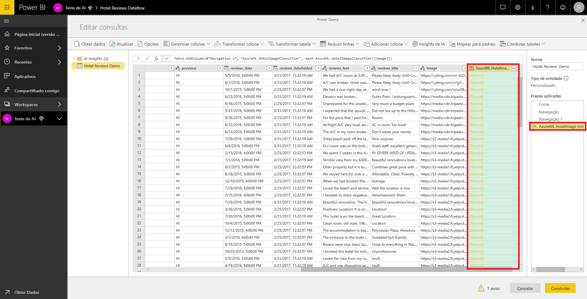
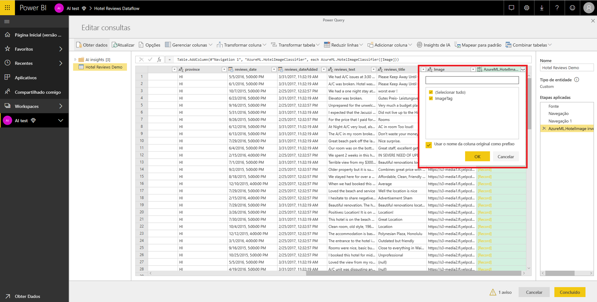

# Integração do Azure Machine Learning no Power BI (versão prévia)

Várias organizações usam modelos de **Machine Learning** para obter melhores insights e previsões sobre seus negócios. A capacidade de visualizar e invocar insights com esses modelos, em seus relatórios e painéis e outras análises, pode ajudar a divulgar essas informações para os usuários comerciais que mais precisam delas.  O Power BI agora facilita a incorporação de insights a partir de modelos hospedados no Serviço do Azure Machine Learning, com o uso de gestos simples de apontar e clicar.

Para usar essa funcionalidade, basta que um cientista de dados conceda acesso ao modelo do Azure ML para o analista de BI usando o portal do Azure.  Em seguida, no início de cada sessão, o Power Query descobre todos os modelos do Azure ML aos quais o usuário tem acesso e os expõe como funções dinâmicas do Power Query.  O usuário pode invocar essas funções, seja acessando-as na faixa de opções no Power Query Editor ou invocando diretamente a função de M. O Power BI também agrupa automaticamente as solicitações de acesso em lotes ao invocar o modelo do Azure ML para um conjunto de linhas a fim de melhorar o desempenho.

Atualmente, esta funcionalidade só tem suporte para fluxos de dados do Power BI e para o Power Query online no serviço do Power BI.

Saiba mais sobre fluxos de dados em [Preparação de dados de autoatendimento no Power BI](service-dataflows-overview.md).

Para saber mais sobre o Azure Machine Learning:

- Visão geral:  [o que é o Serviço do Azure Machine Learning?](https://docs.microsoft.com/azure/machine-learning/service/overview-what-is-azure-ml)
- Guias de Início Rápido e tutoriais para o Azure Machine Learning:  [Documentação do Azure Machine Learning](https://docs.microsoft.com/azure/machine-learning/)

## Conceder acesso ao modelo do Azure ML a um usuário do Power BI

Para acessar um modelo do Azure ML no Power BI, o usuário deve ter acesso de**Leitura** à assinatura do Azure.  Além disso:

- Para modelos do Machine Learning Studio, o acesso de **Leitura** para o serviço Web do Machine Learning Studio
- Para modelos do Serviço do Machine Learning, o acesso de **Leitura** para o espaço de trabalho do serviço do Machine Learning

As etapas neste artigo descrevem como conceder acesso a um usuário do Power BI para um modelo hospedado no serviço do Azure ML para que ele possa acessar esse modelo como uma função do Power Query.  Confira mais detalhes em [Gerenciar acesso usando o RBAC e o portal do Azure](https://docs.microsoft.com/azure/role-based-access-control/role-assignments-portal).

1. Entre no [portal do Azure](https://portal.azure.com).

2. Acesse a página **Assinaturas**. A página **Assinaturas** pode ser encontrada na lista **Todos os serviços** do menu de navegação à esquerda do portal do Azure.

    

3. Selecione sua assinatura.

    

4. Selecione o **Controle de Acesso (IAM)** e depois o botão **Adicionar**.

    

5. Selecione **Leitor** como a Função. Selecione o usuário do Power BI para o qual você deseja conceder acesso ao modelo do Azure ML.

    

6. Selecione **Salvar**.

7. Repita as etapas de três a seis para conceder acesso de **Leitor** ao usuário para o serviço Web específico do Machine Learning Studio *ou* para o espaço de trabalho de serviço do Machine Learning que hospeda o modelo.

## Descoberta de esquema para modelos de Serviço do Machine Learning

Os cientistas de dados usam principalmente o Python para o desenvolvimento e até mesmo a implantação dos modelos de aprendizado de máquina no Serviço do Machine Learning.  Ao contrário do Machine Learning Studio, que ajuda a automatizar a tarefa de criação de um arquivo de esquema para o modelo, no caso do Serviço do Machine Learning, o cientista de dados deve gerar explicitamente o arquivo de esquema usando o Python.

Esse arquivo de esquema deve ser incluído em

## Invocar o modelo do Azure ML no Power BI

Você pode invocar qualquer modelo do Azure ML para o qual recebeu acesso diretamente do Power Query Editor em seu fluxo de dados. Para acessar os modelos do Azure Machine Learning, selecione o botão **Editar** da entidade que você deseja aprimorar com insights provenientes de seu modelo do Azure ML, como mostrado na imagem a seguir.

Selecione o botão **Editar** para abrir o Power Query Editor para as entidades em seu fluxo de dados.

Selecione o botão **Insights de IA** na faixa de opções e selecione a pasta _Modelos do Azure Machine Learning_ no menu de navegação à esquerda. Todos os modelos do Azure ML aos quais você tem acesso são listados aqui como funções do Power Query. Além disso, os parâmetros de entrada do modelo do Azure ML são mapeados automaticamente como parâmetros da função correspondente do Power Query.

Para invocar um modelo do Azure ML, especifique qualquer uma das colunas da entidade escolhida como uma entrada na lista suspensa. Você também pode especificar um valor constante para ser usado como uma entrada, alternando o ícone da coluna à esquerda da caixa de diálogo de entrada.

Selecione **Invocar** para visualizar a versão prévia da saída do modelo do Azure ML como uma nova coluna na tabela de entidades. Você também verá a invocação do modelo como uma etapa aplicada à consulta.

Se o modelo retornar vários parâmetros de saída, eles serão agrupados como um registro na coluna de saída. É possível expandir a coluna para produzir parâmetros de saída individuais em colunas separadas.

Depois de salvar o fluxo de dados, o modelo será automaticamente invocado quando o fluxo de dados for atualizado com qualquer linha nova ou atualizada na tabela de entidades.

## Próximas etapas

Este artigo fornece uma visão geral da integração do Machine Learning com o serviço do Power BI. Os artigos a seguir também podem ser úteis e interessantes. 

* [Tutorial: Invocar um modelo de Machine Learning Studio no Power BI (versão prévia)](service-tutorial-invoke-machine-learning-model.md)
* [Tutorial: Como usar os Serviços Cognitivos no Power BI](service-tutorial-use-cognitive-services.md)
* [Serviços Cognitivos no Power BI (versão prévia)](service-cognitive-services.md)

Para saber mais sobre os fluxos de dados, leia estes artigos:
* [Criação e uso de fluxos de dados no Power BI](service-dataflows-create-use.md)
* [Usando entidades computadas no Power BI Premium](service-dataflows-computed-entities-premium.md)
* [Usando fluxos de dados com fontes de dados locais](service-dataflows-on-premises-gateways.md)
* [Recursos do desenvolvedor para fluxos de dados do Power BI](service-dataflows-developer-resources.md)
* [Integração entre fluxos de dados e o Azure Data Lake (versão prévia)](service-dataflows-azure-data-lake-integration.md)

