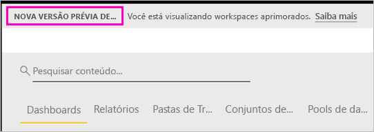

# Organizar o trabalho em novos workspaces (versão prévia) no Power BI

Os workspaces são locais para colaborar com colegas e criar coleções de dashboards e relatórios. Em seguida, você pode agrupar essas coleções em *aplicativos* e distribuí-las para toda a organização ou para pessoas ou grupos específicos. O Power BI está apresentando uma nova experiência de workspace como versão prévia. 

Com a nova versão prévia de workspaces, agora é possível:

- Atribuir funções de workspace a grupos de usuários: grupos de segurança, listas de distribuição, grupos do Office 365 e indivíduos.
- Criar um workspace no Power BI sem criar um grupo do Office 365.
- Usar funções de workspaces mais granulares para obter um gerenciamento de permissões mais flexível em um workspace.

Leia sobre como [criar um dos novos workspaces](service-create-the-new-workspaces.md).
 
Quando você cria um dos novos workspaces, você não está criando um grupo do Office 365 associado e subjacente. Toda a administração do workspace está no Power BI, não no Office 365. Ainda é possível adicionar um grupo do Office 365 ao workspace para continuar gerenciando o acesso do usuário ao conteúdo por meio de grupos do Office 365. No entanto, também é possível usar grupos de segurança e listas de distribuição e adicionar indivíduos diretamente pelo Power BI, dando uma forma flexível de gerenciar o acesso ao workspace. Como agora a administração de workspace está no Power BI, os administradores do Power BI decidem quem em uma organização pode criar workspaces. Nas **Configurações do workspace** no portal de administração, os administradores podem permitir que todas as pessoas ou ninguém em uma organização crie workspaces. Eles também podem limitar a criação de membros de grupos de segurança específicos.

Leia mais sobre o [Portal de administração do Power BI](service-admin-portal.md).

## Distribuir novos workspaces

Durante o período de versão prévia, workspaces antigos e novos podem coexistir lado a lado, e você pode criar qualquer um deles. Quando a versão prévia para novos workspaces for encerrada e eles estiverem disponíveis para o público geral, workspaces antigos ainda podem existir por um tempo. Não será possível criá-los e será necessário se preparar para migrar seus workspaces para a nova infraestrutura de workspaces. Não se preocupe, você terá vários meses para concluir a migração.

## Funções nos novos workspaces

Adicione grupos de usuários ou indivíduos aos novos workspaces como membros, colaboradores ou administradores. Todos em um grupo de usuários obtêm a função que você definiu. Se um indivíduo estiver em vários grupos de usuários, ele terá o nível mais alto de permissão fornecido pela função.

Todas as pessoas que você adiciona a um workspace precisam de uma licença do Power BI Pro. No workspace, esses usuários podem colaborar nos dashboards e relatórios que você planeja publicar para um público-alvo maior ou até mesmo para toda a organização. Para distribuir conteúdo a outras pessoas da sua organização, atribua licenças do Power BI Pro a esses usuários ou coloque o workspace em uma capacidade do Power BI Premium.

As funções permitem que você gerencie quem pode fazer o que em um workspace para que as equipes possam colaborar. Os novos workspaces permitem que você atribua funções a indivíduos e a grupos de usuários: grupos de segurança, grupos do Office 365 e listas de distribuição. 

Ao atribuir funções a um grupo de usuários, os indivíduos no grupo têm acesso ao conteúdo. Se você aninhar grupos de usuários, todos os usuários contidos terão permissão. Um usuário que está em vários grupos de usuários com diferentes funções obtém o nível mais alto de permissão concedido a eles. 

Os novos workspaces oferecem três funções: administradores, membros e colaboradores.

**Os administradores podem:**

- Atualizar e excluir o workspace. 
- Adicionar/remover pessoas, incluindo outros administradores.
- Fazer tudo que os membros podem fazer.

**Os membros podem:** 

- Adicionar membros ou outras pessoas com permissões inferiores.
- Publicar e atualizar um aplicativo.
- Compartilhar um item ou um aplicativo.
- Permitir que outras pessoas compartilhem novamente os itens.
- Fazer tudo que os colaboradores podem fazer.

**Os colaboradores podem:** 

- Criar, editar e excluir conteúdo no workspace. 
- Publicar relatórios no workspace, excluir conteúdo.
- Não podem dar acesso ao conteúdo para novas pessoas. Eles não podem compartilhar o conteúdo novo, mas podem compartilhar com as pessoas com quem o workspace, o item ou o aplicativo já está compartilhado. 
- Não é possível modificar os membros do grupo.
 
Estamos criando fluxos de trabalho Solicitar acesso em todo o serviço para que os usuários que não têm acesso poderem solicitá-lo. No momento, os fluxos de trabalho Solicitar acesso existem para dashboards, relatórios e aplicativos.

## Converter workspaces antigos em novos workspaces

Durante o período de versão prévia, não é possível converter automaticamente os workspaces antigos em novos. No entanto, você pode criar um workspace e publicar seu conteúdo no novo local. 

Quando os novos workspaces estiverem disponíveis para o público geral (GA), será possível aceitar migrar os antigos automaticamente. Em algum momento após a disponibilidade geral, será necessário migrá-los.

## Em que aspectos os novos workspaces são diferentes dos workspaces atuais?

Com os novos workspaces, estamos reformulando alguns recursos. Aqui estão as alterações que serão permanentes juntamente com a versão prévia. 

* A criação de workspaces não criará entidades correspondentes no Office 365 como os workspaces atuais criam. (Ainda é possível adicionar um grupo do Office 365 ao seu workspace atribuindo-lhe uma função). 
* Nos workspaces atuais, é possível adicionar apenas indivíduos aos membros e às listas de administradores. Nos novos workspaces, é possível adicionar vários grupos de segurança do AD, listas de distribuição ou grupos do Office 365 a essas listas para facilitar o gerenciamento de usuários. 
- É possível criar um pacote de conteúdo organizacional de um workspace atual. Não é possível criar um dos novos workspaces.
- É possível consumir um pacote de conteúdo organizacional de um workspace atual. Não é possível consumir um dos novos workspaces.
- Durante o período de versão prévia, alguns recursos ainda não estão habilitados para os novos workspaces. Confira a próxima seção, [Novos recursos de workspace planejados](service-new-workspaces.md#planned-new-workspace-preview-features), para obter detalhes.

## Limitações e considerações

Limitações a serem consideradas:

- Os workspaces podem conter um máximo de mil conjuntos de dados ou mil relatórios por conjunto de dados. 
- Uma pessoa com uma licença do Power BI Pro pode ser membro de um máximo de 250 workspaces.

## Novas versões prévias planejadas dos recursos do workspace

Durante o lançamento da versão prévia, ainda estamos desenvolvendo outras novas versões prévias dos recursos do workspace, que ainda não estão disponíveis:

- Nenhum botão **Sair do workspace**.
- Ainda não há suporte para as métricas de uso.
- Como funciona o Premium: é possível atribuir e criar workspaces em uma capacidade Premium, mas, para mover um workspace entre capacidades, acesse as configurações do workspace.
- Ainda não há suporte para a inserção de Web Part do SharePoint.
- Nenhum botão **OneDrive** para grupos do Office 365 em Obter dados/arquivos.

## Recursos do workspace de aplicativo que funcionam de forma diferente

Alguns recursos funcionam de forma diferente dos workspaces atuais nos novos workspaces. Essas diferenças são intencionais, com base nos comentários recebidos dos clientes, e permitirão uma abordagem mais flexível para colaboração com workspaces:

- Os membros podem ou não compartilhar novamente: substituídos pela função Colaborador
- Workspaces somente leitura: em vez de permitir aos usuários o acesso somente leitura a um workspace, você atribuirá os usuários a uma função de Visualizador que estará disponível em breve, para permitir um acesso semelhante somente leitura ao conteúdo de um workspace.

## Problemas conhecidos

Como esse é um recurso de versão prévia, há algumas limitações que você deve ter em mente. Os seguintes problemas são conhecidos, e as correções estão em desenvolvimento:

- Usuários ou grupos de usuários gratuitos adicionados como destinatários de assinaturas para emails não podem receber os emails, embora devessem. O problema ocorre quando um dos novos workspaces está em uma capacidade Premium, mas o Meu Workspace do usuário que cria a assinatura não está em uma capacidade Premium. Se o Meu workspace estiver em uma capacidade Premium, os usuários e grupos de usuários gratuitos receberão os emails.
- Depois que um workspace for movido de uma capacidade Premium para uma capacidade compartilhada, em alguns casos, os usuários e grupos de usuários gratuitos continuarão recebendo emails, embora não devessem. O problema ocorre quando o Meu workspace do usuário que cria a assinatura está em uma capacidade Premium.

## Próximas etapas
* [Criar workspaces (versão prévia) no Power BI](service-create-the-new-workspaces.md)
* [Criar os workspaces atuais](service-create-workspaces.md)
* [Instalar e usar aplicativos no Power BI](service-create-distribute-apps.md)
* Dúvidas? [Experimente perguntar à Comunidade do Power BI](http://community.powerbi.com/)
