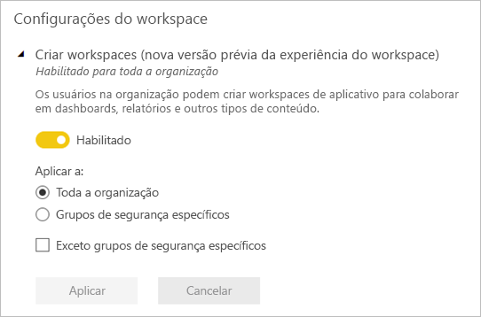

# Organizar o trabalho em novos espaços de trabalho no Power BI

 *Espaços de trabalho* são lugares para colaborar com colegas para criar coleções de dashboards, relatórios e relatórios paginados. A nova experiência de espaço de trabalho ajuda você a gerenciar melhor o acesso ao conteúdo. Este artigo descreve os novos espaços de trabalho e como eles diferem de espaços de trabalho clássicos.  Como com espaços de trabalho clássicos, você ainda usá-los para criar e distribuir aplicativos. Leia sobre como [criar uma nova experiência de espaço de trabalho](service-create-the-new-workspaces.md).

A nova experiência de espaço de trabalho atingiu a disponibilidade geral (GA) e agora é o espaço de trabalho padrão. Você ainda poderá continuar a criar e usar [espaços de trabalho clássicos](service-create-workspaces.md) com base em grupos do Office 365. 

> [!NOTE]
> Para impor a segurança em nível de linha (RLS) para procurar conteúdo em um espaço de trabalho de usuários do Power BI Pro, continue a usar [espaços de trabalho clássicos](service-create-workspaces.md). Selecione o **os membros só podem exibir o conteúdo do Power BI** opção. Como alternativa, publicar um aplicativo do Power BI aos usuários, ou usar o compartilhamento para distribuir o conteúdo. A função de visualizador disponível em breve permitirá esse cenário no futuro em novos espaços de trabalho de experiência de espaço de trabalho.

Com novos espaços de trabalho, você pode:

- Atribuir funções de workspace a grupos de usuários: grupos de segurança, listas de distribuição, grupos do Office 365 e indivíduos.
- Criar um workspace no Power BI sem criar um grupo do Office 365.
- Usar funções de workspaces mais granulares para obter um gerenciamento de permissões mais flexível em um workspace.

Quando você cria um dos novos workspaces, você não está criando um grupo do Office 365 associado e subjacente. Toda a administração do workspace está no Power BI, não no Office 365. Na nova experiência de espaço de trabalho, agora você pode adicionar um grupo do Office 365 na lista de acesso do espaço de trabalho para continuar a gerenciar o acesso do usuário ao conteúdo por meio de grupos do Office 365.

## Administrando a novos espaços de trabalho de experiência de espaço de trabalho
A administração para novos espaços de trabalho de experiência de espaço de trabalho é agora no Power BI, os administradores do Power BI decidir quem em uma organização pode criar espaços de trabalho. Eles também possam gerenciar e recuperar o espaço de trabalho. Para fazer isso, eles precisam usar o portal de administração do Power BI ou os CmdLets do PowerShell. Para espaços de trabalho clássicos com base em grupos do Office 365, administração continuará a ocorrer no portal de administração do Office 365 e Azure Active Directory.

Na **configurações de espaço de trabalho** no portal de administração, os administradores podem usar criar espaços de trabalho (nova experiência de espaço de trabalho) configuração para permitir que todas as pessoas ou ninguém em uma organização para criar novo espaço de trabalho a experiência de espaços de trabalho. Eles também podem limitar a criação de membros de grupos de segurança específicos.

> [!NOTE]
> Criar espaços de trabalho (nova experiência de espaço de trabalho) definindo o padrão é permitir que somente usuários que podem criar grupos do Office 365 para criar novos espaços de trabalho no Power BI. Certifique-se de definir um valor no portal de administração do Power BI para garantir que os usuários adequados podem criar novo espaço de trabalho experiência de espaços de trabalho.

O [lista de espaços de trabalho está disponível](service-admin-portal.md#workspaces) no portal de administração do Power BI. 

## Novos espaços de trabalho lado a lado com espaços de trabalho clássicos

Espaços de trabalho novos, atualizados e de espaços de trabalho clássicos coexistam lado a lado e você pode criar. A nova experiência de espaço de trabalho é o tipo de espaço de trabalho padrão. Power BI continua listar todos os grupos do Office 365 do usuário é membro no Power BI para evitar a alteração de fluxos de trabalho existentes. Para saber como criar um novo espaço de trabalho, leia [criar novos espaços de trabalho](service-create-the-new-workspaces.md). Para saber como criar um espaço de trabalho clássico, leia [criar os espaços de trabalho clássicos](service-create-workspaces.md).

## Funções nos novos workspaces

Para conceder acesso a um novo espaço de trabalho, adicionar grupos de usuários ou indivíduos para uma das funções do espaço de trabalho: os membros, colaboradores ou administradores. Todos em um grupo de usuários obtêm a função que você definiu. Se um indivíduo é em vários grupos de usuários, ele terá o nível mais alto de permissão fornecida pelas funções das quais que eles são atribuídos.

As funções permitem que você gerencie quem pode fazer o que em um workspace para que as equipes possam colaborar. Os novos workspaces permitem que você atribua funções a indivíduos e a grupos de usuários: grupos de segurança, grupos do Office 365 e listas de distribuição. 

Ao atribuir funções a um grupo de usuários, os indivíduos no grupo têm acesso ao conteúdo. Se você aninhar grupos de usuários, todos os usuários contidos terão permissão. Um usuário que está em vários grupos de usuários com diferentes funções obtém o nível mais alto de permissão concedido a eles. 

Os novos workspaces oferecem três funções: administradores, membros e colaboradores.

|Funcionalidade   | Administrador  | Membro  | Colaborador  | 
|---|---|---|---|
| Atualizar e excluir o workspace.  | X  |   |   |
| Adicionar/remover pessoas, incluindo outros administradores.  | X  |   |   |
| Adicionar membros ou outras pessoas com permissões inferiores.  |  X | X  |   |
| Publicar e atualizar um aplicativo. |  X | X  |   |
| Compartilhar um item ou um aplicativo. |  X | X  |   |
| Permitir que outras pessoas compartilhem novamente os itens. |  X | X  |   |
| Criar, editar e excluir conteúdo no workspace.  |  X | X  | X  |
| Publicar relatórios no workspace, excluir conteúdo. |  X | X  | X  |
 
 
## Licenças
Todas as pessoas que você adiciona a um workspace precisam de uma licença do Power BI Pro. No workspace, esses usuários podem colaborar nos dashboards e relatórios que você planeja publicar para um público-alvo maior ou até mesmo para toda a organização. Para distribuir conteúdo a outras pessoas da sua organização, atribua licenças do Power BI Pro a esses usuários ou coloque o workspace em uma capacidade do Power BI Premium.

> [!NOTE]
> Publicando relatórios em nova experiência de espaço de trabalho mais rígidas imposição existente tiver regras de licenciamento. Os usuários que tentarem publicar do Power BI Desktop ou outros clientes ferramentas sem uma licença Pro veem o erro "somente os usuários com licenças do Power BI Pro podem publicar esse espaço de trabalho."

## Em que aspectos os novos workspaces são diferentes dos workspaces atuais?

Com os novos workspaces, estamos reformulando alguns recursos. Aqui estão as alterações que você pode esperar para ser permanente. 

* Criar esses espaços de trabalho não cria grupos do Office 365, como os espaços de trabalho clássico. No entanto, agora você pode usar um grupo do Office 365 para dar aos usuários acesso ao espaço de trabalho, atribuindo a ele uma função. 
* Em espaços de trabalho clássicos, você pode adicionar apenas indivíduos para os membros e listas de administrador. Nos novos workspaces, é possível adicionar vários grupos de segurança do AD, listas de distribuição ou grupos do Office 365 a essas listas para facilitar o gerenciamento de usuários. 
- Você pode criar um pacote de conteúdo organizacional de um espaço de trabalho clássico. Não é possível criar um dos novos workspaces.
- Você pode consumir um pacote de conteúdo organizacional de um espaço de trabalho clássico. Não é possível consumir um dos novos workspaces.

## Lista de contatos do espaço de trabalho
O novo **lista de contatos** recurso permite que você especifique quais usuários recebem a notificação sobre problemas que ocorrem no espaço de trabalho. Por padrão, qualquer usuário ou grupo especificado como um espaço de trabalho do administrador é notificado, mas você pode personalizar a lista. Os usuários ou grupos listados na lista de contatos serão mostrados na interface do usuário (IU) para ajudar os usuários obtêm ajuda relacionadas ao espaço de trabalho. 

Leia mais sobre o [definindo a lista de contatos do espaço de trabalho](service-create-the-new-workspaces.md#workspace-contact-list).

## Workspace OneDrive
O recurso do OneDrive do espaço de trabalho permite que você configure um grupo do Office 365 cujo armazenamento de arquivos de biblioteca de documentos do SharePoint está disponível para usuários do espaço de trabalho. O grupo precisa ser criado fora do Power BI. 

O Power BI não sincronizar as permissões de usuários ou grupos que estão configurados para ter acesso de espaço de trabalho com a associação de grupo do Office 365. A prática recomendada é gerenciar o acesso ao espaço de trabalho por meio do mesmo grupo do Office 365 cujo armazenamento de arquivos que você configurar essa configuração. 

Leia sobre como [definida e acessar o espaço de trabalho do OneDrive](service-create-the-new-workspaces.md#workspace-onedrive).  
   
## A auditoria
As seguintes atividades são auditadas pelo Power BI para novos espaços de trabalho de experiência de espaço de trabalho.

| Nome amigável |   Nome da operação |
|---|---|
| Pasta do Power BI criada | CreateFolder |
| Pasta do Power BI excluída | DeleteFolder |
| Pasta do Power BI atualizada | UpdateFolder |
| Acesso à pasta do Power BI atualizado| UpdateFolderAccess |

Leia mais sobre [auditoria do Power BI](service-admin-auditing.md#activities-audited-by-power-bi).

## Limitações e considerações

Limitações a serem consideradas:

- Os workspaces podem conter um máximo de mil conjuntos de dados ou mil relatórios por conjunto de dados. 
- Uma pessoa com uma licença do Power BI Pro pode ser um membro de um máximo 1.000 os espaços de trabalho.
- Não há suporte para Power BI publisher para Excel.

## Recursos do workspace de aplicativo que funcionam de forma diferente

Alguns recursos funcionam de forma diferente dos workspaces atuais nos novos workspaces. Essas diferenças são intencionais, com base nos comentários é recebido dos clientes e permitir uma abordagem mais flexível para a colaboração com espaços de trabalho:

- Imposição de licenciamento: Publicando relatórios em nova experiência de espaço de trabalho impõe regras de licenciamento existentes que exigem uma licença do Power BI Pro para usuários de colaboração em espaços de trabalho ou o compartilhamento de conteúdo para outros usuários no serviço do Power BI. Os usuários sem uma licença Pro veem o erro "somente os usuários com licenças Powre BI Pro podem publicar esse espaço de trabalho."
- Os membros podem ou não compartilhar novamente: substituídos pela função Colaborador
- Workspaces somente leitura: em vez de permitir aos usuários o acesso somente leitura a um workspace, você atribuirá os usuários a uma função de Visualizador que estará disponível em breve, para permitir um acesso semelhante somente leitura ao conteúdo de um workspace.
- Nenhum botão **Sair do workspace**.

## Perguntas frequentes

**São links para conteúdo existente afetados pelo novo espaço de trabalho experiência GA**

Não. Links para itens existentes em espaços de trabalho clássicos não são afetados pela nova experiência de espaço de trabalho. A disponibilidade geral (GA) da nova experiência de espaço de trabalho altera o espaço de trabalho padrão, você cria, mas não altera espaços de trabalho existentes. 

**Atualizado para a nova experiência de espaço de trabalho com o GA de espaços de trabalho existentes**

Não. O novo espaço de trabalho de GA de experiência altera apenas o tipo de espaço de trabalho padrão para a nova experiência de espaço de trabalho. Clássicos espaços de trabalho existentes com base em grupos do Office 365 permanecem inalterados.

**Espaços de trabalho ainda criados automaticamente para grupos do Office 365**

Sim. Como damos suporte a ambos os tipos de espaços de trabalho lado a lado, continuamos a lista de todos os grupos do Office 365 o usuário tem acesso na lista de espaços de trabalho.

## Próximas etapas
* [Criar novos espaços de trabalho no Power BI](service-create-the-new-workspaces.md)
* [Criar os espaços de trabalho clássicos](service-create-workspaces.md)
* [Instalar e usar aplicativos no Power BI](service-create-distribute-apps.md)
* Dúvidas? [Experimente perguntar à Comunidade do Power BI](http://community.powerbi.com/)
