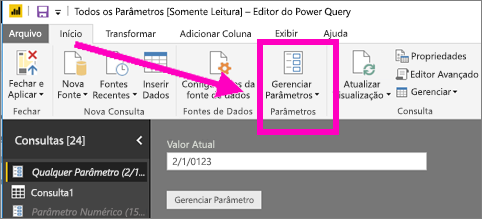
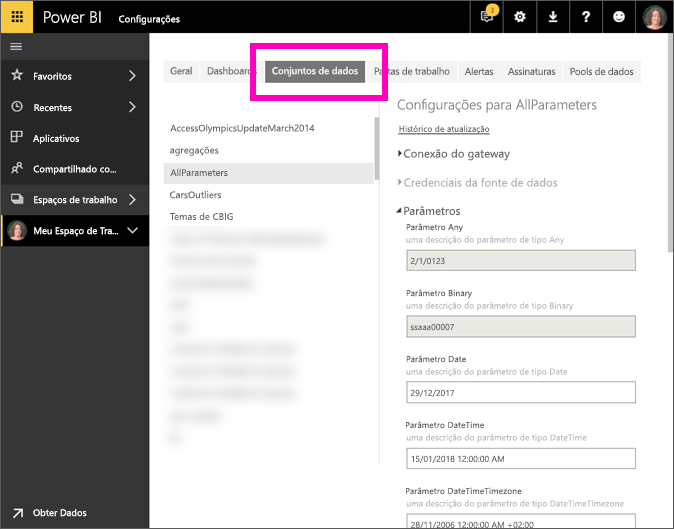

# O que é um parâmetro de consulta?
Os parâmetros de consulta são adicionados no Power BI Desktop por criadores de relatório. Os parâmetros permitem que eles façam que partes dos relatórios dependam de um ou mais *valores* de parâmetro. Por exemplo, um criador de relatórios pode criar um parâmetro que restringe os dados a um único countryregion ou um parâmetro que define os formatos aceitáveis para campos como datas, hora e texto.

## Revisar e editar parâmetros no serviço do Power BI

Assim que os parâmetros são definidos no Desktop, quando o [relatório é publicado no serviço do Power BI](desktop-upload-desktop-files.md), as seleções e as configurações do parâmetro vão junto com o relatório. Algumas configurações de parâmetro podem ser examinadas e editas no serviço do Power BI, não os parâmetros que restringem os dados disponíveis, mas os parâmetros que definem e descrevem os valores aceitáveis.

1. No serviço do Power BI, selecione o ícone de engrenagem  e escolha **Configurações**.

2. Selecione a guia para os **Conjuntos de dados** e destaque um conjunto de dados na lista. 
    
    

3. Expanda **Parâmetros**.  Se o conjunto de dados selecionado não tiver parâmetros, você verá uma mensagem com um link para Saiba mais sobre os parâmetros de consulta. No entanto, se o conjunto de dados tiver parâmetros, expandir **Parâmetros** revelará esses parâmetros. 

    

    Examine as configurações do parâmetro e faça alterações, se necessário. Os campos em cinza não são editáveis. 

## Próximas etapas
Um modo específico para adicionar parâmetros simples é [modificando a URL](service-url-filters.md).