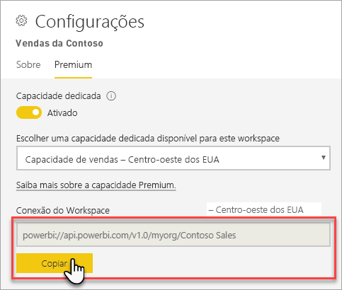
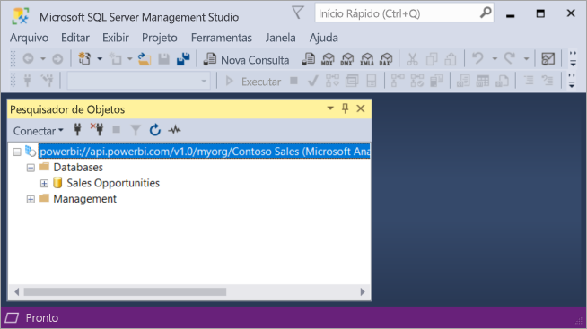

# Conectar-se a conjuntos de dados com aplicativos cliente e ferramentas (visualização)

Suporte de espaços de trabalho e conjuntos de dados Premium de BI do Power *somente leitura* conexões da Microsoft e ferramentas e aplicativos cliente de terceiros. 

> [!NOTE]
> Este artigo destina-se somente para introduzir a conectividade de somente leitura com espaços de trabalho do Power BI Premium e conjuntos de dados. Ele *não é* o objetivo de fornecer informações detalhadas sobre programação, ferramentas específicas e aplicativos, arquitetura e gerenciamento de espaço de trabalho e conjunto de dados. Assuntos descritos aqui exigem uma compreensão sólida de arquitetura de banco de dados de modelo tabular do Analysis Services e administração.

## Protocolo

Power BI Premium usa o [XML for Analysis](https://docs.microsoft.com/bi-reference/xmla/xml-for-analysis-xmla-reference) protocolo XMLA () para comunicações entre aplicativos cliente e o mecanismo que gerencia seus espaços de trabalho e conjuntos de dados. Essas comunicações são o que são normalmente referenciadas como pontos de extremidade do XMLA. O XMLA é o mesmo protocolo de comunicação usado pelo mecanismo do Microsoft Analysis Services, que, nos bastidores, executa o gerenciamento semântico de modelagem, governança, ciclo de vida e dados do Power BI. 

A grande maioria das ferramentas e aplicativos cliente não explicitamente se comunicam com o mecanismo por meio de pontos de extremidade do XMLA. Em vez disso, eles usam bibliotecas de cliente como MSOLAP, ADOMD e AMO como um intermediário entre o aplicativo cliente e o mecanismo, que se comunica exclusivamente usando XMLA.

## Ferramentas com suporte

Essas ferramentas dão suporte a acesso somente leitura aos espaços de trabalho do Power BI Premium e conjuntos de dados:

**SQL Server Management Studio (SSMS)** -TraceEvent, MDX, XMLA e DAX dá suporte a consultas. Requer a versão 18.0. Baixe [aqui](https://docs.microsoft.com/sql/ssms/download-sql-server-management-studio-ssms). 

**SQL Server Profiler** -incluído com o SSMS 18.0 (visualização), essa ferramenta fornece rastreamento e depuração de eventos do servidor. Você pode capturar e salvar dados sobre cada evento em um arquivo ou tabela para análise posterior. Embora oficialmente preterido para o SQL Server, o Profiler continua a ser incluído no SSMS e permanece com suporte para o Analysis Services e agora, o Power BI Premium. Para obter mais informações, consulte [SQL Server Profiler](https://docs.microsoft.com/sql/tools/sql-server-profiler/sql-server-profiler).

**DAX Studio** – código-fonte aberto, a ferramenta da comunidade para executar e analisar DAX consultas no Analysis Services. Requer a versão 2.8.2 ou posterior. Para obter mais informações, consulte [daxstudio.org](https://daxstudio.org/).

**Tabelas dinâmicas do Excel** -Click-to-Run versão do Office 16.0.11326.10000 ou superior é necessária.

**Terceiros** - inclui aplicativos de visualização de dados do cliente e ferramentas que podem se conectar ao, consulta e consuma conjuntos de dados no Power BI Premium. A maioria das ferramentas exigem as versões mais recentes das bibliotecas de cliente MSOLAP, mas alguns podem usar o ADOMD.

## Bibliotecas de cliente

Bibliotecas de cliente são necessárias para ferramentas e aplicativos cliente para se conectar a espaços de trabalho do Power BI Premium. Também há suporte para as mesmas bibliotecas de cliente usadas para se conectar ao Analysis Services no Power BI Premium. Aplicativos cliente da Microsoft, como Excel, SQL Server Management Studio (SSMS) e SQL Server Data Tools (SSDT) instalam todas as três bibliotecas de cliente e atualização-los junto com as atualizações de aplicativo regular. Em alguns casos, especialmente com aplicativos de terceiros e ferramentas, talvez você precise instalar versões mais recentes das bibliotecas de cliente. Bibliotecas de cliente são atualizadas mensalmente. Para obter mais informações, consulte [bibliotecas de cliente para se conectar ao Analysis Services](https://docs.microsoft.com/azure/analysis-services/analysis-services-data-providers).

## Conectar-se a um espaço de trabalho Premium

Você pode se conectar a espaços de trabalho atribuídos a capacidade Premium dedicada. Espaços de trabalho atribuídos a uma capacidade dedicada tem uma cadeia de conexão no formato de URL. 

Para obter a cadeia de caracteres de conexão de área de trabalho no Power BI, no **configurações de espaço de trabalho**, no **Premium** guia **Conexão de área de trabalho**, clique em **copiar**.

Conexões de espaço de trabalho usam o formato de URL a seguir para resolver um espaço de trabalho como se fosse um nome de servidor do Analysis Services:   
`powerbi://api.powerbi.com/v1.0/[tenant name]/[workspace name]` 

Por exemplo, `powerbi://api.powerbi.com/v1.0/contoso.com/Sales Workspace`
> [!NOTE]
> `[workspace name]` é de maiusculas e minúsculas e pode incluir espaços. 

### Para conectar-se no SSMS

Na **conectar ao servidor** > **tipo de servidor**, selecione **Analysis Services**. Na **nome do servidor**, insira a URL. Na **autenticação**, selecione **Active Directory – Universal com suporte MFA**e, em seguida, na **nome de usuário**, insira sua ID de usuário da organização. 

Quando conectado, o espaço de trabalho é mostrado como um servidor do Analysis Services e conjuntos de dados no espaço de trabalho são mostrados como bancos de dados.  

### Catálogo inicial

Algumas ferramentas, como o Profiler do SQL Server, talvez seja necessário especificar uma *Initial Catalog*. Especifica um conjunto de dados (banco de dados) em seu espaço de trabalho. Na **conectar ao servidor**, clique em **opções**. No **conectar ao servidor** caixa de diálogo, na **propriedades de Conexão** guia **conectar-se ao banco de dados**, insira o nome do conjunto de dados.

### Nome do espaço de trabalho duplicado

Ao se conectar a um espaço de trabalho com o mesmo nome que outro espaço de trabalho, você pode receber o seguinte erro: **Não é possível conectar powerbi://api.powerbi.com/v1.0/ [nome do locatário] / [nome do espaço de trabalho].**

Para solucionar esse erro, além do nome de espaço de trabalho, especifique o ObjectIDGuid, que pode ser copiado do objectID do espaço de trabalho na URL. Acrescente a ID de objeto para a URL de conexão. Por exemplo, 'powerbi://api.powerbi.com/v1.0/myorg/Contoso vendas - 9d83d204-82a9-4b36-98f2-a40099093830'

### Nome do conjunto de dados duplicado

Ao se conectar a um conjunto de dados com o mesmo nome que outro conjunto de dados no mesmo espaço de trabalho, acrescente o guid do conjunto de dados para o nome do conjunto de dados. Você pode obter o nome do conjunto de dados *e* guid quando conectado ao espaço de trabalho no SSMS. 

### Atraso em conjuntos de dados mostrados

Ao se conectar a um espaço de trabalho, alterações de conjuntos de dados novos, excluídos e renomeados podem levar até 5 minutos para aparecer. 

### Conjuntos de dados sem suporte

Os seguintes conjuntos de dados não são acessíveis por meio de pontos de extremidade do XMLA. Esses conjuntos de dados *não* aparecem sob o espaço de trabalho no SSMS ou em outras ferramentas: 

- Conjuntos de dados com uma conexão ao vivo para um modelos do Analysis Services. 
- Conjuntos de dados com dados por Push usando a API REST.
- Conjuntos de dados de pasta de trabalho do Excel. 

Não há suporte para os seguintes conjuntos de dados no serviço do Power BI:   

- Conjuntos de dados com uma conexão ao vivo para um conjunto de dados do Power BI.

## Logs de auditoria 

Quando as ferramentas e aplicativos cliente se conectar a um espaço de trabalho, o acesso por meio de pontos de extremidade XMLA é registrado nos logs de auditoria do Power BI sob a **GetWorkspaces** operação. Para obter mais informações, consulte [auditoria do Power BI](service-admin-auditing.md).

## Consulte também

[Referências do Analysis Services](https://docs.microsoft.com/bi-reference/#pivot=home&panel=home-all)   
[SQL Server Management Studio](https://docs.microsoft.com/sql/ssms/sql-server-management-studio-ssms)   
[Protocolo Tabular do SQL Server Analysis Services](https://docs.microsoft.com/openspecs/sql_server_protocols/ms-ssas-t/b98ed40e-c27a-4988-ab2d-c9c904fe13cf)   
[Exibições de gerenciamento dinâmico (DMVs)](https://docs.microsoft.com/sql/analysis-services/instances/use-dynamic-management-views-dmvs-to-monitor-analysis-services)   

Mais perguntas? [Experimente perguntar à Comunidade do Power BI](https://community.powerbi.com/)
