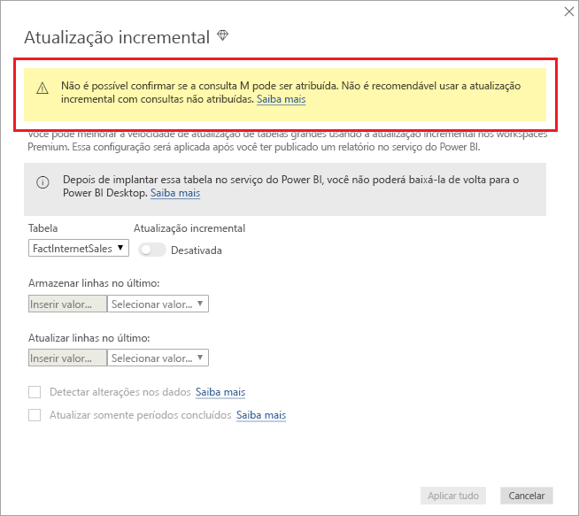

# <a name="incremental-refresh-in-power-bi-premium"></a>Atualização incremental no Power BI Premium

A atualização incremental permite conjuntos de dados muito grandes no serviço do Power BI Premium com os seguintes benefícios:

- **As atualizações são mais rápidas** – somente os dados alterados precisam ser atualizados. Por exemplo, a atualização somente dos últimos cinco dias de um conjunto de dados de dez anos.

- **As atualizações são mais confiáveis** – não é mais necessário manter conexões longas com sistemas de origem voláteis.

- **O consumo de recursos é reduzido** – um número menor de dados para atualização reduz o consumo geral da memória e de outros recursos.

## <a name="configure-incremental-refresh"></a>Configurar a atualização incremental

As políticas de atualização incremental são definidas no Power BI Desktop e aplicadas quando publicadas no serviço do Power BI.

Para começar, habilite a atualização incremental em **Versão prévia dos recursos**.


### <a name="filter-large-datasets-in-power-bi-desktop"></a>Filtrar conjuntos de dados grandes no Power BI Desktop

Os conjuntos de dados grandes, com potencialmente bilhões de linhas, podem não caber em um modelo do Power BI Desktop porque o arquivo PBIX é limitado pelos recursos da memória disponíveis no computador desktop. Portanto, esses conjuntos de dados normalmente são filtrados após a importação. Esse tipo de filtragem é aplicável se a atualização incremental é usada ou não. Para a atualização incremental, realize a filtragem usando parâmetros de data/hora do Power Query.

#### <a name="rangestart-and-rangeend-parameters"></a>Parâmetros RangeStart e RangeEnd

Para a atualização incremental, os conjuntos de dados são filtrados usando parâmetros de data/hora do Power Query com os nomes reservados que diferenciam maiúsculas de minúsculas **RangeStart** e **RangeEnd**. Esses parâmetros são usados para filtrar os dados importados para o Power BI Desktop e também para particionar dinamicamente os dados em intervalos, depois de publicados no serviço do Power BI. Os valores de parâmetro são substituídos pelo serviço para filtragem de cada partição. Depois de publicado, os valores de parâmetro serão substituídos automaticamente pelo serviço do Power BI. Não é necessário defini-los nas configurações do conjunto de dados no serviço. Depois de publicado, os valores de parâmetro serão substituídos automaticamente pelo serviço do Power BI. 

Para definir os parâmetros com valores padrão, no Editor do Power Query, selecione **Gerenciar Parâmetros**.


Com os parâmetros definidos, em seguida, você poderá aplicar o filtro selecionando a opção de menu **Filtro Personalizado** para uma coluna.


Verifique se as linhas são filtradas com o valor da coluna *após ou igual a* **RangeStart** e *antes de* **RangeEnd**.


> [!TIP]
> Embora o tipo de dados dos parâmetros precise ser data/hora, é possível convertê-los para que correspondam aos requisitos da fonte de dados. Por exemplo, a função do Power Query a seguir converte um valor de data/hora para se parecer com uma chave alternativa de inteiro no formato *aaaammdd*, que é comum para data warehouses. A função pode ser chamada pela etapa de filtro.
>
> `(x as datetime) => Date.Year(x)*10000 + Date.Month(x)*100 + Date.Day(x)`

Selecione **Fechar e Aplicar** no Editor Power Query. Um subconjunto do conjunto de dados estará presente no Power BI Desktop.

#### <a name="filter-date-column-updates"></a>Filtrar as atualizações da coluna de data

O filtro na coluna de data é usado para particionar dinamicamente os dados em intervalos no serviço do Power BI. A atualização incremental não foi projetada para dar suporte a casos em que a coluna de data filtrada é atualizada no sistema de origem. Uma atualização é interpretada como uma inserção e uma exclusão, não como uma atualização real. Se a exclusão ocorrer no intervalo histórico e não no intervalo incremental, não será selecionada. Isso pode causar falhas de atualização de dados devido a conflitos de chave de partição.

#### <a name="query-folding"></a>Partição de consulta

É importante que os filtros de partição sejam enviados por push para o sistema de origem quando as consultas forem enviadas para operações de atualização. A aplicação da filtragem significa que a fonte de dados deve dar suporte à partição de consulta. A maioria das fontes de dados compatíveis com consultas SQL é compatível com a partição de consulta. No entanto, isso geralmente não ocorre com fontes de dados como arquivos simples, blobs, Web e feeds OData. Nos casos em que o filtro não é compatível com o back-end da fonte de dados, ele não pode ser aplicado. Nesses casos, o mecanismo de mashup compensa e aplica o filtro localmente, o que pode exigir a recuperação do conjunto de dados completo da fonte de dados. Isso pode fazer com que a atualização incremental seja muito lenta e o processo pode ficar sem recursos no serviço do Power BI ou no gateway de dados local se usado.

Considerando os vários níveis de suporte da partição de consulta para cada fonte de dados, é recomendável realizar a verificação para garantir que a lógica do filtro seja incluída nas consultas de origem. Para facilitar essa tarefa, o Power BI Desktop tenta realizar essa verificação para você. Se não for possível realizar a verificação, um aviso será exibido na caixa de diálogo da atualização incremental ao definir a política de atualização incremental. Fontes de dados baseadas em SQL, como Oracle e Teradata, podem depender desse aviso. Outras fontes de dados talvez não consigam realizar a verificação sem o rastreamento de consultas. Se não for possível que o Power BI Desktop confirme isso, o aviso a seguir será exibido.

 

### <a name="define-the-refresh-policy"></a>Definir a política de atualização

A atualização incremental está disponível no menu de contexto das tabelas, exceto para modelos de conexão dinâmica.


#### <a name="incremental-refresh-dialog"></a>Caixa de diálogo de atualização incremental

A caixa de diálogo de atualização incremental é exibida. Use o botão de alternância para habilitar a caixa de diálogo.


> [!NOTE]
> Se a expressão do Power Query para a tabela não se referir aos parâmetros com nomes reservados, o botão de alternância estará desabilitado.

O texto do cabeçalho explica o seguinte:

- A atualização incremental só é compatível com workspaces nas capacidades Premium. As políticas de atualização são definidas no Power BI Desktop e são aplicadas por operações de atualização no serviço.

- Se você puder baixar o arquivo PBIX que contém uma política de atualização incremental no serviço do Power BI, ele não poderá ser aberto no Power BI Desktop. Embora isso possa ter suporte no futuro, tenha em mente que esses conjuntos de dados podem ficar tão grandes a ponto de não poderem ser baixados e abertos em um computador desktop comum.

#### <a name="refresh-ranges"></a>Intervalos de atualização

O exemplo a seguir define uma política de atualização para armazenar dados por cinco anos civis completos, mais os dados para o ano atual até a data atual, e atualizar de forma incremental dez dias de dados. A primeira operação de atualização carrega os dados históricos. As atualizações seguintes são incrementais e (se agendadas para serem executadas diariamente) realizam as seguintes operações:

- Adicione um novo dia de dados.

- Atualizar dez dias até a data atual.

- Remover os anos civis com mais de cinco anos antes da data atual. Por exemplo, se a data atual for 1º de janeiro de 2019, o ano de 2013 será removido.

A primeira atualização no serviço do Power BI pode demorar mais para importar todos os cinco anos civis. As próximas atualizações podem ser concluídas em uma fração desse tempo.


> [!NOTE]
> Talvez você precise apenas da definição desses intervalos e, nesse caso, poderá ir diretamente para a etapa de publicação abaixo. As listas suspensas adicionais destinam-se aos recursos avançados.

### <a name="advanced-policy-options"></a>Opções avançadas de política

#### <a name="detect-data-changes"></a>Detectar alterações nos dados

A atualização incremental de dez dias é muito mais eficiente do que a atualização completa de cinco anos. No entanto, é possível obter um resultado ainda melhor. Se você marcar a caixa de seleção **Detectar alterações nos dados**, será possível selecionar uma coluna de data/hora usada para identificar e atualizar somente os dias em que os dados foram alterados. Isso pressupõe que uma coluna dessa exista no sistema de origem, normalmente para fins de auditoria. **Essa não deve ser a mesma coluna usada para particionar os dados com os parâmetros RangeStart/RangeEnd.** O valor máximo dessa coluna é avaliado para cada um dos períodos no intervalo incremental. Se ele não foi alterado desde a última atualização, não é necessário atualizar o período. No exemplo, isso pode reduzir ainda mais os dias atualizados de forma incremental de dez para cerca de dois.


> [!TIP]
> O projeto atual requer que a coluna que detecta alterações nos dados seja persistente e fique armazenada em cache na memória. É interessante considerar uma das técnicas a seguir para reduzir a cardinalidade e o consumo de memória.
>
> Persista apenas o valor máximo dessa coluna no momento da atualização, talvez usando uma função do Power Query.
>
> Reduza a precisão a um nível aceitável considerando seus requisitos de frequência de atualização.
>
> Estamos planejando permitir a definição de consultas personalizadas para detecção de alteração nos dados em uma data futura. Essa opção poderá ser usada para evitar que o valor da coluna persista completamente.

#### <a name="only-refresh-complete-periods"></a>Atualizar somente períodos concluídos

Digamos que sua atualização esteja agendada para ser executada às 4h, todas as manhãs. Se os dados aparecerem no sistema de origem durante essas 4 horas, não será necessário considerá-los. Algumas métricas de negócios, como barris por dia no setor de petróleo e gás, não fazem sentido com partes de dias.

Outro exemplo é a atualização de dados de um sistema financeiro no qual os dados do mês anterior são aprovados no dia 12 do mês. Você pode definir o intervalo incremental para um mês e agendar a atualização para ser executada no dia 12 do mês. Com essa opção marcada, os dados de janeiro seriam atualizados em 12 de fevereiro.


> [!NOTE]
> As operações de atualização no serviço são executadas em hora UTC. Assim, é possível determinar a data de efetivação e afetar períodos concluídos. Estamos planejando adicionar a capacidade de substituir a data de efetivação de uma operação de atualização.

## <a name="publish-to-the-service"></a>Publicar no serviço

Como a atualização incremental é um recurso somente Premium, a caixa de diálogo Publicar apenas permite a seleção de um workspace na capacidade Premium.


Agora você pode atualizar o modelo. A primeira atualização pode demorar mais para importar os dados históricos. As próximas atualizações poderão ser muito mais rápidas porque elas usarão a atualização incremental.

## <a name="query-timeouts"></a>Tempos limite de consulta

O artigo [Solucionando problemas de atualização](https://docs.microsoft.com/power-bi/refresh-troubleshooting-refresh-scenarios) explica que as operações de atualização no serviço do Power BI estão sujeitas a tempos limite. As consultas também podem ser limitadas pelo tempo limite padrão da fonte de dados. A maioria das fontes relacionais permitem a substituição de tempos limite na expressão M. Por exemplo, a expressão abaixo usa a [função de acesso a dados do SQL Server](https://msdn.microsoft.com/query-bi/m/sql-database) para defini-lo para 2 horas. Cada período definido pelos intervalos de política envia uma consulta observando a configuração de tempo limite do comando.

```
let
    Source = Sql.Database("myserver.database.windows.net", "AdventureWorks", [CommandTimeout=#duration(0, 2, 0, 0)]),
    dbo_Fact = Source{[Schema="dbo",Item="FactInternetSales"]}[Data],
    #"Filtered Rows" = Table.SelectRows(dbo_Fact, each [OrderDate] >= RangeStart and [OrderDate] < RangeEnd)
in
    #"Filtered Rows"
```
