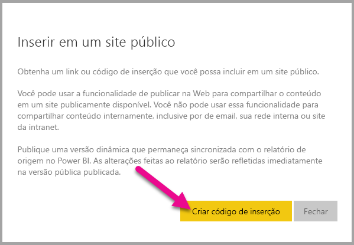
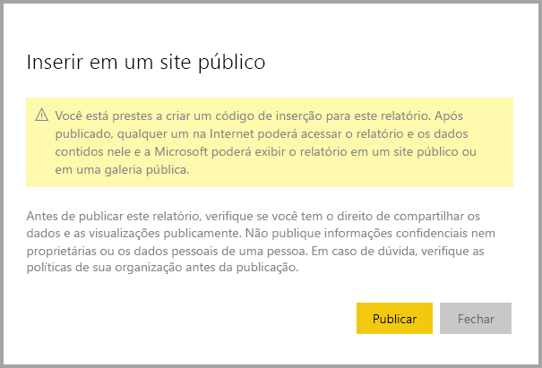

# Publicar na Web por meio do Power BI

Com o Power BI **publicar na web** opção, você pode inserir facilmente visualizações interativas do Power BI online, como em postagens no blog, sites, por meio de emails ou mídia social, de qualquer dispositivo. Também é possível editar, atualizar ou descompartilhar com facilidade os visuais publicados.

> [!WARNING]
> Quando você usa **publicar na web**, qualquer pessoa na Internet pode exibir o relatório publicado ou o visual. Isso não necessita de autenticação e inclui exibir dados de nível de detalhe seus relatórios agregados. Antes de publicar um relatório, verifique se que ele está okey para você compartilhar os dados e as visualizações publicamente. Não publique informações confidenciais nem proprietárias. Em caso de dúvida, verifique as políticas de sua organização antes da publicação.

>[!Note]
>Para inserir seu conteúdo com segurança em um portal ou site interno, use as opções [Inserir](service-embed-secure.md) ou [Inserir no SharePoint Online](service-embed-report-spo.md). Isso garante que todas as permissões e segurança de dados sejam aplicadas quando seus usuários estiverem exibindo seus dados internos.

## Como usar o recurso Publicar na Web

**Publicar na web** está disponível para relatórios em seus espaços de trabalho pessoais ou de grupo que você pode editar.  Ele não está disponível para relatórios compartilhados com você, ou aqueles em segurança em nível de linha de terceira parte confiável para proteger os dados. Consulte a [ **limitações** ](#limitations) seção abaixo para obter uma lista completa de casos em que **publicar na web** não tem suporte. Examine os **aviso** anteriormente neste artigo antes de usar **publicar na web**.

O seguinte *breve vídeo* mostra como esse recurso funciona. Em seguida, experimente você mesmo as etapas a seguir.

<iframe width="560" height="315" src="https://www.youtube.com/embed/UF9QtqE7s4Y" frameborder="0" allowfullscreen></iframe>

As etapas a seguir descrevem como usar o recurso **Publicar na Web**.

1. Abra um relatório no espaço de trabalho que você pode editar e selecione **arquivo > Publicar na web**.

   

2. Examine o conteúdo e selecione a caixa de diálogo **criar código de inserção**.

   

3. Leia o aviso, conforme mostrado aqui e confirme que os dados são okey inserir em um site público. Se estiver, selecione **publicar**.

   

4. Uma caixa de diálogo é exibida com um link. Você pode enviar este link por email, inseri-lo em código como um iFrame ou colá-lo diretamente em uma página da web ou o blog.

   

5. Se você criou anteriormente um código de inserção para um relatório e selecionar **publicar na web**, você não verá as caixas de diálogo nas etapas 2 a 4. Em vez disso, o **código de inserção** caixa de diálogo aparece:

   

   Você pode criar apenas um código de inserção para cada relatório.

## Dicas e truques para modos de exibição

Quando você insere o conteúdo dentro de uma postagem de blog, você normalmente precisará ajustá-lo em um tamanho de tela específica.  Você pode ajustar a altura e a largura na marca iFrame, conforme necessário. No entanto, você precisa garantir que seu relatório se ajuste na área determinada do iFrame, portanto, você também precisa definir um modo de exibição apropriado ao editar o relatório.

A tabela a seguir fornece diretrizes sobre o Modo de Exibição e como ele aparecerá quando for inserido.

| Modo de Exibição | Sua aparência quando inserido |
| --- | --- |
|  |**Ajustar à página** respeitará a altura da página e a largura de seu relatório. Se você definir sua página como taxas 'Dynamic' como 16:9 ou 4:3, seu conteúdo será ajustado para caber no iFrame. Quando inserido em um iFrame, o uso **ajustar à página** pode resultar em **letterboxing**, em que um plano de fundo cinza é mostrado nas áreas do iFrame depois do conteúdo ajustado para caber no iFrame. Para minimizar a aplicação do formato letterbox, defina altura e a largura do iFrame adequadamente. |
|  |**Tamanho real** garante que o relatório preserve seu tamanho, conforme definido na página do relatório. Isso pode resultar em barras de rolagem apareçam em seu iFrame. Defina a altura do iFrame e largura para evitar as barras de rolagem. |
|  |**Ajustar à largura** garante que o conteúdo se ajusta na área de horizontal do iFrame. Uma borda ainda é mostrada, mas o conteúdo é dimensionado para usar todo o espaço horizontal disponível. |

## Dicas e truques para a altura e largura do iFrame

Um **publicar na web** incorporar o código a seguinte aparência:

 
Você pode editar a largura e altura manualmente para garantir que ele é exatamente como você deseja que ele se ajuste a página em que você está inserindo.

Para obter um ajuste ideal, tente adicionar 56 pixels à altura do iFrame para acomodar o tamanho atual da barra de ferramentas inferior. Se sua página de relatório usar o tamanho Dinâmico, a tabela abaixo fornecerá alguns tamanhos que podem ser usados para obter um ajuste sem a aplicação do formato letterbox.

| Taxa | Tamanho | Dimensões (Largura x Altura) |
| --- | --- | --- |
| 16:9 |Pequeno |640 x 416 px |
| 16:9 |Médio |800 x 506 px |
| 16:9 |Grande |960 x 596 px |
| 4:3 |Pequeno |640 x 536 px |
| 4:3 |Médio |800 x 656 px |
| 4:3 |Grande |960 x 776 px |

## Gerenciar códigos de inserção

Depois de criar uma **publicar na web** inserir o código, você pode gerenciar seus códigos da **configurações** menu no Power BI. Gerenciar códigos de inserção inclui a capacidade de remover o destino visual ou relatório de código (tornando o código de inserção inutilizável), ou obter o código de inserção.

1. Para gerenciar seus códigos de inserção de **Publicar na Web** , abra a engrenagem **Configurações** e selecione **Gerenciar códigos de inserção**.

   

2. Os códigos de inserção é exibida.

   

3. Você pode recuperar ou excluir um código de inserção. Excluí-lo desabilita todos os links para o relatório ou visualização.

   

4. Se você selecionar **excluir**, é solicitado que uma confirmação.

   

## Atualizações em relatórios e atualização de dados

Depois de criar sua **publicar na web** código de inserção e compartilhamento, o relatório é atualizada com todas as alterações feitas e o link do código de inserção fica imediatamente ativo e qualquer pessoa que abrir o link pode exibi-lo. Depois dessa ação inicial, no entanto, as atualizações em relatórios ou visuais podem levar aproximadamente uma hora antes de se tornar visível para os usuários. Se você precisar que as atualizações sejam disponibilizadas imediatamente, poderá excluir o código de inserção e criar um novo. Para obter mais informações, consulte o [ **como ele funciona** ](#howitworks) seção mais adiante neste artigo. 

## Atualização de dados

As atualizações de dados são refletidas automaticamente no relatório ou visual inserido. Pode levar aproximadamente uma hora para que os dados atualizados estejam visíveis nos códigos de inserção. Para desabilitar a atualização automática, você pode selecionar **não são atualizadas** no agendamento do conjunto de dados que usa o relatório.  

## Visuais personalizados

Há suporte para visuais personalizados no recurso **Publicar na Web**. Quando você usa **publicar na web**, os usuários com quem você compartilha seu visual publicado não precisam habilitar visuais personalizados exibir o relatório.

## Limitações

**Publicar na web** há suporte para a grande maioria dos dados de fontes e os relatórios no serviço do Power BI, no entanto, a seguir estão **não atualmente com suporte ou disponíveis** com **publicar na web** :

- Relatórios que usam a segurança em nível de linha.
- Relatórios que usam qualquer fonte de dados de Conexão Dinâmica, incluindo Tabulares do Analysis Services hospedados localmente no Analysis Service Multidimensional e o Azure Analysis Services.
- Relatórios compartilhados com você diretamente ou por meio de um pacote de conteúdo organizacional.
- Relatórios em um grupo no qual você não é um membro de edição.
- "R" visuais atualmente não têm suporte no **publicar na web** relatórios.
- Exportar dados de visuais em um relatório, que foi publicado na Web.
- ArcGIS Maps for Power BI visuais.
- Relatórios que contêm medidas DAX de nível de relatório.
- Modelos de consulta de dados de logon único.
- [Proteger informações confidenciais ou proprietárias](#publish-to-web-from-power-bi).
- O recurso de autenticação automática fornecido com a opção **Inserir** não funciona com a API JavaScript do Power BI. Para a API JavaScript do Power BI, use a abordagem [o usuário possui dados](developer/embed-sample-for-your-organization.md) para inserção. Saiba mais sobre a abordagem [o usuário possui dados](developer/embed-sample-for-your-organization.md).

## Configuração de locatário

Os administradores do Power BI podem habilitar ou desabilitar a **publicar na web** recurso. Eles também podem restringir o acesso a grupos específicos, que podem afetar sua capacidade de criar um código de inserção.

|Recurso |Habilitado para toda a organização |Desabilitado para toda a organização |Grupos de segurança específicos   |
|---------|---------|---------|---------|
|**Publicar na web** sob do relatório **arquivo** menu|Habilitado para todos|Não visível para todos|Visível somente para usuários ou grupos autorizados.|
|**Gerenciar códigos de inserção** em **Configurações**|Habilitado para todos|Habilitado para todos|Ativado para todos.  Opção * **Excluir** somente para usuários ou grupos autorizados. * **Obter códigos** habilitados para todos.|
|**Códigos de inserção** no portal de administração|O status refletirá o seguinte: * Ativo * Sem suporte * Bloqueado|O status exibirá **Desabilitado**|O status refletirá o seguinte: * Ativo * Sem suporte * Bloqueado  Se um usuário não estiver autorizado conforme a configuração do locatário, o status exibirá **violado**.|
|Relatórios publicados existentes|Tudo habilitado|Tudo desabilitado|Os relatórios continuam a ser renderizados para todos.|

## Noções básicas sobre a coluna de status do código de inserção

O **gerenciar códigos de inserção** página inclui uma coluna de status. Por padrão, códigos de inserção são **Active**, mas também pode ser um dos status listados abaixo.

| Status | Descrição |
| --- | --- |
| **Ativo** |O relatório está disponível para que os usuários da Internet o vejam e interajam com ele. |
| **Bloqueado** |O conteúdo do relatório viola os [termos de serviço do Power BI](https://powerbi.microsoft.com/terms-of-service). Microsoft bloqueou a ele. Entre em contato com o suporte se acreditar que o conteúdo foi bloqueado por engano. |
| **Sem suporte** |O conjunto de dados do relatório está usando a segurança em nível de linha ou outra configuração sem suporte. Consulte a [ **limitações** ](#limitations) seção para obter uma lista completa. |
| **Violado** |O código de inserção está fora de política de locatário definida. Isso normalmente ocorre quando um código de inserção foi criado e, em seguida, o **publicar na web** configuração de locatário foi alterado para excluir o usuário que possui o código de inserção. Se a configuração de locatário está desabilitado ou o usuário não tem permissão para criar códigos de inserção, mostrar os códigos de inserção existentes uma **violado** status. |

## Como relatar um problema com o conteúdo de Publicar na Web

Para relatar um problema relacionado ao **publicar na web** conteúdo inserido em um site ou blog, use o **sinalizador** ícone na barra inferior, conforme mostrado na imagem a seguir. Você será solicitado a enviar um email à Microsoft explicando sua preocupação. Microsoft avaliará o conteúdo com base nos termos de serviço do Power BI e tomar as devidas providências.

Para relatar um problema, selecione a **sinalizador** ícone na barra inferior do **publicar na web** você ver de relatório.

## Licenciamento e preços

Você precisa ser um usuário do Microsoft Power BI para usar o recurso **Publicar na Web**. Visualizadores do relatório não precisará ser usuários do Power BI.

## Como isso funciona (detalhes técnicos)

Quando você cria um código de inserção usando **publicar na web**, o relatório fica visível para os usuários da Internet. Ele está disponível publicamente, então você pode esperar visualizadores e compartilhar facilmente o relatório por meio de mídia social no futuro. Conforme os usuários exibem o relatório, abrindo a URL pública direta ou exibindo-o inserido em uma página da Web ou em um blog, o Power BI armazena em cache a definição do relatório e os resultados das consultas necessárias para exibi-lo. Isso garante que milhares de usuários simultâneos podem exibir o relatório sem afetar o desempenho.

O cache é duradouro; portanto, se você atualizar a definição de relatório (por exemplo, se você alterar seu modo de exibição) ou atualizar os dados de relatório, pode levar aproximadamente uma hora antes das alterações são refletidas na versão do relatório que exibir seus usuários. Portanto, é recomendável que você teste seu trabalho antecipadamente e crie o código de inserção de **Publicar na Web** somente quando estiver satisfeito com as configurações.

## Próximas etapas

- [Web part do relatório do SharePoint Online](service-embed-report-spo.md) 

- [Inserir o relatório em um site ou portal seguro](service-embed-secure.md)

Mais perguntas? [Experimente a Comunidade do Power BI](http://community.powerbi.com/)
