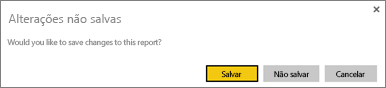
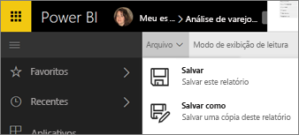
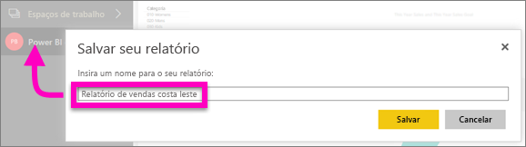

# Salvar um relatório no serviço do Power BI e no Power BI Desktop
Depois de fazer alterações em um relatório no Power BI, você poderá salvá-lo, salvá-lo com um novo nome ou apenas fechá-lo sem salvar as alterações. Digamos que você abra o relatório, cria uma visualização e fixa-o em seu painel. Se você fechá-lo agora sem salvar as alterações, o bloco permanece no painel, mas a visualização não será salva no relatório. Ao clicar nesse bloco no painel, o relatório é aberto, mas a visualização não existe mais no relatório.

> [!TIP]
> Preste atenção a qual workspace está ativo para que você possa encontrar o relatório salvo. O relatório é salvo no workspace ativo.
> 
> 

### Para salvar um relatório:
1. Se você tentar sair de um relatório e esse relatório tiver alterações, o Power BI exibirá um aviso.
   
   
2. Outra maneira de salvar o relatório é selecionar **ARQUIVO** \> **Salvar** ou **Salvar Como**. Se você estiver no [Modo de exibição de leitura](consumer/end-user-reading-view.md) você verá somente a opção Salvar Como. 
   
   
3. Se esse for um novo relatório (Salvar) ou uma nova versão de um relatório existente (Salvar como), dê a ele um nome descritivo.  **O relatório será adicionado ao workspace ativo**.
   
    

### Próximas etapas
Leia mais sobre [relatórios no Power BI](consumer/end-user-reports.md)

[Conceitos básicos para designers no serviço do Power BI](service-basic-concepts.md)

Mais perguntas? [Experimente a Comunidade do Power BI](http://community.powerbi.com/)

