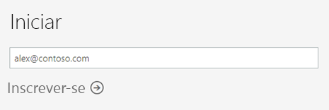
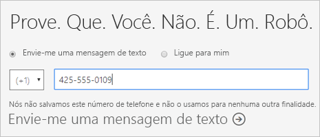
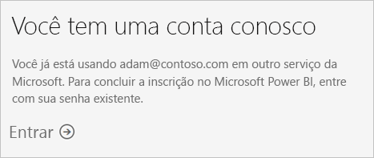
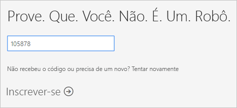
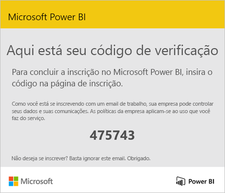
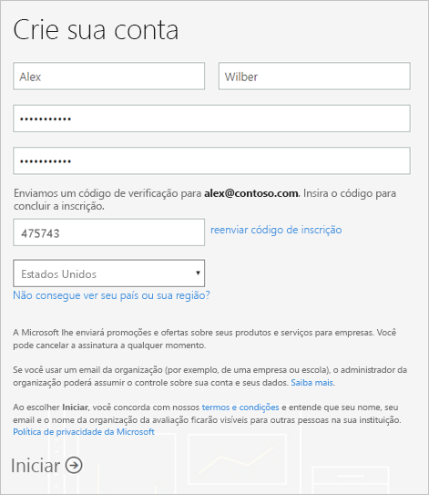
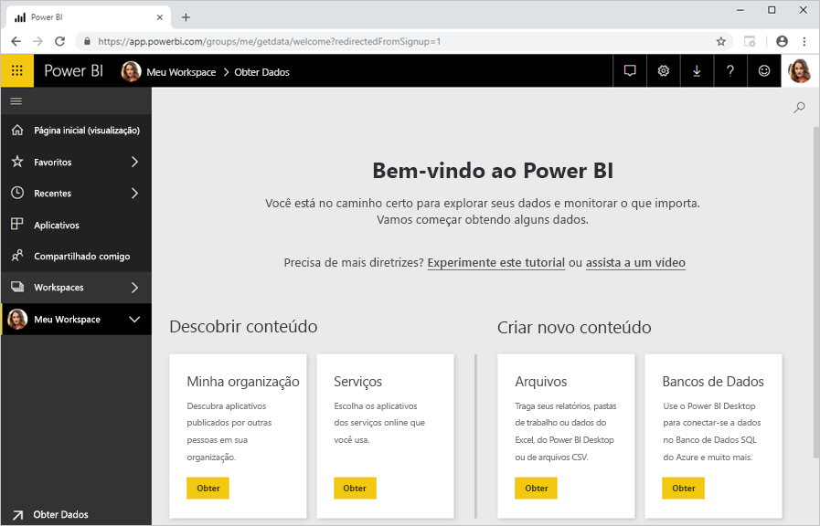

# Inscrever-se no Power BI como indivíduo

O Power BI pode ser sua ferramenta pessoal de relatório e visualização, além de poder servir como o mecanismo de decisões e análise por trás de projetos de grupo, divisões ou empresas inteiras. Este artigo explica como se inscrever para uma avaliação do Power BI Pro como indivíduo. Se você for um administrador do Power BI, consulte [licenciamento do Power BI em sua organização](service-admin-licensing-organization.md).

## Endereços de email compatíveis

Antes de iniciar o processo de inscrição, é importante saber quais tipos de endereços de email que você pode usar no Power BI:

* O Power BI exige que você use um endereço de email corporativo ou escolar para se inscrever. Você não pode se inscrever usando endereços de email fornecidos por provedores de telecomunicação ou de serviços de email do consumidor. Isso inclui outlook.com, hotmail.com, gmail.com e outros.

* Após se inscrever, você pode [convidar usuários convidados](https://docs.microsoft.com/azure/active-directory/active-directory-b2b-what-is-azure-ad-b2b) para ver o conteúdo do Power BI com qualquer endereço de email, incluindo contas pessoais.

* Você pode se inscrever no Power BI com endereços .gov ou .mil, mas isso requer um processo diferente. Para obter mais informações, consulte [registrar sua organização do governo dos EUA no serviço do Power BI](service-govus-signup.md).

## Inscrever-se para uma avaliação

Siga estas etapas para se inscrever para uma avaliação do Power BI Pro. Consulte a próxima seção, [expiração da avaliação](#trial-expiration), para saber mais sobre as opções têm quando esta avaliação expira.

1. Vá para o [página de inscrição](https://signup.microsoft.com/signup?sku=a403ebcc-fae0-4ca2-8c8c-7a907fd6c235) no Power BI.

1. Insira seu endereço de email e selecione **Inscrever-se**.

    

1. Se você receber uma mensagem como esta, escolha uma opção para receber um código de verificação e, em seguida, continue para a próxima etapa neste procedimento.

    

    Se você receber uma mensagem como esta, conclua as etapas para entrar e usar o Power BI.

    

1. Insira o código que você recebeu e selecione **Inscrever-se**.

    

1. Verifique seu email para uma mensagem como esta.

    

1. Na próxima tela, insira suas informações e o código de verificação do email. Selecione uma região, examine as políticas vinculadas desta tela e, em seguida, selecionem **Iniciar**.

    

1. Em seguida, você é levado para [na página de entrada do Power BI](https://powerbi.microsoft.com/landing/signin/), e você pode começar a usar o Power BI.

    

## Término da avaliação

Quando a avaliação do Power BI Pro expirar, as alterações de licença para uma licença do Power BI (gratuita). Quando isso acontecer, você não tem acesso a recursos que exigem uma licença do Power BI Pro. Para obter mais informações, veja [Recursos por tipo de licença](service-features-license-type.md).

Se uma licença do Power BI (gratuita) for suficiente, você não precisa fazer mais nada. Para tirar proveito dos recursos do Power BI Pro, entre em contato com seu administrador de TI sobre como adquirir uma licença do Power BI Pro.

## Solução de problemas do processo de inscrição

Na maioria dos casos, você pode se inscrever para o Power BI seguindo o processo descrito. Alguns dos problemas que podem impedir que você se inscrever são descritos na tabela a seguir, com possíveis soluções alternativas.

| Sintoma / mensagem de erro | Causa e solução |
| ----------------------- | -------------------- |
| <strong>Endereços de email pessoais (por exemplo nancy@gmail.com)</strong> você receberá uma mensagem semelhante a esta durante a inscrição:    *Você inseriu um endereço de email pessoal: Digite seu endereço de email comercial para que possamos armazenar os dados da sua empresa de forma segura.*    ou    *Isso se parece com um endereço de email pessoal. Digite seu endereço de trabalho para que possa se conectar com outras pessoas em sua empresa. Não se preocupe. Não compartilhamos seu endereço com ninguém.* | Power BI não dá suporte a endereços de email fornecidos por provedores de serviços ou telecomunicações de email do consumidor.    Para concluir a inscrição, tente novamente usando um endereço de email atribuído pelo seu trabalho ou escola.    Se você ainda não conseguiu se inscrever e desejar concluir um processo de configuração mais avançado, é possível [registrar-se para obter uma nova assinatura de avaliação do Office 365 e usar esse endereço de email para se inscrever](service-admin-signing-up-for-power-bi-with-a-new-office-365-trial.md).    Também é possível que um usuário existente [convide-o como um convidado](service-admin-azure-ad-b2b.md). |
| **Inscrição por autoatendimento desabilitada**: Você receberá uma mensagem como esta durante a inscrição:    *Não podemos concluir sua inscrição. O departamento de TI desativou a inscrição para o Microsoft Power BI. Entre em contato com eles para concluir a inscrição.*    ou    *Isso se parece com um endereço de email pessoal. Digite seu endereço de trabalho para que possa se conectar com outras pessoas em sua empresa. Não se preocupe. Não compartilhamos seu endereço com ninguém.* | Sua organização administrador de TI desabilitou a inscrição por autoatendimento para Power BI.    Para concluir a inscrição, entre em contato com seu administrador de TI e peça para ele [siga as instruções para habilitar a inscrição](service-admin-licensing-organization.md#enable-or-disable-individual-user-sign-up-in-azure-active-directory).    Você também poderá ter esse problema se tiver se [inscrito no Office 365 por meio de um parceiro](service-admin-syndication-partner.md). |
| **Endereço de email não é uma ID do Office 365** você receberá uma mensagem como esta durante a inscrição:    *Não foi possível encontrá-lo em contoso.com.  Você usa uma ID diferente no trabalho ou escola?    Tente entrar com essa ID, e se não funcionar, entre em contato com o departamento de TI.* | Sua organização usa IDs para entrar no Office 365 e em outros serviços da Microsoft que são diferentes de seu endereço de email.  Por exemplo, seu endereço de email pode ser Nancy.Smith@contoso.com mas sua ID é nancys@contoso.com.    Para concluir a inscrição, use a ID de sua organização atribuiu a você para entrar no Office 365 ou outros serviços da Microsoft.  Se você não souber o que é isso, entre em contato com seu administrador de TI.    Se você ainda não conseguiu se inscrever e desejar concluir um processo de configuração mais avançado, é possível [registrar-se para obter uma nova assinatura de avaliação do Office 365 e usar esse endereço de email para se inscrever](service-admin-signing-up-for-power-bi-with-a-new-office-365-trial.md). |

## Próximas etapas

[Compra do Power BI Pro](service-admin-purchasing-power-bi-pro.md)  
[Contrato de Serviço do Power BI para usuários individuais](https://powerbi.microsoft.com/terms-of-service/)  

Mais perguntas? [Experimente perguntar à Comunidade do Power BI](http://community.powerbi.com/)