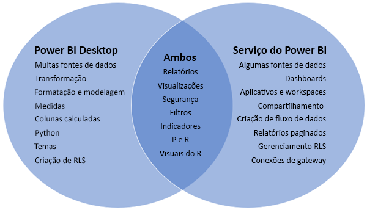
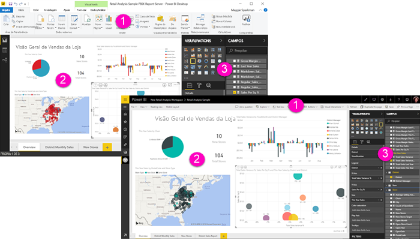

# Comparando o Power BI Desktop e o serviço do Power BI

Em um diagrama de Venn que compara o Power BI Desktop e o serviço do Power BI, a área no meio mostra como os dois se sobrepõem. Algumas tarefas você pode fazer no Power BI Desktop ou no serviço. Mas nos dois lados do diagrama de Venn, o aplicativo e o serviço têm recursos exclusivos.  

O **Power BI Desktop** é uma ferramenta completa para criação de relatório e análise de dados. Ao instalar o aplicativo gratuito no computador local, você pode se conectar a várias fontes de dados diferentes e combiná-las em um modelo de dados (o que geralmente é chamado de modelagem). O [guia de Introdução ao Power BI Desktop](desktop-getting-started.md) percorre esse processo.

O **serviço do Power BI** é um serviço online, baseado em nuvem para equipes e empresas editarem relatórios e colaborarem neles de forma leve. Você também pode se conectar a fontes de dados no serviço do Power BI, mas a modelagem é limitada. 

A maioria dos designers de relatório que trabalham em projetos de business intelligence usam **Power BI Desktop** para criar relatórios e, em seguida, usam o **serviço do Power BI** para compartilhar seus relatórios com outras pessoas.

## Edição de relatório

No aplicativo e no serviço, você pode criar e editar *relatórios*. Um relatório pode ter uma ou várias páginas, com visuais e coleções de visuais. Você pode adicionar indicadores, botões, filtros e detalhamento para melhorar a navegação nos relatórios.

Os editores de relatório no Power BI Desktop e no serviço são semelhantes. Eles são formados por três seções:  

1. As barras de navegação superiores, diferentes no Power BI Desktop e no serviço    
2. A tela de relatório     
3. Os painéis **Campos**, **Visualizações** e **Filtros**

Este vídeo mostra o editor de relatório no Power BI Desktop. 

<iframe width="560" height="315" src="https://www.youtube.com/embed/IkJda4O7oGs" frameborder="0" allowfullscreen></iframe>

## Colaborando no serviço do Power BI

Depois de criar seus relatórios, você pode salvá-los em um *workspace* no **serviço do Power BI**, no qual você e seus colegas poderão colaborar. Os *dashboards* são criados com base nesses relatórios. Em seguida, esses dashboards e relatórios são compartilhados com os consumidores de relatórios dentro e fora da organização. Os consumidores veem os relatórios no serviço do Power BI no [Modo de Exibição de Leitura](consumer/end-user-reading-view.md), não no Modo de Exibição de Edição. Eles não têm acesso a todos os recursos disponíveis para os criadores de relatório. 

## Próximas etapas

[O que é o Power BI Desktop?](desktop-what-is-desktop.md)

[Criar um relatório](service-report-create-new.md) no serviço do Power BI

[Conceitos básicos para designers de relatório](service-basic-concepts.md)

Mais perguntas? [Experimente a Comunidade do Power BI](http://community.powerbi.com/)

