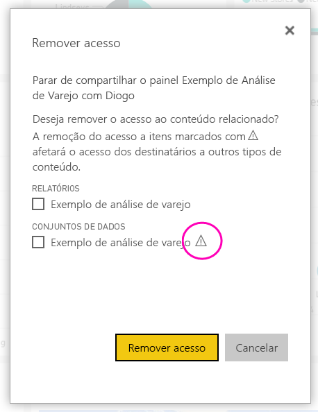
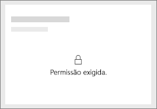
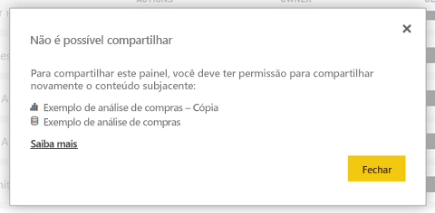

# Compartilhe os painéis e os relatórios do Power BI com colegas e outras pessoas
O *compartilhamento* é uma boa maneira de conceder acesso a algumas pessoas aos dashboards e relatórios. O Power BI também oferece [várias outras maneiras para colaborar e distribuir painéis e relatórios](service-how-to-collaborate-distribute-dashboards-reports.md).

Com o compartilhamento, se você compartilhar o conteúdo dentro ou fora de sua organização, você precisará de uma [licença do Power BI Pro](service-features-license-type.md). Os destinatários também precisarão licenças do Power BI Pro, a menos que o conteúdo está em um [capacidade Premium](service-premium-what-is.md). 

Você pode compartilhar painéis e relatórios da maioria dos lugares no serviço do Power BI: Favoritos, recentes, compartilhado comigo (se o proprietário permite isso), meu espaço de trabalho ou outros espaços de trabalho. Quando você compartilha um painel ou relatório, as pessoas com as quais você o compartilha poderão exibi-lo e interagir com ele, mas não poderão editá-lo. Elas veem os mesmos dados que você no painel ou relatório, a menos que a [RLS (segurança em nível de linha)](service-admin-rls.md) seja aplicada. Os colegas com quem você compartilha também podem compartilhá-lo com os colegas deles, se você permitir. As pessoas fora de sua organização podem também exibam e interagem com o painel ou relatório, mas não é possível compartilhá-lo. 

Você também pode [compartilhar um dashboard de qualquer um dos aplicativos móveis do Power BI](consumer/mobile/mobile-share-dashboard-from-the-mobile-apps.md). No entanto, é possível compartilhar dashboards do Power BI Desktop.

## Vídeo: Compartilhar um painel
Veja Amanda compartilhando seu dashboard com os colegas dentro e fora da empresa. Em seguida, siga as instruções passo a passo abaixo do vídeo para testá-la por conta própria.

<iframe width="560" height="315" src="https://www.youtube.com/embed/0tUwn8DHo3s?list=PL1N57mwBHtN0JFoKSR0n-tBkUJHeMP2cP" frameborder="0" allowfullscreen></iframe>

## Compartilhar um painel ou relatório

1. Em uma lista de painéis ou relatórios ou em um painel ou relatório, selecione **Compartilhar** .

2. Na caixa superior, insira os endereços de email completos dos indivíduos, grupos de distribuição ou grupos de segurança. Você não pode compartilhar com listas de distribuição dinâmicas. 
   
   Você pode compartilhar com as pessoas cujos endereços estejam fora da organização, mas verá um aviso.
   
    
 
   >[!NOTE]
   >A caixa de entrada dá suporte a, no máximo, 100 usuários ou grupos. Se você precisar compartilhar com um grande número de usuários, considere a criação de painel em um espaço de trabalho e [distribuí-lo como um aplicativo](service-create-distribute-apps.md).
   > 
   > 

3. Adicione uma mensagem, se desejar. É opcional.
4. Para permitir que seus colegas compartilhem o conteúdo com outras pessoas, marque **permitir que destinatários compartilhem seu painel (ou relatório)** .
   
   A permissão de compartilhamento por outras pessoas é chamada *novo compartilhamento*. Se você permitir, elas poderão compartilhar novamente por meio do serviço e dos aplicativos móveis do Power BI ou encaminhar o convite por email para outras pessoas em sua organização. O convite expira após um mês. As pessoas de fora da sua organização não podem compartilhar novamente. Como o proprietário do conteúdo, você pode desativar o novo compartilhamento e pode também revogá-lo individualmente. Ver [interromper o compartilhamento ou impedir que outras pessoas compartilhem](#stop-sharing-or-stop-others-from-sharing).

5. Selecione **Compartilhar.**
   
     
   
   Power BI envia um convite por email para os indivíduos, mas não para grupos, com um link para o conteúdo compartilhado. Você verá uma notificação de **Êxito**. 
   
   Quando os destinatários de sua organização clicarem no link, o Power BI adicionará o painel ou relatório às suas páginas de lista **Compartilhado comigo**. Eles podem selecionar seu nome para ver todo o conteúdo que você compartilhou com eles. 
   
   
   
   Quando os destinatários fora de sua organização clicarem no link, eles verão o painel ou relatório, mas não no portal normal do Power BI. Para obter mais informações, consulte [compartilhar um dashboard ou relatório com pessoas fora da sua organização](#share-a-dashboard-or-report-with-people-outside-your-organization).

## Quem tem acesso a um painel ou relatório que você compartilhou?
Às vezes, você precisa ver as pessoas que você compartilhou e ver com quem você compartilhou com:

1. Na lista de painéis e relatórios ou no próprio painel ou relatório, selecione **Compartilhar** . 
2. No **compartilhar dashboard** ou **compartilhar relatório** caixa de diálogo, selecione **acesso**.
   
    

    As pessoas externas à sua organização são listadas como **Convidado**.

## Impedir o compartilhamento ou impedir que outras pessoas compartilhem
Somente o proprietário do painel ou relatório pode ativar e desativar o novo compartilhamento.

### Se você ainda não enviou o convite de compartilhamento
* Desmarque a **permitir que destinatários compartilhem seu painel (ou relatório)** caixa de seleção na parte inferior do convite antes de enviá-lo.

### Se você já compartilhou o painel ou relatório
1. Na lista de painéis e relatórios ou no próprio painel ou relatório, selecione **Compartilhar** . 
2. No **compartilhar dashboard** ou **compartilhar relatório** caixa de diálogo, selecione **acesso**.
   
    
3. Selecione as reticências ( **...** ) ao lado de **Ler e compartilhar novamente** e selecione:
   
   
   
   * **Ler** para impedir que a pessoa compartilhe-o com outras pessoas.
   * **Remover o acesso** para impedir que a pessoa veja o conteúdo compartilhado.

4. No **remover o acesso** caixa de diálogo caixa, decida se você também deseja remover o acesso ao conteúdo relacionado, como relatórios e conjuntos de dados. Se você remover os itens com um ícone de aviso , convém também remover conteúdo relacionado porque ele não será exibido corretamente.

    

## Compartilhar um painel ou relatório com pessoas fora de sua organização
Quando você compartilha com pessoas fora da sua organização, eles receberão um email com um link para o painel compartilhado ou relatório, o que eles devem entrar no Power BI para ver. Se não tiverem uma licença do Power BI Pro, elas poderão inscrever-se para receber uma depois de clicar no link.

Depois de entrar, eles veem o painel ou relatório compartilhado em sua própria janela do navegador, não no portal do Power BI normal. Para acessar mais tarde este dashboard ou relatório, eles devem indicador no link.

Elas não podem editar nenhum conteúdo nesse painel ou relatório. Embora eles podem interagir com os gráficos e alterar filtros ou segmentações de dados, eles não é possível salvar suas alterações. 

Somente os destinatários diretos podem ver o painel ou relatório compartilhado. Por exemplo, se você enviou o email para Vicki@contoso.com, somente Valentina poderá ver o dashboard. Ninguém pode ver o painel, mesmo se tiverem o link. Valentina deve usar o mesmo endereço de email para acessá-lo; Se ela se inscrever com qualquer outro endereço de email, ela não terá acesso ao painel.

Pessoas fora de sua organização não poderão ver os dados se a segurança em nível de linha ou de função for implementada nos modelos tabulares locais do Analysis Services.

Se você enviar um link de um aplicativo móvel do Power BI para pessoas fora da sua organização, ao clicar no link abre o painel em um navegador, não no aplicativo móvel do Power BI.

Se você [permitir que os usuários convidados externo editar e gerenciar o conteúdo da organização](service-admin-portal.md#export-and-sharing-settings), a experiência de consumo somente padrão não se aplica a eles. [Saiba mais](service-admin-azure-ad-b2b.md).

## Limitações e considerações
Coisas para se lembrar a respeito do compartilhamento de painéis e relatórios:

* Em geral, você e seus colegas veem os mesmos dados no painel ou relatório. Portanto, se você tiver permissões para ver mais dados do que eles, eles poderão ver todos os seus dados no painel ou relatório. No entanto, se a [RLS (segurança em nível de linha)](service-admin-rls.md) for aplicada ao conjunto de dados subjacente a um painel ou relatório, as credenciais de cada pessoa serão usadas para determinar quais dados elas podem acessar.
* Todos com quem você compartilha seu dashboard com podem vê-lo e interagir com os relatórios relacionados no [exibição de leitura](consumer/end-user-reading-view.md#reading-view). Elas não podem criar relatórios nem salvar alterações nos relatórios existentes.
* Embora ninguém pode ver ou baixar o conjunto de dados, eles podem acessar o conjunto de dados diretamente usando o analisar no recurso do Excel. Um administrador pode restringir a capacidade de usar analisar no Excel para todos em um grupo. No entanto, a restrição é para todos nesse grupo, para cada espaço de trabalho ao qual ele pertence.
* Qualquer pessoa pode [atualizar os dados](refresh-data.md) manualmente.
* Se você usar o Office 365 para email, poderá compartilhar com os membros de um grupo de distribuição inserindo o endereço de email associado ao grupo de distribuição.
* Os colegas que compartilham seu domínio de email e os colegas cujo domínio é diferente, mas registrado no mesmo locatário, podem compartilhar o dashboard com outras pessoas. Por exemplo, se os domínios contoso.com e contoso2.com são registrados no mesmo locatário e seu endereço de email é konrads@contoso.com, em seguida, ambos ravali@contoso.com e gustav@contoso2.com podem compartilhar, desde que você deu permissão para compartilhar.
* Se seus colegas já tiverem acesso a um relatório ou dashboard específico, você pode enviar um link direto copiando a URL quando estiver no painel ou relatório. Por exemplo: `https://powerbi.com/dashboards/g12466b5-a452-4e55-8634-xxxxxxxxxxxx`
* Da mesma forma, se seus colegas já tiverem acesso a um painel específico, você poderá [enviar um link direto para o relatório subjacente](service-share-reports.md). 
* Você pode compartilhar com, no máximo, 100 usuários ou grupos em uma ação única de compartilhamento. No entanto, pode-se conceder acesso a mais de 500 usuários a um item. Para fazer isso, compartilham várias vezes, especificando os usuários individualmente ou compartilhar com um grupo de usuários que contém todos os usuários.

## Solucionar problemas de compartilhamento

### Destinatários do meu painel verão um ícone de bloqueio em um bloco ou uma mensagem "A permissão necessária"

As pessoas com as quais você compartilha poderão ver um bloco bloqueado em um painel ou uma mensagem "Permissão necessária" ao tentarem exibir um relatório.

Nesse caso, você precisa conceder a permissão para o conjunto de dados subjacente:

1. Vá para a guia **Conjuntos de dados** na sua lista de conteúdo.

1. Selecione as reticências ( **...** ) ao lado do conjunto de dados, em seguida, selecione **gerenciar permissões**.

    

1. Selecione **Adicionar usuário**.

    

1. Insira os endereços de email completos dos indivíduos, grupos de distribuição ou grupos de segurança. Você não pode compartilhar com listas de distribuição dinâmicas.

    

1. Selecione **Adicionar**.

### Não consigo compartilhar um painel ou relatório como favorito

Para compartilhar um dashboard ou relatório, você precisa de permissão para compartilhar novamente o conteúdo subjacente; ou seja, todas relacionadas a relatórios e conjuntos de dados. Se você vir uma mensagem informando que não é possível compartilhar, peça ao autor do relatório para dar a você compartilhar novamente permissão para que os relatórios e conjuntos de dados.

## Próximas etapas
* Tem comentários? Vá para o [site da comunidade do Power BI](https://community.powerbi.com/) para fazer sugestões.
* [Como devo colaborar e compartilhar relatórios e dashboards?](service-how-to-collaborate-distribute-dashboards-reports.md)
* [Compartilhar um relatório do Power BI filtrado](service-share-reports.md).
* Dúvidas? [Experimente a Comunidade do Power BI](http://community.powerbi.com/).

