# Criar um aplicativo de modelo no Power BI (versão prévia)

Os novos *aplicativos de modelo* do Power BI permitem que os parceiros do Power BI criem aplicativos do Power BI com pouca ou nenhuma codificação e implante-os para qualquer cliente do Power BI.  Este artigo contém instruções passo a passo para a criação de um aplicativo de modelo do Power BI.

Se você pode criar painéis e relatórios do Power BI, você pode se tornar um *construtor de aplicativos de modelo* e compila e empacota o conteúdo analítico em um *aplicativo*. Você pode implantar seu aplicativo para outros locatários do Power BI por meio de qualquer plataforma disponível, como o AppSource, ou ao usá-lo em seu próprio serviço web. Como um construtor, você tem a possibilidade de criar um pacote de análise protegido para distribuição.

Os administradores de locatários do Power BI controlam e administram quem, em suas organizações, pode criar aplicativos de modelo e quem pode instalá-los. Os usuários que estão autorizados podem instalar seu aplicativo de modelo, em seguida, modificá-lo e distribuí-lo para os consumidores do Power BI em sua organização.

## Pré-requisitos

Estes são os requisitos para a criação de um aplicativo de modelo:  

- Uma [licença do Power BI Pro](service-self-service-signup-for-power-bi.md)
- Uma [instalação do Power BI Desktop](desktop-get-the-desktop.md) (opcional)
- Familiaridade com o [conceitos básicos do Power BI](service-basic-concepts.md)
- Permissões para criar um aplicativo de modelo. Confira o [portal de administração do Power BI, configurações de Aplicativo de modelo](service-admin-portal.md#template-apps-settings-preview) para obter mais detalhes.

## Habilitar o modo de desenvolvedor de aplicativos

Para criar um aplicativo de modelo que pode ser distribuído para outros locatários do Power BI, você precisa estar no modo de Desenvolvedor de Aplicativos. Caso contrário, você está apenas criando um aplicativo para os consumidores do Power BI em sua própria organização.

1. Abra o serviço do Power BI em um navegador.
2. Acesse **Configurações** > **Geral** > **Desenvolvedor** > **Habilitar modo de desenvolvimento de aplicativos de modelo**.

    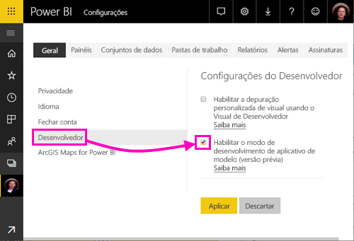

    Se essa opção não for exibida, contate o administrador do Power BI para que ele conceda [permissões de desenvolvimento de aplicativos de modelo](service-admin-portal.md#template-apps-settings-preview) no portal de administração.

3. Selecione **Aplicar**.

## Criar o workspace do aplicativo de modelo

Para criar um aplicativo de modelo que pode ser distribuído para outros locatários do Power BI, você precisa criá-lo em um dos novos workspaces do aplicativo.

1. No serviço do Power BI, selecione **Workspaces** > **Criar workspace do aplicativo**.

    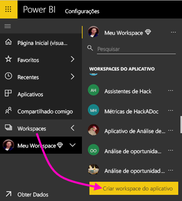

2. Em **Criar um workspace do aplicativo**, em **Visualizar workspaces aprimorados**, selecione **Experimentar agora**.

    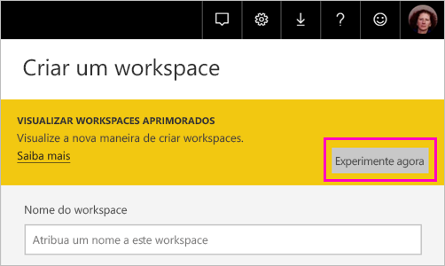

3. Insira um nome, uma descrição (opcional) e a imagem de logotipo (opcional) para o workspace do aplicativo.

4. Selecione **Desenvolver um aplicativo de modelo**.

    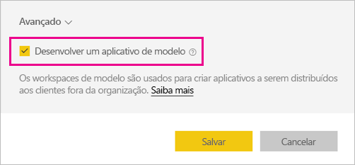

5. Selecione **Salvar**.
>[!NOTE]
>Você precisa de permissões de administrador do Power BI para promover aplicativos de modelo.

## Criar o conteúdo no aplicativo de modelo

Assim como ocorre com um workspace comum do aplicativo do Power BI, a próxima etapa é criar o conteúdo no workspace.  Nesta versão prévia dos aplicativos de modelo, damos suporte a apenas um de cada tipo: um conjunto de dados, um relatório e um dashboard.

- [Crie o conteúdo do Power BI](power-bi-creator-landing.md) no workspace do aplicativo.

Caso esteja usando parâmetros no Power Query, verifique se eles têm um tipo bem definido (por exemplo, Texto). Não há suporte para os tipos Qualquer e Binário.

O artigo [Dicas para a criação de aplicativos de modelo no Power BI (versão prévia)](service-template-apps-tips.md) traz sugestões a serem consideradas ao criar relatórios e dashboards para o aplicativo de modelo.

## Criar o aplicativo de modelo de teste

Agora que há algum conteúdo no workspace, você está pronto para empacotá-lo em um aplicativo de modelo. A primeira etapa é criar um aplicativo de modelo de teste, acessível somente na organização do locatário.

1. No workspace do aplicativo de modelo, selecione **Criar aplicativo**.

    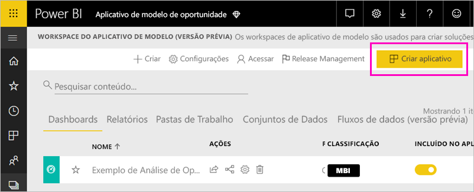

    Aqui, você preencher nas opções adicionais de construção para seu aplicativo de modelo, em cinco categorias:

    **Identidade Visual**

    
    - Nome do aplicativo
    - Descrição
    - Site de suporte (link é apresentado nas informações do aplicativo após a redistribuição do modelo de aplicativo como aplicativo da organização)
    - Logotipo do aplicativo (limite de tamanho de arquivo K 45, taxa de proporção de 1:1,. PNG. jpg. JPEG formatos)
    - Cor de tema do aplicativo

    **Conteúdo**

    **Página de aterrissagem do aplicativo:** Defina um relatório ou dashboard para ser a página de aterrissagem do seu aplicativo, use uma página de aterrissagem que dará a impressão à direita:

    

    **Controle**

    Definir limites e restrições que os usuários de aplicativos terá com o conteúdo do seu aplicativo. Você pode usar esse controle para proteger a propriedade intelectual em seu aplicativo.

    

    >[!NOTE]
    >Exportar para o formato. pbix sempre é bloqueado para usuários que instalam o aplicativo.

    **Parâmetros**

    Use esta categoria para gerenciar o comportamento de parâmetro ao se conectar a fontes de dados. Saiba mais sobre [criando parâmetros de consulta](https://powerbi.microsoft.com/blog/deep-dive-into-query-parameters-and-power-bi-templates/).

    
    - **Valor**: valor de parâmetro padrão.
    - **Necessário**: use essa opção para exigir o instalador para um parâmetro específico do usuário de entrada.
    - **Bloqueio**: O bloqueio impede que o instalador de atualização de um parâmetro.
    - **Estático**: Habilitar caso o aplicativo contenha *apenas* dados de exemplo. Quando você seleciona **estático**, o Assistente de instalação não solicitar aos usuários para se conectar a uma fonte de dados.

    **Acesso** na fase de teste, decida quais outras pessoas em sua organização podem instalar e testar seu aplicativo. Não se preocupe, você sempre poderá voltar e alterar essas configurações posteriormente (configuração não afeta o acesso do aplicativo distribuído do modelo).

2. Selecione **Criar aplicativo**.

    Você verá uma mensagem indicando que o aplicativo de teste está pronto, com um link para copiar e compartilhar com os testadores do aplicativo.

    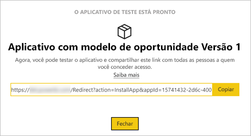

    Você também realizou a primeira etapa do processo de gerenciamento de versão, que é descrita a seguir.

## Gerenciar a versão do aplicativo de modelo

Antes de liberar esse aplicativo de modelo publicamente, é recomendável verificar se ele está pronto para liberação. O Power BI criou o painel de gerenciamento de versão, no qual você pode seguir e inspecionar o caminho completo da versão do aplicativo. Você também pode disparar a transição de um estágio a outro. Os estágios comuns são:

- Gerar um aplicativo de teste: para teste apenas em sua organização.
- Promover o pacote de teste ao estágio de pré-produção: teste fora de sua organização.
- Promover o pacote de pré-produção à produção: versão de produção.
- Exclua qualquer pacote ou comece novamente no estágio anterior.

A URL não muda à medida que você move entre as fases de liberação. Promoção não afeta a URL em si.

Vamos examinar os estágios:

1. No workspace do aplicativo de modelo, selecione **Gerenciamento de Versão**.

    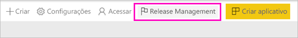

2. Selecione **Criar aplicativo**.

    Se você criar o aplicativo de teste em **Criar o aplicativo de modelo de teste** acima, o ponto amarelo ao lado de **Teste** já estará preenchido e você não precisará selecionar **Criar aplicativo** aqui. Se você selecioná-lo, voltará ao processo de criação do aplicativo de modelo.

3. Selecione **Obter link**.

    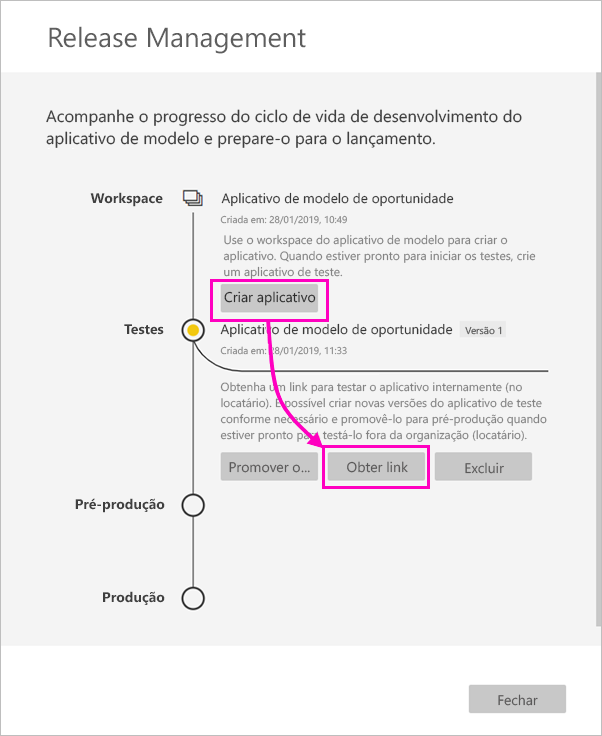

4. Para testar a experiência de instalação do aplicativo, copie o link na janela de notificação e cole-o em uma nova janela do navegador.

    Nela, você seguirá o mesmo procedimento que os clientes seguirão. Confira [Instalar e distribuir aplicativos de modelo em sua organização](service-template-apps-install-distribute.md) para a versão deles.

5. Na caixa de diálogo, selecione **Instalar**.

    Quando a instalação for bem-sucedida, você verá uma notificação indicando que o novo aplicativo está pronto.

6. Selecione **Ir para o aplicativo**.
7. Em **Introdução ao novo aplicativo**, você verá o aplicativo como ele será exibido para os clientes.

    
8. Selecione **Explorar Aplicativo** para verificar o aplicativo de teste com os dados de exemplo.
9. Para fazer alterações, volte ao aplicativo no workspace original. Atualize o aplicativo de teste até ficar satisfeito.
10. Quando você estiver pronto para promover seu aplicativo para pré-produção para outros testes fora de seu locatário, volte para o **gerenciamento de liberações** painel e selecione **promover aplicativo**. 

    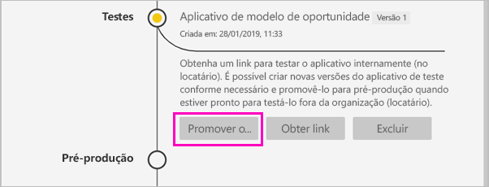

    >[!NOTE]
    > Quando o aplicativo é promovido se torna disponível publicamente fora da sua organização.

11. Selecione **Promover** para confirmar sua escolha.
12. Copie essa nova URL para compartilhamento fora do locatário para teste. Esse link é também a enviar para iniciar o processo de distribuição de seu aplicativo no AppSource, criando uma [nova oferta do Portal do Cloud Partner](https://docs.microsoft.com/azure/marketplace/cloud-partner-portal/power-bi/cpp-publish-offer). Envie somente pré-produção links para Portal do Cloud Partner. Somente depois que o aplicativo é aprovado e receber notificação de que ele é publicado no AppSource, você pode promover esse pacote para produção no Power BI.
13. Quando o aplicativo estiver pronto para produção ou compartilhamento por meio do AppSource, volte ao painel **Gerenciamento de Versão** e selecione **Promover aplicativo** ao lado de **Pré-produção**.
14. Selecione **Promover** para confirmar sua escolha.

    Agora o aplicativo está em produção e pronto para distribuição.

    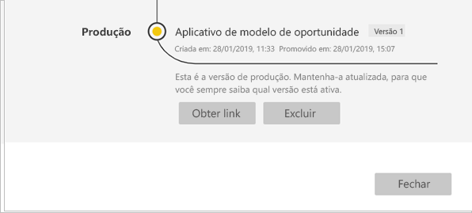

Para disponibilizar o aplicativo amplamente para milhares de usuários do Power BI no mundo, recomendamos que você o envie ao AppSource. Confira a [oferta do Aplicativo do Power BI](https://docs.microsoft.com/azure/marketplace/cloud-partner-portal/power-bi/cpp-power-bi-offer) para obter mais detalhes.

## Atualizar o aplicativo

Agora que o aplicativo está em produção, você poderá recomeçar na fase de teste, sem interromper o aplicativo em produção.

1. No painel **Gerenciamento de versão**, selecione **Criar aplicativo**.
2. Volte ao processo de criação do aplicativo.
3. Depois de definir **Identidade Visual**, **Conteúdo**, **Controle** e **Acesso**, selecione novamente **Criar aplicativo**.
4. Selecione **Fechar** e volte a **Gerenciamento de versão**.

   Você verá que tem duas versões agora: A versão em produção e uma nova versão em teste.

    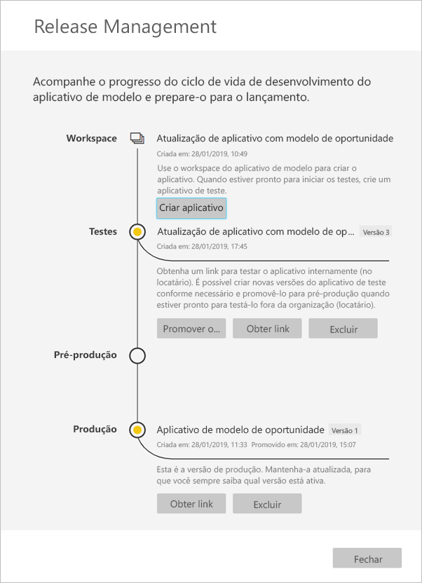

5. Quando você estiver pronto para promover seu aplicativo para pré-produção para outros testes fora de seu locatário, vá até o painel de gerenciamento de versão e selecione **aplicativo de promover** lado **testes**.
6. Seu link agora está ativo, enviá-lo novamente para o Portal do Cloud Partner, seguindo as etapas em [atualização de oferta de aplicativo do Power BI](https://docs.microsoft.com/azure/marketplace/cloud-partner-portal/power-bi/cpp-update-existing-offer).

>[!NOTE]
>Promova seu aplicativo para o estágio de produção somente depois que seu aplicativo é aprovado pelo Portal de parceiros de nuvem e você publicou.

## Próximas etapas

Veja como os clientes interagem com o aplicativo de modelo em [Instalar, personalizar e distribuir aplicativos de modelo em sua organização](service-template-apps-install-distribute.md).

Confira a [oferta do Aplicativo do Power BI](https://docs.microsoft.com/azure/marketplace/cloud-partner-portal/power-bi/cpp-power-bi-offer) para obter mais detalhes sobre como distribuir o aplicativo.
