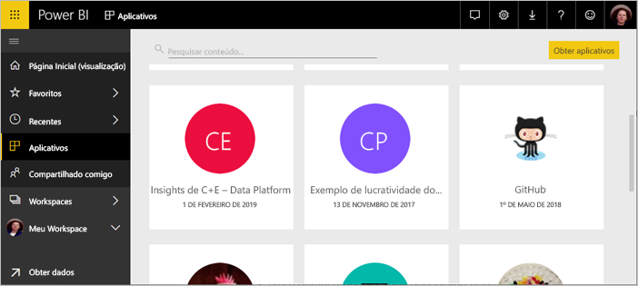
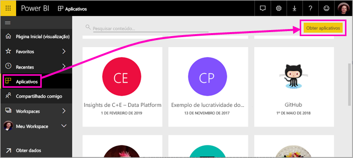
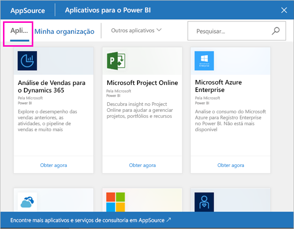
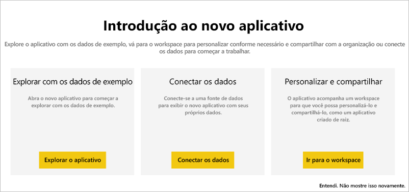
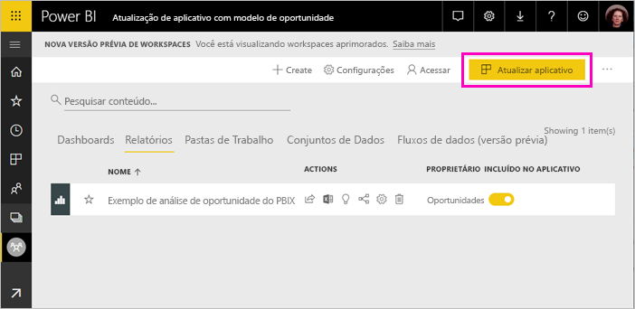
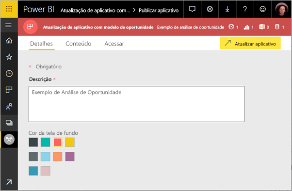
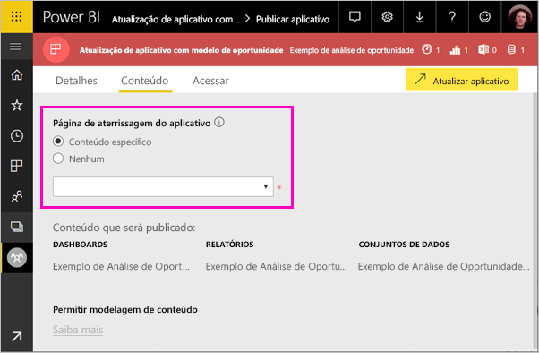
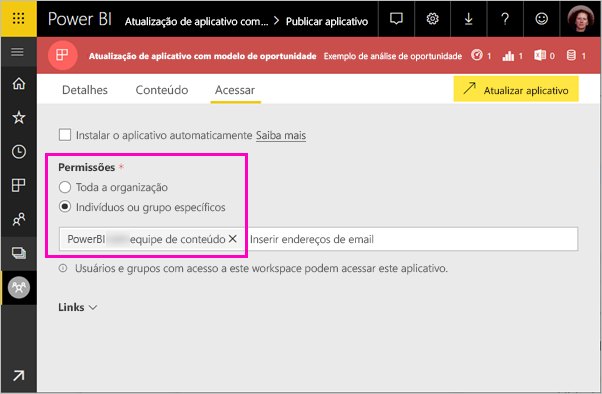

# Instalar e distribuir aplicativos de modelo em sua organização – Power BI (versão prévia)

Os novos *aplicativos de modelo* do Power BI permitem que os parceiros do Power BI criem aplicativos do Power BI com pouca ou nenhuma codificação e implante-os para qualquer cliente do Power BI. Este artigo destina-se a analistas do Power BI. Explica como instalar, personalizar e distribuir um aplicativo de modelo criado por um parceiro do Power BI. Caso esteja interessado em criar aplicativos de modelo para distribuí-los por conta própria, confira [Criar um aplicativo de modelo no Power BI](service-template-apps-create.md).

Quando você instala um aplicativo de modelo criado por um parceiro do Power BI, você pode modificá-lo para atender às necessidades de sua organização e, em seguida, distribuí-lo para seus colegas de trabalho como um aplicativo.  

## Pré-requisitos  

Estes são os requisitos para instalar, personalizar e distribuir um aplicativo de modelo:  

- Uma [licença do Power BI Pro](service-self-service-signup-for-power-bi.md)
- Familiaridade com os [conceitos básicos do Power BI ](service-basic-concepts.md)
- Link de instalação válido do criador do aplicativo de modelo ou do AppSource. 
- Permissões para instalar aplicativos de modelo. 

## Instalar um aplicativo de modelo

Você poderá receber um link para um aplicativo de modelo. Caso contrário, você poderá pesquisar no AppSource o aplicativo de seu interesse. De qualquer forma, após a instalação, você poderá modificá-lo e distribuí-lo para sua organização.

### Pesquisar no AppSource com um navegador

Em um navegador, selecione este link para abrir o AppSource filtrado para aplicativos do Power BI:

- https://appsource.microsoft.com/marketplace/apps?product=power-bi

### Pesquisar no AppSource com o serviço do Power BI

1. No painel de navegação à esquerda do serviço do Power BI, selecione **Aplicativos** > **Obter aplicativos**.

    

2. No AppSource, selecione **Aplicativos**.

    

3. Procure ou pesquise o aplicativo e, em seguida, selecione **Obter agora**.

2. Na caixa de diálogo, selecione **Instalar**.

    Caso você tenha uma licença do Power BI Pro, o aplicativo será instalado com seu workspace do aplicativo associado. Personalize o aplicativo no workspace associado.

    Quando a instalação for bem-sucedida, você verá uma notificação indicando que o novo aplicativo está pronto. 

3. Selecione **Ir para o aplicativo**.
4. Em **Introdução ao novo aplicativo**, selecione uma das três opções:

    

    - **Explorar o aplicativo**: Exploração básica dos dados de exemplo. Comece aqui para conhecer o aspecto geral do aplicativo. 
    - **Conectar os dados**: Altere a fonte de dados dos dados de exemplo para sua própria fonte de dados. Redefina os parâmetros do conjunto de dados e as credenciais da fonte de dados. Confira [Limitações conhecidas](service-template-apps-tips.md#known-limitations) no artigo sobre dicas de aplicativos de modelo. 
    - **Ir para o workspace** (opção mais avançada): faça qualquer alteração permitida pelo construtor do aplicativo.

    Se desejar, ignore esta caixa de diálogo e acesse o workspace associado diretamente por meio de **Workspaces** no painel de navegação à esquerda.   
 
5. Antes de compartilhá-lo com seus colegas de trabalho, o ideal é conectar-se aos seus próprios dados. Talvez você também deseje modificar o relatório ou o dashboard para adequá-lo à sua organização. Além disso, nesta altura, você poderá adicionar outros relatórios ou dashboards.

## Atualizar e distribuir o aplicativo

Depois de atualizar o aplicativo para sua organização, você estará pronto para publicá-lo. As etapas são as mesmas da publicação de qualquer outro aplicativo. 

1. Quando concluir a personalização, na exibição de lista do workspace, selecione **Atualizar aplicativo** no canto superior direito.  

    

2. Em **Detalhes**, modifique a descrição e a cor da tela de fundo.

   

3. Em **Conteúdo**, selecione uma página de aterrissagem, o dashboard ou o relatório.

   

4. Em **Acesso**, permita acesso a usuários selecionados ou a toda a organização.  

   

5. Selecione **Atualizar aplicativo**. 

6. Depois de publicá-lo com êxito, você poderá copiar o link e compartilhá-lo com as pessoas a quem você permitiu acesso. Se você o compartilhou com elas, elas também podem vê-lo na guia **Minha organização** do AppSource.

## Próximas etapas 

[Criar workspaces com seus colegas no Power BI](service-create-workspaces.md)

 

 
