# Tutorial: Invocar um modelo de Machine Learning Studio no Power BI (versão prévia)

Neste tutorial, passamos pela experiência de incorporar insights de um modelo do **Azure Machine Learning Studio** ao Power BI. Este tutorial inclui orientações para conceder acesso de usuário do Power BI a um modelo do Azure ML, criar um fluxo de dados e aplicar os insights do modelo do Azure ML ao seu fluxo de dados. Ele também faz referência ao guia de início rápido para criar um modelo do Azure ML, caso você ainda não tenha um modelo.

O tutorial guiará você durante as etapas a seguir:

> [!div class="checklist"]
> * Criação e publicação de um modelo do Azure Machine Learning
> * Concessão de acesso a um usuário do Power BI para usar o modelo
> * Criação de um fluxo de dados
> * Aplicação de insights a partir do modelo do Azure ML para o fluxo de dados

## Criação e publicação de um modelo do Azure ML

Siga as instruções em [Passo a passo – Etapa 1: criação de um workspace do Machine Learning Studio](https://docs.microsoft.com/azure/machine-learning/studio/walkthrough-1-create-ml-workspace) para criar um workspace do **Machine Learning**.

Essas etapas podem ser usadas com qualquer modelo do Azure ML ou com o conjunto de dados que você já tem. Se você não tiver um modelo publicado, crie rapidamente um modelo consultando [Criar seu primeiro teste de ciência de dados no Azure Machine Learning Studio](https://docs.microsoft.com/azure/machine-learning/studio/create-experiment) que define um modelo do Azure ML para Previsão de preços dos veículos.

Siga as etapas em [Implantar um serviço Web do Azure Machine Learning Studio](https://docs.microsoft.com/azure/machine-learning/studio/publish-a-machine-learning-web-service) para publicar o modelo do Azure ML como um serviço Web.

## Concessão de acesso de usuário do Power BI

Para acessar um modelo do Azure ML do Power BI, você deve ter acesso de **Leitura** à assinatura do Azure e ao grupo de recursos, e acesso de **Leitura** ao serviço Web do Azure Machine Learning Studio para modelos do Machine Learning Studio.  Para o modelo de serviço do Azure Machine Learning, é preciso acesso de **Leitura** para o workspace do serviço de Machine Learning.

As etapas a seguir pressupõem que você é o coadministrador da assinatura do Azure e do grupo de recursos para os quais o modelo foi publicado.

Entre no [portal do Azure](https://portal.azure.com) e navegue até a página **Assinaturas**, que pode ser localizada pela lista **Todos os Serviços** no menu de navegação à esquerda.

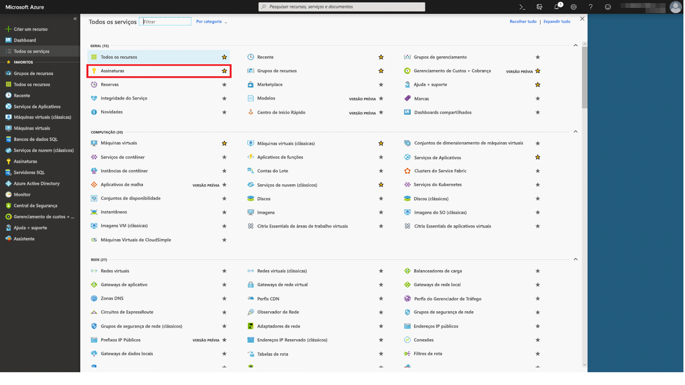

Escolha a assinatura do Azure que você usou para publicar o modelo e escolha **IAM (Controle de Acesso)** . Em seguida, escolha **Adicionar atribuição de função**, depois escolha a função de **Leitor** e escolha o usuário do Power BI. Selecione **Salvar** ao terminar. A imagem a seguir mostra essas seleções.

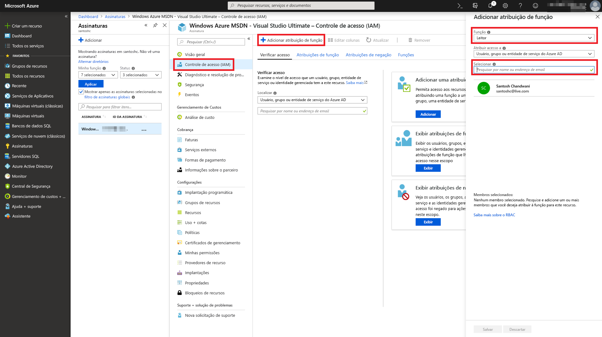

Em seguida, repita as etapas acima para conceder acesso à função de **Colaborador** ao usuário do Power BI para o serviço Web do Machine Learning específico para o qual o modelo do Azure ML foi implantado.

## Criação de um fluxo de dados

### Obter dados para a criação do fluxo de dados

Entre no serviço do Power BI com as credenciais do usuário para o qual você concedeu acesso ao modelo do Azure ML na etapa anterior.

Esta etapa pressupõe que você tenha os dados que deseja classificar com seu modelo do Azure ML no formato CSV.  Se você usou o **Teste de preços dos veículos** para criar o modelo no Machine Learning Studio, o conjunto de dados será compartilhado no link a seguir:

* [Modelo de exemplo do Azure Learning Studio](https://raw.githubusercontent.com/santoshc1/PowerBI‑AI‑samples/master/Tutorial\_MLStudio\_model\_integration/Automobile%20price%20data%20\_Raw\_.csv)

### Criação de um fluxo de dados

Para criar as entidades em seu fluxo de dados, entre no serviço do Power BI e navegue até um workspace na capacidade dedicada que tenha a versão prévia de IA habilitada.

Se ainda não tiver um workspace, crie um escolhendo **Workspaces** no menu à esquerda e escolha **Criar workspace do aplicativo** no painel inferior.  Um painel será aberto para inserir os detalhes do workspace. Insira o nome de um workspace e selecione **Salvar**.

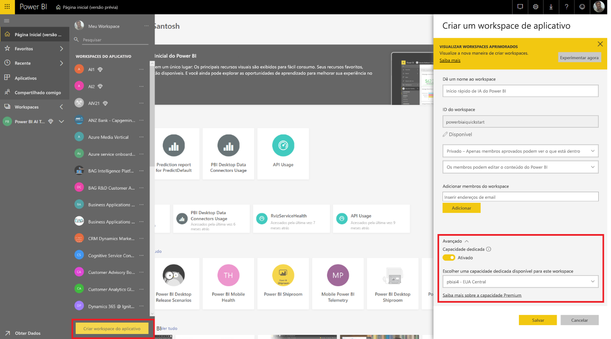

Depois que o workspace tiver sido criado, você pode escolher **Ignorar** na parte inferior direita da tela de Boas-vindas.

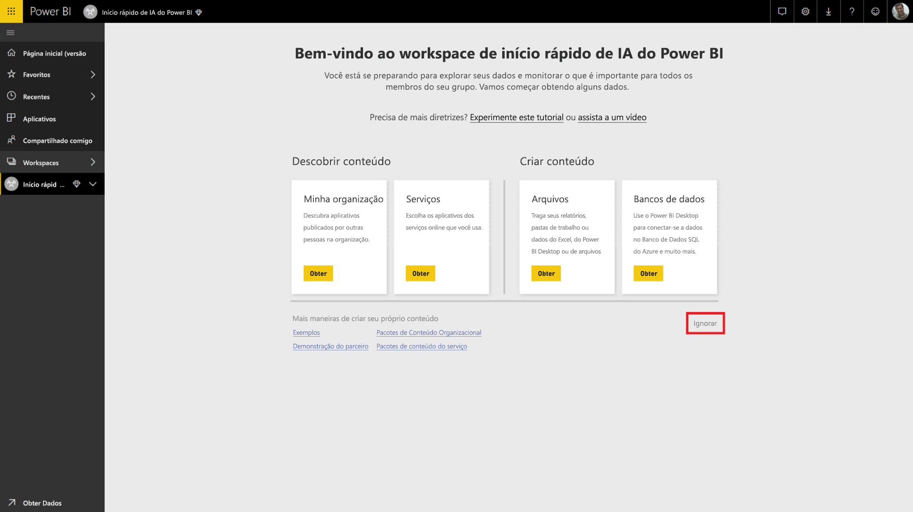

Escolha a guia **Fluxos de dados (versão prévia)** e selecione o botão **Criar** no canto superior direito do workspace. Em seguida, escolha **Fluxo de dados**.

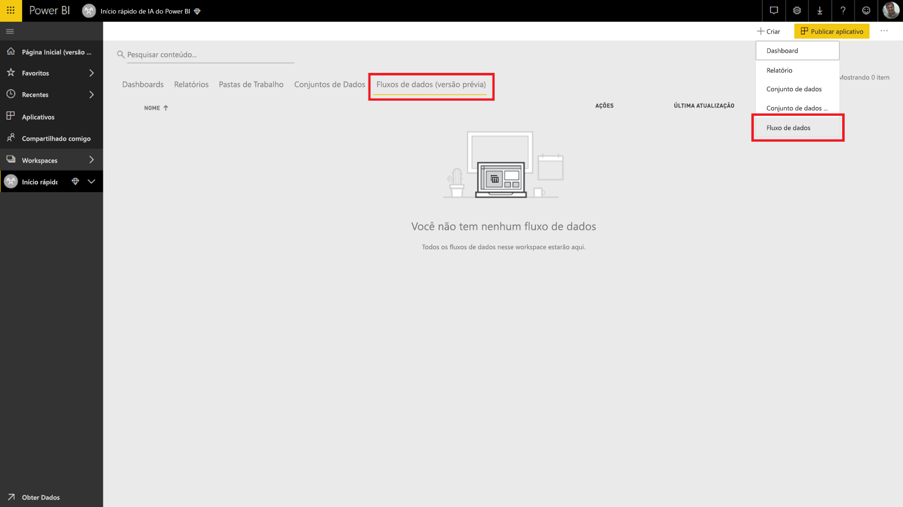

Selecione **Adicionar novas entidades**, que inicia o **Power Query Editor** no navegador.

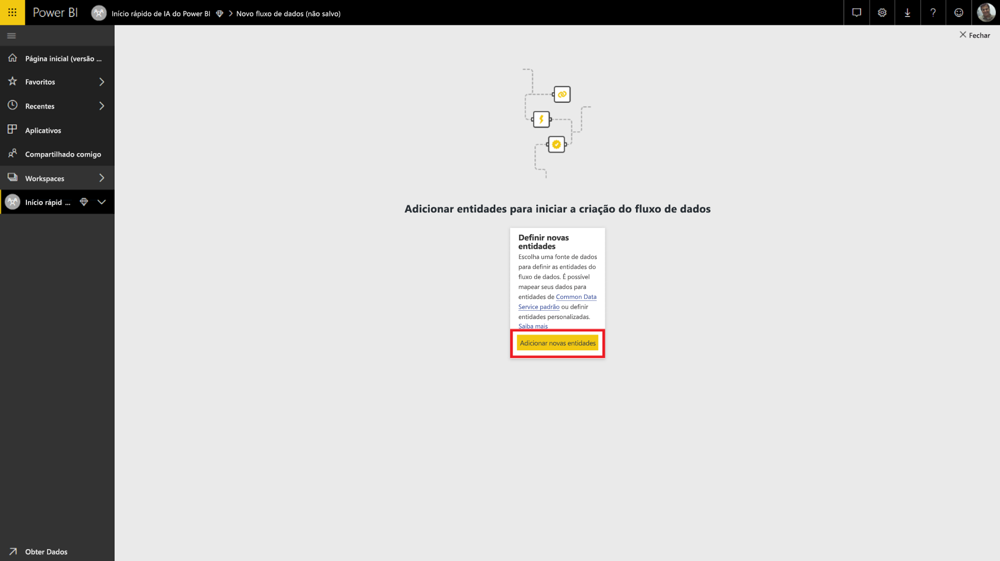

Selecione **Arquivo de texto/CSV** como fonte de dados.

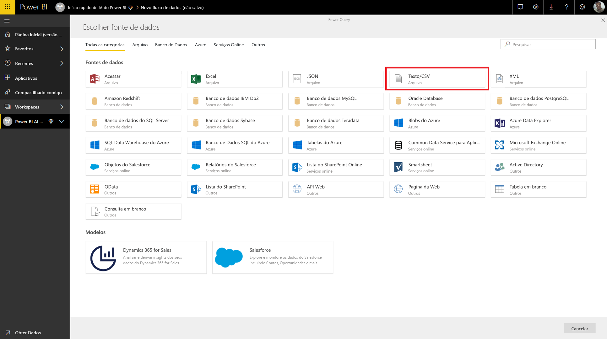

Na tela seguinte, você será solicitado a se conectar a uma fonte de dados. Cole o link nos dados usados para criar seu modelo do Azure ML. Se você tiver usado os dados de _Preços de automóveis_, cole o link a seguir na caixa **URL ou caminho do arquivo** e clique em **Avançar**.

`https://raw.githubusercontent.com/MicrosoftLearning/Principles-of-Machine-Learning-Python/master/Module7/Automobile%20price%20data%20_Raw_.csv`

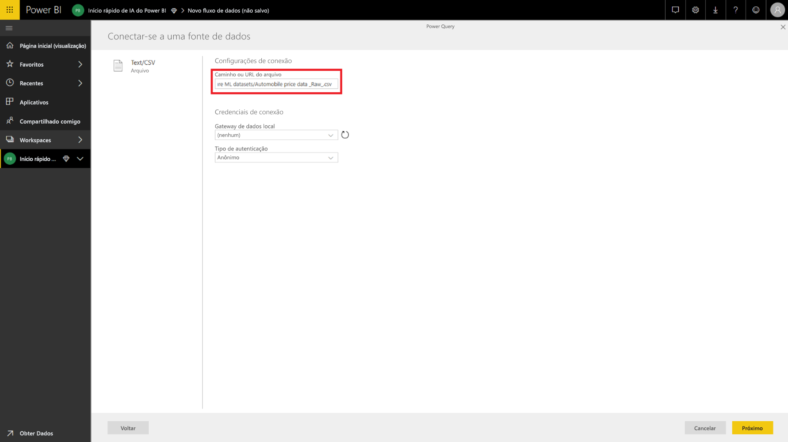

O Power Query Editor mostra uma versão prévia dos dados a partir do arquivo CSV. Selecione **Transformar Tabela** na faixa de opções dos comandos e **Usar Primeira Linha como Cabeçalho**.  A etapa de consulta _Cabeçalhos promovidos_ é adicionada ao painel **Etapas aplicadas** à direita. Também é possível renomear a consulta para um nome mais objetivo, como _Preço dos veículos_, usando o painel à direita.

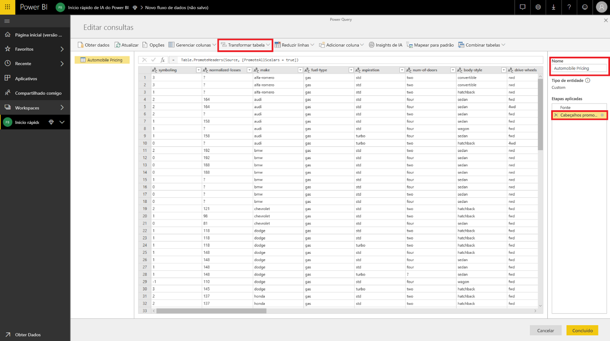

Nosso conjunto de dados de origem tem valores desconhecidos definidos como “?”.  Para limpar isso, podemos substituir “?” por “0” para evitar erros futuros por questões de simplicidade.  Para fazer isso, escolha as colunas *normalized-losses*, *bore*, *stroke*, *compression-ratio*, *horsepower*, *pico-rpm* e *price* clicando no nome nos cabeçalhos das colunas. Em seguida, clique em “Transformar colunas” e escolha “Substituir valores”.  Substitua “?” por “0”.

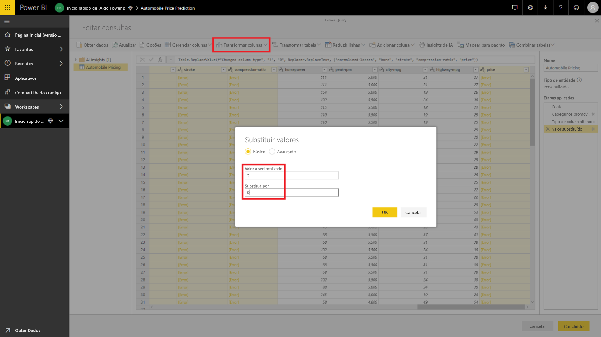

Todas as colunas na tabela de uma fonte de texto/CSV são tratadas como colunas de texto.  Em seguida, precisamos alterar as colunas numéricas para os tipos de dados corretos.  Isso pode ser feito no Power Query clicando no símbolo de tipo de dados no cabeçalho da coluna.  Altere as colunas para os tipos abaixo:

- **Número inteiro**:  symboling, normalized-losses, curb-weight, engine-size, horsepower, peak-rpm, city-mpg, highway-mpg, price
- **Número decimal**:  wheel-base, length, width, height, bore, stroke, compression-ratio

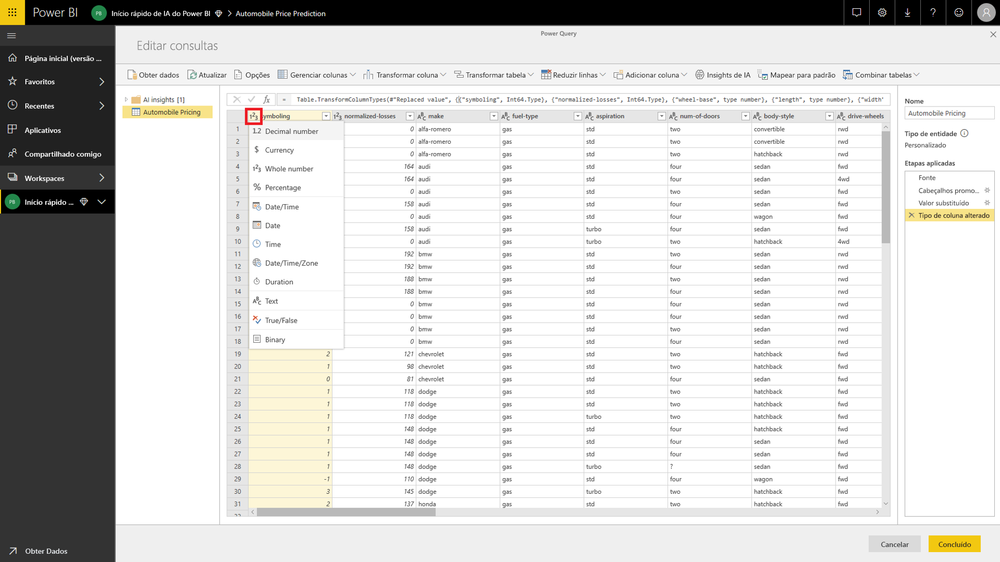

Escolha **Concluído** para fechar o Power Query Editor. Isso mostrará a lista de entidades com os dados de _Preços dos veículos_ que adicionamos. Selecione **Salvar** no canto superior direito, forneça um nome para o fluxo de dados e selecione **Salvar**.

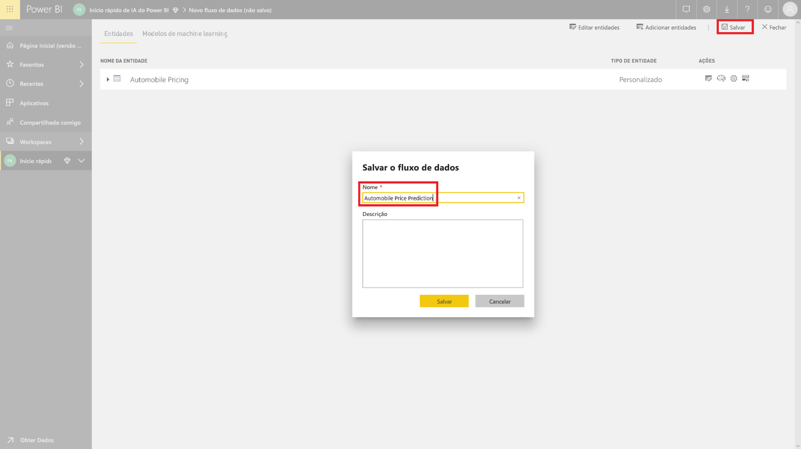

### Atualizar fluxo de dados

Quando o fluxo de dados é salvo, uma notificação a respeito é exibida. Selecione **Atualizar agora** para ingerir dados a partir da origem para o fluxo de dados.

Selecione **Fechar** no canto superior direito e aguarde até que a atualização do fluxo de dados termine.

Também é possível atualizar seu fluxo de dados usando os comandos **Ações**. O fluxo de dados exibe o carimbo de data/hora de quando a atualização é concluída.

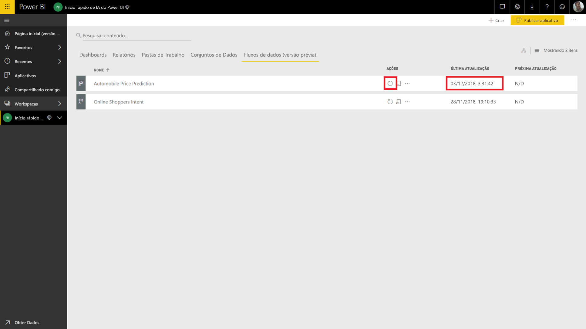

## Aplicar insights do modelo do Azure ML

Para acessar o modelo do Azure ML da _Previsão de Preços dos Veículos_, edite a entidade _Preços dos veículos_ à qual queremos adicionar o preço previsto.

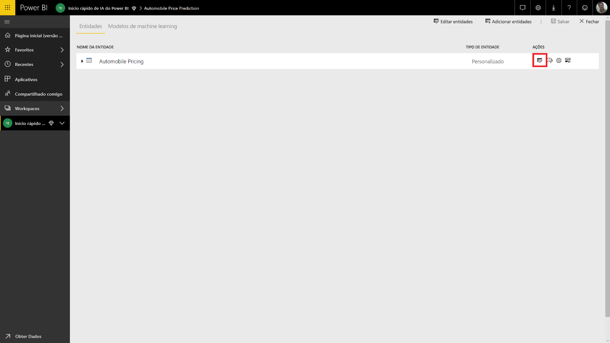

Se o ícone **Editar** for selecionado, o Power Query Editor será aberto para as entidades em seu fluxo de dados.

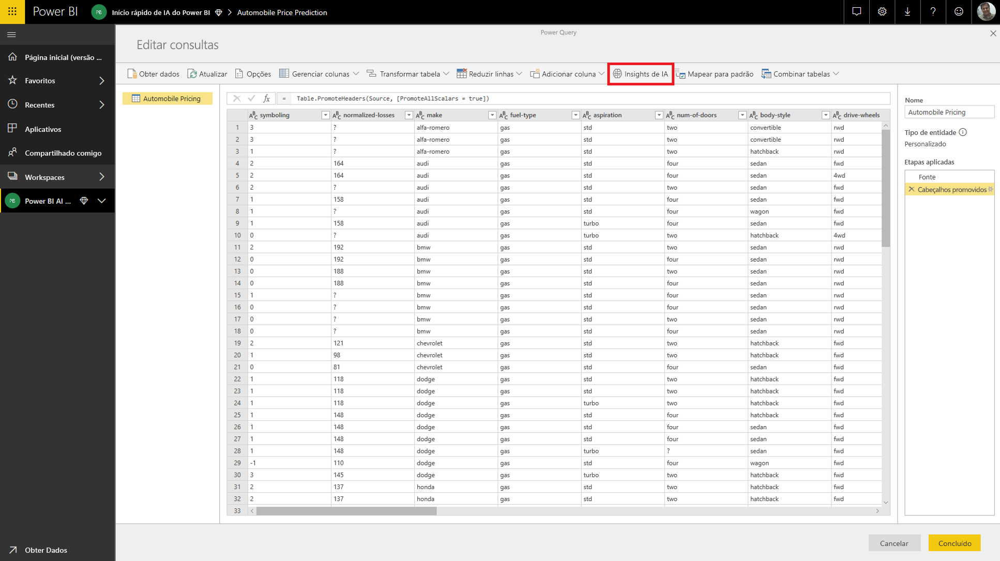

Selecione o botão **Insights de IA** na faixa de opções e selecione a pasta _Modelos do Azure Machine Learning_ no menu de navegação à esquerda.

Os modelos do Azure ML aos quais você recebeu acesso são listados como funções do Power Query com um prefixo *AzureML.*  Quando você clica na função correspondente ao modelo _AutomobilePricePrediction_, os parâmetros do serviço Web do modelo são listados como parâmetros de função.

Para invocar um modelo do Azure ML, especifique qualquer uma das colunas da entidade escolhida como uma entrada na lista suspensa. Você também pode especificar um valor constante para ser usado como uma entrada, alternando o ícone da coluna à esquerda da caixa de diálogo de entrada. Quando o nome de uma coluna corresponde a um dos nomes de parâmetros da função, a coluna é automaticamente sugerida como uma entrada.  Se o nome da coluna não corresponder, escolha-o na lista suspensa.

No caso do modelo de _Previsão de preços dos veículos_, os parâmetros de entrada são:

- make
- body-style
- wheel-base
- engine-size
- horsepower
- peak-rpm
- highway-mpg

No nosso caso, como nossa tabela corresponde ao conjunto de dados original usado para treinar o modelo, todos os parâmetros têm as colunas corretas já marcadas.

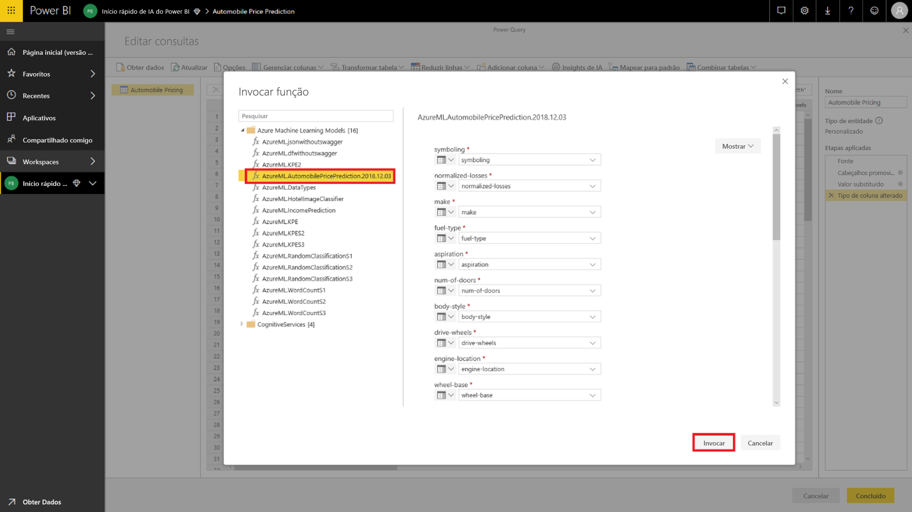

Escolha **Invocar** para visualizar a versão prévia da saída do modelo do Azure ML como uma nova coluna na tabela de entidades. Você também verá a invocação do modelo como uma etapa aplicada da consulta.

A saída do modelo é mostrada como um registro na coluna de saída. É possível expandir a coluna para produzir parâmetros de saída individuais em colunas separadas. No nosso caso, estamos interessados apenas nos _Rótulos Classificados_ que contêm o preço previsto do veículo.  Então, desmarcamos o restante e escolhemos **OK**.

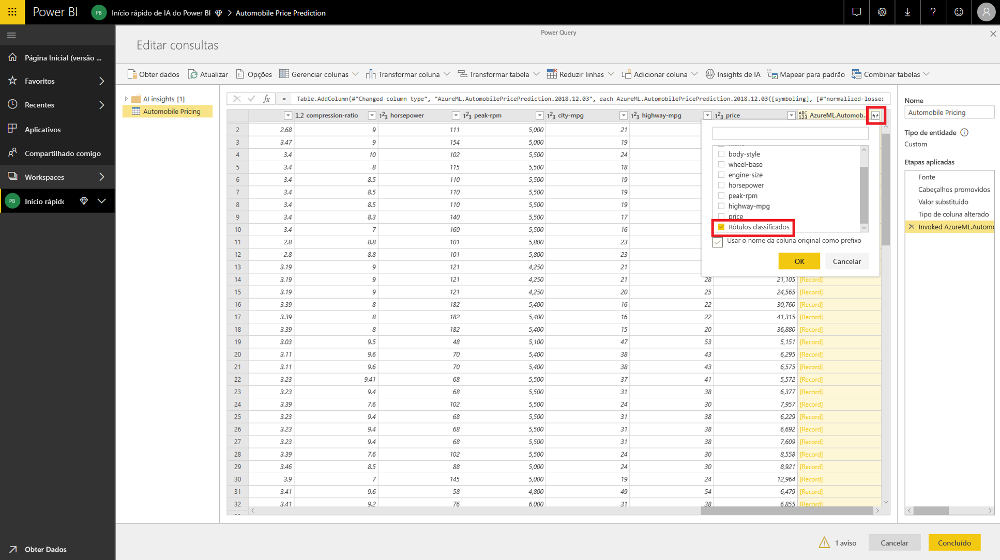

A coluna *Rótulos Classificados* resultante tem a previsão de preço do modelo do Azure ML.

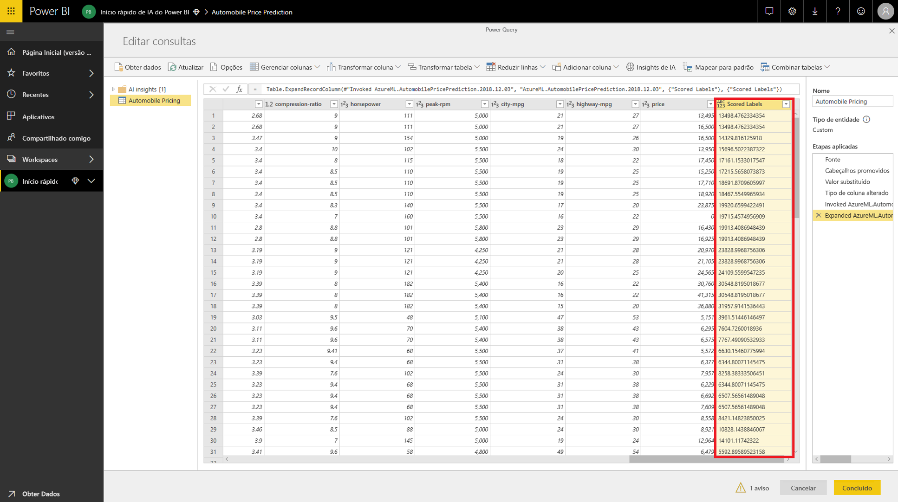

Depois de salvar seu fluxo de dados, o modelo do Azure ML será automaticamente chamado quando o fluxo de dados for atualizado para qualquer linha nova ou atualizada na tabela de entidades.

## Limpar recursos

Se você não precisar mais dos recursos do Azure criados com este artigo, exclua-os para evitar cobranças.  Você também pode excluir os fluxos de dados criados se já não precisar deles.

## Próximas etapas

Neste tutorial, você criou uma experiência simples com o Azure Machine Learning Studio usando um conjunto de dados simples utilizando estas etapas:

- Criação e publicação de um modelo do Azure Machine Learning
- Concessão de acesso a um usuário do Power BI para usar o modelo
- Criação de um fluxo de dados
- Aplicação de insights a partir do modelo do Azure ML para o fluxo de dados

Confira mais informações sobre a [Integração do Azure Machine Learning no Power BI (Versão prévia)](service-machine-learning-integration.md).
