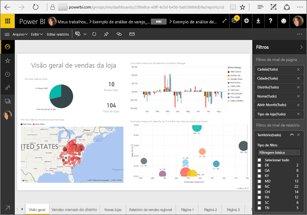
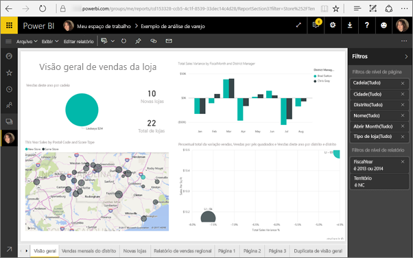
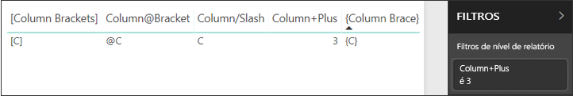
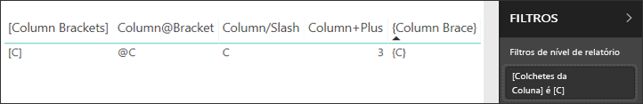

# <a name="filter-a-report-using-query-string-parameters-in-the-url"></a>Filtrar relatórios usando parâmetros da cadeia de caracteres de consulta na URL

Ao abrir um relatório no serviço do Power BI, cada página do relatório tem sua própria URL exclusiva. Para filtrar essa página do relatório, é possível usar o painel Filtros na tela de relatório.  Outra opção é adicionar os parâmetros de cadeia de consulta na URL para filtrar o relatório. Talvez você tenha um relatório que gostaria de mostrar aos colegas, mas antes deseja filtrá-lo previamente para enviar a eles. Uma maneira de filtrar isso é iniciar com a URL padrão do relatório, adicionar os parâmetros de filtro à URL e, em seguida, enviá-los a nova URL inteira por email.



## <a name="uses-for-query-string-parameters"></a>Usos dos parâmetros de cadeia de consulta

Digamos que você esteja trabalhando no Power BI Desktop e queira criar um relatório que contenha links para outros relatórios do Power BI, mas deseje mostrar apenas algumas das informações nos outros relatórios. Primeiro, filtre os relatórios usando os parâmetros de cadeia consulta e salve as URLs. Em seguida, crie uma tabela no Desktop com essas novas URLs de relatório.  Em seguida, publique e compartilhe o relatório.

Alguém que esteja criando uma solução avançada do Power BI também pode usar os parâmetros de cadeia de consulta.  Usando o DAX, ela cria um relatório que gera uma URL do relatório filtrado dinamicamente, com base na seleção que seu cliente faz no relatório atual. Quando os clientes selecionam a URL, eles veem apenas as informações pretendidas. 

## <a name="query-string-parameter-syntax-for-filtering"></a>Sintaxe dos parâmetros da cadeia de caracteres de consulta para filtragem

Com parâmetros, você pode filtrar o relatório usando um ou mais valores, mesmo quando esses valores contêm espaços ou caracteres especiais. A sintaxe básica é razoavelmente simples. Comece com a URL do relatório, adicione um ponto de interrogação e, em seguida, adicione a sintaxe do filtro.

URL?filter=***Table***/***Field*** eq '***value***'


* Os nomes de **Tabela** e **Campo** diferenciam maiúsculas de minúsculas, o **valor** não.
* Os campos ocultos na exibição de relatório ainda podem ser filtrados.

### <a name="field-types"></a>Tipos de campo

O tipo de campo pode ser número, data/hora ou cadeia de caracteres. O tipo usado precisa corresponder ao tipo definido no conjunto de dados.  Por exemplo, a especificação de uma coluna de tabela do tipo "cadeia de caracteres" não funcionará se você estiver procurando um valor de data/hora ou numérico em uma coluna de conjunto de dados definida como data, por exemplo, Table/StringColumn eq 1.

* As **cadeias de caracteres** precisam ser colocadas entre aspas simples, como ‘nome do gerenciador’.
* Os **números** não exigem nenhuma formatação especial
* **Datas e horas** precisam estar entre aspas únicas e ser precedidas pela palavra **DateTime**.

Se ainda estiver confuso, continue lendo e nós explicaremos detalhadamente.  

## <a name="filter-on-a-field"></a>Filtrar em um campo

Suponhamos que a URL do nosso relatório seja a seguinte.


Podemos ver em nossa visualização de mapa (acima) que temos lojas na Carolina do Norte.

>[!NOTE]
>Este exemplo baseia-se na [amostra da Análise de Varejo](sample-datasets.md).
> 

Para filtrar o relatório para mostrar dados somente de lojas em "NC" (Carolina do Norte), inclua a URL com o seguinte:

?filter=Store/Territory eq 'NC'


>[!NOTE]
>*NC* é um valor armazenado no campo **Território** da tabela **Repositório**.
> 

Nosso relatório é filtrado para Carolina do Norte; todas as visualizações na página de relatório mostram dados apenas da Carolina do Norte.



## <a name="filter-on-multiple-fields"></a>Filtrar em vários campos

Também é possível filtrar em vários campos adicionando mais parâmetros à sua URL. Vamos voltar ao nosso parâmetro de filtro original.

```
?filter=Store/Territory eq 'NC'
```

Para filtrar por campos adicionais, adicione um '**and**' e outro campo no mesmo formato que o descrito acima. Veja um exemplo.

```
?filter=Store/Territory eq 'NC' and Store/Chain eq 'Fashions Direct'
```

<iframe width="640" height="360" src="https://www.youtube.com/embed/0sDGKxOaC8w?showinfo=0" frameborder="0" allowfullscreen></iframe>

## <a name="operators"></a>Operadores

O Power BI dá suporte a diversos operadores além do '**and**'. A tabela a seguir lista esses operadores, juntamente com o tipo de conteúdo compatível com eles.

|operador  | definição | cadeia de caracteres  | número | Data |  Exemplo|
|---------|---------|---------|---------|---------|---------|
|**and**     | e |  sim      | sim |  sim|  product/price le 200 and price gt 3.5 |
|**eq**     | igual a |  sim      | sim   |  sim       | Address/City eq 'Redmond' |
|**ne**     | diferente de |   sim      | sim  | sim        |  Address/City ne 'London' |
|**ge**     |  maior ou igual       | não | sim |sim |  product/price ge 10
|**gt**     | maior que        |não | sim | sim  | product/price gt 20
|**le**     |   menor ou igual      | não | sim | sim  | product/price le 100
|**lt**     |  menor que       | não | sim | sim |  product/price lt 20
|**in****     |  incluindo       | sim | sim |  sim | Student/Age in (27, 29)


\** Quando **in** é usado, os valores à direita de **in** podem ser uma lista separada por vírgulas entre parênteses ou uma única expressão que retorna uma coleção.

### <a name="numeric-data-types"></a>Tipos de dados numéricos

Um filtro de URL do Power BI pode incluir números nos formatos a seguir.

|Tipo de número  |Exemplo  |
|---------|---------|
|**inteiro**     |   5      |
|**longo**     |   5L ou 5l      |
|**duplo**     |   5.5 ou 55e-1 ou 0.55e+1 ou 5D ou 5d ou 0.5e1D ou 0.5e1d ou 5.5D ou 5.5d ou 55e-1D ou 55e-1d     |
|**decimal**     |   5M ou 5m ou 5.5M ou 5.5m      |
|**flutuante**     | 5F ou 5f ou 0.5e1F ou 0.5e-1d        |

### <a name="date-data-types"></a>Tipos de dados de data

O Power BI dá suporte ao OData V3 e V4 para os tipos de dados **Data** e **DateTimeOffset**.  As datas são representadas usando o formato EDM (2019-02-12T00:00:00), de modo que, quando você especifica uma data como AAAA-MM-DD, o Power BI a interpreta como AAAA-MM-DDT00:00:00.

Por que essa distinção é importante? Digamos que você crie o parâmetro de cadeia de consulta **Table/Date gt 2018-08-03**.  Os resultados incluirão 3 de agosto de 3, 2018 ou começarão em 4 de agosto de 4, 2018? Como o Power BI converte sua consulta em **Table/Date gt 2018-08-03T00:00:00**, os resultados incluem todas as datas que têm uma parte de hora diferente de zero, pois essas datas são maiores que **2018-08-03T00:00:00**.

## <a name="special-characters-in-url-filters"></a>Caracteres especiais em filtros de URL

Caracteres especiais e espaços exigem uma formatação adicional. Quando a sua consulta contiver espaços, traços ou outros caracteres não ASCII, prefixe esses caracteres especiais com um *código de escape* começando com um sublinhado e um X (**x**), em seguida, o **Unicode** de quatro dígitos e seguido por outro sublinhado. Se o Unicode tiver menos que quatro caracteres, será necessário preenchê-lo com zeros. Aqui estão alguns exemplos.

|Identificador  |Unicode  | Codificação para o Power BI  |
|---------|---------|---------|
|**Nome da tabela**     | O espaço é 0x20        |  Table_x0020_Name       |
|**Column**@**Number**     |   @ é 0x40     |  Column_x0040_Number       |
|**[Column]**     |  [é 0x0058] é 0x0050       |  _x0058_Column_x0050       |
|**Column+Plus**     | + é 0x2B        |  Column_x002B_Plus       |

Table_x0020_Name/Column_x002B_Plus eq 3 


Table_x0020_Special/_x005B_Column_x0020_Brackets_x005D_ eq '[C]' 

### <a name="use-dax-to-filter-on-multiple-values"></a>Usar o DAX para filtrar vários valores

Outra maneira de filtrar em vários campos é criar uma coluna calculada que concatena dois campos em um único valor. A partir daí, é possível filtrar nesse valor.

Suponhamos, por exemplo, que haja dois campos: Território e Cadeia. No Power BI Desktop, [crie uma nova coluna Calculada](desktop-tutorial-create-calculated-columns.md) (campo) chamada TerritoryChain. Lembre-se que o nome do **Campo** não pode conter espaços. Veja a seguir a fórmula DAX da coluna.

TerritoryChain = [Território] & " - " & [Cadeia]

Publique o relatório no serviço do Power BI e, em seguida, use a cadeia de caracteres de consulta de URL para filtrar e exibir dados somente de lojas Lindseys em NC.

    https://app.powerbi.com/groups/me/reports/8d6e300b-696f-498e-b611-41ae03366851/ReportSection3?filter=Store/TerritoryChain eq 'NC–Lindseys'

## <a name="pin-a-tile-from-a-filtered-report"></a>Fixar um bloco de um relatório filtrado

Após filtrar o relatório usando parâmetros da cadeia de caracteres de consulta, é possível fixar as visualizações do relatório em questão no seu dashboard.  O bloco no dashboard exibe os dados filtrados; a seleção desse bloco do dashboard abre o relatório usado para criá-lo.  No entanto, a filtragem executada usando a URL não é salva com o relatório. Quando você seleciona o bloco do painel, o relatório é aberto em seu estado não filtrado.  Isso significa que os dados exibidos no bloco do painel não correspondem aos dados exibidos na visualização de relatório.

Essa discrepância é útil quando você deseja ver resultados diferentes: filtrados no painel e não filtrados no relatório.

## <a name="considerations-and-troubleshooting"></a>Considerações e solução de problemas

Há alguns pontos a serem considerados ao usar os parâmetros da cadeia de caracteres de consulta.

* Quando o operador *in* é usado, os valores à direita de *in* podem ser uma lista separada por vírgulas entre parênteses.    
* No Servidor de Relatórios do Power BI, você pode [passar parâmetros de relatório](https://docs.microsoft.com/sql/reporting-services/pass-a-report-parameter-within-a-url?view=sql-server-2017.md) incluindo-os em uma URL de relatório. Esses parâmetros de URL não são prefixados, porque são passados diretamente para o mecanismo de processamento de relatório.
* A filtragem da cadeia de caracteres de consulta não funciona com [Publicar na Web](service-publish-to-web.md).
* [Inserir com Web Part de Relatório no SharePoint Online](service-embed-report-spo.md) não é compatível com filtros de URL.
* O tipo de dados Long é (2^53-1) devido a limitações de Javascript.
* Filtros de URL do relatório têm um limite de 10 expressões (10 filtros conectados por AND).

## <a name="next-steps"></a>Próximas etapas

[Fixar uma visualização em um dashboard](service-dashboard-pin-tile-from-report.md)  
[Inscrever-se em uma avaliação gratuita](https://powerbi.microsoft.com/get-started/)

Mais perguntas? [Experimente perguntar à Comunidade do Power BI](http://community.powerbi.com/)
