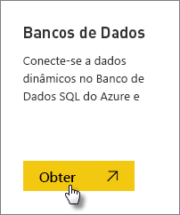
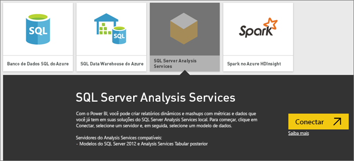
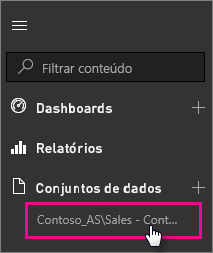

# Dados dinâmicos do SQL Server Analysis Services no Power BI

No Power BI, há duas maneiras pelas quais você pode se conectar a um servidor do SQL Server Analysis Services dinâmico. Em **Obter dados**, você pode se conectar a um servidor do SQL Server Analysis Services ou se conectar [a um arquivo do Power BI Desktop](service-desktop-files.md) ou a uma [pasta de trabalho do Excel](service-excel-workbook-files.md) que já se conecta a um servidor do Analysis Services. Como uma prática recomendada, a Microsoft recomenda usar o Power BI Desktop devido à riqueza do conjunto de ferramentas e à capacidade de manter localmente uma cópia de backup do arquivo do Power BI Desktop.

>[!IMPORTANT]
> * Para conectar-se a um servidor do Analysis Services, um gateway de dados local deverá ser instalado e configurado por um administrador. Para obter mais informações, veja [Gateway de dados local](service-gateway-onprem.md).
> * Ao usar o gateway, seus dados permanecem locais.  Os relatórios criados com base nesses dados são salvos no serviço do Power BI. 
> * [A consulta em linguagem natural por perguntas e respostas](service-q-and-a-direct-query.md) está na visualização para conexões dinâmicas do Analysis Services.

## Para conectar-se a um modelo em Obter dados

1. Em **Meu Workspace**, selecione **Obter dados**. Você também poderá alterar para um workspace de grupo, se houver um disponível.

   

2. Selecione **Bancos de Dados e Mais**.

   

3. Selecione **SQL Server Analysis Services** > **Conectar**.

   

4. Selecione um servidor. Se você não vir servidores listados aqui, isso significa que um gateway e uma fonte de dados não estão configurados, ou que sua conta não está listada na guia **Usuários** da fonte de dados no gateway. Verifique com o seu administrador.

5. Selecione o modelo ao qual você deseja se conectar. Ele pode ser Tabela ou Multidimensional.

Depois de se conectar ao modelo, ele será exibido no seu site do Power BI em **Meu Workspace/Conjuntos de Dados**. Se você for alternado para um workspace de grupo, o conjunto de dados será exibido no grupo.

## Blocos de dashboard

Se você fixar visuais de um relatório no painel, os blocos fixos serão atualizados automaticamente a cada 10 minutos. Se os dados no servidor do Analysis Services local forem atualizados, os blocos serão atualizados automaticamente após 10 minutos.

## Problemas comuns

* Não é possível carregar o erro de esquema de modelo – esse erro ocorre quando o usuário que se conecta ao SSAS não tem acesso ao banco de dados do SSAS, ao cubo e ao modelo.

## Próximas etapas

* [On-premises data gateway (Gateway de dados local)](service-gateway-onprem.md)  
* [Gerenciar fontes de dados do Analysis Services](service-gateway-enterprise-manage-ssas.md)  
* [Solução de problemas do gateway de dados local](service-gateway-onprem-tshoot.md)  

Mais perguntas? [Experimente a Comunidade do Power BI](http://community.powerbi.com/)