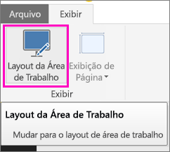
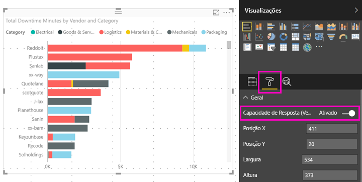

# Otimizar um visual do Power BI para qualquer tamanho
Por padrão, quando você cria um novo relatório, os visuais são *responsivos*, isto é, eles podem mudar dinamicamente para exibir o máximo de dados e insights, independentemente do tamanho da tela. Para relatórios mais antigos, você também pode definir os elementos visuais para serem redimensionados dinamicamente.

Como um visual muda de tamanho, o Power BI prioriza a exibição de dados, por exemplo, removendo o preenchimento e movendo a legenda para a parte superior do visual automaticamente, para que ele continue informativo mesmo quando fica menor. A capacidade de resposta é especialmente útil em visuais no aplicativo móvel do Power BI em telefones.

Qualquer visual com eixos X e Y e segmentações podem ser redimensionados de maneira responsiva.

## Ativar a capacidade de resposta no Power BI Desktop
1. Em um relatório mais antigo no Power BI Desktop, na guia **Exibir**, certifique-se de que você está no **Layout da área de trabalho**.
   
    
2. Selecione um visual e no painel **Visualizações**, selecione a seção **Formatar**.
3. Expanda **Geral** > deslize a opção **Responsivo** para a posição **Ativo**.
   
    
   
     Agora quando você [criar um relatório otimizado para o telefone](../desktop-create-phone-report.md) e adicionar esse visual, ele será redimensionado com sutileza.

## Ativar a capacidade de resposta no serviço do Power BI
Você pode ativar a capacidade de resposta de um visual em um relatório mais antigo do serviço do Power BI. Você precisa ser capaz de editar o relatório.

1. Em um relatório no serviço do Power BI ([https://powerbi.com](https://powerbi.com)), selecione **Editar Relatório**.
2. Selecione um visual e no painel **Visualizações**, selecione a seção **Formatar**.
3. Expanda **Geral** > deslize a opção **Responsivo** para a posição **Ativo**.
   
    
   
     Agora quando você [criar uma exibição para telefone deste relatório](../desktop-create-phone-report.md) e adicionar esse visual, ele será redimensionado com sutileza.

## Próximas etapas
* [Criar relatórios otimizados para os aplicativos de telefone do Power BI](../desktop-create-phone-report.md)
* [Exibir relatórios do Power BI otimizados para seu telefone](../consumer/mobile/mobile-apps-view-phone-report.md)
* Mais perguntas? [Experimente perguntar à Comunidade do Power BI](http://community.powerbi.com/)

