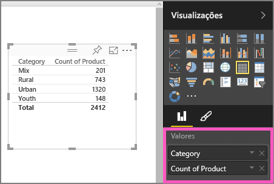
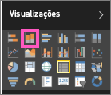

# Parte I: Adicionar visualizações a um relatório do Power BI
Este artigo apresenta uma breve introdução à criação de uma visualização em um relatório usando o serviço do Power BI ou Power BI Desktop.  Para obter um conteúdo mais avançado, [veja a Parte II](power-bi-report-add-visualizations-ii.md). Assista à Amanda demonstrando algumas maneiras diferentes de criar, editar e formatar visuais na tela do relatório. Em seguida, experimente você mesmo, usando o [exemplo Vendas e Marketing](../sample-datasets.md) para criar seu próprio relatório.

<iframe width="560" height="315" src="https://www.youtube.com/embed/IkJda4O7oGs" frameborder="0" allowfullscreen></iframe>

## Abrir um relatório e adicionar uma nova página
1. Abra um [relatório no Modo de Exibição de Edição](../consumer/end-user-reading-view.md). Este tutorial use o [exemplo de Vendas e Marketing](../sample-datasets.md).
2. Se o painel Campos não estiver visível, selecione o ícone de seta para abri-lo. 
   
   
3. Adicione uma página em branco ao relatório.

## Adicionar visualizações ao relatório
1. Crie uma visualização selecionando um campo no painel **Campos** .  
   
   **Comece com um campo numérico** como SalesFact > Vendas $. O Power BI cria um gráfico de colunas com uma coluna.
   
   
   
   **Ou comece com um campo de categoria**, como Nome ou Produto: o Power BI cria uma Tabela e adiciona esse campo ao contêiner **Valores**.
   
   
   
   Ou **comece com um campo com informações geográficas**, como Área Geográfica > Cidade. O Power BI e o Bing Mapas criam uma visualização de mapa.
   
   
2. Crie uma visualização e, em seguida, alterar o tipo. Selecione **Produto > Categoria** e **Produto > Contagem do Produto** para adicioná-los aos **Valores**.
   
   
3. Altere a visualização em um gráfico de colunas selecionando o ícone de gráfico de coluna.
   
   
4. Quando você cria visualizações no relatório, é possível [fixá-las no dashboard](../service-dashboard-pin-tile-from-report.md). Para fixar a visualização, selecione o ícone de pino .
   
   
  

## Próximas etapas
 Continue em [Parte 2: Adicionar visualizações a um relatório do Power BI](power-bi-report-add-visualizations-ii.md)
   
   [Interaja com as visualizações](../consumer/end-user-reading-view.md) no relatório.
   
   [Faça ainda mais com as visualizações](power-bi-report-visualizations.md).
   
   [Salve seu relatório](../service-report-save.md).
