# <a name="best-design-practices-for-reports-and-visuals"></a>Práticas recomendadas de design para relatórios e visuais

Este artigo fornece as práticas recomendadas para criação de relatórios no Power BI. Ele aborda os princípios de design que podem ser aplicados aos relatórios e às páginas, bem como os visuais individuais que compõem relatórios. Muitas dessas práticas recomendadas também se aplicam ao design de dashboard.

> [!NOTE]
> As recomendações dadas neste artigo são diretrizes que você deverá aplicar quando for conveniente. Para cada princípio que descrevemos abaixo, geralmente, há motivos válidos para “quebrar a regra”.

Esperamos que este artigo seja um ponto de partida para você, que você aplique o que aprendeu em seus próprios relatórios e visualizações e continue essa conversa na [Comunidade do Power BI](http://community.powerbi.com/). O uso de design e visualização de relatórios de BI é um tópico relevante no momento. Há muitos líderes de ideias, blogueiros e sites que examinam o design de relatórios de BI com profundidade. Listamos alguns no final do artigo.

> *Estamos sobrecarregados com informações, não por conta do excesso, mas porque não sabemos como controlá-las.*
– Stephen Few

## <a name="a-look-at-the-landscape-and-terminology"></a>Análise do cenário e da terminologia

No Power BI, um relatório pode ter uma ou mais páginas de relatório. Todas as páginas juntas são chamadas de relatório. Os elementos básicos do relatório são visuais (também conhecidos como visualizações), imagens independentes e caixas de texto. Dos pontos de dados individuais e elementos do relatório à página de relatório em si, há diversas opções de formatação.

Vamos começar no estágio de planejamento do relatório, seguir para os princípios básicos de design de relatório e, em seguida, abordar os princípios de design de visuais, concluindo com uma discussão sobre as práticas recomendadas para os tipos de visual individuais.

As diretrizes e instruções detalhadas sobre como criar e usar relatórios do Power BI estão disponíveis em [Conheça o Power BI](https://powerbi.microsoft.com/learning/).

## <a name="before-you-build-your-first-visualization-focus-on-requirements"></a>Antes de criar sua primeira visualização, concentre-se nos requisitos

A criação de um relatório começa antes da criação do primeiro visual. Um bom relatório precisa de planejamento. Conheça os dados com os quais você precisa trabalhar e anote os requisitos do relatório. Faça estas perguntas:

* Qual a necessidade da empresa?

* Como os leitores usarão esses dados?

* Quem usará esses dados?

* Quais decisões o leitor deseja tomar com base nesse relatório?

A resposta para essas perguntas orientará o design. Cada relatório conta uma história. Verifique se a história corresponde à necessidade de negócios. Pode ser uma tentação adicionar visuais que mostram análises impactantes, mas, se elas não corresponderem à necessidade de negócios, o relatório não será útil. Os usuários poderão ficar distraídos com esses visuais. Além disso, talvez que você não possa obter as informações para tomar essa decisão desses dados. Você pode usar esse relatório para medir o que precisa avaliar?

Você pode usar os relatórios para monitorar, descobrir, acompanhar, prever, avaliar, gerenciar, testar e muito mais. Por exemplo, a necessidade de negócios é um relatório de vendas que avalia o desempenho. Você poderá criar um relatório que examina as vendas atuais, compara-as às vendas anteriores e aos concorrentes e que inclui alguns KPIs que disparam alertas. Talvez os leitores possam fazer uma busca detalhada nos números de vendas para ver os fechamentos de lojas ou problemas na cadeia de fornecedores que podem estar afetando as vendas. Outra busca detalhada pode ser a capacidade de examinar as vendas por loja, região, produto, temporada e muito mais.

Conheça os clientes do relatório. Crie um relatório que usa uma terminologia conhecida e oferece dados em um nível de detalhe e complexidade equivalente ao nível de conhecimento dos clientes. Você tem mais de um tipo de cliente? Cada caso é um caso. Crie páginas de relatório separadas com base na experiência. Não se esqueça de rotular cada página com clareza para que os clientes possam se identificar. Outra opção é usar segmentações, para que os clientes possam adaptar a página de acordo com suas necessidades. Envolva o cliente no estágio de planejamento e evite o erro de criar o que você acha que eles precisam. Se você cometer esse erro, prepare-se para recomeçar.

Depois de identificar a necessidade de negócios, os clientes e as métricas que você deseja incluir, a próxima etapa é escolher os visuais certos para contar a história. Apresente-os da maneira mais eficaz possível. Vamos começar com alguns princípios básicos de design de relatórios.

## <a name="principles-of-report-design"></a>Princípios de design de relatórios

Uma página de relatório tem espaço limitado e uma das coisas mais difíceis é ajustar todos os elementos desejados nesse espaço – e ainda fazer com essas informações sejam compreendidas facilmente. Além disso, não subestime o valor de um relatório visualmente atraente. O segredo é encontrar o equilíbrio entre um relatório que seja atraente e útil ao mesmo tempo.

Vamos dar uma olhada no layout, na clareza e na estética.

### <a name="layout-of-the-report-canvas"></a>Layout da tela de relatório

A tela de relatório tem uma quantidade finita de espaço. Se você não puder ajustar todos os elementos em uma única página de relatório, divida o relatório em várias páginas. Você pode personalizar uma página de relatório para um público específico (por exemplo, RH, TI, vendas). Se quiser, deverá ajustá-lo para uma pergunta comercial específica:

* "Como os defeitos estão afetando nosso tempo de inatividade?"

* "Qual é o impacto da nossa campanha de marketing sobre o sentimento?"

Talvez seja melhor abordá-la como uma história progressiva. Por exemplo, a primeira página em uma visão geral ou gancho para chamar a atenção, a segunda página continuando a história de dados, a terceira explora mais profundamente a história e assim por diante. Se o relatório inteiro se ajustar a uma única página, também funciona. Caso contrário, crie páginas de relatório separadas que dividem o conteúdo de forma lógica. Não se esqueça de dar às páginas nomes significativos e úteis.

Considere a possibilidade de ocupar todos os espaços de uma galeria de arte. Você não colocaria 50 obras da arte em uma sala pequena, ocupando-a com cadeiras e pintando cada parede com uma cor diferente. Como curador, você escolheria apenas as partes que tivessem um tema comum. Você os disporia na sala com bastante espaço para os visitantes circularem e pensarem. Você pode até mesmo colocar cartões informativos que descrevem o que eles estão observando. Há uma razão pela qual as galerias mais modernas têm paredes simples!

Neste artigo, vamos começar com um exemplo de relatório que precisa de muito trabalho. Conforme aplicamos nossas práticas recomendadas e os princípios de design, nosso relatório será aprimorado.


**Figura 1: esta página de relatório bagunçada precisa de muito trabalho**

O exemplo acima apresenta vários problemas de design (layout) relacionados ao espaço que abordaremos abaixo:

* Alinhamento, ordem e uso de proximidade

* Uso inadequado de espaço e classificação

* Desordem

### <a name="alignment-order-and-proximity"></a>alinhamento, ordem e proximidade

O layout dos elementos do relatório afeta a compreensão e orienta o leitor pela página de relatório. A forma como os elementos são colocados e posicionados conta uma história. O texto pode ser “comece aqui e, depois, veja aqui” ou “esses três elementos estão relacionados entre si”.

* Na várias culturas, as pessoas olham um texto da esquerda para a direita e de cima para baixo. Posicione o elemento mais importante no canto superior esquerdo do relatório. Organize também o restante dos visuais de uma maneira que leva à navegação lógica e à compreensão das informações.

* Posicione os elementos que exigem que o leitor faça uma escolha à esquerda das visualizações na qual a opção causará impacto: segmentações, por exemplo.

* Coloque os elementos relacionados à posição perto entre si. A proximidade indica a relação entre os elementos.

* Outra maneira de transmitir as relações é adicionar uma borda ou uma cor da tela de fundo em torno dos elementos relacionados. Por outro lado, adicione um divisor para distinguir entre diferentes seções de um relatório.

* Use o espaço em branco para dividir visualmente as seções da página de relatório.

* Preencha a página de relatório. Se você achar que há espaço em branco demais, aumente o tamanho das visualizações ou diminua o tamanho da tela.

* Reflita cuidadosamente sobre o dimensionamento dos elementos do relatório. Não deixe que a disponibilidade de espaço determine o tamanho de uma visualização.

* Faça com que o tamanho dos elementos importantes fique maior em relação aos outros ou adicione um elemento visual como uma seta para chamar a atenção.

* Alinhe os elementos na página de relatório, de forma simétrica ou assimétrica intencionalmente.

Vamos examinar o alinhamento em mais detalhes.

#### <a name="alignment"></a>Alinhamento

O alinhamento não significa que os diferentes componentes precisem ter o mesmo tamanho. Isso não significa que você deve ter o mesmo número de componentes em cada linha do relatório. Isso apenas significa que há uma estrutura para a página que ajuda na navegação e legibilidade.

Podemos ver em nosso relatório atualizado que alinhamos os componentes do relatório nas bordas esquerda e direita. Também alinhamos cada linha do relatório horizontal e verticalmente. Nossas segmentações estão à esquerda dos visuais que elas afetam.


**Figura 2: nosso exemplo de relatório bagunçado aprimorado com as edições de layout**

O Power BI inclui ferramentas para ajudá-lo a alinhar os visuais. No Power BI Desktop, com vários visuais selecionados, use as opções **Alinhar** e **Distribuir** na guia de faixa de opções **Ferramentas Visuais** para fazer a correspondência da posição dos visuais.

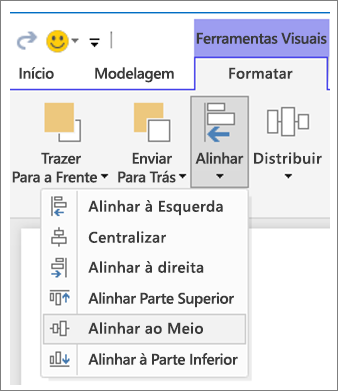

**Figura 3a: Alinhar ferramentas visuais no Power BI Desktop**


**Figura 3b: Alinhar ferramentas visuais no serviço do Power BI**

No serviço do Power BI e no Power BI Desktop, você também tem um controle preciso sobre o tamanho e a posição das visualizações. Você pode encontrar esse controle na guia **Geral** no painel **Formatar** para todas as visualizações:

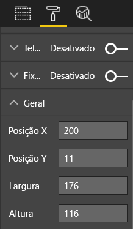

**Figura 4: definir a posição exata do visual**

Em nossa página de relatório de exemplo (Figura 2), o Power BI alinha os dois cartões e a borda grande na **Posição X** em 200.

#### <a name="fit-to-the-space"></a>Ajustar ao espaço

Faça o melhor uso do espaço que você tem. Se você souber como as pessoas visualizarão o relatório, projete-o tendo isso em mente. Reduza os espaços vazios para preencher a tela. Faça tudo o que puder para eliminar a necessidade de barras de rolagem em visuais individuais. Preencha o espaço sem fazer com que os visuais pareçam “espremidos”.

##### <a name="adjust-the-page-size"></a>Ajustar o tamanho da página

Ao reduzir o tamanho da página, os elementos individuais ficam maiores em relação à página geral. Desmarque a seleção dos visuais na página e usando a guia **Tamanho da Página** no painel **Formatar**.

Esta é uma página de relatório usando um tamanho de página **4:3** e, em seguida, **16:9**. Observe como o layout combina muito melhor com o tamanho 16:9. Há ainda espaço suficiente para remover a barra de rolagem do segundo visual.

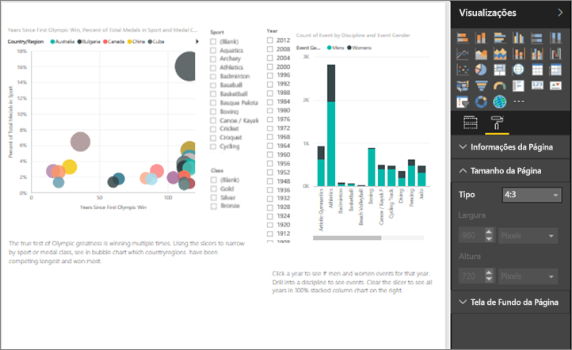

**Figura 5a: o relatório na proporção de tamanho de página 4:3**

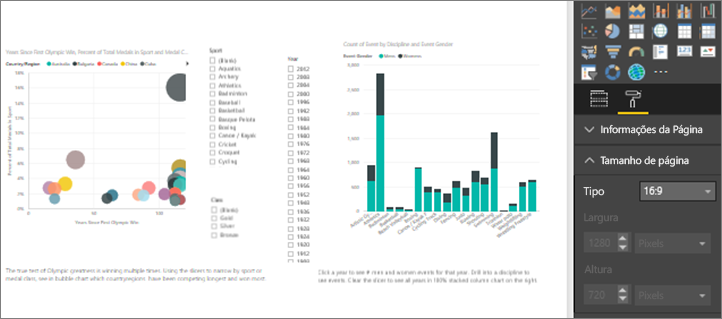

**Figura 5b: O relatório na proporção de tamanho de página 16:9**

As pessoas verão seu relatório na taxa de proporção de 4:3, 16:9 ou outra? Em telas pequenas ou enormes? Elas verão seu relatório em todos os tamanhos e proporções de tela possíveis? Crie o relatório com isso em mente.

Nossa página de relatório de exemplo parece um pouco “espremida”. Sem nenhum visual selecionado:

1. Selecione  para abrir o painel **Formatar**.

1. Expanda **Tamanho da página**.

1. Para **Tipo**, selecione **Personalizado**.

1. Altere **Altura** para **900**.

    

**Figure 6: aumentar a altura da página**

#### <a name="reduce-clutter"></a>Reduzir a desordem

Uma página de relatório cheia será difícil de ser compreendida em uma visão rápida e poderá ser tão complicada que os leitores nem mesmo vão tentar entendê-la. Elimine todos os elementos do relatório desnecessários. Não adicione recursos que não ajudem na compreensão ou na navegação. A página de relatório precisa transmitir as informações da forma mais clara, rápida e coesa possíveis.

Em seu livro *The Visual Display of Quantitative Information* (A exibição visual de informações quantitativas), Edward Tufte chama isso de “proporção de dados para tinta”. Basicamente, remova qualquer coisa que não seja essencial.

A desordem que você remover aumentará o espaço em branco na página de relatório. Ele lhe dará mais espaço para aplicar as práticas recomendadas que aprendemos na seção [Alinhamento, ordem e proximidade](#alignment-order-and-proximity).

Nosso exemplo já está com uma aparência bem melhor. Removemos elementos que o deixavam cheio e adicionamos formas para agrupar os elementos. A imagem de tela de fundo não existe mais, removemos a forma de seta e a caixa de texto desnecessárias, movemos um visual para outra página do relatório, entre outras coisas. Também aumentamos o tamanho da página para aumentar o espaço em branco.


**Figura 7: nosso exemplo de relatório bagunçado agora arrumado**

### <a name="tell-a-story-at-a-glance"></a>Contar uma história em uma visão rápida

O teste geral deverá ser uma pessoa sem nenhum conhecimento prévio conseguir entender rapidamente o relatório sem a explicação de ninguém. Em uma visão rápida, os leitores podem ver rapidamente do que trata a página e o que cada gráfico e cada tabela significa.

Quando os leitores examinarem o relatório, seus olhos deverão se concentrar no elemento que você deseja que eles vejam primeiro. Seus olhos continuarão da esquerda para a direita e de cima para baixo. Mude esse comportamento adicionando indicações visuais como rótulos de caixa de texto, formas, bordas, tamanho e cor.

#### <a name="text-boxes"></a>Caixas de texto

Às vezes, os títulos das visualizações não são suficientes para contar a história. Adicione caixas de texto para se comunicar com as pessoas que estão vendo seus relatórios. Use caixas de texto para descrever a página de relatório, um agrupamento de visuais ou um visual individual. Elas explicam os resultados ou definir melhor um visual, os componentes do visual ou as relações entre os visuais. Você pode usar as caixas de texto para chamar a atenção com base em critérios diferentes destacados na caixa de texto.

No serviço do Power BI, na barra de menus superior, selecione **Caixa de Texto**. (No Power BI Desktop, selecione **Caixa de Texto** na área **Inserir** da faixa de opções.)

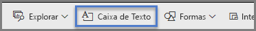

**Figura 8: Adicione uma caixa de texto no serviço do Power BI**

Insira texto na caixa vazia. Em seguida, use os controles para definir a fonte, o tamanho, o alinhamento e muito mais. Use as alças para redimensionar a caixa.

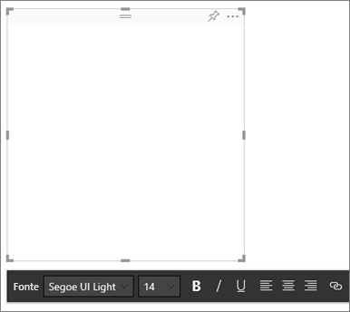

**Figura 9: formatar a caixa de texto**

Mas não exagere. O excesso de texto em um relatório prejudica a leitura em um relatório. Se você achar que sua página de relatório precisa um excesso de texto para torná-la mais compreensível, comece novamente. É possível escolher um visual diferente que conta uma história melhor por conta própria? É possível ajustar os títulos nativos do visual para torná-los mais inteligíveis?

#### <a name="text"></a>Text

Crie um guia de estilo de texto e aplique-o a todas as páginas do relatório. Escolha um número limitado de cores, fontes e tamanhos de texto. Aplique este guia de estilo a elementos textuais. Também aplique-o às opções de fonte que você escolher nas visualizações. Consulte a seção [Títulos e rótulos que fazem parte das visualizações](#titles-and-labels-that-are-part-of-the-visualizations). Defina as regras para quando você usará negrito, itálico, um tamanho da fonte maior, cores específicas etc. Tente evitar usar todas as letras maiúsculas ou sublinhadas.

#### <a name="shapes"></a>Formas

As formas também podem ajudar na navegação e na compreensão. Use formas para agrupar informações relacionadas e realçar dados importantes, e use as setas para direcionar os olhos. As formas ajudam os leitores a entender onde começar e como interpretar o relatório. Em termos de design, isso costuma ser conhecido como *contraste*.

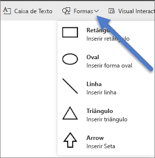

**Figura 10a: Formas de serviço do Power BI**

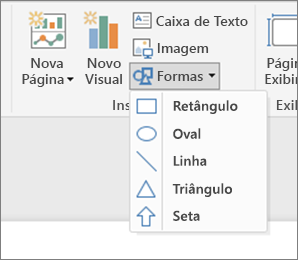

**Figura 10b: formas no Power BI Desktop**

Qual é a aparência de nossa página de exemplo agora? A Figura 11 mostra uma página mais limpa e menos cheia com um uso consistente de tamanhos de texto, fontes e cores. O título da página no canto superior esquerdo nos informa do que trata a página.


**Figura 11: nosso exemplo de relatório com a aplicação das diretrizes de texto e adição do título**

Em nosso exemplo, adicionamos o título de uma página de relatório no canto superior esquerdo: no primeiro lugar que os leitores olham. O tamanho da fonte é 28 e a fonte é Segoe Bold para ajudar a destacá-lo do restante da página. O guia de estilo do nosso texto não sugere plano de fundo, títulos pretos, legendas e rótulos. Aplicamos isso a todos os elementos visuais na página, sempre que possível (os eixos de gráfico de combinação e os rótulos não são editáveis). Além disso, esses elementos foram configurados de acordo com as especificações do guia de estilo:

* Cartões: **Rótulo de categoria** definido como **Desativado**, **Título** definido como **Ligado**, 12 pontos, preto e centralizado.

* Títulos de visual: Se **Ativado**, definidos como 12 pontos e alinhados à esquerda.

* Segmentações de dados: **Cabeçalho** definido como **Desativado**, **Título** **Ativado**. Mantenha os **Itens** > **Texto** cinza e com 10 pontos.

* Gráficos de dispersão e de coluna: fonte preta para os eixos X e Y e os títulos, se forem usados.

#### <a name="color"></a>Cor

Use cores para manter a consistência. Falaremos mais abaixo sobre as cores em [Princípios de design de visuais](#principles-of-visual-design). Aqui estamos falando sobre o que está sendo deliberado em sua seleção de cor. Isso deve ser feito de modo que a cor não distraia a leitura do seu relatório. O excesso de cores vivas sobrecarrega os sentidos. O tema desta seção é mais voltado para o que não fazer com as cores.

#### <a name="backgrounds"></a>Telas de fundo

Ao definir telas de fundo para páginas de relatório, escolha cores que não obscurecem o relatório, que combinam com as outras cores na página ou que, geralmente, não prejudicam a vista. Lembre-se de que algumas cores têm um significado inerente. Por exemplo, nos Estados Unidos, normalmente, a cor vermelha em um relatório é interpretada como algo ruim.

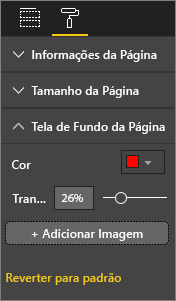

**Figura 12: definir o plano de fundo do relatório**

Você não está criando uma obra de arte, mas um relatório funcional. Escolha uma cor que melhore a legibilidade e a projeção dos elementos do relatório. Um estudo sobre o uso de cores e visualizações em páginas da Web descobriu que um contraste mais alto entre as cores aumenta a velocidade de compreensão. Dois artigos exploram este tópico:

* [O efeito de cor de plano de fundo e texto na pesquisa visual de páginas da Web](https://www.sciencedirect.com/science/article/pii/S0141938202000410)

* [Determinando a percepção dos usuários de características estéticas e de complexidade visual da página da Web](https://www.researchgate.net/publication/301362579_Determining_Users'_Perception_of_Web_Page_Visual_Complexity_and_Aesthetic_Characteristics)

Aplicamos algumas práticas recomendadas de cores em nosso relatório de exemplo (Figuras 20 e 21). O mais admirável foi que alteramos a cor da tela de fundo para preto. O amarelo era muito claro e forçava a vista. Além disso, no gráfico **Contagem de nomes de atletas por ano e classe**, a parte amarela das barras desapareceu na tela de fundo amarela. O uso de uma tela de fundo preta (ou branca) nos dá o contraste máximo e torna os visuais o foco de nossa atenção.

Estas são as etapas adicionais que realizamos para melhorar o relatório de exemplo:

#### <a name="page-title"></a>Título da página

Quando alteramos a tela de fundo para preto, nosso título desapareceu porque o campo da caixa de texto só permite a fonte preta. Para corrigir esse problema, adicione um título da caixa de texto:

1. Com a caixa de texto selecionada, apague o texto.

1. Na guia **Visualizações**, selecione **Título** e **Ative**.

1. Selecione a seta para expandir as opções de **Título**.

1. Insira **Jogos Olímpicos de verão** no campo **Texto do Título**.

1. Em **Cor da fonte**, selecione branco.

    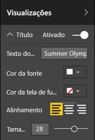

    **Figure 13: adicionar um título de página**

#### <a name="cards"></a>Cartões

Para os visuais do cartão:

1. Selecione  para abrir o painel **Formatar**.

1. Definir **Plano de fundo** como **Ativado**.

1. Selecione branco com **Transparência** de **0%** .

    

1. Defina o **Título** como **Ativado**.

1. Em **Cor da fonte**, selecione branco e em **Cor do plano de fundo**, selecione preto.

    

#### <a name="slicers"></a>Segmentações

Até este ponto as duas segmentações tinham uma formatação diferente. Isso não faz sentido em termos de design. Para ambas as segmentações de dados: 

1. Altere a cor da tela de fundo para azul-piscina.

    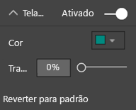

    **Figura 14: alterar a cor do plano de fundo da segmentação de dados**

    Azul-piscina é uma boa opção porque faz parte da paleta de cores da página – você pode vê-la no mapa coroplético, no mapa de árvore e no gráfico de colunas.

1. Adicione uma borda branca fina.

    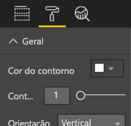

    **Figure 15: adicionar uma borda à segmentação de dados**

1. A fonte cinza é difícil de ser vista em cima do azul-piscina; portanto, altere a cor de **Itens** para branco.

    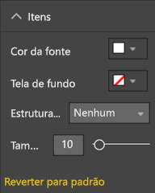

    **Figura 16: alterar a cor da fonte da segmentação de dados**

1. Finalmente, em **Título**, altere a **Cor da fonte** para branco e adicione preto como a **Cor da tela de fundo**.

    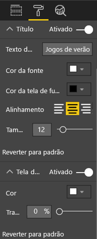

    **Figura 17: formatar o título da segmentação de dados**

#### <a name="rectangle-shape"></a>Forma de retângulo

O retângulo também desapareceu na tela de fundo preta. Para relatar esse problema:

1. Selecione a forma.

1. No painel **Formatar forma**, deslize **Plano de fundo** para **Ativado**.

    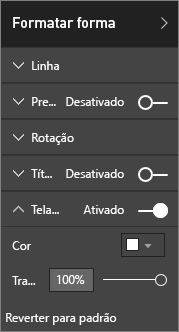

    **Figura 18: formatar a forma**

#### <a name="column-charts-bubble-chart-filled-map-and-treemap"></a>Gráficos de colunas, gráfico de bolhas, mapa coroplético e mapa de árvore

Adicione uma tela de fundo branca aos visuais restantes na página de relatório. No painel **Formatar**:

1. Expanda a opção **Plano de fundo**.

1. Defina a **Cor** como branco.

1. Defina a **Transparência** como 0.

    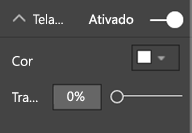

    **Figura 19: adicionar um plano de fundo branco às visualizações restantes**

Será essa a aparência do relatório depois que você o reformatar:


**Figura 20: exemplo de relatório com a aplicação das práticas recomendadas de cores (plano de fundo preto)**


**Figura 21: exemplo de relatório com a aplicação das práticas recomendadas de cores (plano de fundo branco)**

### <a name="aesthetics"></a>Estética

Discutimos grande parte do que consideraríamos estética acima: alinhamento, cor, opções de fonte e desordem. Há algumas outras práticas recomendadas para design de relatório que vale a pena discutir. Elas têm a ver com a aparência geral do relatório.

Lembre-se de que a função do relatório é atender a uma necessidade de negócios, não ser visualmente agradável. Algum senso estético é necessário, especialmente quando se trata das primeiras impressões. O consultor Tony Bodoh, de Nashville, EUA, explica que “a emoção dispara um meio segundo antes de a lógica entrar em cena”. Primeiro, os leitores reagirão no plano emocional à sua página de relatório. Eles terão mais tempo para se aprofundarem. Se a página parecer desorganizada, confusa ou não profissional, talvez o leitor nunca descubra a história impactante que ela conta.

Wayne Eckerson, blogger e analista do setor na TechTarget, faz uma ótima analogia. Criar um relatório é semelhante a decorar uma sala. Com o tempo, você compra um vaso, um sofá, uma mesa de canto e um quadro. Separadamente, você gosta de todos esses elementos. Embora cada seleção individual seja lógica, em conjunto, os objetos combinam ou disputam a atenção.

Concentre-se nessas coisas:

* Crie um tema ou aparência comum para o relatório e aplique-o a todas as páginas do relatório.

* Use imagens independentes e outros elementos gráficos para apoiar e não se desviar da história real.

* Aplique também todas as práticas recomendadas que abordamos até o momento neste artigo.

## <a name="principles-of-visual-design"></a>Princípios de design de visuais

Examinamos os princípios do design de relatórios: como organizar os elementos do relatório para que eles facilitem a compreensão rápida do relatório. Agora vamos examinar os princípios de design de visuais propriamente ditos. Na próxima seção, vamos nos aprofundar nos visuais individuais e abordar as práticas recomendadas para alguns dos tipos mais usados.

Por enquanto, vamos deixar de lado nossa página de relatório de exemplo e examinar outros exemplos. Depois de concluirmos os princípios de design de visuais, vamos voltar à nossa página de relatório de exemplo e aplicar o que aprendemos. Forneceremos instruções passo a passo.

### <a name="planning--choose-the-right-visual"></a>Planejamento – escolher o visual certo

Assim como é importante planejar seu relatório antes de começar a criá-lo, cada visual também necessita de planejamento. Pergunte-se: "qual história estou tentando contar com este visual" e descubra qual tipo de visual contará melhor a história. Você poderia mostrar o progresso ao longo de um ciclo de vendas como um gráfico de barras, mas um gráfico de cascata ou de funil não seria melhor? Para obter ajuda com esse processo, leia a última seção deste artigo [Tipos de visual e práticas recomendadas](#visual-types-and-best-practices). Ele descreve as práticas recomendadas para os tipos mais comuns de visual. Não se surpreenda se o primeiro tipo de visual escolhido acabe não sendo a melhor opção. Experimente mais de um tipo de visual para ver qual deles alcança melhor o objetivo.

Compreenda a diferença entre dados categóricos e quantitativos e saiba quais tipos de visual funcionam melhor com tipos de dados específicos. Dados quantitativos costumam ser conhecidos como medidas e, em geral, são numéricos. Dados categóricos costumam ser conhecidos como dimensões e podem ser classificados. Isso é abordado mais detalhadamente em [Escolher a medida certa](#choose-the-right-measure) abaixo.

Evite a tentação de usar tipos de visual sofisticados ou mais complexos para fazer com que o relatório pareça mais impressionante. O que você deseja é a opção mais simples para transmitir sua história. Gráficos de barras horizontais e gráficos de linhas simples podem transmitir informações rapidamente. Eles são conhecidos e convenientes e a maioria dos leitores pode interpretá-los facilmente. Outra vantagem é que a maioria das pessoas lê da esquerda para a direita e de cima para baixo e, portanto, é possível examinar esses dois tipos de gráfico e compreender as informações rapidamente.

O visual precisa de rolagem para contar a história? Evite a rolagem, se possível. Tente aplicar filtros e usar hierarquias/análises. Se esses elementos não removerem a barra de rolagem, escolha um tipo diferente de visual. Se você não conseguir eliminar a rolagem, os leitores tolerarão melhor a rolagem horizontal do que a vertical.

Mesmo quando você escolher definitivamente o melhor visual para a história, talvez você ainda precise de ajuda para contar a história. É nesse momento que os rótulos, títulos, menus, cores e tamanho entram em cena. Abordaremos esses elementos de design mais adiante na seção [Elementos de design](#design-elements).

### <a name="choose-the-right-measure"></a>Escolher a medida certa

A história que o visual conta é interessante? Ela tem alguma importância? Não crie visuais só porque você gosta de criar visuais. Talvez você achou que os dados contariam uma história interessante, mas não foi o caso. Não tenha medo de recomeçar e procurar uma história mais interessante. Talvez a história já exista, mas precise ser avaliada de uma maneira diferente.

Digamos que você deseje avaliar o sucesso de seus gerentes de vendas. Qual medida você usaria para fazer isso? Você avaliaria isso da melhor forma examinando o total de vendas ou o lucro total, o crescimento ao longo do ano anterior ou o desempenho em relação a uma meta? A vendedora Sara pode ter o maior lucro. Se você mostrar o lucro total por vendedor em um gráfico de barras, ela parecerá uma celebridade em comparação com os outros vendedores. Se Sara tiver um alto custo de vendas (despesas de viagem, custos de envio, custos de fabricação etc.), a simples análise das vendas não contará a melhor história.

#### <a name="reflect-reality-dont-distort-reality"></a>Refletir, sem distorcer, a realidade

É possível criar um visual que distorce a verdade. Existe um site em que os fãs de dados compartilham o que eles consideram visuais ruins. O tema comum nos comentários é a decepção com a empresa que criou e distribuiu determinado visual. Um visual ruim deixa claro que a empresa não pode ser confiável.

Portanto, crie visuais que intencionalmente não distorcem a realidade e que não são manipulados para contar a história que você quer que eles contem. Este é um exemplo disso:


**Figura 22: gráfico de realidade distorcida**

Neste exemplo, parece que há uma grande diferença entre as quatro empresas, e que CorpB é muito mais bem-sucedida do que as outras três. Observe que o eixo X não começa no zero e que as diferenças entre as empresas, provavelmente, estão dentro da margem de erro. Aqui estão os mesmos dados com um eixo X que começa no zero.


**Figura 23: gráfico realista**

Os leitores esperam e costumam pressupor que o eixo X começa no zero. Se você decidir não começar do zero, fazer isso de forma a não distorcer os resultados. Adicione uma caixa de texto ou indicação visual para apontar o desvio da regra.

### <a name="design-elements"></a>Elementos de design

Depois de selecionar um tipo e uma medida e criar o visual, é hora de ajustar a exibição para eficácia máxima. Esta seção aborda:

* Layout, espaço e tamanho

* Elementos de texto: rótulos, anotações, menus, títulos

* Classificação

* Interação entre visuais

* Cores

#### <a name="tweaking-visuals-for-best-use-of-space"></a>Ajustar os visuais para o melhor uso de espaço

Se você estiver tentando ajustar vários gráficos em um relatório, maximizar a proporção de dados para tinta ajudará a destacar a história nos dados. Como mencionamos acima, Edward Tufte inventou o termo “proporção de dados para tinta”. O objetivo é remover o máximo de marcas possíveis de um gráfico sem comprometer a capacidade do leitor de interpretar os dados.

No primeiro conjunto de gráficos abaixo, há títulos e rótulos de eixo redundantes: **janeiro de 2014**, **abril de 2014** e assim por diante. Nos títulos, **por Data** é repetido. Os títulos dos gráficos também precisam de um espaço horizontal dedicado em cada um deles. Ao removermos os títulos de gráfico e ativarmos rótulos de eixo individuais, removemos também um pouco de tinta e temos um melhor uso do espaço total. Podemos remover os rótulos de eixo dos dois gráficos principais para reduzir um pouco mais o uso de tinta e usar mais espaço para os dados.

Se, em algum momento específico, você desejar destacar algo, poderá desenhar linhas ou retângulos atrás de todos os gráficos. Fazer isso ajuda a chamar a atenção para cima e para baixo, como ajuda para as comparações.

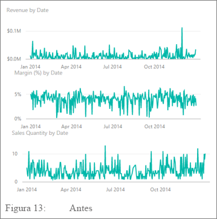

**Figura 24: antes**


**Figura 25: depois**

**Para ativar e desativar os títulos dos eixos**

1. Selecione o visual para torná-lo ativo.

1. Selecione  para abrir o painel **Formatar**.

1. Expanda as opções para o **Eixo X** ou **Eixo Y**.

1. Arraste o controle deslizante para o **Título** para ativar ou desativar.

    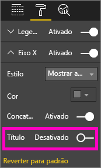

    **Figura 26: ativar e desativar os títulos dos eixos**

##### <a name="to-turn-axis-labels-on-and-off"></a>Para ativar e desativar os rótulos de eixo

1. Selecione o visual para torná-lo ativo.

1. Selecione  para abrir o painel **Formatar**.

1. Ao lado do **Eixo x** e **Eixo y** estão os controles deslizantes.

1. Arraste o controle deslizante para ativar ou desativar os rótulos de eixo.

    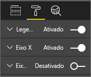

    **Figura 27: ativar e desativar os rótulos dos eixos**

    > [!TIP]
    > Um dos cenários em que você poderia desativar os rótulos do eixo Y seria se você tivesse ativado os **Rótulos de dados**.

##### <a name="to-remove-visual-titles"></a>Para remover os títulos de visuais

1. Selecione o visual para torná-lo ativo.

1. Selecione  para abrir o painel **Formatar**.

1. Defina o controle deslizante de **Título** como **Desativado**.

    

    **Figura 28: remover os títulos de visuais**

Considere como os leitores exibirão o relatório. Verifique se seus elementos visuais e o texto estão grandes e escuros o suficiente para que as pessoas possam ler. Se você tiver um visual proporcionalmente maior na página, os leitores poderão pressupor que ele é o mais importante. Coloque espaço suficiente entre os visuais para que o relatório não pareça cheio e confuso. Alinhe os visuais para ajudar a direcionar os olhos dos leitores.

##### <a name="to-resize-a-visual"></a>Para redimensionar um visual

1. Selecione o visual para torná-lo ativo.

1. Capte e arraste uma das alças para ajustar o tamanho.

    

    **Figura 29: redimensionar visual**

##### <a name="to-move-a-visual"></a>Para mover um visual

1. Selecione o visual para torná-lo ativo.

1. Selecionar e manter a barra de garra na parte central superior do visual

1. Arraste o visual para o novo local.

    

    **Figura 30: mover um visual**

#### <a name="titles-and-labels-that-are-part-of-the-visualizations"></a>Títulos e rótulos que fazem parte das visualizações

Verifique se os títulos e rótulos são fáceis de ler e autoexplicativos. O texto dos títulos e rótulos deve estar em um tamanho ideal com cores que se destacam. Você se lembra do nosso guia de estilo (consulte [Texto](#text) anteriormente no artigo)? Limite o número de cores e tamanhos – o excesso de tamanhos de fonte e cores diferentes faz com que a aparência da página fique carregada e confusa. Use a mesma cor da fonte e o tamanho para o título de todos os elementos visuais na página do relatório. Além disso, escolha o mesmo alinhamento para todos os títulos na página do relatório.

**O painel Formatar**

Para cada uma das alterações de formatação listadas abaixo, selecione o ícone  para abrir o painel **Formatar**.


**Figura 31: Abrir o painel Formatar**

Em seguida, selecione o elemento visual a ser ajustado e verifique se ele está definido como **Ativado**. Os exemplos de elementos visuais são: **Eixo X**, **Eixo Y**, **Título**, **Rótulos de dados** e **Legenda**. O exemplo abaixo mostra o elemento **Título**.

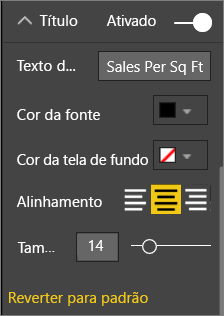

**Figura 32: formatar um título de visual**

##### <a name="set-the-text-size"></a>Definir o tamanho do texto

Você pode ajustar o tamanho do texto em títulos e rótulos de dados, mas não em eixos X ou Y ou legendas. Para rótulos de dados especificamente, brinque com as **Unidades de exibição** e o número de **Casas decimais**. Você acabará encontrando o nível de detalhe ideal para exibir as informações em seu relatório.

##### <a name="set-the-text-alignment"></a>Definir o alinhamento de texto

Você pode escolher um alinhamento de título à esquerda, à direita ou no centro. Escolha uma opção e aplique essa mesma configuração a todos os visuais da página.

##### <a name="set-the-text-position"></a>Definir a posição do texto

Ajuste a posição do texto em alguns eixos Y e na legenda. Seja qual for a opção escolhida, faça o mesmo para os outros eixos Y e as outras legendas da página.

##### <a name="set-the-title-and-label-length"></a>Definir o título e o tamanho de rótulo

Ajuste o tamanho de títulos, títulos de eixo, rótulos de dados e legendas. Se você optar por exibir um desses elementos, ajustar o tamanho (juntamente com o tamanho do texto) garante que o Power BI não truncará os valores:

* Para **Título** e **Legenda**, a configuração é **Texto do título**. Insira o título real que será exibido no visual.

* Em **Eixo x** e **Eixo y**, a configuração é **Estilo** e você seleciona uma opção em uma lista suspensa.

* Em **Rótulos de dados**, as configurações são **Exibição** e **Decimal**. Use a lista suspensa **Exibição** para selecionar as unidades de medida: **milhões**, **milhares**, **nenhum**, **automático** etc. Use o campo **Decimal** para informar ao Power BI quantas casas decimais serão exibidas.

##### <a name="set-the-text-color"></a>Definir a cor do texto

Ajuste a cor do texto para títulos, eixos e rótulos de dados.

#### <a name="titles-and-labels-that-arent-part-of-the-visualizations"></a>Títulos e rótulos que não fazem parte das visualizações

Anteriormente neste artigo, abordamos a adição de caixas de texto a páginas de relatório. Às vezes, os títulos das visualizações não são suficientes para contar a história. Adicione caixas de texto para transmitir informações adicionais para os leitores de seus relatórios.

Para evitar que a página de relatório fique muito confusa ou carregada, seja consistente no uso de alinhamento, tamanhos, cores e fontes de caixa de texto. Para fazer uma alteração ao texto em uma caixa de texto, selecione a caixa de texto para revelar o menu de formatação.


**Figura 33: formatar a fonte usada em uma caixa de texto**

#### <a name="sorting"></a>Classificação

Uma oportunidade simples para fornecer análises mais rápidas é definir a classificação dos visuais. Por exemplo, classificar os gráficos de barras em ordem crescente ou decrescente com base no valor das barras permite que você mostre informações incrementais significativas rapidamente sem usar mais espaço.

Para classificar um gráfico:

1. Selecione as reticências no canto superior direito do gráfico.

1. Selecione **Classificar**.

1. Escolha o campo pelo qual você deseja classificar e a direção.

Para obter mais informações, confira [Alterar a classificação de um visual](../consumer/end-user-change-sort.md).

#### <a name="chart-interaction-and-interplay"></a>Interação entre gráficos

Um dos recursos mais interessantes do Power BI é a capacidade de editar o modo como os gráficos interagem entre si. Por padrão, os gráficos têm realce cruzado: quando você seleciona um ponto de dados, os dados relacionados de outros gráficos ficam iluminados e os dados não relacionados, esmaecidos. Você pode substituir esse comportamento para usar um gráfico como um filtro verdadeiro. Isso economizará espaço na página. No serviço do Power BI, selecione **Interações visuais** na barra de menus para fazer a alteração.

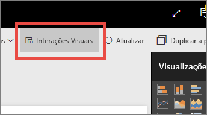

**Figura 34: interações de visual**

Em seguida, para cada visual da página, decida se deseja que o visual selecionado seja filtrado, realçado ou não tenha nenhuma ação. Você não pode realçar todos os elementos visuais. Para elementos visuais que você não consegue realçar, o controle de realce não estará disponível. Para obter mais informações, confira [Interações entre visuais no Power BI](../consumer/end-user-interactions.md).

> [!TIP]
> Para os leitores que estão conhecendo o Power BI agora, essa capacidade de selecionar e interagir com relatórios pode não ser imediatamente óbvia. Adicione caixas de texto para ajudá-los a entender no que eles podem selecionar para descobrir mais informações.

#### <a name="the-use-of-color-in-visuals"></a>O uso de cores em visuais

Anteriormente neste artigo, falamos sobre a importância de ter um plano de como você pretende usar as cores em um relatório. Esta seção trará alguma repetição, mas, basicamente, se aplica a como você usa as cores em visuais individuais. Os mesmos princípios se aplicam: usar as cores para tornar o relatório coeso, adicionar ênfase aos dados importantes e melhorar a compreensão do leitor sobre o visual. Usar um número excessivo de cores pode causar distração. Isso prejudica a leitura. Não comprometa a compreensão para fins estéticos. Apenas adicione cores se elas melhorarem a compreensão.

> [!TIP]
> Conheça seu público e as regras de cores inerentes. Por exemplo, nos Estados Unidos, verde geralmente significa “bom” e vermelho normalmente significa “ruim”.

As seções a seguir abordam:

* Cores de dados

* Cores do rótulo de dados

* Cores de valores categóricos

* Cores de valores numéricos

##### <a name="use-colors-to-highlight-interesting-data"></a>Usar as cores para realçar dados interessantes

A maneira mais simples de usar as cores é alterar uma ou mais cores do ponto de dados para chamar a atenção para ele. Neste exemplo, a cor muda quando os Jogos Olímpicos passaram de um ciclo de 4 anos para um ciclo de 2 anos de jogos alternados de Inverno e Verão.


**Figura 35: usar as cores para contar uma história**

Você pode alterar as cores de ponto de dados na guia **Cores de dados** do painel **Formatar**. Para personalizar cada ponto de dados individualmente, verifique se a opção **Mostrar tudo** está definida como **Ativada**.

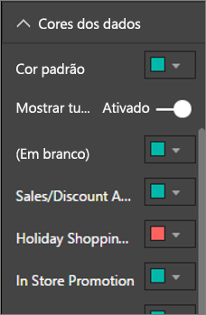

**Figura 36: definir as cores do ponto de dados**

> [!NOTE]
> O Power BI aplica um tema padrão aos visuais de relatório. Os designers escolhem as cores do tema para fornecer variedade e contraste. Para desviar da paleta de temas padrão, selecione **Cor personalizada**.
>
> 
>
> **Figura 37: escolher uma cor personalizada**

No Power BI Desktop, você pode até mesmo realçar **Exceções** ou uma seção de uma linha usando uma segunda série:


**Figura 38: Usar o Power BI Desktop para plotar exceções**

Aqui, os valores da série **Exceções** só existem nos casos em que a temperatura média de agosto cai abaixo de 60. Fizemos isso criando uma coluna calculada DAX usando esta fórmula:

```
Outliers = if(Editions[Temp]<60, Editions[Temp], BLANK())
```

Em nosso exemplo, havia três exceções: **1952**, **1956** e **2000**.

##### <a name="colors-for-labels-and-titles"></a>Cores de títulos e rótulos

Ao explorar todas as opções de formatação disponíveis, você encontrará vários lugares diferentes para adicionar cores a títulos e legendas. Por exemplo, é possível alterar a cor de rótulos de dados e títulos de eixo. Seja cuidadoso. Em geral, você deseja usar uma única cor para todos os títulos de visual. Assim como acontece com as outras diretrizes neste artigo, há sempre situações e motivos para quebrar as regras. Se você decidir quebrar as regras, faça isso por um bom motivo.

##### <a name="colors-for-categorical-values"></a>Cores de valores categóricos

Normalmente, gráficos com uma série têm um valor categórico na legenda. Por exemplo, cada cor na legenda abaixo representa uma categoria diferente de País/Região.


**Figura 39: cores padrão aplicadas**

Os designers escolhem as cores padrão que o Power BI usa para fornecer uma boa separação de cores entre os valores categóricos, para que eles sejam fáceis de serem distinguidos. Às vezes, as pessoas alteram essas cores de acordo com seu esquema corporativo, mas isso pode causar problemas.


**Figura 40: cores aplicadas como matizes de uma única cor**

Ao manter um único matiz e variar a intensidade da cor, este visual introduziu uma falsa sensação de ordenação entre as categorias. Isso implica que as bolhas mais escuras ficam mais altas ou mais baixas em alguma escala do que os matizes mais claros. Com exceção da ordem alfabética, normalmente, não existe uma ordem inerente a essa classificação de valor categórico.

Para alterar as cores padrão, selecione  Para abrir o painel **Formatar** e selecione **Cores de dados**.

##### <a name="colors-for-numerical-values"></a>Cores de valores numéricos

Para campos que têm alguma ordem inerente e valores numéricos, você também pode colorir os pontos de dados pelo valor. Colorir os pontos de dados por valor pode ser útil para mostrar o espalhamento de valores pelos dados e também para permitir que o Power BI mostre duas variáveis em um único gráfico. O gráfico a seguir deixa claro que, embora a China tenha a maior contagem de medalhas, o Japão e a Tailândia participaram em mais Jogos Olímpicos.


**Figura 41: colorir pontos de dados pelo valor**

Para criar este gráfico:

1. Selecione o visual para torná-lo ativo.

1. Selecione  para abrir o painel **Formatar**.

1. Selecione **Cores de dados** > opção > **Formatação condicional**:

    

    **Figura 42: Selecione a formatação condicional**

1. Ajuste as cores na caixa de diálogo **Cor padrão - *Cores de dados*** .

    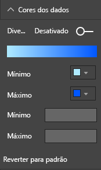

    **Figura 43: ajustar as cores usadas para saturação**

Você também pode usar cores para enfatizar a variação em torno de um valor central. Por exemplo, colorir valores positivos com verde e valores negativos com vermelho. Fique atento às diferenças culturais ao atribuir cores a valores positivos ou negativos. Nem todas as culturas usam vermelho para coisas ruins e verde para boas.


**Figura 44: cor para enfatizar a variação em torno de um valor central**

### <a name="principles-of-visual-design--applied-to-example-report-page"></a>Princípios de design de visuais – aplicados à página de relatório de exemplo

Agora vamos usar os princípios de visuais abordados acima e aplicá-los ao nosso relatório de exemplo.


**Figura 45: nosso relatório de exemplo (antes)**


**Figura 46: nosso relatório de exemplo (depois)**

#### <a name="what-did-we-do"></a>O que fizemos?

| Item | Descrição |
| ---- | ----------- |
| Segmentação de Dados | Removemos os espaços em branco das segmentações adicionando um filtro de nível de página e selecionando somente **Ouro**, **Prata**, **Bronze**. <br> Alteramos **Controles de Seleção** para **Desativado** em **Seleção Única** e **Selecionar Tudo**. |
| Bolhas | Há tantos itens na legenda que eles só são exibidos após rolar uma barra de rolagem na tela. Removemos a legenda e ativamos **Rótulos de categoria**. Os clientes podem focalizar as bolhas para ver os detalhes.<br> Abreviamos o título e removemos “por país/região”, já que isso parece óbvio. <br> **Ativamos** os rótulos de eixos em ambos para facilitar a compreensão do gráfico. |
| Mapa coroplético | Alteramos as **Cores de dados** para destacá-las mais. <br> Ativamos **Divergente** e definimos o **Mínimo** como rosa e o **Máximo** como vermelho.
| Mapa de árvore | Removemos o filtro que foi definido como somente EUA. <br> Definimos os **Rótulos de dados** como uma casa decimal. <br> O visual usava o campo **Classe** que não é muito útil porque ele quase sempre será 33% para as 3 medalhas: Ouro, Prata e Bronze. <br> Selecionamos um campo diferente e mais interessante, **Sexo**. Para design, alteramos Aquático para azul e Atlético para cinza.
| Gráfico de barras superior | Abreviamos o título, removemos rótulos de dados e desativamos o título da legenda. <br> Alteramos a ordem das palavras do título para que fosse correspondente ao gráfico abaixo.
| Gráfico de barras inferior | Classificamos por ano em ordem crescente para que fosse correspondente ao gráfico acima. <br> Alteramos as cores para que fossem correspondentes à classe. <br> Alteramos o título. <br> Desativamos a legenda para obter mais espaço para os dados. <br> Ativados os rótulos de dados. Eles não aparecerão no relatório porque o visual é muito pequeno para os rótulos sejam fáceis de ler. Eles serão exibidos quando o leitor for aberto no visual no modo **Foco**. Saiba mais sobre o [modo Foco](../consumer/end-user-focus.md). <br> Adicionado **Contagem de eventos (distinta)** à **Dicas de ferramenta**. Agora quando você focaliza uma coluna empilhada, as dicas de ferramenta também informam quantos eventos as pessoas concluíram no ano. |
| Interações Visuais | Desativamos as interações em ambos os cartões, pois desejo que eles sempre mostrem o total de jogos e esportes. |

## <a name="visual-types-and-best-practices"></a>Tipos de visual e práticas recomendadas

O Power BI fornece vários tipos de visual nativamente. Adicione os visuais personalizados disponíveis da Microsoft e da comunidade do Power BI e o total de opções será enorme para documentar aqui. Vamos examinar alguns dos tipos de visual nativos mais utilizados.

### <a name="line-charts"></a>Gráficos de linhas


Gráficos de linhas são uma maneira eficiente de examinar dados ao longo do tempo. Analisar dados em tabelas não aproveita, de fato, a velocidade na qual nossos picos identificam picos, vales, ciclos e padrões. O exemplo abaixo mostra as tendências no número de medalhas entregues e de atletas que ganharam essas medalhas.


**Figura 47: gráficos de linhas**

#### <a name="best-practices"></a>Práticas recomendadas

* Quando as pessoas olham os gráficos de linhas, a primeira coisa que veem é a forma da curva. Você precisa ter um eixo X que torna a curva significativa nesse momento ou ter categorias de distribuição. Se você colocar campos categóricos como produto ou geografia no eixo X, o gráfico de linhas não será interessante. A forma da curva não fornecerá nenhuma informação significativa.

* Se você optar por colocar vários gráficos acima e abaixo um do outro, a fim de facilitar a comparação entre as séries dessa forma, alinhe o eixo X. Use filtros para garantir que o Power BI mostra o mesmo intervalo de valores. Se você estiver examinando intervalos de datas, verifique se eles são os mesmos intervalos de datas. Por exemplo, 1896 a 2012 em ambos os gráficos.

* Faça uso total do espaço. Se isto fizer sentido para seus dados, defina os pontos **Inicial** e **Final** do eixo Y para eliminar o espaço vazio na parte superior e inferior do gráfico. Isso ajuda a manter o foco nos pontos de dados reais. Para definir os pontos **Inicial** e **Final**:

  1. Selecione o visual para torná-lo ativo.

  1. Selecione  para abrir o painel **Formatar**.
  
  1. Expanda a área do **Eixo y** e defina os pontos **Inicial** e **Final**.
  
      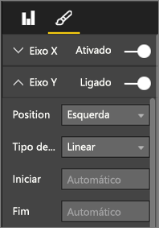
  
      **Figura 48: Definir os pontos inicial e final**

* Outro motivo para definir explicitamente os pontos **Inicial** e **Final** é se você está comparando dois ou mais gráficos na mesma página usando o mesmo campo do eixo Y. Por exemplo, se você estiver examinando as contagens totais de eventos e o Reino Unido tiver contagens que variam de 1 a 70 e a Austrália tiver contagens que variam de 1 a 12, os dois gráficos de linhas exibirão eixos Y muito diferentes (Figura 49). Isso dificulta a comparação em uma visão rápida. Em vez disso, defina os gráficos para que eles usem o mesmo intervalo de eixo Y (Figura 50).
  
  
  
  **Figura 49: Gráficos de linhas com eixos Y diferentes**
  
  
  
  **Figura 50: Gráficos de linhas com eixos Y correspondentes**

Para obter mais informações, confira:

* [Personalizar as propriedades dos eixos X e Y](power-bi-visualization-customize-x-axis-and-y-axis.md)

* [Gráficos de linhas e intervalos irregulares: Uma parceria incompatível](http://www.perceptualedge.com/articles/visual_business_intelligence/line_graphs_and_irregular_intervals.pdf)

* [Introdução à visualização de dados: gráficos de linhas](http://www.columnfivemedia.com/data-visualization-101-line-charts)

### <a name="bar-and-column-charts"></a>Gráficos de barras e colunas


Se os gráficos de linhas são o padrão para examinar dados ao longo do tempo, gráficos de barras são o padrão para examinar um valor específico em categorias diferentes. Se você classificar as barras de acordo com o número, verá instantaneamente os principais valores e a distribuição. Gráficos de barras horizontais funcionam bem com rótulos longos.


**Figura 51: Gráfico de barras horizontais**

#### <a name="best-practices"></a>Práticas recomendadas

* Exiba os rótulos de dados para obter os valores. Isso facilita a identificação de valores específicos. Para exibir os rótulos de dados: 

  1. Selecione o visual para torná-lo ativo.

  1. Selecione  para abrir o painel **Formatar**.
  
  1. Definir **Rótulos de dados** como **Ativado**.

      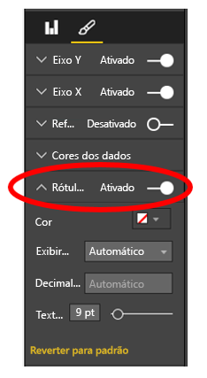

      **Figura 52: ativar rótulos de dados**

* O gráfico de barras acima é útil para comparar uma medida com várias outras em um único ponto no tempo. Embora o gráfico de linhas tenha nos mostrado a tendência ao longo do tempo, o gráfico de barras nos mostra a tendência de uma única categoria em um ponto específico no tempo. Em uma visão rápida, nosso gráfico de barras mostra que a Espanha tem uma das piores taxas de desemprego do mundo, 24,70%.

* Quando um gráfico de Barras ou Colunas inteiro não se ajusta ao espaço alocado, o Power BI adiciona barras de rolagem. Quando possível, e se fizer sentido, estruture o visual e o relatório para mostrar o gráfico inteiro. Assim, o leitor tem uma visão geral de toda a distribuição. Infelizmente, isso não é possível em nosso exemplo, dado o número significativo de países em todo o mundo.

  Uma maneira de limitar os valores incluídos é usar um filtro. Por exemplo, adicione um filtro de **nível de visual** que mostra o país somente se a taxa de desemprego está acima de 20%.

* Você pode fazer drill down (e drill up novamente) nos gráficos de barras e colunas. Essa é uma ótima maneira de empacotar mais informações em um visual sem ocupar mais espaço. O exemplo abaixo tem uma hierarquia para Regiões > Países. Clicar duas vezes na barra de uma região faz uma busca detalhada nos países que compõem a região. Para obter mais informações sobre o modo de análise, confira [Modo de análise em uma visualização no Power BI](../consumer/end-user-drill.md).
  
  
  
  **Figura 53: fazer drill down**

Para obter mais detalhes sobre gráficos de Barras e Colunas:

* [Introdução à visualização de dados: gráficos de barras](http://blog.newscred.com/article/data-visualization-101-bar-charts)

* [Catálogo de visualização de dados: gráfico de barras](http://www.datavizcatalogue.com/methods/bar_chart.html#.VYV-hY3bLJw)

* [Catálogo de visualização de dados: gráfico de barras de vários conjuntos](http://www.datavizcatalogue.com/methods/multiset_barchart.html#.VYV_gI3bLJw)

### <a name="stacked-bar-and-column-charts"></a>Gráficos de barras e colunas empilhadas


Adicione outra dimensão aos gráficos de barras e colunas empilhando categorias diferentes na barra ou na coluna. Agora o gráfico transmite informações sobre uma tendência geral (com base na altura e no tamanho), mas também mostra a influência das categorias sobre essa tendência. O gráfico abaixo mostra o crescimento geral da receita mais alta de equipes de futebol acima de 6 bilhões em 2014.


**Figura 54: gráfico de colunas empilhadas**

Este gráfico de colunas empilhadas mostra que a **receita total** está crescendo ao longo do tempo e que as categorias **Comercial** e **Difusão** estão crescendo de forma contínua ao longo do tempo – contribuindo para o aumento da receita geral. No entanto, esse gráfico não facilita a comparação do impacto que cada uma das três categorias causa sobre as outras. Por exemplo, “como o crescimento da categoria Comercial é comparado ao crescimento da categoria Difusão ou Dia de jogo?” Uma opção melhor para esses dados, ou um visual complementar para esses dados, seria um gráfico de linhas.

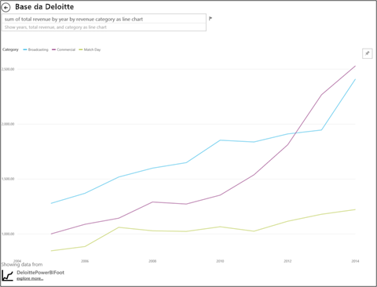

**Figura 55: converter em um gráfico de linhas**

Neste gráfico de linhas, é mais fácil ver como a receita comercial foi a que mais cresceu, seguido por difusão e dia de jogo.

#### <a name="best-practices"></a>Práticas recomendadas

* Assim como ocorre com gráficos de colunas e barras, você tem a opção de exibição horizontal ou vertical. Horizontal será uma opção melhor se você tiver rótulos longos e vertical se tiver dados de série temporal.

* Evite gráficos de Barras e Colunas empilhadas se você desejar mostrar tendências e outros padrões de mudança ao longo do tempo. Outros gráficos, como gráficos de Linhas, fazem um trabalho muito melhor.

* Você também pode ter a distribuição de acordo com o volume total ou como um percentual do total.

* Como Few observou:

    > *(...) é difícil comparar os segmentos de uma barra empilhada. Se você tiver organizado os segmentos lado a lado e todos eles crescessem da mesma linha de base, seria fácil comparar suas alturas, mas quando eles empilhados em cima um do outro, essa tarefa torna-se difícil. Além disso, embora seja razoavelmente fácil ver como (a receita) mudou conforme o mês, é bem difícil ver como (a receita) nas outras (categorias) mudou*.

* Gráficos 100% empilhados são uma boa opção ao usar percentuais que somam 100. No exemplo abaixo, vemos a distribuição de categoria por equipe. Os percentuais são relativos e permitem observar os padrões rapidamente. A receita do Everton é obtida principalmente de Difusão (mais de 70%), enquanto o PSG obtém apenas 20% de sua receita de Difusão. A escolha de uma exibição horizontal facilita o ajuste dos rótulos de equipe e a visualização do impacto do tipo de receita.

  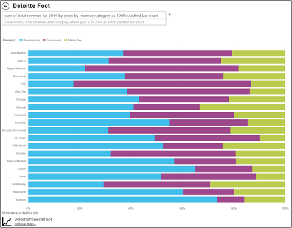

  **Figura 56: gráfico empilhado horizontal**

Para obter mais informações sobre gráficos empilhados:

* [Catálogo de visualização de dados: gráficos de barras empilhadas](http://www.datavizcatalogue.com/methods/stacked_bar_graph.html#top)

* [Quando os gráficos de barras 100% empilhadas são úteis?](http://www.perceptualedge.com/blog/?p=2239)

### <a name="combo-bar-and-column-charts"></a>Gráficos de combinação de barras e colunas


No Power BI, é possível combinar gráficos de colunas e linhas em um gráfico de combinação. As opções são: 

* gráfico de colunas empilhadas 

* gráfico de colunas agrupadas

Economize espaço valioso na tela combinando dois visuais separados em um.

As duas capturas de tela a seguir mostram um cenário antes-e-depois.


 **Figura 57: como dois gráficos separados**

A primeira tem dois visuais separados: um gráfico de Colunas que mostra a população ao longo do tempo e um gráfico de Linhas que mostra o PIB ao longo do tempo. Esses gráficos são um bom candidato para um gráfico de Combinação porque têm o mesmo Eixo X (ano) e valores (2002 a 2012). Por que não os combinar para comparar essas duas tendências em um único visual? Combinar esses dois gráficos permite que você faça uma comparação mais rápida dos dados.


 **Figura 58: como um único gráfico de combinação**

A nova página de relatório tem um único visual: um gráfico de linhas e um gráfico de colunas empilhadas. Poderíamos facilmente ter criado um gráfico de linhas e um gráfico de colunas clusterizadas. Agora é mais fácil procurar uma relação entre as duas tendências. Podemos ver que, até 2008, a população e o PIB seguiam uma tendência semelhante. Mas a partir de 2009, com o nivelamento do crescimento da população, o PIB ficou mais volátil.

#### <a name="best-practices"></a>Práticas recomendadas

* Os gráficos de combinação funcionam melhor quando ambos os visuais têm, pelo menos, um eixo em comum.

* Fique de olho nos eixos! O gráfico de Combinação é fácil de ser lido e interpretado? Ele usa valores e intervalos diferentes? Se a escala do Eixo Y do gráfico de colunas for bem menor do que a escala do Eixo Y do gráfico de linhas, o gráfico de combinação não será significativo. Observe a terceira linha (na cor azul-piscina) lá em baixo, na parte inferior.

   

   **Figura 59: um gráfico de linhas que não deu certo**

  O gráfico de combinação também não será significativo se o gráfico de colunas e o gráfico de linhas usarem duas medidas diferentes e você não criar eixos duplos. Por exemplo, dólares versus por cento. Lembre-se de incluir os dois eixos para ajudar o leitor a compreender o gráfico e considere também a adição de rótulos de eixo.

  Para criar eixos duplos:

    1. Selecione o visual para torná-lo ativo.

    1. Selecione  para abrir o painel **Formatar**.

    1. Expanda o **Eixo Y** e defina **Mostrar secundário** como **Ativado**.

          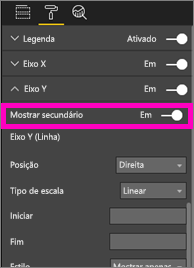

          **Figura 60: mostrar eixo secundário**

    1. Defina o **Eixo Y (coluna)**  > **Título** como **Ativado**.

    1. Defina o **Eixo Y (linha)**  > **Título** como **Ativado**.

  Essa é a aparência do gráfico:

  

  **Figura 61: preferencialmente criar um gráfico de combinação**

* Aproveite os eixos duplos. É uma ótima maneira de comparar várias medidas com intervalos de valores diferentes. Isso ajuda a ilustrar a correlação entre duas medidas em uma visualização.

Para obter mais informações:

* [Gráfico de combinação no Power BI](power-bi-visualization-combo-chart.md)

* [Eixos com escala dupla em gráficos: isso é sempre a melhor solução? ](http://www.perceptualedge.com/articles/visual_business_intelligence/dual-scaled_axes.pdf)

### <a name="scatter-chart"></a>Gráfico de dispersão


Às vezes, temos tantas variáveis que desejamos vê-las juntas, e um gráfico de dispersão pode ser uma maneira útil para obter uma visão geral. Os gráficos de dispersão exibem as relações entre duas (Dispersão) ou três (Bolhas) medidas quantitativas. Um gráfico de dispersão sempre tem dois eixos de valor para mostrar um conjunto de dados numéricos em um eixo horizontal e outro conjunto de valores numéricos em um eixo vertical. O gráfico mostra pontos na interseção de um valor numérico de x e y, combinando esses valores em pontos de dados individuais. O Power BI pode distribuir esses pontos de dados de maneira uniforme ou não pelo eixo horizontal. Depende dos dados.

Um gráfico de bolhas substitui os pontos de dados por bolhas, com o tamanho de bolha representando uma dimensão adicional dos dados.

O gráfico de bolhas abaixo examina a América do Sul e compara o PIB per capita (Eixo Y), soma do PIB (Eixo X) e população por país da América do Sul.


**Figura 62: PIB e população da América do Sul como um gráfico de bolhas**

O tamanho das bolhas representa a população total de um país específico. O Brasil tem a maior população (tamanho de bolha) e a maior participação no PIB da América do Sul. É o mais longo no eixo X. Mas observe que o PIB per capita do Uruguai, do Chile e da Argentina é maior que o do Brasil. É o mais longo do Eixo Y.

Se você adicionar um eixo de reprodução, poderá fingir que é Hans Rosling e contar a história ao longo do tempo: [Usar dados para ter informações e impacto: mostrando o progresso da África com o Power View e PPI pela Microsoft](https://www.youtube.com/watch?v=PbaDBJWCeD4). Para adicionar um eixo de reprodução, arraste um campo de datetime para a seção **Eixo de reprodução**.

#### <a name="best-practices"></a>Práticas recomendadas

* Gráficos de dispersão e de bolhas são excelentes contadores de histórias. Mas eles não são tão úteis ao tentar explorar os dados. Stephen Few indica que:

    > *A vantagem dessa abordagem é quando ela é usada para contar uma história. Quando Rosling narra o que acontece no gráfico conforme as bolhas se movem e seu valor é alterado, apontando para o que ele deseja que nós vemos, as informações ganham vida. No entanto, os gráficos de bolhas animados, são muito menos eficazes para explorar e entender os dados por conta própria. Duvido que Rosling usa esse método para descobrir as histórias, mas apenas para contá-las depois que elas são conhecidas. Não podemos acompanhar mais de uma bolha ao mesmo tempo, pois elas ficam se movendo. Portanto, somos forçados a executar a animação repetidamente para tentar entender o que está acontecendo. Podemos adicionar trilhas às bolhas selecionadas, o que possibilita examinar o caminho completo percorrido por essas bolhas, mas, se você usar as trilhas para mais de algumas bolhas, o gráfico rapidamente ficará muito cheio. Basicamente, o que estou enfatizando é que essa não é a melhor maneira de exibir essas informações para análise e exploração.*

* Adicione os rótulos dos eixos X e Y para ajudar a contar a história. Especialmente com gráficos de bolhas, há muitos componentes em jogo e os rótulos ajudam os leitores a entenderem o visual.

* Adicione rótulos de dados para facilitar a interpretação do visual. Especialmente com gráficos de bolhas, quando você tiver vários itens na Legenda, poderá ser difícil distinguir cores semelhantes. No visual acima, as cores de legenda para Suriname Columbia e Equador são semelhantes.

* Você criou um gráfico de dispersão e está vendo apenas um ponto de dados que agrega todos os valores nos eixos X e Y? O gráfico agrega todos os valores ao longo de uma única linha horizontal ou vertical? Para corrigir a agregação, adicione um campo à área **Detalhes** para informar ao Power BI como agrupar os valores. O campo deve ser exclusivo para cada ponto que você deseja plotar. Para obter ajuda, consulte o [Tutorial de gráficos de dispersão e de bolhas do Power BI](power-bi-visualization-scatter.md).

### <a name="treemap-charts"></a>Gráfico de mapa de árvore


Os mapas de árvore podem ser úteis para dar uma boa visão geral do tamanho relativo dos diferentes componentes que compõem um todo, especialmente quando você pode agrupá-los por categorias. Sempre que você tenta entender um novo assunto, ter um mapa de árvore dos principais componentes pode ser útil para conhecer a distribuição geral.

No primeiro gráfico abaixo, você pode ver imediatamente que o Brasil compõe aproximadamente metade do PIB da América do Sul. Você também pode ver que Colômbia e Chile têm aproximadamente o mesmo tamanho.

Digamos que você queira ter um contexto mais amplo e ainda ter uma ideia do impacto dos principais países contribuintes. Crie hierarquias visuais com membros de categoria (países) aninhados em regiões. Basicamente, o segundo mapa de árvore nos dá uma ideia do tamanho relativo das regiões. Em seguida, dentro de cada região, podemos ver quais países individuais contribuem mais. Podemos ver que há três regiões substanciais: Europa, Ásia e América do Norte. Dentro dessas regiões, podemos ver facilmente os principais países/regiões.

A principal limitação de um mapa de árvore é que é difícil comparar os retângulos menores. É um bom gráfico para uma visão geral, mas os gráficos de barras e de colunas provavelmente são uma opção melhor para ter uma ideia mais precisa do tamanho relativo dos diferentes componentes.

O primeiro mapa de árvore dá uma indicação ampla da ordem de tamanho do PIB. No entanto, é difícil identificar diferenças específicas entre países, especialmente as menores folhas sem rótulo. Para esses dados, quando você compara um único agrupamento, um gráfico de barras ou colunas pode ser uma opção melhor.

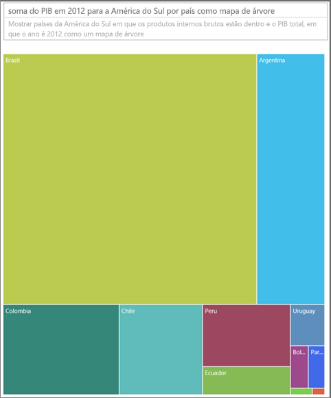

**Figura 63: Comparação dos PIB da América do Sul como um mapa de árvore**

Em seguida, adicionamos região como outro nível de dados. Podemos ver a contribuição geral para o PIB por regiões. Além disso, podemos ver o impacto relativo nas regiões. Lembre-se de que fazer isso com medidas não aditivas (como médias) poderá fazer com que a soma dos detalhes não represente o valor real no nível de agregação.


**Figura 64: PIB por região e país como um mapa de árvore**

Para obter mais informações sobre mapas de árvore:

* [Descoberta de Business Intelligence usando visualizações de mapa de árvore](http://www.perceptualedge.com/articles/b-eye/treemaps.pdf)

* [Catálogo de visualização de dados: Mapa de árvore](http://www.datavizcatalogue.com/methods/treemap.html#.VYhylI3bL7Y)

### <a name="other-charts"></a>Outros gráficos

#### <a name="pie-or-donut-charts"></a>Gráfico de pizza ou de rosca


Em geral, os gráficos de barras, colunas e linhas atenderão a maioria das finalidades. É amplamente reconhecido que os gráficos de pizza e de rosca são difíceis para os humanos interpretarem corretamente e, na verdade. Na verdade, muitas vezes eles podem distorcer os dados. Evite usá-los sempre que possível. Stephen Few tem um artigo excelente sobre sua história e os perigos em [Save the Pies for Dessert](https://www.perceptualedge.com/articles/08-21-07.pdf) (Guarde as pizzas para o fim de semana).

Ele explica a única ocasião em que os gráficos de pizza podem ser úteis: ao comparar relações de parte para o todo. Raramente é melhor do que um gráfico de barras 100% empilhadas.

Outro artigo (e animação) interessante sobre gráficos de pizza pode ser encontrado no [site da Darkhorse Analytics](http://www.darkhorseanalytics.com/blog/salvaging-the-pie).

#### <a name="radial-gauges--kpis"></a>Medidores radiais e KPIs


Os medidores radiais parecem ser um bom visual para indicar o desempenho em relação a uma meta e são populares em painéis executivos. No entanto, eles apresentam duas desvantagens principais. Assim como ocorre com os gráficos de pizza, é difícil de interpretar o ângulo da área sombreada em comparação com a linha completa de destino ou arco de 180°. Ele também usa muito espaço para mostrar uma única métrica.

Uma boa alternativa é um visual de KPI simples:


Os KPIs mostram o valor, o status, a meta, a variação da meta e a tendência na mesma quantidade de espaço. A coloração verde ficará vermelha se os dados não atingirem a meta e poderá ficar amarela se os dados atingirem uma meta intermediária. É muito mais simples de ser lido e interpretado que o medidor.

Para obter mais informações, confira:

* [Gráficos de medidor radial no Power BI](power-bi-visualization-radial-gauge-charts.md)

* [Visuais de KPI](power-bi-visualization-kpi.md)

## <a name="conclusion"></a>Conclusão

Agora é hora de colocar essas práticas recomendadas em ação. Mantenha contato e compartilhe suas próprias práticas recomendadas. Não concorda com nossas recomendações ou descobriu um bom motivo para “quebrar as regras”? Também gostaríamos muito de saber sua experiência.

Mais perguntas? [Experimente a Comunidade do Power BI](http://community.powerbi.com/)

### <a name="book-recommendations"></a>Recomendações de literatura

Há muitos livros excelentes disponíveis hoje para ajudar as equipes a atualizarem o conhecimento sobre as técnicas de design de visuais. O livro *Information Dashboard Design* (Design de Painéis de Informações), de Stephen Few, é uma leitura obrigatória. Ele se aprofunda em mais detalhes em dois outros livros: *Show Me the Numbers* e *Now You See It*. Few e outros autores se inspiraram de Edward R. Tufte, cujo livro *The Visual Display of Quantitative Information* (A exibição visual de informações quantitativas) é considerado um clássico na área. Tufte também escreveu *Visual Explanations* (Explicações visuais), *Envisioning Information* (Vislumbrando informações) e *Beautiful Evidence* (Linda evidência). Novo livro de Andy Kirk *Data Visualization: A Handbook for Data Driven Design* (Visualização de dados: um guia de design orientado a dados) é outra excelente opção. Alguns outros autores recomendados são: Lachlan James, William McKnight e Boris Evelson (Forrester), Darkhorse Analytics.
