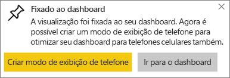
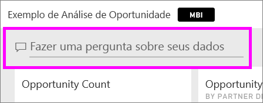
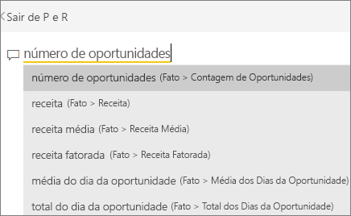

# Visualizações de cartão
Às vezes, um único número é a coisa mais importante que você deseja acompanhar no seu painel ou relatório do Power BI, como as vendas totais, a fatia de mercado ano após ano ou o total de oportunidades. Esse tipo de visualização é chamado de *Cartão*. Assim como em quase todas as visualizações nativas do Power BI, os cartões podem ser criados usando o editor de relatório ou P e R.

## Criar um cartão usando o editor de relatório
Essas instruções usam o exemplo de análise de varejo. Para acompanhar, [baixe o exemplo](../sample-datasets.md) do serviço do Power BI (app.powerbi.com) ou do Power BI Desktop.   

1. Comece em uma página de relatório em branco e selecione **Armazenar** \> campo **Contagem de armazenamento aberto**. Caso esteja usando o serviço do Power BI, você precisará abrir o relatório no [Modo de Exibição de Edição](../service-interact-with-a-report-in-editing-view.md).

    O Power BI cria um gráfico de colunas com um número.

   
2. No painel de Visualizações, selecione o ícone de cartão.

   
6. Focalize sobre o cartão e selecione o ícone de pino  para adicionar a visualização ao painel.

   
7. Fixe o bloco em um painel existente ou em um novo painel.

   * Painel existente: selecione o nome do painel no menu suspenso.
   * Novo painel: digite o nome do novo painel.
8. Selecione **Fixar**.

   Uma mensagem de Êxito (perto do canto superior direito) informa que a visualização foi adicionada, como um bloco, ao painel.

   
9. Selecione **Ir para o dashboard**. Nele, você pode [editar e mover](../service-dashboard-edit-tile.md) a visualização fixada.

## Criar um cartão a partir de uma caixa de perguntas de P e R
A caixa pergunta de P e R é a maneira mais fácil de fazer um Cartão. A caixa de perguntas P e R está disponível no serviço do Power BI de um dashboard ou relatório e na exibição de relatório da Área de Trabalho. As etapas abaixo descrevem como criar um Cartão a partir de um painel do serviço do Power BI. Se desejar criar um cartão usando um P e R no Power BI Desktop, [siga estas instruções](https://powerbi.microsoft.com/blog/power-bi-desktop-december-feature-summary/#QandA) para usar o P e R para relatórios do Desktop.

Este exemplo usa a [amostra Análise de Oportunidade](../sample-opportunity-analysis.md).

1. Na parte superior do painel, comece a digitar o que você deseja saber sobre os dados na caixa de pergunta. 

   

> [!TIP]
> Em um relatório de serviço do Power BI, na **Exibição de edição**, selecione Fazer uma pergunta na barra de menus superior. Em um relatório do Power BI Desktop, encontre algum espaço aberto e clique duas vezes para abrir uma caixa de pergunta.

2. Por exemplo, digite “número de oportunidades” na caixa de pergunta.

   

   A caixa da pergunta o ajuda dando sugestões e reformulações e, por fim, exibe o número total.  
4. Selecione o ícone de pino  no canto superior direito para adicionar o cartão ao painel.

   
5. Fixe o cartão, com um bloco, em um painel existente ou novo.

   * Painel existente: selecione o nome do painel no menu suspenso. Suas opções serão limitadas apenas aos painéis no workspace atual.
   * Novo dashboard: digite o nome do novo dashboard e ele será adicionado ao seu workspace atual.
6. Selecione **Fixar**.

   Uma Mensagem de êxito (perto do canto superior direito) informa que a visualização foi adicionada, como um bloco, ao painel.  

   
7. Selecione **Ir para o dashboard** para ver o novo bloco. Nele, é possível [renomear, redimensionar, adicionar um hiperlink, reposicionar o bloco e muito mais](../service-dashboard-edit-tile.md) no dashboard.

   

## Formatar um cartão
Você tem várias opções para alterar rótulos, texto, cor e muito mais. A melhor maneira de aprender é criar um cartão e, em seguida, explorar o painel de formatação. Aqui estão algumas das opções de formatação disponíveis. 

O painel Formatação está disponível ao interagir com o cartão em um relatório. Se fizer alterações a um cartão em um relatório, fixe-o novamente para ver essas alterações em seu dashboard. 

1. Comece selecionando o ícone de rolo de tinta para abrir o painel Formatação. 

    
2. Com o cartão selecionado, expanda **Rótulo de dados** e altere a cor, o tamanho e a família de fontes. Se você tivesse milhares de repositórios, poderia usar **Exibir unidades** para mostrar o número de repositórios por milhares e controlar as casas decimais também. Por exemplo, 125,8K em vez de 125.832,00.

3.  Expanda **Rótulo de categoria** e altere a cor e o tamanho.

    

4. Expanda **Plano de fundo** e mova o controle deslizante para ligado.  Agora você pode alterar a cor da tela de fundo e a transparência.

    

5. Continue para explorar as opções de formatação até que seu cartão esteja exatamente como você deseja. 

    

## Considerações e solução de problemas
Se uma caixa de perguntas não for exibida, entre em contato com o administrador do sistema ou de locatário.    

## Próximas etapas
[Gráficos de combinação no Power BI](power-bi-visualization-combo-chart.md)

[Tipos de visualização no Power BI](power-bi-visualization-types-for-reports-and-q-and-a.md)
