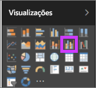
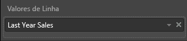

# Gráfico de combinação no Power BI

No Power BI, um gráfico de combinação é uma visualização única que combina um gráfico de linhas e um gráfico de colunas. Combinar os dois gráficos em um permite você faça uma comparação rápida dos dados.

Os gráficos de combinação podem ter um ou dois eixos Y.

## Quando usar um gráfico de combinação

Os gráficos de combinação são uma ótima opção:

* Quando você tem um gráfico de linhas e um gráfico de colunas com o mesmo eixo X.

* Para comparar várias medidas com intervalos de valores diferentes.

* Para ilustrar a correlação entre duas medidas em uma visualização.

* Para verificar se uma medida atende o destino definido pela outra medida.

* Para conservar o espaço de tela.

## Pré-requisitos

Gráficos de combinação estão disponíveis no serviço do Power BI e no Power BI Desktop. Este tutorial usa o serviço do Power BI para criar um gráfico de combinação. Verifique se você tem as credenciais do usuário para entrar no Power BI.

Veja Will criar um gráfico de combinação usando a amostra de Vendas e Marketing.

<iframe width="560" height="315" src="https://www.youtube.com/embed/lnv66cTZ5ho?list=PL1N57mwBHtN0JFoKSR0n-tBkUJHeMP2cP" frameborder="0" allowfullscreen></iframe>  

## Criar um gráfico de combinação básico de eixo único

Para acompanhar, abra o serviço do Power BI e conecte-se ao exemplo de **Análise de varejo**. Para criar seu próprio gráfico de combinação, entre no Power BI e selecione **Obter Dados** > **Amostras** > **Amostra de Análise de Varejo** > **Conectar**. O painel de **Exemplo de Análise de Varejo** é exibido.

1. No painel "Exemplo de análise de varejo", selecione o bloco **Total de lojas** para abrir o relatório **Visão geral de vendas das lojas**.

1. Selecione **Editar relatório** para abrir o relatório no modo de Exibição de Edição.

1. Na parte inferior da página, selecione **+** para adicionar uma nova página de relatório.

1. Crie um gráfico de coluna que mostra as vendas deste e margem bruta por mês.

    1. No painel Campos, selecione **Vendas** \> **Vendas do Deste Ano** > **Valor**.

    1. Arraste **Vendas** \> **Margem Bruta Deste Ano** para a seção **Valor**.

    1. Selecione **Hora** \> **FiscalMonth** para adicioná-la à seção **Eixo**.

        

1. Selecione as reticências no canto superior direito da visualização e escolha **Classificar por > FiscalMonth**. Para alterar a ordem de classificação, selecione as reticências novamente e escolha **Classificar em ordem crescente** ou **Classificar em ordem decrescente**.

1. Converta o gráfico de colunas em um gráfico de combinação. Há dois gráficos de combinação disponíveis: **Linha e coluna empilhada** e **Linha e coluna clusterizada**. Com o gráfico de coluna selecionado, no painel **Visualizações**, selecione o **Gráfico de colunas agrupadas e linha**.

    

1. No painel **Campos**, arraste **Vendas** > **Vendas do Ano Passado** para **Valores de Linha**.

    

    O gráfico de combinação deve ter esta aparência:

    

## Criar um gráfico de combinação com dois eixos

Nesta tarefa, vamos comparar as vendas e a margem bruta.

1. Crie um novo gráfico de linhas que acompanha o **% de Margem Bruta do ano passado** por **Mês**. Selecione as reticências para classificá-lo por **Mês** e **Crescente**.

    

     Em janeiro, a % de Margem Bruta foi de 35%, chegando ao seu máximo em 45% em abril, caindo em julho e chegando ao seu máximo novamente em agosto. Será que vamos ver um padrão semelhante nas vendas do ano passado e deste ano?

1. Adicione **Vendas deste ano** > **Valor** e **Vendas do último ano** no gráfico de linhas. A escala de **% de Margem Bruta do Ano Passado** é muito menor do que a escala de **Vendas**. É difícil comparar.

    

1. Para tornar o visual mais fácil de ler e interpretar, converta o gráfico de linhas em um gráfico de linha e coluna empilhada.

    

1. Arraste **% de Margem Bruta no Ano Passado** de **Valores de Coluna** para **Valores de Linha**. 

    

    O Power BI cria dois eixos permitindo o serviço de modo a dimensionar os conjuntos de dados de forma diferente. À esquerda são calculados os dólares e à direita é calculado o percentual. E podemos ver a resposta à nossa pergunta: Sim, podemos ver um padrão semelhante.

## Adicionar títulos aos eixos

1. Selecione o ícone de rolo de pintura  para abrir o painel Formatação.

1. Selecione a seta para baixo para expandir as opções do **eixo Y** .

1. Para **Eixo Y (Coluna)** , selecione estas opções:

    | Configuração | Valor |
    | ------- | ----- |
    | Posição | Selecione **Esquerda**. |
    | Exibir unidades | Selecione **Milhões**. |
    | Título | Mova o controle deslizante para **Ligado**. |
    | Estilo | Selecione **Mostrar apenas o título**. |
    | Mostrar secundário | Mova o controle deslizante para **Ligado**.  Isso mostra as opções para formatar a seção de gráfico de linhas do gráfico de combinação. |

1. Para **Eixo Y (Linha)** , selecione estas opções:

    | Configuração | Valor |
    | ------- | ----- |
    | Posição | Selecione **Direita**. |
    | Título | Mova o controle deslizante para **Ligado**. |
    | Estilo | Selecione **Mostrar apenas o título**. |

    Seu gráfico de combinação agora mostra eixos duplos, ambos com títulos.

    

1. Opcionalmente, altere a fonte, o tamanho e a cor do texto e defina outras opções de formatação para melhorar a legibilidade e a exibição do gráfico.

Daqui, talvez você queira:

* [Adicione o gráfico de combinação como um bloco do dashboard](../service-dashboard-tiles.md).

* [Salve o relatório](../service-report-save.md).

* [Torne o relatório mais acessível a pessoas com necessidades especiais](../desktop-accessibility.md).

## Realce cruzado e filtragem cruzada

Realçar uma coluna ou uma linha em um gráfico de combinação realiza o realce cruzado e a filtragem cruzada das outras visualizações na página do relatório. Para alterar esse comportamento padrão, use [interações visuais](../service-reports-visual-interactions.md).

## Próximas etapas

[Gráficos de rosca no Power BI](power-bi-visualization-doughnut-charts.md)

[Tipos de visualização no Power BI](power-bi-visualization-types-for-reports-and-q-and-a.md)