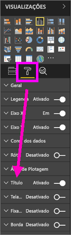
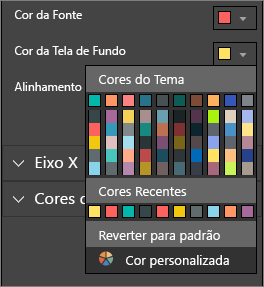
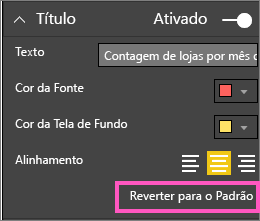
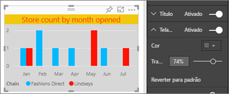
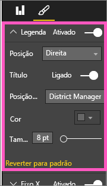
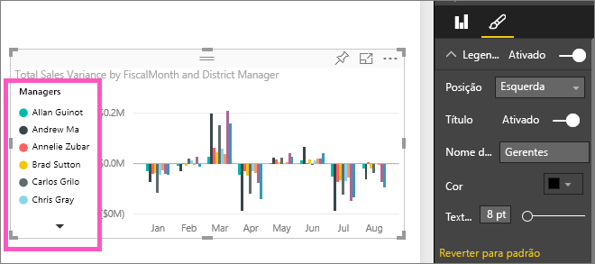

# Personalizar títulos, legendas e telas de fundo de visualizações

Neste tutorial, você aprenderá várias maneiras diferentes de personalizar as visualizações. Há muitas opções para personalizar as visualizações. A melhor maneira de aprender sobre elas é explorando o painel **Formatar** (selecione o ícone de rolo de tinta). Para começar, este artigo mostrará como personalizar o título, a legenda e a tela de fundo de uma de visualização.

Não é possível personalizar todas as visualizações. Confira a [lista completa](#visualization-types-that-you-can-customize) de visualizações para obter detalhes.

Avance até 4:50 no vídeo para ver uma demonstração de como personalizar as visualizações:

<iframe width="560" height="315" src="https://www.youtube.com/embed/IkJda4O7oGs" frameborder="0" allowfullscreen></iframe>

Agora, siga as instruções abaixo para experimentar com seus dados.

## Pré-requisitos

- O serviço do Power BI ou o Power BI Desktop

- Relatório Exemplo de Análise de Varejo

## Personalizar títulos de visualização em relatórios

Para acompanhar, entre no [serviço do Power BI](https://app.powerbi.com) e abra o relatório [Exemplo de Análise de Varejo](../sample-datasets.md) no modo de exibição [Editar relatório](../service-interact-with-a-report-in-editing-view.md).

> [!NOTE]
> Ao fixar uma visualização em um dashboard, ela se torna um bloco do dashboard. Você também pode personalizar os blocos em si com [novos títulos e subtítulos, hiperlinks e redimensionamento](../service-dashboard-edit-tile.md).

1. Vá para a página **Novas Lojas** do relatório **Exemplo de Análise de Varejo**.

1. Selecione o gráfico de colunas clusterizado **Contagem de Loja Aberta por Mês e Cadeia Abertos**.

1. No painel **Visualizações**, selecione o ícone de rolo de tinta para revelar as opções de formato.

1. Selecione **Título** para expandir essa seção.

   

1. Mova o controle deslizante de **Título** para **Ativado**.

   

1. Par alterar o título, insira *Contagem de loja por mês aberto* no campo **Texto do título**.

1. Altere a **Cor da fonte** para laranja e a **Cor do plano de fundo** para amarelo.

    1. Selecione o menu suspenso e escolha uma cor em **Cores do tema**, **Cores recentes** ou **Cores personalizadas**.

        

    1. Selecione o menu suspenso para fechar a janela de cores.

       Salve as alterações feitas.

       Se precisar reverter todas as alterações, você poderá voltar para as cores padrão selecionando **Reverter ao padrão** na janela de cores.

1. Aumente o tamanho do texto para **12 pt**.

1. A última personalização que você fará no título do gráfico é alinhá-lo no centro da visualização.

    

Nesse ponto do tutorial, o título do gráfico de colunas clusterizado se parecerá com este:

Salve as alterações e vá para a próxima seção.

Se você precisar reverter todas as alterações, selecione **Reverter ao padrão**, na parte inferior do painel de personalização do **Título**.

## Personalizar planos de fundo de visualização

Com o mesmo gráfico de colunas clusterizado selecionado, expanda as opções de **Plano de fundo**.

1. Mova o controle deslizante de **Plano de fundo** para **Ativado**.

1. Selecione a lista suspensa e escolha uma cor cinza.

1. Altere a **Transparência** para **74%** .

Nesse ponto do tutorial, o plano de fundo do gráfico de colunas clusterizado se parecerá com este:

Salve as alterações e vá para a próxima seção.

Se você precisar reverter todas as alterações, selecione **Reverter ao padrão**, na parte inferior do painel de personalização do **Plano de fundo**.

## Personalizar legendas de visualização

1. Abra a página do relatório **Visão geral** e selecione o gráfico **Variação das Vendas Totais por FiscalMonth e Gerente do Distrito**.

1. Na guia **Visualização**, selecione o ícone de rolo de pintura para abrir o painel Formatar.

1. Expanda as opções de **Legenda**:

      

1. Mova o controle deslizante de **Legenda** para **Ativado**.

1. Mova a legenda para a esquerda da visualização.

1. Adicione um título de legenda alternando **Título** para **Ativado**.

1. Insira *Gerentes* no campo **Nome da legenda**.

Nesse ponto do tutorial, a legenda do gráfico de colunas clusterizado se parecerá com este:

Salve as alterações e vá para a próxima seção.

Se você precisar reverter todas as alterações, selecione **Reverter ao padrão** na parte inferior do painel de personalização de **Legenda**.

## Tipos de visualização que podem ser personalizados

Veja a seguir uma lista de visualizações e as opções de personalização que estão disponíveis para cada:

| Visualização | Título | Tela de fundo | Legenda |
|:--- |:--- |:--- |:--- |
| Área | sim | sim |sim |
| Barras | sim | sim |sim |
| Cartão | sim | sim |n/a |
| Cartão de múltiplas linhas | sim | sim | n/a |
| Coluna | sim | sim | sim |
| Combinação | sim | sim | sim |
| Donut | sim | sim | sim |
| Mapa coroplético | sim | sim | sim |
| Funil | sim | sim | n/a |
| Medidor | sim | sim | n/a |
| KPI | sim | sim | n/a |
| Linha | sim | sim | sim |
| Mapear | sim | sim | sim |
| Matriz | sim | sim | n/a |
| Pizza | sim | sim | sim |
| Dispersão | sim | sim | sim |
| Segmentação de Dados | sim | sim | n/a |
| Tabela | sim | sim | n/a |
| Caixa de texto | não | sim | n/a |
| Mapa de árvore | sim | sim | sim |
| Waterfall | sim | sim | sim |

## Próximas etapas

- [Personalizar as propriedades dos eixos X e Y](power-bi-visualization-customize-x-axis-and-y-axis.md)

- [Introdução com propriedades de eixo e formatação de cor](service-getting-started-with-color-formatting-and-axis-properties.md)

- [Conceitos básicos para consumidores do serviço do Power BI](../consumer/end-user-basic-concepts.md)

Mais perguntas? [Experimente a Comunidade do Power BI](http://community.powerbi.com/)
