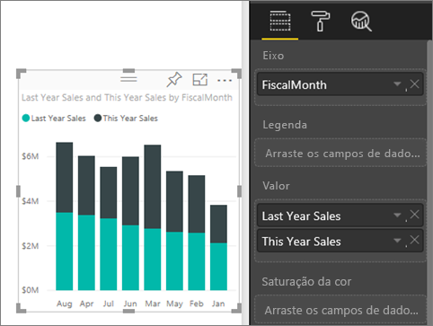
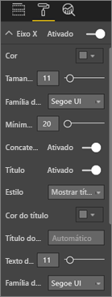
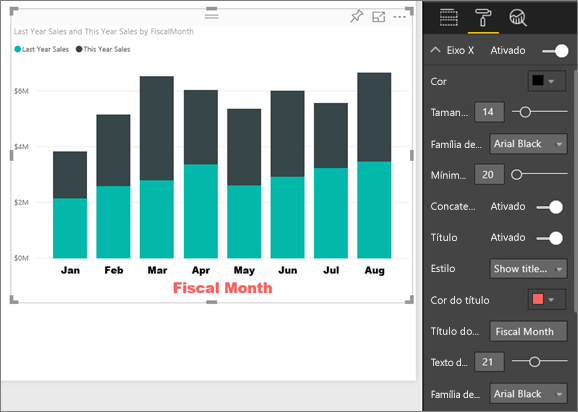
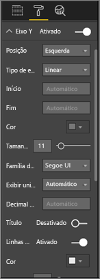
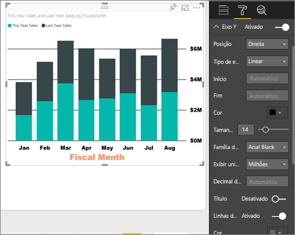
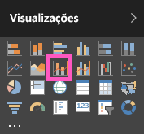
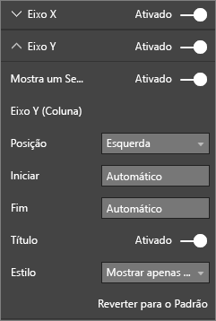

# Personalizar as propriedades dos eixos X e Y

Neste tutorial, você aprenderá várias maneiras diferentes de personalizar os eixos X e Y de seus visuais. Nem todos os visuais têm eixos. Gráficos de pizza, por exemplo, não têm eixos. E as opções de personalização variam de visual para visual. Existem muitas opções para abordar em um único artigo, então dê uma olhada em algumas das personalizações de eixos mais usadas e obtenha familiaridade com o painel **Formato** do visual na tela de relatório do Power BI.  

> [!NOTE]
> Esta página aplica-se ao serviço do Power BI e ao Power BI Desktop. Essas personalizações, que ficam disponíveis quando o **Formato** o ícone (de rolo de tinta ) é selecionado, também estão disponíveis no Power BI Desktop.

Assista à Amanda personalizar os eixos X e Y. Ela demonstrará as diferentes maneiras de controlar a concatenação ao fazer drill down e drill up.

<iframe width="560" height="315" src="https://www.youtube.com/embed/9DeAKM4SNJM" frameborder="0" allowfullscreen></iframe>

## Pré-requisitos

- O serviço do Power BI

- Relatório Exemplo de Análise de Varejo

## Personalizar os eixos de visualização X e Y em relatórios

Para acompanhar, entre no [serviço do Power BI](https://app.powerbi.com) e abra o relatório [Exemplo de Análise de Varejo](../sample-datasets.md) no modo de exibição [Editar relatório](../service-interact-with-a-report-in-editing-view.md).

### Criar uma visualização de gráfico de colunas empilhadas

Antes de personalizar a visualização, você precisa compilá-la.

1. No serviço do Power BI, expanda **Meu Espaço de Trabalho**.

1. Role a tela para baixo e selecione **Exemplo de Análise de Varejo** na lista de **Conjuntos de dados**.

1. No painel de **Visualizações**, selecione o ícone do gráfico de colunas empilhadas.

    

1. Para definir os valores do eixo X, no painel **Campos**, selecione **Time** > **FiscalMonth**.

1. Para definir os valores do eixo Y, no painel **Campos**, selecione **Vendas** > **Vendas Deste Ano** e selecione **Vendas** > **Vendas deste Ano** > **Valor**.

    

### Personalizar o eixo X

Agora você pode personalizar o eixo X.

1. No painel **Visualizações**, selecione **Formato** (ícone de rolo de tinta ) para revelar as opções de personalização.

1. Expanda as opções de eixo X.

   

1. Mova a segmentação do **eixo X** para **Ativado**.

    

    Um motivo pelo qual você talvez queira desativar o eixo X é para economizar espaço para mais dados.

1. Formatar a fonte, o tamanho e a cor do texto:

    - **Cor**: selecione preto

    - **Tamanho do texto**: insira *14*

    - **Família de fontes**: selecione **Arial Black**

1. Deslize a opção **Título** para **Ativado** para exibir o nome do eixo X. Nesse caso, é o **FiscalMonth**.

1. Formatar a fonte, o tamanho e a cor do texto do título:

    - **Cor do título**: selecione laranja

    - **Título do eixo**: insira *Mês Fiscal*

    - **Tamanho de texto do título**: insira *21*

Depois de concluir as personalizações, o gráfico de colunas empilhadas terá a aparência a seguir:

Salve as alterações e vá para a próxima seção.

Se você precisar reverter todas as alterações, selecione **Reverter ao Padrão** na parte inferior do painel de personalização do **eixo X**.

### Personalizar o eixo Y

Em seguida, você personalizará o eixo Y.

1. Expanda as opções de eixo Y.

   

1. Mova a segmentação do **eixo Y** para **Ativado**.  

    

    Um motivo pelo qual você talvez queira desativar o eixo Y é para economizar espaço para mais dados.

1. Defina a **Posição** do eixo Y para a **Direita**.

1. Formatar a fonte, o tamanho e a cor do texto:

    - **Cor**: selecione preto

    - **Tamanho do texto**: insira *14*

    - **Família de fontes**: selecione **Arial Black**

1. Defina as **Unidades de exibição** para **Milhões** e **Casas decimais** para *0*.

1. Para essa visualização, o fato de ter um título de eixo Y não melhora o visual; portanto, deixe o **Título** **Desativado**.  

1. Destacaremos as linhas de grade, alterando a cor e aumentando o traço:

    - **Cor**: selecione cinza-escuro

    - **Traço**: insira *2*

Depois de todas essas personalizações, o gráfico de colunas deve ser parecido com isto:

## Personalizar visualizações de eixo Y duplo

Primeiro, você criará um gráfico de combinação que examina o impacto da contagem da loja nas vendas. É o mesmo gráfico criado no [Tutorial do gráfico de combinação](power-bi-visualization-combo-chart.md). Em seguida, você formatará o eixo Y duplo.

### Crie um gráfico com dois eixos Y

1. Crie um novo gráfico de linhas que acompanha a **% de Vendas > Margem Bruta do ano passado** por **Hora > FiscalMonth**.

    

    > [!NOTE]
    > Para obter ajuda sobre a classificação por mês, confira [Classificar o uso de outros critérios](../consumer/end-user-change-sort.md#other).

    A porcentagem da Margem Bruta em janeiro foi de 35%, chegou a 45% em abril, caindo em julho e subindo novamente em agosto. Será que vamos ver um padrão semelhante nas vendas do ano passado e deste ano?

1. Adicione **Vendas deste ano > Valor** e **Vendas do último ano** no gráfico de linhas.

    

    A escala de **% de Margem Bruta do Ano Passado** (a linha azul acompanhando a linha de grade **0M%** ) é muito menor do que a escala de **Vendas**, o que dificulta a comparação. Além disso, os percentuais de rótulo do eixo Y são absurdas.

1. Para tornar o visual mais fácil de ler e interpretar, converta o gráfico de linhas em um gráfico de colunas empilhadas e Linhas.

   

1. Arraste **% de Margem Bruta no Ano Passado** de **Valores de Coluna** para **Valores de Linha**.

    

    Agora você tem o gráfico de colunas empilhadas criado na primeira seção com um gráfico de linhas sobreposto a ele. Opcionalmente, use o que você aprendeu acima para formatar a cor e o tamanho da fonte dos eixos.

   

   O Power BI cria dois eixos Y permitindo que os conjuntos de dados sejam dimensionados de forma diferente. O eixo à esquerda calcula os dólares e o eixo à direita calcula o percentual.

### Formatar o eixo Y secundário

1. No painel **Visualizações**, selecione o ícone de rolo de tinta para exibir as opções de formato.

1. Expanda as opções de eixo Y.

1. Role a tela para baixo até encontrar a opção **Mostrar secundário**. Verifique se está **Ativada**.

   

1. (Opcional) Personalize os dois eixos. Se você mudar a **Posição** para o eixo da coluna ou o eixo de linha, os dois eixos trocarão de lado.

### Adicionar títulos a ambos os eixos

Com uma visualização complicada, convém adicionar títulos de eixos.  Os títulos ajudam seus colegas a conhecer a história de sua visualização.

1. Alterne **Título** para **Ativado** para o **Eixo Y (Coluna)** e o **Eixo Y (Linha)** .

1. Defina o **Estilo** para **Mostrar somente o título** de ambos.

   

1. Seu gráfico de combinação agora mostra eixos duplos, ambos com títulos.

   

Para obter mais informações, confira [Dicas e truques para formatação com cores no Power BI](service-tips-and-tricks-for-color-formatting.md).

## Considerações e solução de problemas

Se o eixo X for categorizado pelo proprietário do relatório como um tipo de data, a opção **Tipo** será exibida e você poderá selecionar entre contínua ou categórica.

## Próximas etapas

- [Visualizações em relatórios do Power BI](power-bi-report-visualizations.md)

- [Personalizar títulos, legendas e telas de fundo de visualizações](power-bi-visualization-customize-title-background-and-legend.md)

- [Introdução com propriedades de eixo e formatação de cor](service-getting-started-with-color-formatting-and-axis-properties.md)

- [Conceitos básicos para consumidores do serviço do Power BI](../consumer/end-user-basic-concepts.md)

Mais perguntas? [Experimente a Comunidade do Power BI](http://community.powerbi.com/)
