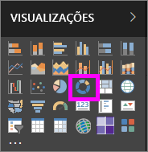
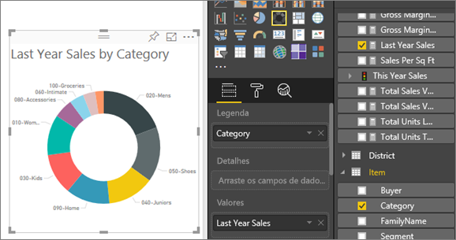

# Gráficos de rosca no Power BI
Um gráfico de rosca é semelhante a um gráfico de pizza que mostra a relação das partes com um todo. A única diferença é que o centro está em branco e permite o espaço para um rótulo ou ícone.

## Crie um gráfico de rosca
Essas instruções usam o Exemplo de Análise de Varejo para criar um gráfico de rosca que exibe as vendas deste ano por categoria. Para acompanhar, [baixe o exemplo](../sample-datasets.md) para o serviço do Power BI ou o Power BI Desktop.

1. Comece em uma página de relatório em branco. Caso esteja usando o serviço do Power BI, certifique-se de abrir o relatório no [Modo de Exibição de Edição](../service-interact-with-a-report-in-editing-view.md).

2. No painel Campos, selecione **Vendas** \> **Vendas do Ano Passado**.  
   
3. No painel Visualizações, selecione o ícone de gráfico de rosca  para converter seu gráfico de barras em um gráfico de rosca. Se as **Vendas do Ano Passado** não estiverem na área **Valores**, arraste-as para lá.
     
   

4. Selecione **Item** \> **Categoria** para adicioná-lo à área **Legenda**. 
     
    

5. Opcionalmente, [ajuste o tamanho e a cor do texto do gráfico](power-bi-visualization-customize-title-background-and-legend.md). 

## Considerações e solução de problemas
* A soma dos valores do gráfico de rosca deve somar até 100%.
* Muitas categorias são difíceis de ler e interpretar.
* Os gráficos de rosca são melhor usados para comparar uma determinada seção ao toda, em vez de comparar as seções individuais entre si. 

## Próximas etapas
[Gráficos de funil no Power BI](power-bi-visualization-funnel-charts.md)

[Tipos de visualização no Power BI](power-bi-visualization-types-for-reports-and-q-and-a.md)

