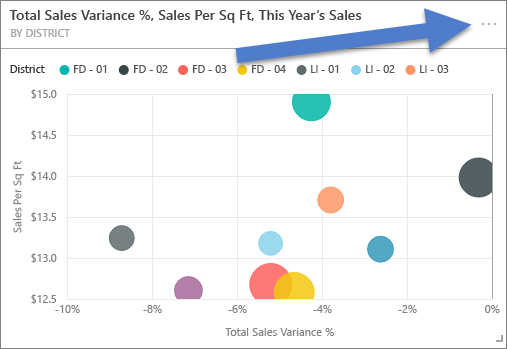
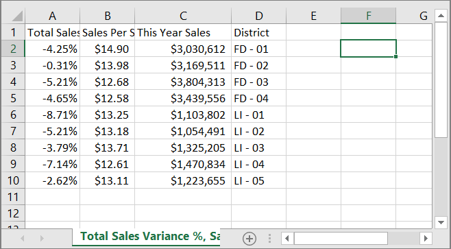
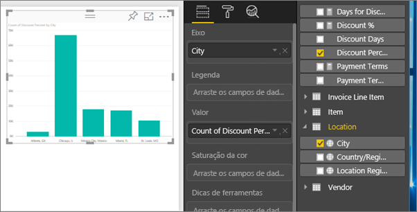
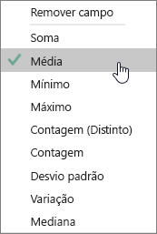
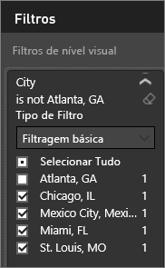
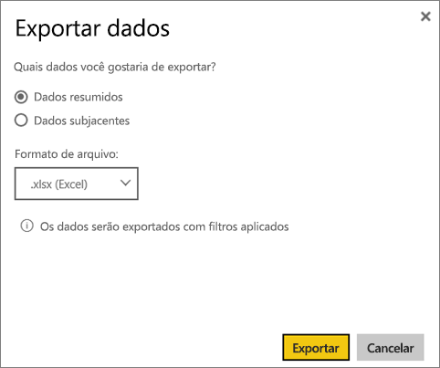
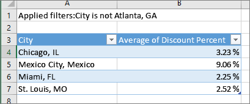
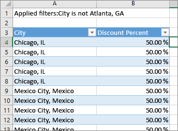
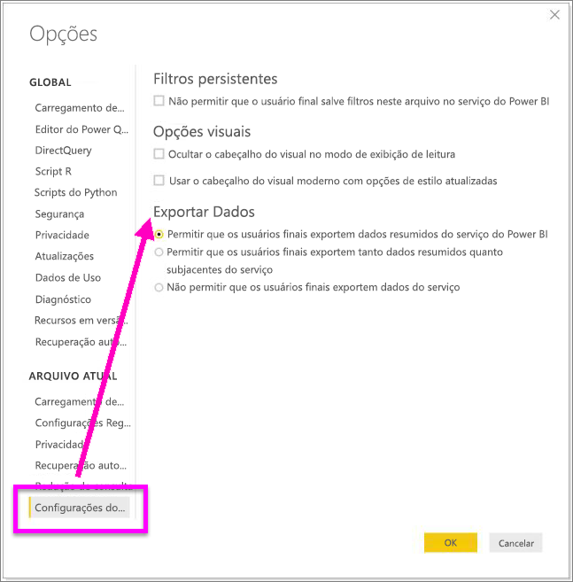

# Exportar dados de uma visualização
Se desejar ver os dados usados para criar uma visualização, [você poderá exibi-los no Power BI](service-reports-show-data.md) ou exportá-los para o Excel como um arquivo .xlsx ou .csv. A opção de exportação de dados requer uma licença Pro ou Premium e a edição de permissões para o conjunto de dados e o relatório. 

Assista a Will exportar os dados de uma das visualizações de seu relatório, salvá-los como um arquivo .xlsx e abri-los no Excel. Em seguida, siga as instruções passo a passo abaixo do vídeo para testá-la por conta própria.

<iframe width="560" height="315" src="https://www.youtube.com/embed/KjheMTGjDXw" frameborder="0" allowfullscreen></iframe>

## De uma visualização em um painel do Power BI
1. Selecione as elipses no canto superior direito da visualização.

    
2. Escolha o ícone  **Exportar dados** .

    
3. Os dados são exportados para um arquivo .csv. Se o visual for filtrado, os dados baixados também serão filtrados.    
4. O navegador solicitará que você salve o arquivo.  Após salvá-lo, abra o arquivo .csv no Excel.

    

## De uma visualização em um relatório
Para continuar, abra o [Relatório de exemplo de análise de compras](../sample-procurement.md) no Modo de Exibição de Edição. Adicionar uma nova página de relatório em branco. Em seguida, siga as etapas abaixo para adicionar uma agregação e um filtro de nível de visualização.

1. Criar um novo gráfico de coluna.  No painel Campos, selecione **Localização > Cidade** e **Fatura > Porcentagem de Desconto**.  Talvez você precise mover a **Porcentagem de desconto** para o valor também. 

    
2. Alterar a agregação de **Porcentagem de Desconto** de **Contagem** para **Média**. Na seção Valor, selecione a seta à direita de **Porcentagem de Desconto** (poderá estar como **Contagem de porcentagem de desconto**) e escolha **Média**.

    
3. Adicione um filtro para **Cidade** para remover **Atlanta**.

   

   Agora estamos prontos para experimentar as duas opções de exportação de dados. 

4. Selecione as elipses no canto superior direito da visualização. Escolha  **Exportar dados**.

   
5. No Power BI online, se a visualização tiver uma agregação (um exemplo seria a alteração de **Contagem** para *média*, *soma* ou *mínimo*), haverá duas opções: **Dados resumidos** e **Dados subjacentes**. No Power BI Desktop, você terá apenas a opção para **Dados resumidos**. Para entender melhor as agregações, consulte [Agregações no Power BI](../service-aggregates.md).
    
6. Selecione **Dados resumidos** > **Exportar** e escolha .xlsx ou .csv. O Power BI exporta os dados.  Se você aplicou filtros à visualização, os dados serão exportados da maneira que foram filtrados. Ao selecionar **Exportar**, o navegador solicitará que você salve o arquivo. Após salvá-lo, abra o arquivo no Excel.

   **Dados resumidos**: selecione esta opção se você quiser exportar dados para o que você vê nesse visual.  Esse tipo de exportação mostra somente os dados (colunas e medidas) que você escolheu para criar o visual.  Se o visual tiver uma agregação, você exportará dados agregados. Por exemplo, se você tiver um gráfico de barras mostrando quatro barras, você obterá quatro linhas de dados. Os dados resumidos estão disponíveis como arquivos .xlsx e .csv.

   Neste exemplo, a nossa exportação do Excel mostra um total para cada cidade. Como filtramos e retiramos Atlanta, ela não está incluída nos resultados.  A primeira linha da nossa planilha mostra os filtros que foram usados ao extrair os dados do Power BI.

   
7. Agora experimente selecionar **Dados subjacentes** > **Exportar** e escolher .xlsx. O Power BI exporta os dados. Se você aplicou filtros à visualização, os dados serão exportados da maneira que foram filtrados. Ao selecionar **Exportar**, o navegador solicitará que você salve o arquivo. Após salvá-lo, abra o arquivo no Excel.

   >[!WARNING]
   >A exportação de dados subjacentes permite que os usuários vejam todos os dados detalhados – todas as colunas nos dados. Os administradores de serviço do Power BI podem desativar esse recurso para sua organização. Se for o proprietário de um conjunto de dados, você poderá definir colunas proprietárias como "ocultas" para que elas não apareçam na lista Campos no serviço do Power BI ou na área de trabalho.

   **Dados subjacentes**: selecione esta opção se você quiser ver os dados no visual ***e*** dados adicionais do modelo (consulte o gráfico abaixo para obter detalhes).  Se a visualização tiver uma agregação, selecionar *Dados subjacentes* removerá a agregação. Ao selecionar **Exportar**, os dados são exportados para um arquivo .xlsx e o navegador solicita que você salve o arquivo. Após salvá-lo, abra o arquivo no Excel.

   Neste exemplo, a nossa exportação do Excel mostra uma linha para cada linha única de Cidade do nosso conjunto de dados e a porcentagem de desconto para aquela entrada única. Em outras palavras, os dados são nivelados e não agregados. A primeira linha da nossa planilha mostra os filtros que foram usados ao extrair os dados do Power BI.  

   

## Exportar detalhes dos dados subjacentes
O que você vê quando seleciona **Dados subjacentes** pode variar. Compreender esses detalhes pode exigir ajuda do administrador ou do departamento de TI. No Power BI Desktop ou no serviço, na exibição de relatório, uma *medida* é exibida na lista Campos com um ícone de calculadora . As medidas são criadas no Power BI Desktop não no serviço do Power BI.

| O visual contém |                                                                              O que você verá na exportação                                                                              |
|-----------------|-------------------------------------------------------------------------------------------------------------------------------------------------------------------------------------|
|   Agregações    |                                                 os *primeiros* dados de agregação e não ocultos da tabela inteira para essa agregação                                                  |
|   Agregações    | Dados relacionados – Se o visual usa dados de outras tabelas de dados que são *relacionados* à tabela de dados que contém a agregação (desde que essa relação seja \*:1 ou 1:1) |
|    Medidas     |                                      Todas as medidas no visual *e* todas as medidas de qualquer tabela de dados contendo uma medida usada no visual                                      |
|    Medidas     |                                       Todos os dados não ocultos de tabelas que contêm essa medida (desde que essa relação é \*: 1 ou 1:1)                                       |
|    Medidas     |                                      Todos os dados de todas as tabelas que estão relacionadas à tabela (contendo as medidas por meio de uma cadeia de \*: 1 de 1:1)                                      |
|  Somente medidas  |                                                   Todas as colunas não ocultas de todas as tabelas relacionadas (para expandir a medida)                                                   |
|  Somente medidas  |                                                             Dados resumidos para quaisquer linhas duplicadas para medidas de modelo.                                                              |

### Definir as opções de exportação
Designers de relatório do Power BI controlam os tipos de opções de exportação de dados que estão disponíveis para seus consumidores. As opções são:
- Permitir a exportação apenas de dados resumidos (esse é o padrão para novos relatórios) 
- Permitir a exportação de dados resumidos e subjacentes (esse era o padrão antes de outubro de 2018) 
- Não permitir a exportação de nenhum dado  

    > [!IMPORTANT]
    > É recomendável que os designers de relatório examinem novamente relatórios antigos e redefinam manualmente a opção de exportação, conforme necessário.

1. Para definir essas opções, comece no Power BI Desktop.

2. No canto superior esquerdo, selecione **Arquivo** > **Opções e configurações** > **Opções**. 

3. Em **Arquivo atual**, selecione **Configurações de relatório**.

    

4. Faça sua seleção no menu suspenso **Exportar dados**.

Você também pode atualizar essa configuração no serviço do Power BI.  

É importante observar que, se as configurações do portal de administração do Power BI entrarem em conflito com as do relatório para exportação de dados, as configurações de administração substituirão as de exportação de dados. 

## Limitações e considerações
* O número máximo de linhas que pode ser exportado do **Power BI Desktop** e do **serviço do Power BI** para .csv é 30.000.
* O número máximo de linhas que pode ser exportado para .xlsx é de 150.000.
* Exportar usando *Dados subjacentes* não funcionará se a fonte de dados for uma conexão dinâmica do Analysis Services, a versão for anterior a 2016 e as tabelas no modelo não tiverem uma chave exclusiva.  
* Exportar usando *Dados subjacentes* não funcionará se a opção *Mostrar itens sem dados* estiver habilitada para a visualização sendo exportada.
* Ao usar o DirectQuery, a quantidade máxima de dados que podem ser exportados é 16 MB. Isso pode resultar na exportação de um número de linhas menor que o máximo, especialmente se houver muitas colunas, dados que são difíceis de compactar e outros fatores que aumentam o tamanho do arquivo e diminuem o número de linhas exportadas.
* Se o visual usa dados de mais de uma tabela de dados, e não existe relação para essas tabelas no modelo de dados, somente os dados para a primeira tabela são exportados. 
* No momento, os visuais personalizados e visuais do R não são compatíveis.
* Exportar dados não está disponível para usuários fora da sua organização que estão usando um dashboard que foi compartilhado com eles. 
* No Power BI, um campo (coluna) pode ser renomeado clicando duas vezes nele e digitando um novo nome.  Esse novo nome é conhecido como um *alias*. É possível que um relatório do Power BI termine com nomes de campo duplicados, mas o Excel não permite duplicatas.  Assim, quando os dados são exportados para o Excel, os aliases de campo revertem para seus nomes originais de campo (coluna).  
* Se forem usados caracteres Unicode no arquivo .csv, o texto no Excel poderá não ser exibido corretamente. Apesar disso, abri-lo no Bloco de Notas funcionará bem. Exemplos de caracteres Unicode são símbolos de moeda e palavras estrangeiras. A solução para isso é importar o csv para o Excel em vez de abri-lo diretamente. Para fazer isso:

  1. Abrir o Excel
  2. Na guia **Dados**, selecione **Obter dados externos** > **De texto**.
* Administradores do Power BI têm a capacidade de desabilitar a exportação de dados.

Mais perguntas? [Experimente perguntar à Comunidade do Power BI](http://community.powerbi.com/)

