# Visualização de influenciadores principais
O visual de influenciadores principais ajuda a entender os fatores que influenciam uma métrica na qual você está interessado. Ele analisa os dados, classifica os fatores importantes e os exibe como influenciadores principais. Por exemplo, você está interessado em descobrir o que influencia a rotatividade de funcionários. Um dos fatores pode ter a duração do contrato de trabalho e outro pode ser a idade do funcionário. 
 
## Quando usar os influenciadores principais? 
O visual de influenciadores principais é uma ótima opção: 
- Para ver quais fatores afetam a métrica que está sendo analisada.

- Para comparar a importância relativa desses fatores. Por exemplo, os contratos de curto prazo têm mais impacto na rotatividade comparado aos contratos de longo prazo? 

## Requisitos dos influenciadores principais 
A métrica que está sendo analisada precisa ser um campo categórico.    

## Recursos do visual de influenciadores principais

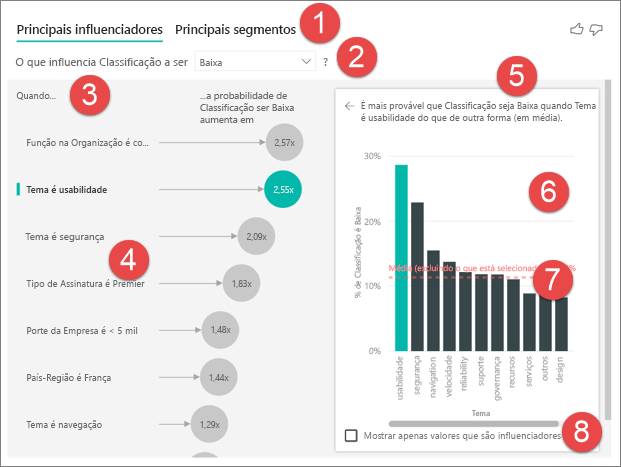    

1. ***Guias*** – selecione uma guia para alternar entre exibições. Os influenciadores principais mostram os primeiros colaboradores para o valor de métrica selecionado. Os primeiros segmentos mostram os primeiros segmentos que contribuem para o valor de métrica selecionado. Um *segmento* é composto por uma combinação de valores.  Por exemplo, um segmento pode ser consumidores que são clientes durante, pelo menos, vinte anos e vivem na região oeste. 

2. ***Lista suspensa*** – valor da métrica que está sendo investigada. Neste exemplo, estamos examinando a métrica **classificação** e o valor que selecionamos é **baixa**.    

3. ***Redefinição*** – ajuda-nos a interpretar o visual no painel esquerdo. 

4. ***Painel esquerdo*** – o painel esquerdo contém um visual.  Nesse caso, o painel esquerdo mostra uma lista dos primeiros influenciadores principais.

5. ***Redefinição*** – ajuda-nos a interpretar o visual no painel direito.

6. ***Painel direito*** – o painel direito contém um visual. Nesse caso, o gráfico de colunas exibe todos os valores para o **influenciador principal**, o **Tema** selecionado no painel esquerdo. O valor específico (**Usabilidade**) no painel esquerdo está em verde e todos os outros valores do **Tema** estão em preto.

7. ***Linha média*** – a média é calculada para todos os outros valores possíveis do **Tema**, exceto **usabilidade**. Portanto, o cálculo se aplica a todos os valores em preto. Ele nos informa qual percentual dos outros **Temas** nos deu uma classificação baixa. Em outras palavras, quando uma classificação é dada por um cliente, esse cliente também descreve o motivo ou o **tema** para a classificação. Alguns temas são usabilidade, velocidade, segurança etc. O **Tema** é **Usabilidade** é o segundo maior influenciador principal para uma classificação baixa, de acordo com o visual no painel esquerdo. Se extrairmos a média de todos os temas e de sua contribuição para uma classificação igual a **baixa**, obteremos o resultado observado aqui em vermelho. 

8. ***Caixa de seleção*** – mostra apenas valores que são influenciadores.

## Criar um visual de influenciadores principais 
 
Assista a este vídeo para saber como criar um visual de influenciadores principais e, em seguida, siga as etapas abaixo para criar um por conta própria. 

<iframe width="560" height="315" src="https://www.youtube.com/embed/fDb5zZ3xmxU" frameborder="0" allow="accelerometer; autoplay; encrypted-media; gyroscope; picture-in-picture" allowfullscreen></iframe>

Nosso Gerente de Produto quer descobrir quais fatores levam os clientes a deixar revisões negativas sobre nosso serviço de nuvem.  Para acompanhar, abra o [arquivo PBIX de Comentários do Cliente](https://github.com/Microsoft/powerbi-desktop-samples/blob/master/2019/customerfeedback.pbix) no Power BI Desktop. Baixe também o [arquivo do Excel de Comentários do Cliente para o serviço do Power BI ou o Power BI Desktop](https://github.com/Microsoft/powerbi-desktop-samples/blob/master/2019/customerfeedback.xlsx). 

> [!NOTE]
> O conjunto de dados de Comentários do Cliente baseia-se em [Moro e colaboradores, 2014] S. Moro, P. Cortez e P. Rita. A Data-Driven Approach to Predict the Success of Bank Telemarketing (Uma abordagem controlada por dados para prever o sucesso de telemarketing bancário). Decision Support Systems, Elsevier, 62:22-31, junho de 2014 

1. Abra o relatório e selecione o ícone de influenciadores principais.  

    

2. Arraste a métrica que deseja investigar para o campo **Analisar**. O campo **Analisar** só dá suporte a variáveis categóricas (não contínuas). Como estamos interessados em examinar o que leva uma classificação do cliente de nosso serviço a ser **Baixa**, selecionamos **Tabela Clientes** > **Classificação**.    
3. Em seguida, arraste os campos que você acredita que podem influenciar a **Classificação** para a área **Explicar por**. Você poderá arrastar quantos campos desejar. Nesse caso, começamos com: 
    - País-Região 
    - Função na Organização 
    - Tipo de Assinatura 
    - Porte da Empresa 
    - Tema     
4. Como estamos interessados em classificações negativas, selecione **Baixa** na lista suspensa **O que influencia a Classificação a ser**.  

    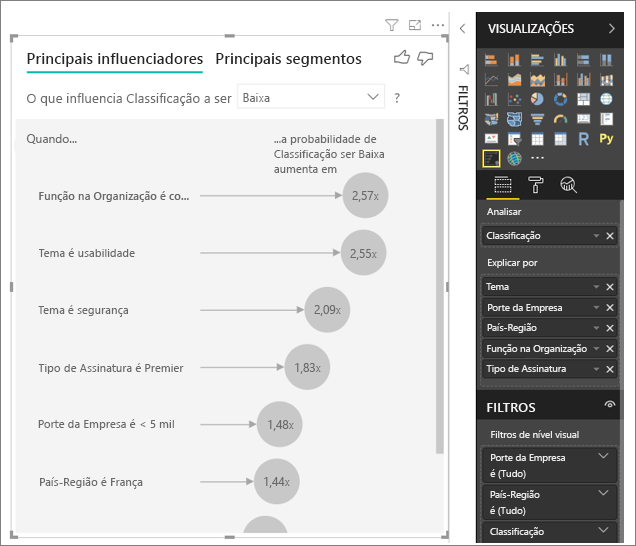

A análise é executada no nível da tabela do campo que está sendo analisado. Nesse caso, estamos interessados na métrica **Classificação**, que é definida no nível de um cliente (cada cliente deu uma pontuação alta ou baixa). Todos os nossos fatores explicativos devem ser definidos no nível do cliente para serem usados pelo visual. 

No exemplo acima, todos os nossos fatores explicativos têm uma relação um-para-um ou muitos para um com a métrica. Por exemplo, cada pontuação tem exatamente um tema associado a ela (qual era o tema principal da revisão do cliente). Da mesma forma, os clientes provenientes de um país têm um tipo de associação e uma função em suas organizações. Portanto, os fatores explicativos já são atributos de um cliente e nenhuma transformação é necessária – o visual pode fazer uso imediato deles. 

Mais adiante no tutorial, examinaremos exemplos mais complexos nos quais há relações um-para-muitos. Nesses casos, as colunas primeiro precisam ser agregadas no nível do cliente para que a análise possa ser executada.  

As medidas e as agregações usadas como fatores explicativos também são avaliadas no nível da tabela da métrica **Analisar**; veremos alguns exemplos mais adiante neste artigo. 

## Interpretando os influenciadores principais categóricos 
Vamos dar uma olhada nos influenciadores principais para classificações baixas. 

### Primeiro fator único que influencia a probabilidade de uma classificação baixa

Em nossa organização, temos três funções: consumidores, administradores e editores. Vemos que ser um consumidor é o primeiro fator que contribui para uma classificação baixa. 

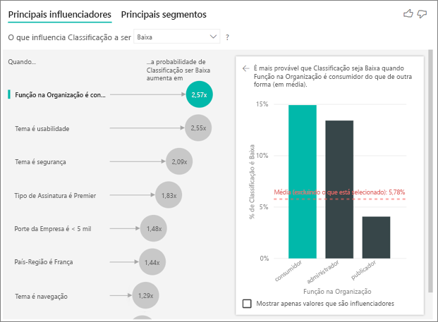

Mais precisamente, nossos clientes estão 2,57 vezes mais propensos a nos dar uma pontuação negativa. O gráfico de influenciadores principais lista **A Função na Organização é consumidor** em primeiro lugar na lista à esquerda. Ao selecionar **A Função na Organização é consumidor**, o Power BI mostra detalhes adicionais no painel à direita – o impacto comparativo de cada **função** na probabilidade de uma classificação baixa.
  
- 14,93% dos consumidores dão uma pontuação baixa  
- Em média, todas as outras funções dão uma pontuação baixa 5,78% do tempo 
- Portanto, os consumidores são 2,57x mais propensos a darem uma pontuação baixa comparado a todas as outras funções (a diferença entre a barra verde e a linha pontilhada vermelha) 

### Segundo fator único que influencia a probabilidade de uma classificação baixa

O visual de influenciadores principais pode comparar e classificar fatores de muitas variáveis diferentes.  Nosso segundo influenciador não tem nenhuma relação com a **Função na Organização**.  Selecione o segundo influenciador na lista: **O Tema é usabilidade**. 

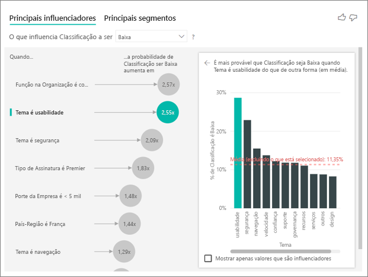

Aqui, vemos que o segundo fator mais importante está relacionado ao tema da revisão do cliente. Os clientes que comentaram sobre a *usabilidade* do produto eram 2,21x mais propensos a darem uma pontuação baixa comparado aos clientes que comentaram sobre outros temas, como confiabilidade, design ou velocidade. 

Você pode ver entre os visuais que a média (linha pontilhada vermelha) foi alterada de 5,78% para 11,34%. A média é dinâmica, pois se baseia na média de todos os outros valores. No caso do primeiro influenciador, a média excluiu a função de cliente, ao passo que, no segundo, ela excluiu o tema usabilidade. 
 
Marcar a caixa na parte inferior do visual resultará na filtragem do visual para apenas os valores influentes (nesse caso, as funções que levam a uma pontuação baixa). Portanto, examinaremos dos 12 temas até os quatro que o Power BI identificou como influenciadores de classificações baixas. 

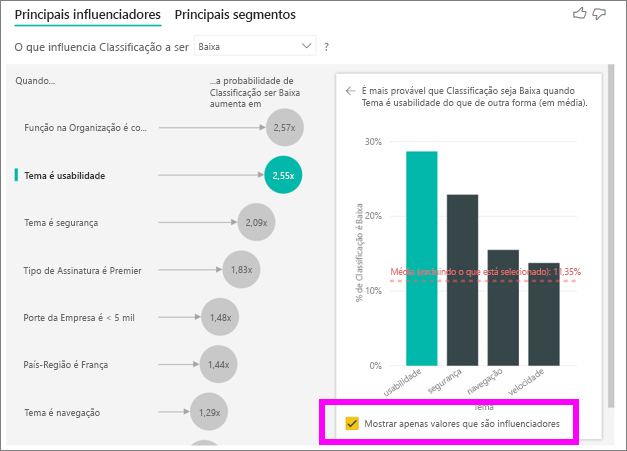

## Interagindo com outros visuais 
 
Sempre que um usuário clica em uma segmentação, um filtro ou outro visual na tela, o visual de Influenciadores principais executa novamente sua análise sobre a nova parte dos dados. Por exemplo, vamos arrastar Porte da Empresa para o relatório e usá-lo como uma segmentação. Queremos ver se os influenciadores principais para nossos clientes corporativos (cujo porte da empresa é maior que 50.000) são diferentes da população geral.  
 
A seleção de **>50.000** executa a análise novamente e podemos ver que os influenciadores mudaram. Para clientes de empresas de grande porte, os influenciadores principais para classificações baixas têm uma **Tema** relacionado à **segurança**. Podemos querer investigar mais detalhadamente, para ver se há recursos de segurança específicos com os quais nossos clientes de empresas de grande porte estão insatisfeitos. 

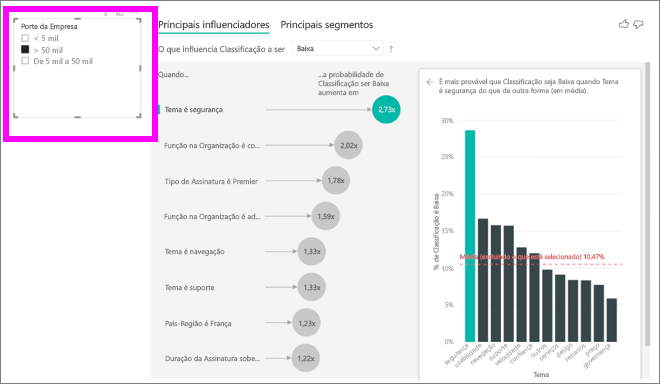

## Interpretando influenciadores principais contínuos 
 
Até agora, usamos o visual para explorar como diferentes campos categóricos influenciam as classificações baixas. Também é possível inserir fatores contínuos (por exemplo, idade, altura, preço) em ‘Explicar por’. Vejamos o que acontece se soltarmos ‘Tempo de Uso’ da tabela Clientes em ‘Explicar por’. O Tempo de Uso representa o tempo durante o qual o cliente usa o serviço. 
 
Descobrimos que, conforme o **Tempo de Uso** aumenta, a probabilidade de recebimento de uma classificação mais baixa também aumenta. Essa tendência sugere que nossos clientes de prazo mais longo são, na verdade, mais propensos a darem uma pontuação negativa, o que é um insight interessante e algo que talvez eu queira acompanhar mais tarde.  
 
A visualização nos informa que sempre que o tempo de uso aumenta em 13,44 meses, em média, a probabilidade de uma classificação baixa aumenta em 1,23x. Nesse caso, os 13,44 meses representam o desvio padrão do tempo de uso. Portanto, o insight que recebemos examina como o aumento do tempo de uso em um valor padrão (o desvio padrão do tempo de uso) afeta a probabilidade de recebimento de uma classificação baixa. 
 
O gráfico de dispersão no lado direito plota o percentual médio das classificações baixas para cada valor de tempo de uso e inclui uma linha de tendência para realçar o declive.  

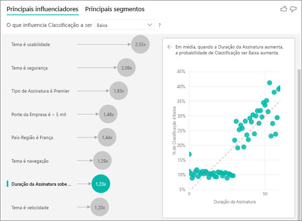

## Interpretando medidas/agregações como influenciadores principais 
 
Por fim, os usuários também podem usar medidas e agregações como fatores explicativos em suas análises. Por exemplo, talvez seja de nosso interesse ver qual é o impacto que a contagem de tíquetes de suporte do cliente ou a duração média de um tíquete em aberto tem sobre a pontuação que recebemos. 
 
Nesse caso, queremos ver se o número de tíquetes de suporte de um cliente influencia a pontuação que ele nos dá. Vamos inserir a ID do tíquete de suporte da tabela Tíquete de Suporte. Como um cliente pode ter vários tíquetes de suporte, precisamos agregar a ID no nível do cliente. Essa agregação é importante, pois estamos executando a análise no nível do cliente e, portanto, todos os fatores precisam ser definidos nesse nível de granularidade. 
 
Vamos examinar a contagem de IDs (de modo que cada linha de cliente tenha uma contagem de tíquetes de suporte associada a ela). Nesse caso, observamos que, conforme a contagem de tíquetes de suporte aumenta, a probabilidade de a classificação ser baixa aumenta para 5,51x. O visual do lado direito mostra o número médio de tíquetes de suporte por diferentes valores de Classificação (avaliados no nível do cliente). 

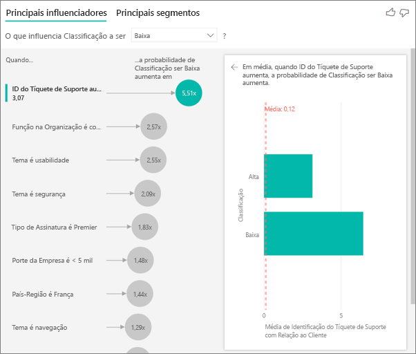

## Interpretando os resultados: primeiros segmentos 
 
Embora a guia ‘Influenciadores principais’ permita aos usuários avaliar cada fator individualmente, os usuários podem alternar para ‘Primeiros segmentos’ para ver como uma combinação de fatores afeta a métrica analisada. 
 
Os primeiros segmentos inicialmente apresentam uma visão geral de todos os segmentos que foram descobertos pelo Power BI. No exemplo abaixo, podemos ver que seis segmentos foram encontrados. Esses segmentos são classificados pelo percentual de classificações baixas no segmento. Observamos que o segmento 1, por exemplo, tem 74,3% de classificações do cliente que são baixas.  Quanto maior a bolha, maior é a proporção de classificações baixas. O tamanho da bolha do outro lado representa o número de clientes que estão no segmento. 

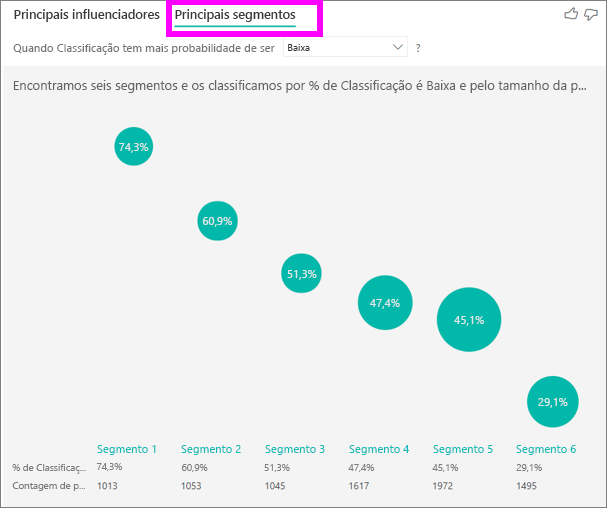

A seleção de uma bolha faz uma busca detalhada nos detalhes desse segmento. Se selecionarmos o segmento 1, por exemplo, descobriremos que ele é composto por clientes relativamente estabelecidos (que já estão conosco há mais de 29 meses) com um grande número de tíquetes de suporte (superior a 4). Por fim, eles não são editores (portanto, são consumidores ou administradores).  
 
Nesse grupo, 74,3% deram uma classificação baixa. O cliente médio dá uma classificação baixa 11,7% do tempo e, portanto, esse segmento tem uma proporção significativamente maior do que as classificações baixas (superior em 63 pontos percentuais). Também descobrimos que o segmento 1 contém aproximadamente 2,2% dos dados, representando uma parte acessível da população. 

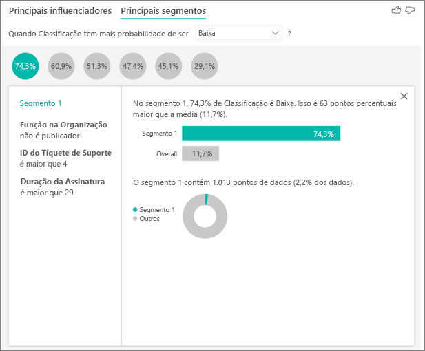

## Considerações e solução de problemas 
 
**Quais são as limitações da versão prévia?** 
 
Atualmente, o visual Influenciadores principais está em versão prévia pública e existem várias limitações das quais os usuários devem estar cientes. As funcionalidades não disponíveis no momento incluem: 
- Análise de métricas que são agregações/medidas 
- Consumindo o visual no Power BI Embedded
- Consumindo o visual nos aplicativos móveis do Power BI
- Suporte à RLS 
- Suporte ao DirectQuery 
- Suporte à Conexão Dinâmica 
 
**Vejo um erro indicando que não nenhum influenciador/segmento foi encontrado. Por que isso acontece?**  

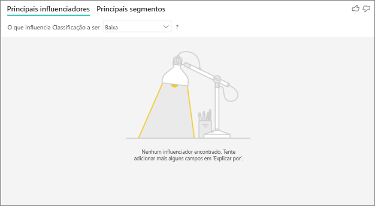

Esse erro ocorre quando você inclui campos em **Explicar por**, mas nenhum influenciador é encontrado.   
- Você incluiu a métrica analisada em ‘Analisar’ e ‘Explicar por’ (remova-a de **Explicar por**) 
- Os campos explicativos tem muitas categorias com poucas observações. Isso dificulta para a visualização determinar quais fatores são os influenciadores, pois é difícil generalizar os fatos com base em algumas observações 
- Os fatores explicativos têm um número suficiente de observações para fazer generalizações, mas a visualização não encontrou nenhuma correlação significativa para relatar 
 
**Vejo um erro indicando que a métrica analisada não tem dados suficientes nos quais executar a análise. Por que isso acontece?**  

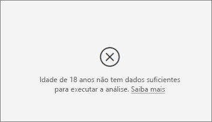

A visualização trabalha com a análise de padrões nos dados de um grupo (por exemplo, os clientes que deram classificações baixas) comparado a outros grupos (por exemplo, os clientes que deram classificações altas). Se os dados do modelo têm muito poucas observações, fica difícil encontrar padrões. Se a visualização não tiver dados suficientes para encontrar influenciadores significativos, ela indicará que mais dados são necessários para executar a análise. Recomendamos a presença de, pelo menos, 100 observações para o estado selecionado (clientes em rotatividade) e, pelo menos, 10 observações para os estados usados para comparação (clientes estabelecidos).  
 
**Vejo um erro indicando que um campo em ‘Explicar por’ não está relacionado exclusivamente à tabela que contém a métrica analisada. Por que isso acontece?**  
 
A análise é executada no nível da tabela do campo que está sendo analisado. Por exemplo, se você estiver analisando os comentários do cliente sobre seu serviço, poderá ter uma tabela que informa se um cliente deu uma classificação alta ou baixa. Nesse caso, a análise será executada no nível da tabela de clientes. 

Se você tiver uma tabela relacionada definida em um nível mais granular do que a tabela que contém a métrica, você receberá esse erro. Vamos ilustrar isso por meio de um exemplo: 
 
- Você está analisando o que influencia os clientes a dar classificações baixas para seu serviço 
- Você está interessado em ver se o dispositivo no qual o cliente está consumindo o serviço influencia as revisões fornecidas 
- Um cliente pode consumir o serviço de várias maneiras diferentes   
- No exemplo abaixo, o cliente 10000000 usa um navegador e um tablet para interagir com o serviço 

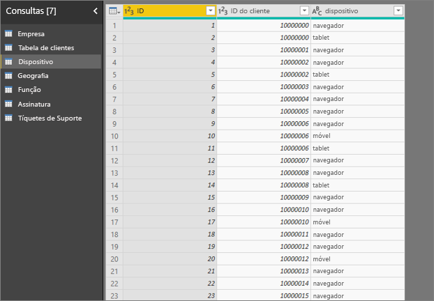

Se você tentar usar a coluna de dispositivo como um fator explicativo, verá o seguinte erro: 

Isso ocorre porque o dispositivo não está definido no nível do cliente – um cliente pode consumir o serviço em vários dispositivos. Para que a visualização encontre padrões, o dispositivo precisa se tornar um atributo do cliente. Nesse caso, tenho várias soluções que dependem de minha compreensão dos negócios: 
 
- Posso alterar o resumo do dispositivo, por exemplo, para contar se eu acredito que o número de dispositivos pode ter um impacto sobre a pontuação dada por um cliente 
- Posso dinamizar a coluna de dispositivos para ver se o consumo do serviço em um dispositivo específico influencia a classificação de um cliente  
 
Neste exemplo, dinamizei meus dados para criar colunas para ‘navegador’, ‘aplicativo móvel’ e ‘tablet’. Agora posso usá-los em ‘Explicar por’. Descobrimos que todos os dispositivos passam a ser influenciadores, com o navegador tendo o maior impacto sobre a pontuação do cliente. 

Mais precisamente, os clientes que não usam o navegador para consumir o serviço são 3,79x mais propensos a darem uma pontuação baixa do que aqueles que usam o navegador. Mais abaixo na lista, observamos que, no caso do aplicativo móvel, o inverso é verdadeiro. Os clientes que usam o aplicativo móvel são mais propensos a darem uma pontuação baixa do que aqueles que não usam o aplicativo móvel.  

**Vejo um aviso indicando que as medidas não foram incluídas na análise. Por que isso acontece?** [2052261] 

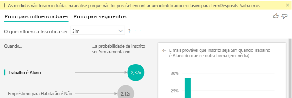

A análise é executada no nível da tabela do campo que está sendo analisado. Se você estiver analisando a rotatividade de clientes, poderá ter uma tabela que informa se um cliente deixou ou não de usar o serviço. Nesse caso, a análise será executada no nível da tabela de clientes.
 
Por padrão, as medidas e as agregações são analisadas no nível dessa tabela. Se tivermos uma medida para ‘Média de gastos mensais’, isso será analisado no nível da tabela de clientes.  

Se a tabela de clientes não tiver um identificador exclusivo, não poderemos avaliar a medida e ela será ignorada pela análise. Para evitar isso, garanta que a tabela com a métrica (nesse caso, a tabela de clientes) tenha um identificador exclusivo (por exemplo, a ID do cliente). Também é muito fácil adicionar uma coluna de índice usando o Power Query.
 
**Vejo um aviso indicando que a métrica analisada tem mais de 10 valores exclusivos e que isso pode afetar a qualidade da análise. Por que isso acontece?**  

A visualização de IA é otimizada para a análise de categorias (por exemplo, a Rotatividade é ‘Sim’ ou ‘Não’, a Satisfação do Cliente é ‘Alta’, ‘Média’ ou ‘Baixa’ etc.) O aumento do número de categorias para análise significa que temos menos observações por categoria, o que dificulta a localização de padrões nos dados para a visualização. 

Para encontrar influenciadores mais fortes, recomendamos o agrupamento de valores semelhantes em uma única unidade. Por exemplo, se você tiver uma métrica por preço, será provável que obtenha resultados melhores agrupando preços semelhantes em algo como buckets ‘Alto’, ‘Médio’ e ‘Baixo’ vs. o uso de faixas de preço individuais. 

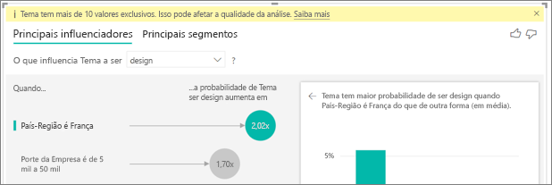

**Há fatores nos dados que parecem que deveriam ser influenciadores principais, mas não são. Como isso pode acontecer?**

No exemplo abaixo, observamos que os clientes que são consumidores influenciam as classificações baixas (14,93% das classificações são baixas). Curiosamente, a função de administrador também tem uma grande proporção de classificações baixas (13,42%), mas não é considerada um influenciador. 

O motivo por trás disso é que a visualização também leva em consideração o número de pontos de dados ao encontrar os influenciadores. No exemplo abaixo, temos mais de 29.000 consumidores e 10 vezes menos administradores (cerca de 2.900). Além disso, somente 390 deles deram uma classificação baixa. Portanto, o visual não tem dados suficientes para determinar se realmente encontrou um padrão com as classificações do administrador ou se ele é apenas um resultado casual.  

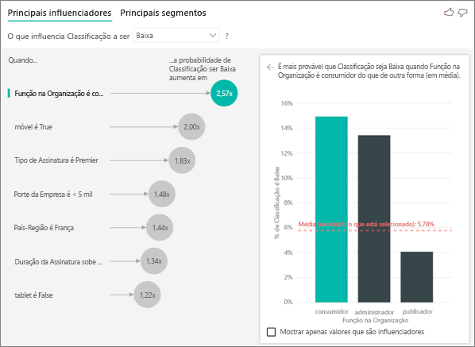

**Como calcular os influenciadores principais?**

Nos bastidores, a Visualização de IA usa o [ML.NET](https://dotnet.microsoft.com/apps/machinelearning-ai/ml-dotnet) para executar uma regressão logística e calcular os influenciadores principais. Uma regressão logística é um modelo estatístico que compara diferentes grupos entre si. Se examinarmos o que influencia as classificações baixas, a regressão logística examinará as diferenças entre os clientes que deram uma pontuação baixa e aqueles que deram uma pontuação alta. Se tivermos várias categorias (pontuação alta, pontuação neutra, pontuação baixa), examinaremos as diferenças entre aqueles que deram uma classificação baixa e os clientes que não deram uma classificação baixa (as diferenças entre estes e aqueles que deram uma classificação alta OU uma classificação neutra). 
 
A regressão logística pesquisa padrões nos dados, procurando as diferenças entres os clientes que deram uma classificação baixa e aqueles que deram uma classificação alta. Por exemplo, ela pode descobrir que os clientes que têm mais tíquetes de suporte dão um percentual muito maior de classificações baixas do que aqueles que têm poucos tíquetes de suporte ou nenhum.
 
A regressão logística também leva em consideração a quantidade de pontos de dados presentes. Se, por exemplo, os clientes que têm uma função de administrador derem proporcionalmente pontuações mais negativas, mas houver apenas alguns administradores, isso não será considerado um fator influente. Isso se deve ao fato de não haver pontos de dados suficientes disponíveis para inferir um padrão. Um teste estatístico (teste de Wald) é usado para determinar se um fator é considerado um influenciador. O visual usa um valor p de 0,05 para determinar o limite. 

**Como calcular os segmentos?**

Nos bastidores, a Visualização de IA usa o [ML.NET](https://dotnet.microsoft.com/apps/machinelearning-ai/ml-dotnet) para executar uma árvore de decisão e encontrar subgrupos interessantes. O objetivo da árvore de decisão é acabar com um subgrupo de pontos de dados que seja relativamente alto na métrica em que estamos interessados (por exemplo, os clientes que deram uma classificação baixa). 

A árvore de decisão usa cada fator explicativo e tenta inferir qual fator fornecerá a melhor ‘divisão’. Por exemplo, se filtrarmos os dados para incluir somente os clientes de empresas de grande porte, isso separará os clientes que deram uma classificação alta vs. classificação baixa? Ou talvez seja melhor filtrarmos os dados para incluir somente os clientes que comentaram sobre a segurança? 

Depois que a árvore de decisão faz uma divisão, ela usa esse subgrupo de dados (por exemplo, os clientes que comentaram sobre a segurança) e tenta descobrir qual será a próxima melhor divisão apenas para esses dados. Após cada divisão, ela também leva em consideração se tem pontos de dados suficientes, de modo que isso seja um grupo representativo do qual um padrão será inferido ou se isso pode ser apenas uma anomalia nos dados e, portanto, não um segmento real. (Outro teste estatístico é aplicado para verificar a significância estatística da condição de divisão, com um valor p igual a 0,05). 

Depois que a árvore de decisão conclui a execução, ela usa todas as divisões (comentários sobre a segurança, empresas de grande porte) e cria filtros do Power BI. Essa combinação de filtros é empacotada como um segmento no visual. 
 
**Por que alguns fatores se tornam influenciadores/deixam de ser influenciadores conforme mais campos são arrastados para ‘Explicar por’?**

A visualização avalia todos os fatores explicativos em conjunto. Isso significa que, embora um fator possa ser um influenciador por si só, quando levado em consideração com outros fatores, ele poderá não ser. Imagine que estamos analisando o que influencia o preço alto de uma casa, com os quartos e o tamanho da casa como fatores explicativos: 
- Por si só, uma quantidade maior de quartos pode ser um fator para o preço alto da casa 
- A inclusão do tamanho da casa na análise significa que agora examinaremos o que acontece com os quartos, ainda mantendo a constante do tamanho da casa 
- Se corrigimos o tamanho da casa em 139 m2, é improvável que o aumento contínuo do número de quartos aumente consideravelmente o preço da casa. Os quartos podem não ser tão importantes como um fator como eram antes do tamanho da casa ser considerado. 

## Próximas etapas
[Gráficos de combinação no Power BI](power-bi-visualization-combo-chart.md)

[Tipos de visualização no Power BI](power-bi-visualization-types-for-reports-and-q-and-a.md)
