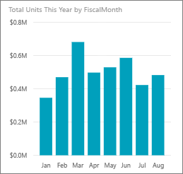
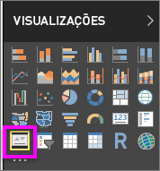
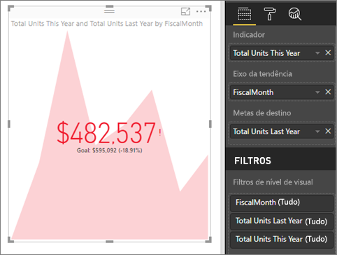

# Visuais de KPI
Um KPI (Indicador Chave de Desempenho) é uma indicação visual que comunica a quantidade de progresso feito em relação a uma meta mensurável. Para obter mais informações sobre KPIs, veja [Microsoft Developer Network](https://msdn.microsoft.com/library/hh272050).

Se você não estiver inscrito no Power BI, [inscreva-se para uma avaliação gratuita](https://app.powerbi.com/signupredirect?pbi_source=web) antes de começar.

## Pré-requisitos
* [Power BI Desktop – é gratuito!](https://powerbi.microsoft.com/en-us/get-started/)
* [O arquivo PBIX de exemplo de Análise de Varejo](http://download.microsoft.com/download/9/6/D/96DDC2FF-2568-491D-AAFA-AFDD6F763AE3/Retail%20Analysis%20Sample%20PBIX.pbix)

## Quando usar um KPI
Os KPIs são uma ótima opção:

* para medir o progresso (no que estou adiantado ou atrasado?)
* para medir a distância para uma meta (o quão adiantado ou atrasado eu estou?)   

## Requisitos de KPI
Um KPI se baseia em uma medida específica e é projetado para ajudá-lo a avaliar o status e o valor atual de uma métrica em relação a uma meta definida. Portanto, um visual de KPI requer uma medida *base* que é avaliada como um valor e uma medida ou um valor de *destino*, bem como um *limite* ou uma *meta*.

Atualmente, um conjunto de dados de KPI precisa conter valores de meta referente a um KPI. Se seu conjunto de dados não contiver um, será possível criar metas adicionando uma planilha do Excel com as metas ao seu modelo de dados ou ao arquivo PBIX.

## Como criar um KPI
Para acompanhar, abra o [arquivo .PBIX de Análise de Varejo](http://download.microsoft.com/download/9/6/D/96DDC2FF-2568-491D-AAFA-AFDD6F763AE3/Retail%20Analysis%20Sample%20PBIX.pbix) no Power BI Desktop. Vamos criar um KPI que mede o progresso que fizemos para atingir uma meta de vendas.

Ou veja Will mostrando como criar elementos visuais de métrica únicos: medidores, cartões e KPIs.

<iframe width="560" height="315" src="https://www.youtube.com/embed/xmja6EpqaO0?list=PL1N57mwBHtN0JFoKSR0n-tBkUJHeMP2cP" frameborder="0" allowfullscreen></iframe>

1. Abra o relatório no modo de exibição de Relatório e selecione a guia amarela para adicionar uma nova página.    
2. No painel campos, selecione **Vendas > Total de Unidades neste Ano**.  Esse será o indicador.
3. Adicione **Hora > FiscalMonth**.  Isso representará a tendência.
4. IMPORTANTE: classifique o gráfico por **FiscalMonth**. Depois de converter a visualização em um KPI, não haverá opção para classificar.

    
5. Converta o visual para um KPI selecionando o ícone do KPI do painel Visualização.
   
    
6. Adicione uma meta. Adicione as vendas do último ano como a meta. Arraste **Total de Unidades do Ano Passado** para o campo **Metas de destino**.
   
    
7. Opcionalmente, formate o KPI selecionando o ícone de rolo de pintura para abrir o painel Formatação.
   
   * **Indicador** – controla as unidades de exibição e as casas decimais do indicador.
   * **Eixo de tendência**: quando definido como **Ativado**, o eixo de tendência é exibido como a tela de fundo do visual de KPI.  
   * **Metas** – quando definido como **Ativado**, o visual exibe a meta e a distância da meta como um percentual.
   * **Codificação de cor > Direção** – alguns KPIs são considerados *melhores* para valores mais altos, enquanto outros são considerados *melhores* para valores mais baixos. Por exemplo, ganhos versus tempo de espera. Normalmente, um valor mais alto de ganhos é melhor em comparação com um valor mais alto de tempo de espera. Selecione **alto é melhor** e, opcionalmente, altere as configurações de cor.

Os KPIs também estão disponíveis no serviço do Power BI nos seus dispositivos móveis, mantendo você sempre conectado à pulsação de seus negócios.

## Considerações e solução de problemas
* Se seu KPI não se parecer com o mostrado acima, talvez seja necessário classificar por fiscalmonth. Como os KPIs não têm uma opção de classificação, será necessário classificar por fiscalmonth *antes* de converter sua visualização em um KPI.

## Próximas etapas

[Mapas básicos no Power BI](power-bi-map-tips-and-tricks.md)

[Tipos de visualização no Power BI](power-bi-visualization-types-for-reports-and-q-and-a.md)