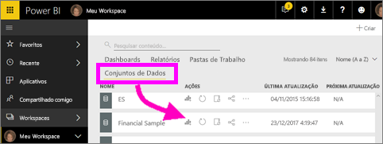
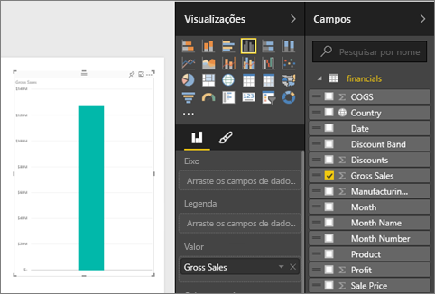
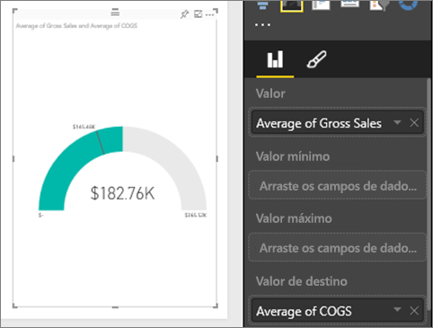
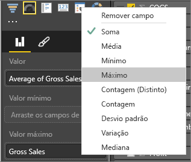
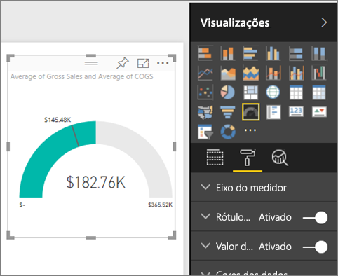
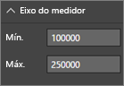
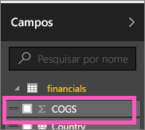

# Gráficos de medidor radial no Power BI

Um gráfico de medidor radial tem um arco circular e mostra um único valor que acompanha o progresso em relação a um objetivo/KPI (indicador chave de desempenho). A linha (ou *agulha*) representa o valor de meta ou destino. O sombreamento representa o progresso em relação a esse objetivo. O valor dentro do arco representa o valor do progresso. O Power BI distribui uniformemente todos os valores possíveis ao longo do arco, do mínimo (valor mais à esquerda) para o máximo (valor mais à direita).

Neste exemplo, você é um revendedor de carros, controlando a média de vendas da equipe por mês. A agulha representa uma meta de vendas de 140 carros. A média mínima possível de vendas é 0 e o máximo é 200.  O sombreamento azul mostra que a equipe tem uma média de aproximadamente 120 vendas neste mês. Felizmente, há ainda outra semana para atingir a meta.

Veja Will mostrando como criar elementos visuais de métrica únicos: medidores, cartões e KPIs.

<iframe width="560" height="315" src="https://www.youtube.com/embed/xmja6EpqaO0?list=PL1N57mwBHtN0JFoKSR0n-tBkUJHeMP2cP" frameborder="0" allowfullscreen></iframe>

## Quando usar um medidor radial

Os medidores radiais são uma ótima opção para:

* Mostrar o progresso para atingir uma meta.

* Representar uma medida percentual, como um KPI.

* Mostrar a integridade de uma única medida.

* Exibir informações que você pode verificar e compreender rapidamente.

## Pré-requisitos

* O serviço do Power BI ou o Power BI Desktop

* Pasta de trabalho do Excel de exemplo financeiro: [baixe o exemplo diretamente](http://go.microsoft.com/fwlink/?LinkID=521962).

## Criar um medidor radial básico

Estas instruções usam o serviço do Power BI. Para acompanhar, entre no Power BI e abra o arquivo Exemplo Financeiro do Excel.

### Etapa 1: abrir o arquivo do Excel de Exemplo Financeiro

1. Se ainda não fez isso, baixe o [arquivo do Excel de Exemplo Financeiro](../sample-financial-download.md). Lembre-se do local em que você o salvou.

1. No serviço do Power BI, selecione **Obter dados** > **Arquivos**.

1. Selecione **Arquivo local** e navegue até o local do arquivo de exemplo.

1. Selecione **Importar**. O Power BI adiciona o Exemplo Financeiro a seu espaço de trabalho como um conjunto de dados.

1. Na lista de conteúdo **Conjuntos de dados**, selecione o ícone **Criar relatório** para o **Exemplo Financeiro**.

    

### Etapa 2: criar um medidor para acompanhar as Vendas Brutas

Na última seção, quando você tiver selecionado o ícone **Criar relatório**, o Power BI criou um relatório em branco na exibição de edição.

1. No painel **Campos**, selecione **Vendas Brutas**.

   

1. Altere a agregação para **Médio**.

   

1. Selecionar o ícone de medidor  para converter o gráfico de colunas em um gráfico de medidor.

    

    Dependendo de quando você baixa o arquivo de **Exemplo Financeiro**, você poderá ver os números que não correspondem a esses números.

    > [!TIP]
    > Por padrão, o Power BI cria um gráfico de medidor no qual o valor atual (nesse caso, **Média das Vendas Brutas**) deve estar no ponto na metade do medidor. Como o valor **Média das Vendas Brutas** é de US$ 182.760, o valor inicial (Mínimo) é definido como 0 e o valor final (Máximo) é definido como o dobro do valor atual.

### Etapa 3: definir um valor de destino

1. Arraste **COGS** do painel **Campos** para o contêiner **Valor de destino**.

1. Altere a agregação para **Médio**.

   O Power BI adiciona uma agulha para representar o valor de destino de **US$ 145.480**.

   

    Observe que ultrapassamos o nosso alvo.

   > [!NOTE]
   > Você pode inserir manualmente um valor de destino. Consulte a seção [Use as opções de formatação manual para definir os valores Mínimo, Máximo e Destino](#use-manual-format-options-to-set-minimum-maximum-and-target-values).

### Etapa 4: definir um valor máximo

Na Etapa 2, o Power BI usou o campo **Valor** para definir automaticamente o valor mínimo e o máximo. E se você quiser definir seu próprio valor máximo? Digamos que, em vez de usar o dobro do valor atual como o valor máximo possível, você deseja defini-lo como o maior número de vendas brutas no conjunto de dados.

1. Arraste **Vendas Brutas** do painel **Campos** para o **Valor Máximo** também.

1. Altere a agregação para **Máximo**.

   

   O medidor é redesenhado com um novo valor de término, 1,21 milhão em vendas brutas.

   

### Etapa 5: Salvar seu relatório

1. [Salve o relatório](../service-report-save.md).

1. [Adicione o gráfico de medidor como um bloco do dashboard](../service-dashboard-pin-tile-from-report.md). 

## Use as opções de formatação manual para definir os valores Mínimo, Máximo e Destino

1. Remova **Vendas Brutas Máx.** do **Valor máximo** também.

1. Selecione o ícone de rolo de pintura para abrir o painel **Formatar**.

   

1. Expanda o **Eixo de medidor** e insira valores para **Mín.** e **Máx**.

    

1. Desmarque a opção **COGS** no painel **Campos** para remover o valor de destino.

    

1. Quando o campo **Destino** aparecer no **Eixo do medidor**, insira um valor.

     

1. Como opção, continue com a formatação do gráfico de medidor.

Depois que você tiver concluído essas etapas, terá um gráfico de medidor que pode ter esta aparência:

## Próxima etapa

* [Visuais de KPI (Indicador Chave de Desempenho)](power-bi-visualization-kpi.md)

* [Tipos de visualização no Power BI](power-bi-visualization-types-for-reports-and-q-and-a.md)

Mais perguntas? [Experimente a Comunidade do Power BI](http://community.powerbi.com/)