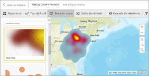
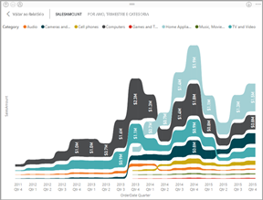
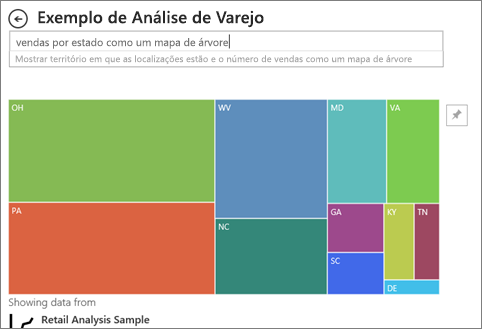

# Tipos de visualização no Power BI
## Visualizações do Power BI
Incluiremos novas visualizações, fique ligado!

Além disso, confira o [Microsoft AppSource](https://appsource.microsoft.com/marketplace/apps?product=power-bi-visuals), no qual você encontrará uma lista cada vez maior de [visuais personalizados](../power-bi-custom-visuals.md) que poderá baixar e usar em seus próprios dashboards e relatórios. Se sentindo criativo? [Saiba como criar e adicionar seus próprios visuais para este site da comunidade](../developer/office-store.md).  

## Lista das visualizações disponíveis no Power BI
Todas essas visualizações podem ser adicionadas aos relatórios do Power BI, especificadas em P e R e fixadas a painéis.

### Gráficos de área: básico (em camadas) e empilhado

>[!TIP]
>O gráfico de Área Básico baseia-se no gráfico de linhas com a área entre o eixo e a linha preenchida.

Para obter mais informações, veja [Gráfico de área básica](power-bi-visualization-basic-area-chart.md).

### Gráficos de barras e colunas

 

>[!TIP]
>Gráficos de barras são o padrão para observar um valor específico entre categorias diferentes.

### Cartões: linha múltipla

### Cartões: número único

Para obter mais informações, confira [Criar um Cartão (bloco de número grande)](power-bi-visualization-card.md).

### Gráficos de combinação

>[!TIP]
>Um gráfico de combinação combina um gráfico de colunas e um gráfico de linhas. Escolha *Colunas Empilhadas e Linha* e *Colunas Agrupadas e Linha*.

Para obter mais informações, veja [Gráficos de combinação no Power BI](power-bi-visualization-combo-chart.md).

### Gráficos de rosca

>[!TIP]
>Gráficos de rosca são semelhantes aos Gráficos de pizza.  Eles mostram a relação das partes com um todo.

Para obter mais informações, veja [Gráficos de rosca no Power BI](power-bi-visualization-doughnut-charts.md).

### Gráficos de funil

>[!TIP]
>Funis ajudam a visualizar um processo contendo estágios e itens que seguem uma sequência de um estágio para o próximo.  Use um funil quando houver um fluxo sequencial entre estágios, como um processo de vendas que começa com clientes potenciais e termina com a realização da compra.

Para obter mais informações, veja [Gráficos de funil no Power BI](power-bi-visualization-funnel-charts.md).

### Gráficos de medidor

>[!TIP]
>Exibe o status atual no contexto de uma meta.

Para obter mais informações, veja [Gráficos de medidor no Power BI](power-bi-visualization-radial-gauge-charts.md).

### Gráficos de influenciadores principais

Um gráfico de influenciador principal exibe os principais colaboradores para um resultado ou valor selecionado.

Para obter mais informações, confira [Gráficos de influenciador principal no Power BI](power-bi-visualization-influencers.md)

### KPIs

>[!TIP]
>Exibe o progresso em direção a uma meta mensurável.

Para obter mais informações, veja [KPIs no Power BI](power-bi-visualization-kpi.md).

### Gráficos de linhas

>[!TIP]
>Enfatizam o formato geral de uma série inteira de valores, geralmente ao longo do tempo.

### Mapas: mapas básicos

>[!TIP]
>Usados para associar informações categóricas e quantitativas a locais espaciais.

Para obter mais informações, confira as [Dicas e truques para visualizações de mapa](power-bi-map-tips-and-tricks.md).

### Mapas: Mapas ArcGIS

Para obter mais informações, veja [Mapas de ArcGIS no Power BI](power-bi-visualization-arcgis.md).

### Mapas: mapas preenchidos (Coropléticos)

>[!TIP]
>Quanto mais intensa a cor, maior o valor.

Para obter mais informações, veja [Mapas preenchidos no Power BI](power-bi-visualization-filled-maps-choropleths.md).

### Mapas: mapas de formas

>[!TIP]
>Compara regiões por cor.

Para obter mais informações, veja [Mapas de forma no Power BI](desktop-shape-map.md).

### Matriz

>[!TIP]
>Uma tabela dá suporte a duas dimensões, mas uma matriz facilita significativamente a exibição dos dados entre várias dimensões – ela dá suporte a um layout em níveis. A matriz agrega automaticamente os dados e permite fazer drill down. 

Para obter mais informações, veja [Visuais de matriz no Power BI](desktop-matrix-visual.md).

### Gráficos de pizza

>[!TIP]
>Gráficos de pizza mostram a relação das partes com um todo. 

### Visuais de script R

>[!TIP]
>Os visuais criados com scripts do R, normalmente chamados de *visuais do R*, podem apresentar formatação e análise de dados avançadas, como previsão, usando o poder da análise e da visualização avançadas do R. Os visuais do R podem ser criados no Power BI Desktop e publicados no serviço do Power BI.   

Para saber mais, confira [Visuais do R no Power BI](service-r-visuals.md).

### Gráfico da faixa de opções

>[!TIP]
>Gráficos de faixa de opções cuja categoria de dados tem a classificação mais alta (maior valor). Gráficos de faixa de opções são eficazes para mostrar alterações na classificação, com o maior intervalo (valor) sempre exibido na parte superior de cada período.

Para saber mais, confira [Gráficos da Faixa de Opções no Power BI](desktop-ribbon-charts.md).

### Gráficos de Dispersão e Bolhas

>[!TIP]
>Exiba relações entre medidas quantitativas, duas de (dispersão) ou três de (bolhas) – sim ou não, em qual ordem, etc.

Para obter mais informações, veja [Gráficos de dispersão no Power BI](power-bi-visualization-scatter.md).

### Dispersão de alta densidade

>[!TIP]
>Pontos de dados demais em um visual podem sobrecarregá-lo, portanto, um algoritmo de amostragem sofisticado é usado para garantir a precisão da visualização.

Para obter mais informações, veja [Gráficos de dispersão de alta densidade no Power BI](desktop-high-density-scatter-charts.md).

### Segmentações

Para obter mais informações, veja [Segmentação de dados no Power BI](power-bi-visualization-slicers.md).

### Imagens autônomas

Para obter mais informações, veja [Adicionar um widget de imagem a um dashboard](../service-dashboard-add-widget.md).

### Tabelas

>[!TIP]
>Trabalhe bem com comparações quantitativas entre itens em que há várias categorias.

Para obter mais informações, confira [Trabalhando com tabelas no Power BI](power-bi-visualization-tables.md).

### Treemaps

Para obter mais informações, veja [Mapas de árvore no Power BI](power-bi-visualization-treemaps.md).

>[!TIP]
>São gráficos de retângulos coloridos, com um tamanho que representa o valor.  Eles podem ser hierárquicos, com retângulos aninhados nos retângulos principais.

### Gráfico de cascata

>[!TIP]
>Os gráficos de cascata mostram o total em execução à medida que os valores são adicionados ou subtraídos.

Para obter mais informações, veja [Gráficos de cascata no Power BI](power-bi-visualization-waterfall-charts.md).

## Informe à P e R qual visualização deve ser usada
Ao digitar consultas em linguagem natural com a P e R do Power BI, você pode especificar o tipo de visualização em sua consulta.  Por exemplo:

“***vendas por estado como um treemap***”

## Próximas etapas
[Visualizações em relatórios do Power BI](power-bi-report-visualizations.md)    
[A referência visual correta de sqlbi.com](http://www.sqlbi.com/wp-content/uploads/videotrainings/dashboarddesign/visuals-reference-may2017-A3.pdf)