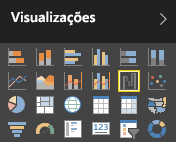
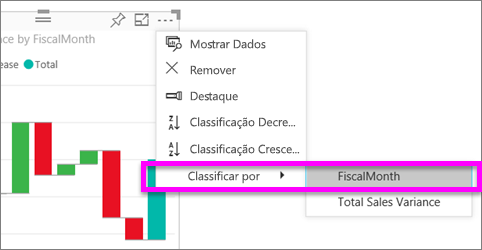
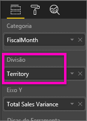
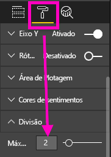

# Gráficos de cascata no Power BI

Os gráficos de cascata mostram o total em execução à medida que o Power BI adiciona ou subtrai valores. São úteis para entender como um valor inicial (como a receita líquida) é afetado por uma série de alterações positivas e negativas.

As colunas são codificadas por cores para que você possa notar rapidamente aumentos e diminuições. Com frequência, as colunas de valor inicial e final [iniciam-se no eixo horizontal](https://support.office.com/article/Create-a-waterfall-chart-in-Office-2016-for-Windows-8de1ece4-ff21-4d37-acd7-546f5527f185#BKMK_Float "iniciam-se no eixo horizontal"), enquanto os valores intermediários são colunas flutuantes. Devido a esse estilo, os gráficos de cascata também são chamados de gráficos de ponte.

<iframe width="560" height="315" src="https://www.youtube.com/embed/qKRZPBnaUXM" frameborder="0" allow="autoplay; encrypted-media" allowfullscreen></iframe>

## Ao usar um gráfico de cascata

Os gráficos de cascata são uma ótima opção:

* Quando houver alterações para a medida ao longo do tempo, uma série ou categorias diferentes.

* Para auditar as principais alterações que contribuem para o valor total.

* Para traçar o lucro anual da empresa, mostrando várias fontes de receita e chegar ao lucro total (ou perda).

* Para ilustrar o início e final do número de funcionários de sua empresa em um ano.

* Para visualizar o quanto você ganha e gasta mensalmente, e o saldo parcial da sua conta.

## Pré-requisitos

* O serviço do Power BI ou o Power BI Desktop

* Relatório Exemplo de Análise de Varejo

## Obter o relatório de exemplo de Análise de Varejo

Essas instruções usam o exemplo de análise de varejo. Criar uma visualização requer permissões de edição para o conjunto de dados e o relatório. Felizmente, os exemplos do Power BI são todos editáveis. Se alguém compartilhar um relatório com você, é possível criar visualizações em relatórios. Para acompanhar, obtenha o [Relatório de exemplo de Análise de Varejo](../sample-datasets.md).

Após obter o conjunto de dados do **Exemplo de Análise de Varejo**, você pode começar a usar.

## Criar um gráfico de cascata

Crie um gráfico de cascata que exibe a variação de vendas (vendas estimadas versus vendas reais) por mês.

1. No **Meu Espaço de Trabalho**, selecione **Conjuntos de dados** > **Criar um relatório**.

    

1. No painel **Campos**, selecione **Vendas** > **Variação do Total de Vendas**.

   

1. Selecione o ícone de cascata  para converter o gráfico em um mapa de árvore.

    Se a **Variação Total de Vendas** não estiver na área do **eixo Y**, arraste-a para lá.

    

1. Selecione **Hora** > **FiscalMonth** para adicioná-la à caixa **Categoria**.

    

1. Verifique se o Power BI classificou o gráfico de cascata em ordem cronológica. No canto superior direito do gráfico, selecione as reticências (...).

    Verifique se há um indicador amarelo ao lado esquerdo das opções **Classificar em ordem crescente** e **FiscalMonth**

    

    Você também pode examinar os valores do eixo X e ver se estão na ordem de **Jan** à **Ago**.

    Aprofunde-se um pouco mais para ver o que está contribuindo mais para as alterações a cada mês.

1. Arraste **Repositório** > **Região** para o bucket **Divisão**.

    

    Por padrão, o Power BI adiciona os cinco principais colaboradores a aumentos ou diminuições por mês.

    

    Você está interessado apenas nos dois colaboradores principais.

1. No painel **Formato**, selecione **Divisão** e defina **Divisões máximas** para **2**.

    

    Uma rápida análise revela que as regiões de Ohio e Pensilvânia são os maiores colaboradores para a movimentação, negativa e positiva, em nosso gráfico de cascata.

    

    É uma descoberta interessante. Ohio e Pensilvânia têm um impacto significativo devido às vendas nessas duas regiões serem muito maiores do que nas outras? Você pode verificar isso.

1. Crie um mapa que examina o valor de vendas deste ano e as vendas do último ano por território.

    

    O mapa corrobora a teoria. Ele mostra que essas duas regiões tiveram o valor mais alto de vendas no ano passado (tamanho da bolha) e neste ano (sombreamento da bolha).

## Realce e filtragem cruzada

Para obter informações sobre como usar o painel **Filtros**, veja [Adicionar um filtro a um relatório no modo de exibição de Edição](../power-bi-report-add-filter.md).

Realçar uma coluna em um gráfico de cascata faz a filtragem cruzada dos filtros com outras visualizações na página do relatório e vice-versa. No entanto, a coluna **Total** não dispara o realce ou responde à filtragem cruzada.

## Próximas etapas

* [Alterar como os visuais interagem em um relatório do Power BI](../service-reports-visual-interactions.md)

* [Tipos de visualização no Power BI](power-bi-visualization-types-for-reports-and-q-and-a.md)
