# Distribuir conteúdo de Power BI para usuários convidados externos usando Azure Active Directory B2B

**Resumo:** Este é um White paper técnico que descreve como distribuir conteúdo para usuários fora da organização usando a integração do Azure Active Directory B2B (Azure AD Business).

**Usadas** Lukasz Pawlowski, Kasper de Jonge

**Revisores técnicos:** Adam Wilson, Sheng Liu, Qian Liang, Sergei Gundorov, Jacob Grimm, Adam Saxton, Maya Shenhav, Nimrod Shalit, Elisabeth Olson

> [!NOTE]
> Você pode salvar ou imprimir este whitepaper selecionando **Imprimir** no seu navegador e, em seguida, selecionando **Salvar como PDF**.

## Introdução

A Power BI dá às organizações uma visão de 360 de seu negócio e capacita todos nessas organizações a tomar decisões inteligentes usando dados. Muitas dessas organizações têm relações fortes e confiáveis com parceiros, clientes e contratados externos. Essas organizações precisam fornecer acesso seguro a Power BI dashboards e relatórios aos usuários nesses parceiros externos.

O Power BI integra-se com [Azure Active Directory B2B do Azure ad](https://docs.microsoft.com/azure/active-directory/b2b/what-is-b2b) para permitir a distribuição segura de conteúdo de Power bi para usuários convidados fora da organização – ao mesmo tempo que mantém o controle e rege o acesso a dados internos.

Este white paper abrange todos os detalhes necessários para entender a integração Power BI com o B2B Azure Active Directory. Abordamos seu caso de uso, configuração, licenciamento e segurança de nível de linha mais comuns.

> [!NOTE]
> Ao longo deste white paper, nos referimos Azure Active Directory como Azure AD e Azure Active Directory Business to Business como Azure AD B2B.

## Cenários

A contoso é um fabricante automotivo e trabalha com muitos fornecedores diferentes que o fornecem a todos os componentes, materiais e serviços necessários para executar suas operações de fabricação. A contoso deseja simplificar sua logística de cadeia de fornecedores e planejar o uso de Power BI para monitorar as principais métricas de desempenho de sua cadeia de suprimentos. A contoso deseja compartilhar com a análise de parceiros de cadeia de suprimentos externa de maneira segura e gerenciável.

A Contoso pode habilitar as seguintes experiências para usuários externos usando o Power BI e o Azure AD B2B.

### Ad hoc por compartilhamento de item

A contoso trabalha com um fornecedor que cria radiadores para carros da contoso. Muitas vezes, eles precisam otimizar a confiabilidade dos radiadores usando dados de todos os carros da contoso. Um analista da Contoso usa Power BI para compartilhar um relatório de confiabilidade do radiador com um engenheiro no fornecedor. O engenheiro recebe um email com um link para exibir o relatório.

Conforme descrito acima, esse compartilhamento ad hoc é realizado por usuários empresariais de acordo com a necessidade. O link enviado pelo Power BI ao usuário externo é um link de convite do Azure AD B2B. Quando o usuário externo abre o link, ele é solicitado a ingressar na organização do Azure AD da Contoso como um usuário convidado. Depois que o convite for aceito, o link abrirá o relatório ou o painel específico. O administrador do Azure Active Directory delega a permissão para convidar usuários externos para a organização e escolhe o que esses usuários podem fazer quando aceitam o convite conforme descrito na seção governança deste documento. O analista da Contoso pode convidar o usuário convidado somente porque o administrador do Azure AD permitiu que essa ação e o administrador de Power BI permitiam que os usuários convidassem os convidados a exibir conteúdo nas configurações de locatário do Power BI.

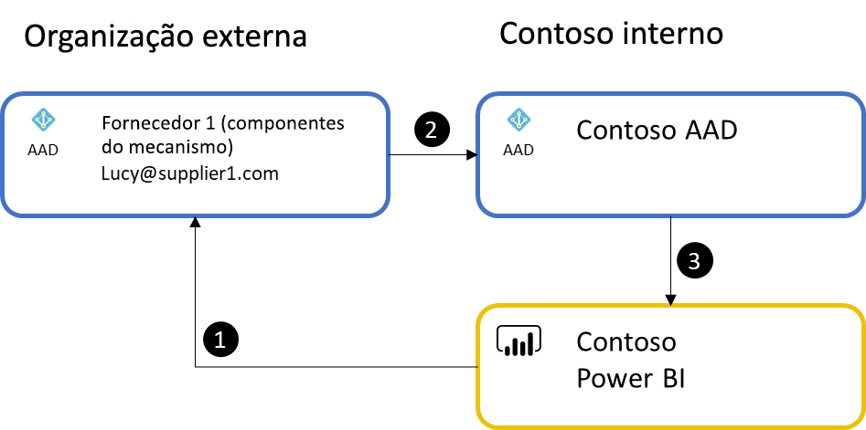

1. O processo começa com um usuário interno da Contoso que compartilha um Dashboard ou um relatório com um usuário externo. Se o usuário externo ainda não for um convidado no Azure AD da Contoso, ele será convidado. Um email é enviado para seu endereço de email que inclui um convite para o Azure AD da contoso
2. O destinatário aceita o convite para o Azure AD da Contoso e é adicionado como um usuário convidado no Azure AD da contoso.
3. Em seguida, o destinatário é redirecionado para o painel Power BI, relatório ou aplicativo, que são somente leitura para o usuário.

O processo é considerado ad hoc, já que os usuários empresariais da Contoso executam a ação de convite conforme necessário para suas finalidades comerciais. Cada item compartilhado é um único link que o usuário externo pode acessar para exibir o conteúdo.

Depois que o usuário externo foi convidado para acessar os recursos da Contoso, uma conta de sombra pode ser criada para eles no contoso Azure AD e não precisa ser convidada novamente.  Na primeira vez que tentam acessar um recurso da Contoso como um painel Power BI, eles passam por um processo de consentimento, que o reconsidera o convite.  Se eles não concluírem o consentimento, eles não poderão acessar nenhum conteúdo da contoso.  Se eles tiverem problemas para resgatar o convite por meio do link original fornecido, um administrador do Azure AD poderá reenviar um link de convite específico para que eles possam resgatar.

### Planejado por compartilhamento de item

A contoso trabalha com um subcontratado para executar a análise de confiabilidade de radiadores. O subcontratado tem uma equipe de 10 pessoas que precisam acessar dados no ambiente de Power BI da contoso. O administrador do Azure AD da Contoso está envolvido para convidar todos os usuários e para lidar com adições/alterações à medida que o pessoal do subcontratado mudar. O administrador do Azure AD cria um grupo de segurança para todos os funcionários do subcontratado. Usando o grupo de segurança, os funcionários da Contoso podem facilmente gerenciar o acesso a relatórios e garantir que toda a equipe subcontratado necessária tenha acesso a todos os relatórios, painéis e aplicativos de Power BI necessários. O administrador do Azure AD também pode evitar estar envolvido no processo de convite ao escolher delegar direitos de convite a um funcionário confiável na contoso ou ao subcontratado para garantir o gerenciamento de pessoal oportuno.

Algumas organizações exigem mais controle sobre quando usuários externos são adicionados, convidando muitos usuários em uma organização externa ou muitas organizações externas. Nesses casos, o compartilhamento planejado pode ser usado para gerenciar a escala de compartilhamento, para impor políticas organizacionais e até mesmo para delegar direitos a indivíduos confiáveis para convidar e gerenciar usuários externos. O Azure AD B2B dá suporte a convites planejados a serem enviados diretamente [do portal do Azure por um administrador de ti](https://docs.microsoft.com/azure/active-directory/b2b/add-users-administrator)ou por meio [do PowerShell usando a API do Gerenciador de convite](https://docs.microsoft.com/azure/active-directory/b2b/customize-invitation-api) , em que um conjunto de usuários pode ser convidado em uma ação. Usando a abordagem de convites planejados, a organização pode controlar quem pode convidar usuários e implementar processos de aprovação. Recursos avançados do Azure AD, como grupos dinâmicos, podem facilitar a manutenção automática da associação do grupo de segurança.

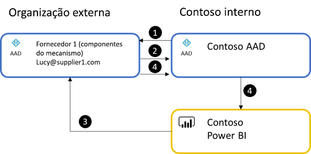

1. As estrelas do processo com um administrador de ti convidam o usuário convidado manualmente ou por meio da API fornecida pelo Azure Active Directory
2. O usuário aceita o convite para a organização.
3. Depois que o usuário aceitar o convite, um usuário do Power BI poderá compartilhar um relatório ou Dashboard com o usuário externo ou um grupo de segurança no qual eles estão. Assim como no caso de compartilhamento regular no Power BI o usuário externo recebe um email com o link para o item.
4. Quando o usuário externo acessa o link, sua autenticação em seu diretório é passada para o Azure AD da Contoso e usada para obter acesso ao conteúdo de Power BI.

### Compartilhamento ad hoc ou planejado de aplicativos Power BI

A contoso tem um conjunto de relatórios e painéis que eles precisam para compartilhar com um ou mais fornecedores. Para garantir que todos os usuários externos necessários tenham acesso a esse conteúdo, ele é empacotado como um aplicativo Power BI. Os usuários externos são adicionados diretamente à lista de acesso do aplicativo ou por meio de grupos de segurança. Em seguida, alguém da Contoso envia a URL do aplicativo para todos os usuários externos, por exemplo, em um email. Quando os usuários externos abrem o link, eles veem todo o conteúdo em uma única experiência fácil de navegar.

Usar um aplicativo Power BI torna mais fácil para a contoso criar um portal de BI para seus fornecedores. Uma única lista de acesso controla o acesso a todo o conteúdo necessário, reduzindo a verificação de tempo desperdiçado e definindo permissões de nível de item. O Azure AD B2B mantém o acesso de segurança usando a identidade nativa do fornecedor para que os usuários não precisem de credenciais de logon adicionais. Se você estiver usando convites planejados com grupos de segurança, o gerenciamento de acesso ao aplicativo como pessoal gira dentro ou fora do projeto é simplificado. Associação de grupos de segurança manualmente ou usando [grupos dinâmicos](https://docs.microsoft.com/azure/active-directory/b2b/use-dynamic-groups), para que todos os usuários externos de um fornecedor sejam adicionados automaticamente ao grupo de segurança apropriado.

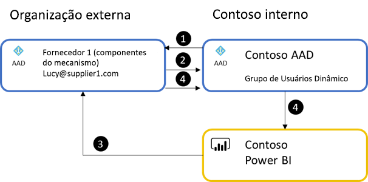

1. O processo é iniciado pelo usuário que está sendo convidado para a organização do Azure AD da Contoso por meio do portal do Azure ou do PowerShell
2. O usuário pode ser adicionado a um grupo de usuários no Azure AD. Um grupo de usuários estático ou dinâmico pode ser usado, mas os grupos dinâmicos ajudam a reduzir o trabalho manual.
3. Os usuários externos recebem acesso ao aplicativo Power BI por meio do grupo de usuários. A URL do aplicativo deve ser enviada diretamente ao usuário externo ou colocada em um site ao qual eles têm acesso. Power BI dá um melhor esforço para enviar um email com o link do aplicativo para usuários externos, mas ao usar grupos de usuários cujas associações podem ser alteradas, Power BI não é capaz de enviar a todos os usuários externos gerenciados por meio de grupos de usuários.
4. Quando o usuário externo acessa a URL do aplicativo Power BI, ele é autenticado pelo Azure AD da Contoso, o aplicativo é instalado para o usuário e o usuário pode ver todos os relatórios e painéis contidos no aplicativo.

Os aplicativos também têm um recurso exclusivo que permite que os autores de aplicativos instalem o aplicativo automaticamente para o usuário, para que ele esteja disponível quando o usuário fizer logon. Esse recurso só é instalado automaticamente para usuários externos que já fazem parte da organização da Contoso no momento em que o aplicativo é publicado ou atualizado. Portanto, ele é melhor usado com a abordagem de convites planejados e depende do aplicativo que está sendo publicado ou atualizado depois que os usuários são adicionados ao Azure AD da contoso. Os usuários externos sempre podem instalar o aplicativo usando o link do aplicativo.

### Comentar e inscrever-se no conteúdo entre organizações

À medida que a contoso continua a trabalhar com seus prestadores de serviço ou fornecedores, os engenheiros externos precisam trabalhar em conjunto com os analistas da contoso. O Power BI fornece vários recursos de colaboração que ajudam os usuários a se comunicarem sobre o conteúdo que podem consumir. Os comentários do painel (e em breve comentários do relatório) permitem que os usuários discutam os pontos de dados que veem e se comunicam com autores de relatório para fazer perguntas.

Atualmente, os usuários convidados externos podem participar de comentários, deixando comentários e lendo as respostas. No entanto, diferentemente dos usuários internos, @mentioned os usuários convidados não podem ser e não recebem notificações de que receberam um comentário. Os usuários convidados não podem usar o recurso de assinaturas em Power BI no momento da gravação. Em uma versão futura, essas restrições serão compostas e o usuário convidado receberá um email quando tiver um @mentions comentário ou quando uma assinatura for entregue ao email contendo um link para o conteúdo em Power bi.

### Acessar conteúdo no Power BI aplicativos móveis

Em uma versão futura, quando os usuários da Contoso compartilharem relatórios ou dashboards com seus contrapartes convidados externos, Power BI enviará um email notificando o convidado. Quando o usuário convidado abrir o link para o relatório ou painel em seu dispositivo móvel, o conteúdo será aberto nos aplicativos móveis nativos Power BI em seu dispositivo, se estiverem instalados. O usuário convidado poderá então navegar entre o conteúdo compartilhado com eles no locatário externo e voltar para seu próprio conteúdo de seu locatário inicial.

> [!NOTE]
> O usuário convidado não pode abrir o aplicativo Power BI Mobile e navegar imediatamente até o locatário externo, deve começar com um link para um item no locatário externo. As soluções alternativas comuns são descritas na seção [distribuindo links para conteúdo na Power bi da organização pai](#distributing-links-to-content-in-the-parent-organizations-power-bi) mais adiante neste documento.

### Edição e gerenciamento entre organizações de conteúdo de Power BI

A Contoso e seus fornecedores e subcontratados trabalham cada vez mais juntos. Muitas vezes, um analista do subcontratado precisa de uma métrica adicional ou visualizações de dados a serem adicionadas a um relatório que a contoso compartilhou com elas. Os dados devem residir no locatário de Power BI da Contoso, mas os usuários externos devem ser capazes de editá-lo, criar um novo conteúdo e até mesmo distribuí-lo para os indivíduos apropriados.

Power BI fornece uma opção que permite que **usuários convidados externos possam editar e gerenciar conteúdo** na organização. Por padrão, os usuários externos têm uma experiência orientada por consumo somente leitura. No entanto, essa nova configuração permite que o administrador do Power BI escolha quais usuários externos podem editar e gerenciar conteúdo em sua própria organização. Depois de permitido, o usuário externo pode editar relatórios, dashboards, publicar ou atualizar aplicativos, trabalhar em espaços de trabalho e conectar-se a dados que eles têm permissão para usar.

Esse cenário é descrito em detalhes na seção permitindo que usuários externos editem e gerenciem conteúdo em Power BI mais adiante neste documento.

## Relações organizacionais usando Power BI e B2B do Azure AD

Quando todos os usuários de Power BI são internos à organização, não há necessidade de usar o Azure AD B2B. No entanto, uma vez que duas ou mais organizações desejam colaborar em dados e ideias, o suporte de Power BI para B2B do Azure AD torna isso mais fácil e econômico.

A seguir, normalmente, são encontradas estruturas organizacionais adequadas para a colaboração entre organizações do estilo B2B do Azure AD no Power BI. O Azure AD B2B funciona bem na maioria dos casos, mas, em algumas situações, vale a pena considerar as abordagens alternativas comuns abordadas no final deste documento.

### Caso 1: Colaboração direta entre organizações

O relacionamento da contoso com seu fornecedor de radiador é um exemplo de colaboração direta entre organizações. Como há relativamente poucos usuários na contoso e seu fornecedor que precisa acessar informações de confiabilidade do radiador, usar o compartilhamento externo baseado em B2B do Azure AD é ideal. É fácil de usar e de administrar. Esse também é um padrão comum nos serviços de consultoria, em que um consultor pode precisar criar conteúdo para uma organização.

Normalmente, esse compartilhamento ocorre inicialmente usando ad hoc por compartilhamento de item. No entanto, à medida que as equipes crescem ou se aprofundam, a abordagem de compartilhamento por item planejada se torna o método preferencial para reduzir a sobrecarga de gerenciamento. Além disso, o compartilhamento ad hoc ou planejado de aplicativos Power BI, comentários e assinatura de conteúdo entre organizações, o acesso ao conteúdo em aplicativos móveis também pode entrar em jogo, bem como a edição entre organizações e o gerenciamento de conteúdo de Power BI. Importante, se os usuários das organizações tiverem Power BI Pro licenças em suas respectivas organizações, eles poderão usar essas licenças pro nos ambientes de Power BI de cada uma delas. Isso fornece licenciamento vantajoso, uma vez que a organização que está convidando talvez não precise pagar por uma licença de Power BI Pro para os usuários externos. Isso é discutido mais detalhadamente na seção licenciamento mais adiante neste documento.

### Caso 2: Pai e suas subsidiárias ou afiliadas

Algumas estruturas de organização são mais complexas, incluindo subsidiárias parcialmente ou totalmente corporativas, empresas afiliadas ou relações de provedor de serviços gerenciados. Essas organizações têm uma organização pai como uma empresa controladora, mas as organizações subjacentes operam semiautônomamente, às vezes em diferentes requisitos regionais. Isso leva a cada organização que tem seu próprio ambiente do Azure AD e separa Power BI locatários.

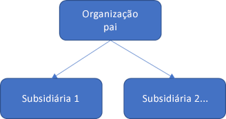

Nessa estrutura, a organização pai normalmente precisa distribuir informações padronizadas para suas subsidiárias. Normalmente, esse compartilhamento ocorre usando o compartilhamento ad hoc ou planejado da abordagem de aplicativos Power BI, conforme ilustrado na imagem a seguir, pois permite a distribuição de conteúdo autoritativo padronizado para públicos amplos. Na prática, uma combinação de todos os cenários mencionados anteriormente neste documento é usada.

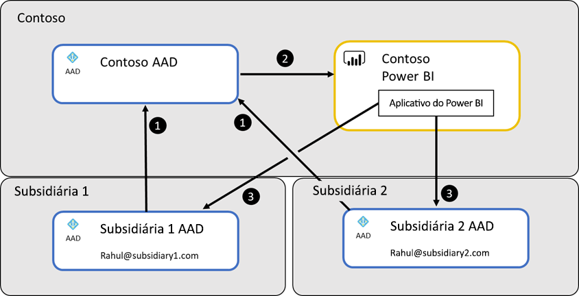

Isso segue o seguinte processo:

1. Os usuários de cada subsidiária são convidados para o Azure AD da contoso
2. Em seguida, o aplicativo Power BI é publicado para conceder a esses usuários acesso aos dados necessários
3. Por fim, os usuários abrem o aplicativo por meio de um link que eles receberam para ver os relatórios

Vários desafios importantes são enfrentados pelas organizações nesta estrutura:

- Como distribuir links para conteúdo no Power BI da organização pai
- Como permitir que os usuários da subsidiária acessem a fonte de dados hospedada pela organização pai

#### Distribuindo links para conteúdo no Power BI da organização pai

Três abordagens são comumente usadas para distribuir links para o conteúdo. O primeiro e mais básico é enviar o link para o aplicativo para os usuários necessários ou colocá-lo em um site do SharePoint Online a partir do qual ele pode ser aberto. Os usuários podem então marcar o link em seus navegadores para ter acesso mais rápido aos dados de que precisam.

A segunda abordagem se baseia na edição e gerenciamento entre organizações de Power BI recurso de conteúdo. A organização pai permite que os usuários das subsidiárias acessem seu Power BI e controlam o que eles podem acessar por meio de permissão. Isso dá acesso ao Power BI Home, em que o usuário da subsidiária vê uma lista abrangente de conteúdo compartilhado para eles no locatário da organização pai. Em seguida, a URL para o ambiente de Power BI das organizações pai é dada aos usuários nas subsidiárias.

A abordagem final usa um aplicativo Power BI criado dentro do locatário Power BI para cada subsidiária. O aplicativo Power BI inclui um painel com [blocos configurados com a opção link externo](https://docs.microsoft.com/power-bi/service-dashboard-edit-tile#hyperlink). Quando o usuário pressiona o bloco, ele é levado para o relatório, o painel ou o aplicativo apropriado no Power BI da organização pai. Essa abordagem tem a vantagem adicional de que o aplicativo pode ser instalado automaticamente para todos os usuários na subsidiária e está disponível para eles sempre que eles entrarem em seu próprio ambiente de Power BI. Uma vantagem adicional dessa abordagem é que ela funciona bem com os aplicativos móveis Power BI que podem abrir o link nativamente. Você também pode combinar isso com a segunda abordagem para permitir a alternância mais fácil entre ambientes de Power BI.

#### Permitindo que os usuários da subsidiária acessem fontes de dados hospedadas pela organização pai

Geralmente, os analistas de uma subsidiária precisam criar sua própria análise usando os dados fornecidos pela organização pai. Nesse caso, geralmente as fontes de dados de nuvem são usadas para resolver o desafio.

A primeira abordagem aproveita [Azure Analysis Services](https://docs.microsoft.com/azure/analysis-services/analysis-services-overview) para criar uma data warehouse de nível empresarial que atenda às necessidades de analistas em todo o pai e em suas subsidiárias, conforme mostrado na imagem a seguir. A Contoso pode hospedar os dados e usar recursos como segurança em nível de linha para garantir que os usuários em cada subsidiária possam acessar apenas seus dados. Os analistas em cada organização podem acessar os data warehouse por meio de Power BI Desktop e publicar análises resultantes em seus respectivos locatários de Power BI.

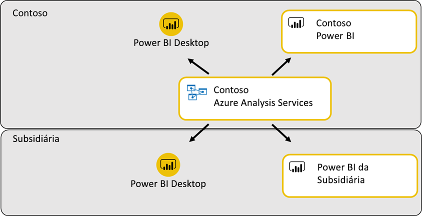

A segunda abordagem aproveita o [banco de dados SQL do Azure](https://azure.microsoft.com/services/sql-database/) para criar um data warehouse relacional para fornecer acesso aos dados. Isso funciona de forma semelhante à abordagem de Azure Analysis Services, embora alguns recursos como segurança de nível de linha possam ser mais difíceis de implantar e manter entre as subsidiárias.

Abordagens mais sofisticadas também são possíveis, mas as anteriores são de longe as mais comuns.

### Caso 3: Ambiente compartilhado entre parceiros

A Contoso pode entrar em uma parceria com um concorrente para criar um carro em conjunto em uma linha de assembly compartilhada, mas para distribuir o veículo sob diferentes marcas ou em regiões diferentes. Isso requer colaboração extensiva e copropriedade de dados, inteligência e análise entre organizações. Essa estrutura também é comum no setor de serviços de consultoria, em que uma equipe de consultores pode fazer análises baseadas em projetos para um cliente.

Na prática, essas estruturas são complexas, conforme mostrado na imagem a seguir, e exigem que a equipe se mantenha. Para ser eficaz, essa estrutura depende da edição e do gerenciamento entre organizações de Power BI recurso de conteúdo, pois permite que as organizações reutilizem Power BI Pro licenças adquiridas para seus respectivos locatários de Power BI.

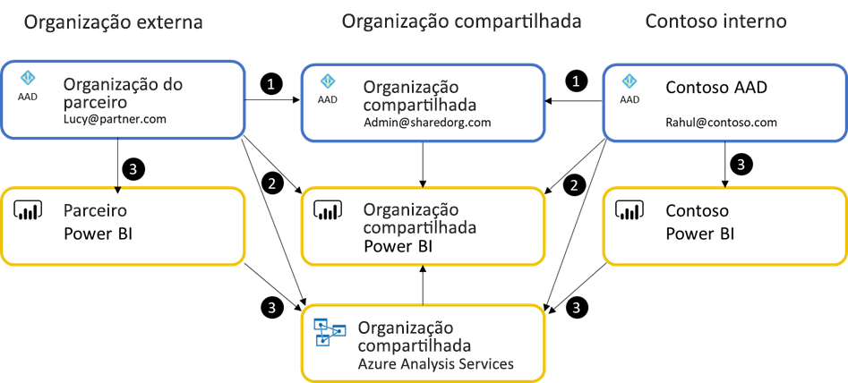

Para estabelecer um locatário de Power BI compartilhado, um Azure Active Directory precisa ser criado e pelo menos uma conta de usuário Power BI Pro precisa ser adquirida para um usuário nesse Active Directory. Esse usuário convida os usuários necessários para a organização compartilhada. O importante é que, nesse cenário, os usuários da Contoso são tratados como usuários externos quando operam dentro das Power BI da organização compartilhada.

O processo é o seguinte:

1. A organização compartilhada é estabelecida como um novo Azure Active Directory e pelo menos uma conta de usuário é criada na nova organização. Esse usuário deve ter uma licença Power BI Pro atribuída a ele.
2. Esse usuário estabelece um locatário Power BI e convida os usuários necessários da Contoso e da organização parceira. O usuário também estabelece quaisquer ativos de dados compartilhados, como Azure Analysis Services. A Contoso e os usuários do parceiro podem acessar a Power BI da organização compartilhada como usuários convidados. Se for permitido editar e gerenciar conteúdo em Power BI os usuários externos podem usar Power BI página inicial, usar espaços de trabalho, carregar ou editar conteúdo e compartilhar relatórios. Normalmente, todos os ativos compartilhados são armazenados e acessados da organização compartilhada.
3. Dependendo de como as partes concordam em colaborar, é possível que cada organização desenvolva seus próprios dados proprietários e análises usando ativos de data warehouse compartilhados. Eles podem distribuí-los para seus respectivos usuários internos usando seus locatários Power BI internos.

### Caso 4: Distribuição para centenas ou milhares de parceiros externos

Embora a contoso tenha criado um relatório de confiabilidade do radiador para um fornecedor, agora a contoso deseja criar um conjunto de relatórios padronizados para centenas de fornecedores. Isso permite que a contoso garanta que todos os fornecedores tenham a análise de que precisam para fazer melhorias ou para corrigir os defeitos de fabricação.

Quando uma organização precisa distribuir dados padronizados e informações para muitos usuários/organizações externos, eles podem usar o cenário ad hoc ou planejado de aplicativos Power BI para criar um portal de BI rapidamente e sem custos de desenvolvimento extensivos. O processo para criar um portal desse tipo usando um aplicativo Power BI é abordado no estudo de caso: Criando um portal de BI usando o Power BI + Azure AD B2B – instruções passo a passo mais adiante neste documento.

Uma variante comum desse caso é quando uma organização está tentando compartilhar ideias com consumidores, especialmente ao considerar o uso do Azure B2C com Power BI. Power BI não dá suporte nativo ao Azure B2C. Se você estiver avaliando opções para esse caso, considere usar a opção 2 alternativa nas abordagens alternativas comuns na seção mais adiante neste documento.

## Estudo de caso: Criando um portal de BI usando o Power BI + Azure AD B2B – instruções passo a passo

A integração do Power BI com o Azure AD B2B oferece à contoso uma maneira direta e sem complicações de fornecer aos usuários convidados acesso seguro ao seu portal de BI. A Contoso pode configurar isso com três etapas:

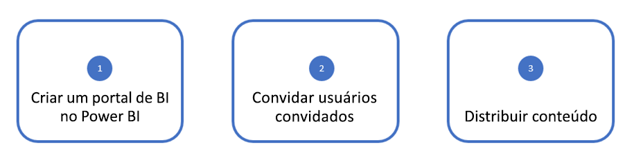

1. Criar um portal de BI no Power BI

    A primeira tarefa para a contoso é criar seu portal de BI no Power BI. O portal de BI da Contoso consistirá em uma coleção de painéis e relatórios criados por finalidade que serão disponibilizados para muitos usuários internos e convidados. A maneira recomendada para fazer isso no Power BI é criar um aplicativo Power BI. Saiba mais sobre os [aplicativos no Power bi](https://powerbi.microsoft.com/blog/distribute-to-large-audiences-with-power-bi-apps/).

- A equipe de BI da Contoso cria um espaço de trabalho de aplicativo no Power BI

    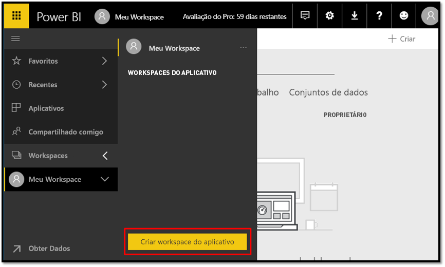
    

- Outros autores são adicionados ao espaço de trabalho

    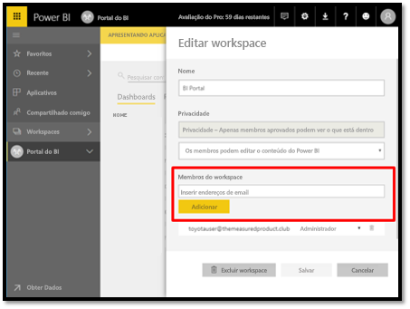

- O conteúdo é criado dentro do espaço de trabalho

    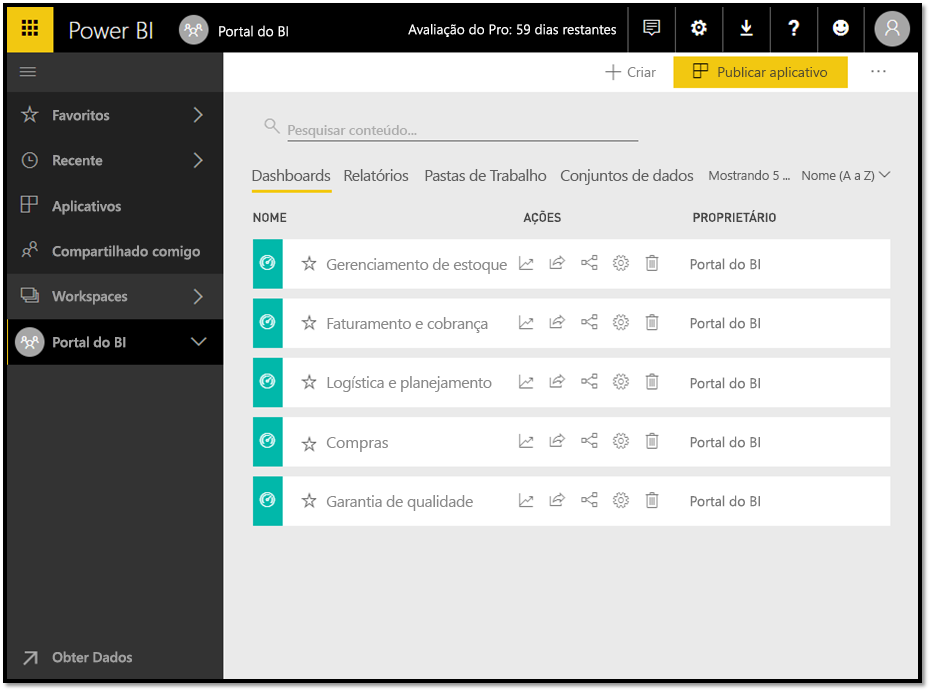

    Agora que o conteúdo foi criado em um espaço de trabalho de aplicativo, a Contoso está pronta para convidar usuários convidados em organizações parceiras para consumir esse conteúdo.

2. Convidar usuários convidados

    Há duas maneiras de o contoso convidar usuários convidados para seu portal de BI no Power BI:

    * Convites planejados
    * Convites ad hoc

    **Convites planejados**

    Nessa abordagem, a contoso convida os usuários convidados para o Azure AD antecipadamente e, em seguida, distribui Power BI conteúdo a eles. A Contoso pode convidar usuários convidados do portal do Azure ou usando o PowerShell. Estas são as etapas para convidar usuários convidados do portal do Azure:

    - O administrador do Azure AD da Contoso navega para **portal do Azure > Azure Active Directory > usuários e grupos > todos os usuários > novo usuário convidado**

    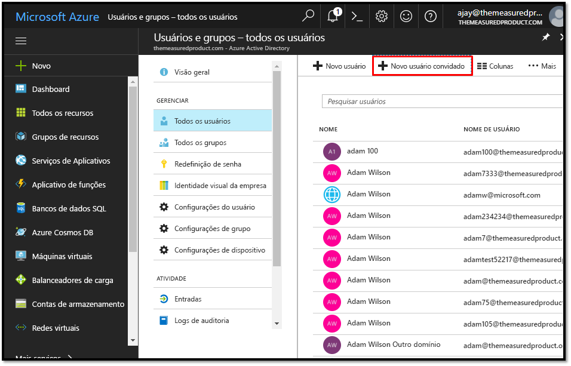

    - Adicione uma mensagem de convite para os usuários convidados e clique em convidar

    

    > [!NOTE]
    > Para convidar usuários convidados da portal do Azure, você precisa de um administrador para a Azure Active Directory do seu locatário.

    Se a contoso quiser convidar muitos usuários convidados, eles poderão fazer isso usando o PowerShell. O administrador do Azure AD da Contoso armazena os endereços de email de todos os usuários convidados em um arquivo CSV. Aqui estão [Azure Active Directory código de colaboração B2B e exemplos](https://docs.microsoft.com/azure/active-directory/b2b/code-samples) e instruções do PowerShell.

    Após o convite, os usuários convidados receberão um email com o link do convite.

    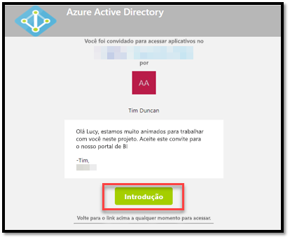

    Depois que os usuários convidados clicarem no link, poderão acessar o conteúdo no locatário do Azure AD da contoso.

    > [!NOTE]
    > É possível alterar o layout do email de convite usando o recurso de identidade visual do Azure AD, conforme descrito [aqui](https://docs.microsoft.com/azure/active-directory/active-directory-b2b-invitation-email).

    **Convites ad hoc**

    E se a contoso não souber todos os usuários convidados que deseja convidar antes do tempo? Ou, e se o analista da Contoso que criou o portal de BI quiser distribuir o conteúdo para os usuários convidados? Também damos suporte a esse cenário em Power BI com convites ad hoc.

    O analista pode apenas adicionar os usuários externos à lista de acesso do aplicativo quando eles estão publicando-os. Os usuários convidados recebem um convite e, depois de aceitá-lo, eles são redirecionados automaticamente para o conteúdo de Power BI.

    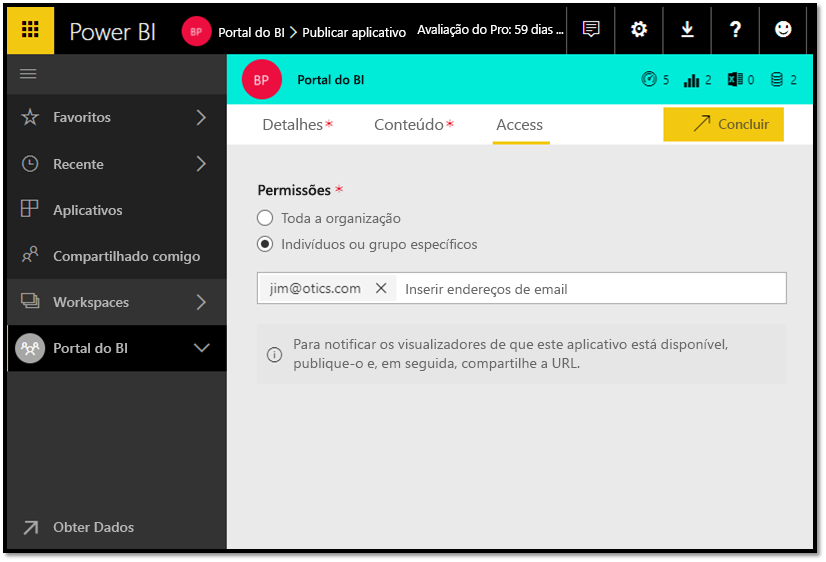

    > [!NOTE]
    > Os convites são necessários apenas na primeira vez que um usuário externo é convidado para sua organização.

3. Distribuir conteúdo

    Agora que a equipe de BI da Contoso criou o portal de BI e convidou os usuários convidados, eles podem distribuir seu portal para seus usuários finais, fornecendo aos usuários convidados acesso ao aplicativo e publicando-o. Power BI conclui automaticamente os nomes de usuários convidados que foram adicionados anteriormente ao locatário da contoso. Os convites ad hoc para outros usuários convidados também podem ser adicionados neste ponto.

    > [!NOTE]
    > Se você estiver usando grupos de segurança para gerenciar o acesso ao aplicativo para usuários externos, use a abordagem de convites planejados e compartilhe o link do aplicativo diretamente com cada usuário externo que deve acessá-lo. Caso contrário, o usuário externo pode não conseguir instalar ou exibir o conteúdo de dentro do aplicativo. _

    Os usuários convidados recebem um email com um link para o aplicativo.

    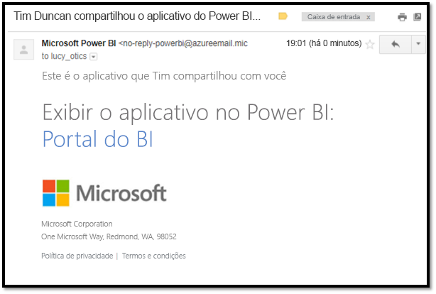

    Ao clicar nesse link, os usuários convidados serão solicitados a autenticar com a identidade de sua própria organização.

    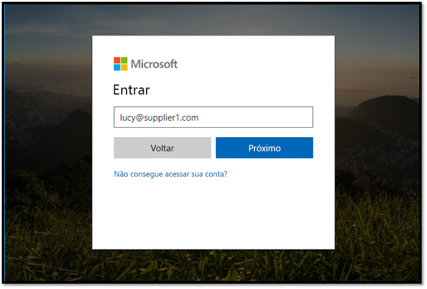

    Depois que eles forem autenticados com êxito, eles serão redirecionados para o aplicativo de BI da contoso.

    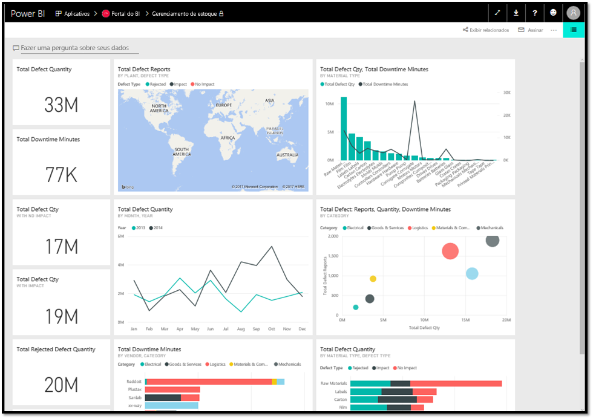

    Os usuários convidados podem chegar posteriormente ao aplicativo da Contoso clicando no link no email ou no indicador do link. A contoso também pode facilitar para os usuários convidados adicionando esse link a qualquer portal de extranet existente que os usuários convidados já usam.

4. Próximas etapas

    Usando um aplicativo Power BI e o Azure AD B2B, a contoso conseguiu criar rapidamente um portal de BI para seus fornecedores de forma sem código. Isso simplificau muito a distribuição de análises padronizadas para todos os fornecedores que precisavam dela.

    Embora o exemplo tenha mostrado como um único relatório comum poderia ser distribuído entre os fornecedores, Power BI pode ir muito além. Para garantir que cada parceiro veja apenas os dados relevantes, Segurança em Nível de Linha pode ser adicionado facilmente ao relatório e ao modelo de dados. A seção segurança de dados para parceiros externos mais adiante neste documento descreve esse processo em detalhes.

    Geralmente, relatórios e painéis individuais precisam ser inseridos em um portal existente. Isso também pode ser feito reutilizando muitas das técnicas mostradas no exemplo. No entanto, nessas situações, pode ser mais fácil inserir relatórios ou dashboards diretamente de um espaço de trabalho. O processo para convidar e atribuir permissão de segurança para os usuários necessários permanecem os mesmos.

## Nos bastidores: Como o Lucy da Supplier1 é capaz de acessar Power BI conteúdo do locatário da contoso?

Agora que vimos como a contoso é capaz de distribuir diretamente Power BI conteúdo para usuários convidados em organizações parceiras, vamos examinar como isso funciona nos bastidores.

Quando a Contoso [lucy@supplier1.com](mailto:lucy@supplier1.com) convidou para seu diretório, o Azure ad cria um [Lucy@supplier1.com](mailto:Lucy@supplier1.com) link entre o e o locatário do Azure ad da contoso. Esse link permite que o Azure ad Lucy@supplier1.com saiba que pode acessar o conteúdo no locatário da contoso.

Quando o Lucy tenta acessar o aplicativo Power BI da Contoso, o Azure AD verifica se o Lucy pode acessar o locatário da Contoso e, em seguida, fornece Power BI um token que indica que o Lucy é autenticado para acessar o conteúdo no locatário da contoso. Power BI usa esse token para autorizar e garantir que o Lucy tenha acesso ao aplicativo de Power BI da contoso.

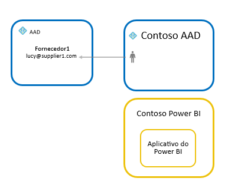

A integração do Power BI com o Azure AD B2B funciona com todos os endereços de email de negócios. Se o usuário não tiver uma identidade do Azure AD, poderá ser solicitado a criar uma. A imagem a seguir mostra o fluxo detalhado:

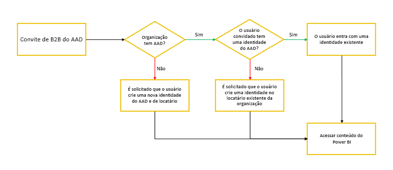

É importante reconhecer que a conta do Azure AD será usada ou criada no Azure AD da parte externa, isso possibilitará que o Lucy use seu próprio nome de usuário e senha e suas credenciais irão parar de funcionar automaticamente em outros locatários sempre que Lucy deixa a empresa quando sua organização também usa o Azure AD.

## Licenciamento

A Contoso pode escolher uma das três abordagens para licenciar usuários convidados de seus fornecedores e organizações parceiras para ter acesso a Power BI conteúdo.

> [!NOTE]
> _A camada gratuita do Azure AD B2B's é suficiente para usar Power BI com o Azure AD B2B. Alguns recursos B2B avançados do Azure AD, como grupos dinâmicos, exigem licenciamento adicional. Consulte a documentação B2B do Azure AD para obter informações adicionais:_ [ _https://docs.microsoft.com/azure/active-directory/b2b/licensing-guidance_ ](https://docs.microsoft.com/azure/active-directory/b2b/licensing-guidance)

### Abordagem 1: A contoso usa Power BI Premium

Com essa abordagem, a contoso compra Power BI Premium capacidade e atribui seu conteúdo do portal de BI a essa capacidade. Isso permite que usuários convidados de organizações parceiras acessem o aplicativo de Power BI da Contoso sem nenhuma licença Power BI.

Os usuários externos também estão sujeitos às experiências somente de consumo oferecidas para usuários "gratuitos" em Power BI ao consumir conteúdo no Power BI Premium.

A contoso também pode aproveitar outros recursos Power BI Premium para seus aplicativos, como taxas de atualização maiores, capacidade dedicada e tamanhos de modelos grandes.

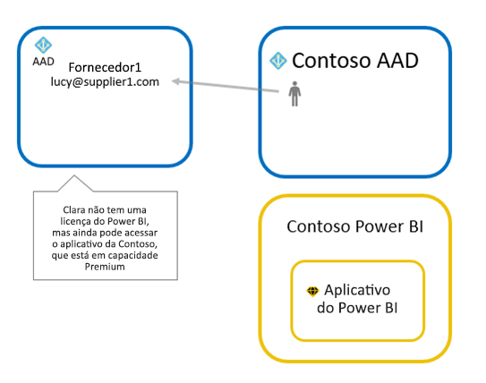

### Abordagem 2: A contoso atribui licenças de Power BI Pro a usuários convidados

Com essa abordagem, a contoso atribui licenças pro a usuários convidados de organizações parceiras – isso pode ser feito no centro de administração de Microsoft 365 da contoso. Isso permite que usuários convidados de organizações parceiras acessem o aplicativo de Power BI da Contoso sem comprar uma licença por conta própria. Isso pode ser apropriado para o compartilhamento com usuários externos cuja organização ainda não adotou Power BI.

> [!NOTE]
> _A licença pro da Contoso aplica-se a usuários convidados somente quando eles acessam conteúdo no locatário da contoso. As licenças pro permitem o acesso ao conteúdo que não está em uma capacidade de Power BI Premium. No entanto, usuários externos com uma licença pro são restritos por padrão a uma experiência de consumo apenas. Isso pode ser alterado usando a abordagem descrita na_ seção habilitando _usuários externos para editar e gerenciar conteúdo no Power bi_ _mais adiante neste documento._

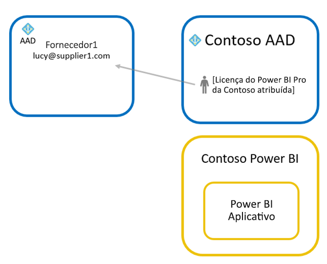

### Abordagem 3: Os usuários convidados trazem sua própria licença de Power BI Pro

Com essa abordagem, o fornecedor 1 atribui uma licença de Power BI Pro ao Lucy. Em seguida, eles podem acessar o aplicativo de Power BI da contoso com essa licença. Como o Lucy pode usar sua licença pro de sua própria organização ao acessar um ambiente de Power BI externo, essa abordagem, às vezes, é conhecida como _traga sua própria licença_ (BYOL). Se ambas as organizações estiverem usando Power BI, isso oferecerá um licenciamento vantajoso para a solução de análise geral e minimizará a sobrecarga de atribuir licenças a usuários externos.

> [!NOTE]
> _A licença pro fornecida ao Lucy pelo fornecedor 1 se aplica a qualquer locatário Power BI em que Lucy é um usuário convidado. As licenças pro permitem o acesso ao conteúdo que não está em uma capacidade de Power BI Premium. No entanto, usuários externos com uma licença pro são restritos por padrão a uma experiência de consumo apenas. Isso pode ser alterado usando a abordagem descrita na_ seção habilitando _usuários externos para editar e gerenciar conteúdo no Power bi_ _mais adiante neste documento._

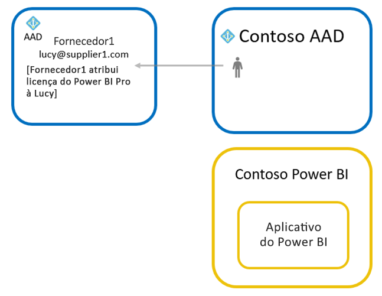

## Segurança de dados para parceiros externos

Normalmente, ao trabalhar com vários fornecedores externos, a contoso precisa garantir que cada fornecedor Veja dados apenas sobre seus próprios produtos. A segurança baseada em usuário e a segurança em nível de linha dinâmica facilitam esse processo com Power BI.

### Segurança baseada no usuário

Um dos recursos mais poderosos do Power BI é Segurança em Nível de Linha. Esse recurso permite que a contoso crie um único relatório e conjunto de recursos, mas ainda aplique regras de segurança diferentes para cada usuário. Para obter uma explicação aprofundada, consulte [RLS (segurança em nível de linha)](https://powerbi.microsoft.com/documentation/powerbi-admin-rls/).

A integração do Power BI com o Azure AD B2B permite que a contoso atribua regras de Segurança em Nível de Linha a usuários convidados assim que elas são convidadas para o locatário da contoso. Como vimos antes, a Contoso pode adicionar usuários convidados por meio de convites planejados ou ad hoc. Se a contoso quiser impor a segurança em nível de linha, é altamente recomendável usar os convites planejados para adicionar os usuários convidados antecipadamente e atribuí-los às funções de segurança antes de compartilhar o conteúdo. Se a contoso usa convites ad hoc, pode haver um curto período de tempo em que os usuários convidados não poderão ver dados.

> [!NOTE]
> Esse atraso no acesso a dados protegidos pela RLS ao usar convites ad hoc pode levar a solicitações de suporte à sua equipe de ti, pois os usuários verão os relatórios/painéis em branco ou com aparência desfeita ao abrir um link de compartilhamento no email que receberem. Portanto, é altamente recomendável usar convites planejados neste cenário. * *

Vamos percorrer isso com um exemplo.

Como mencionado anteriormente, a contoso tem fornecedores em todo o mundo e eles querem garantir que os usuários de suas organizações de fornecedores obtenham informações de dados de apenas seu território.  Mas os usuários da Contoso podem acessar todos os dados. Em vez de criar vários relatórios diferentes, a contoso cria um único relatório e filtra os dados com base no usuário que o exibe.

Para garantir que a contoso possa filtrar dados com base em quem está se conectando, duas funções são criadas na área de trabalho Power BI. Um para filtrar todos os dados da SalesTerritory "Europa" e outro para "América do Norte".

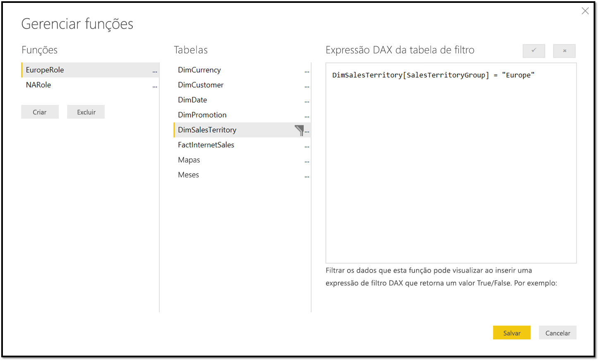

Sempre que as funções são definidas no relatório, um usuário deve ser atribuído a uma função específica para que eles obtenham acesso a qualquer dado. A atribuição de funções ocorre dentro do serviço do Power BI ( **conjuntos de > segurança** )

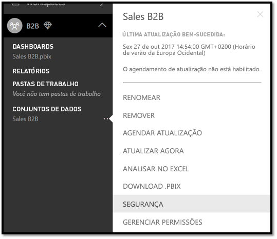

Isso abre uma página na qual a equipe de BI da Contoso pode ver as duas funções que eles criaram.  Agora, a equipe de BI da Contoso pode atribuir usuários às funções.

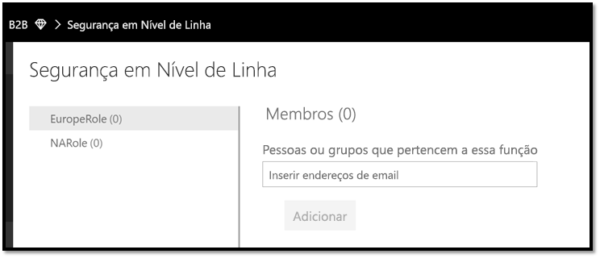

No exemplo, a Contoso está adicionando um usuário em uma organização parceira com o endereço[adam@themeasuredproduct.com](mailto:adam@themeasuredproduct.com)de email "" à função Europe:

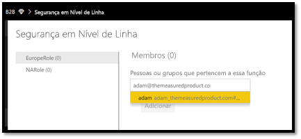

Quando isso é resolvido pelo Azure AD, a Contoso pode ver o nome aparecer na janela pronta para ser adicionada:

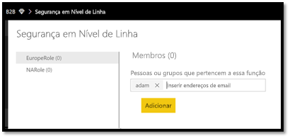

Agora, quando esse usuário abrir o aplicativo que foi compartilhado com ele, ele verá apenas um relatório com dados da Europa:

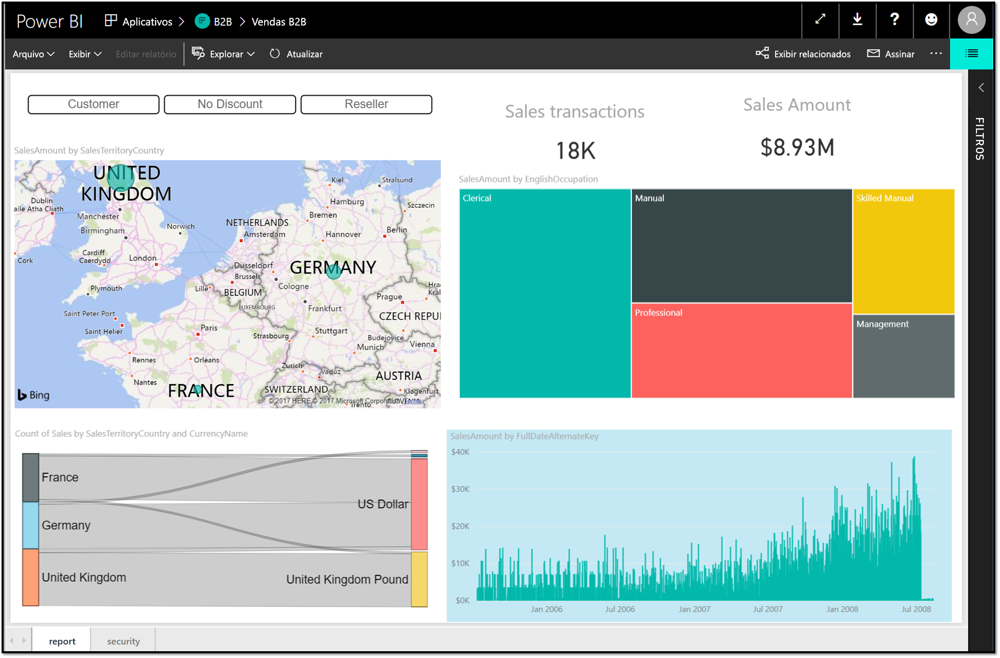

### Segurança dinâmica em nível de linha

Outro tópico interessante é ver como a RLS (segurança em nível de linha) dinâmica funciona com o B2B do Azure AD.

Em resumo, a segurança dinâmica em nível de linha funciona filtrando os dados no modelo com base no nome de usuário da pessoa que está se conectando ao Power BI. Em vez de adicionar várias funções para grupos de usuários, você define os usuários no modelo. Não descreveremos o padrão em detalhes aqui. O Kasper de Jong oferece uma gravação detalhada em todos os tipos de segurança de nível de linha em Power BI Desktop folha de consulta de [segurança dinâmica](https://www.kasperonbi.com/power-bi-desktop-dynamic-security-cheat-sheet/)e neste [White Paper](https://msdn.microsoft.com/library/jj127437.aspx) .

Vejamos um pequeno exemplo – a contoso tem um relatório simples sobre vendas por grupos:

Agora este relatório precisa ser compartilhado com dois usuários convidados e um usuário interno-o usuário interno pode ver tudo, mas os usuários convidados só podem ver os grupos aos quais eles têm acesso. Isso significa que devemos filtrar os dados somente para os usuários convidados. Para filtrar os dados adequadamente, a contoso usa o padrão RLS dinâmico, conforme descrito no White Paper e na postagem do blog. Isso significa que a contoso adiciona os nomes de acessados aos próprios dados:

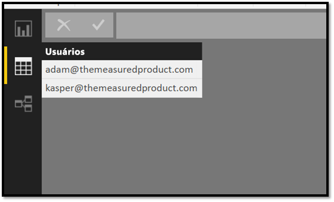

Em seguida, a contoso cria o modelo de dados correto que filtra os dados adequadamente com as relações corretas:

Para filtrar os dados automaticamente com base em quem está conectado, a contoso precisa criar uma função que passe o usuário que está se conectando. Nesse caso, a contoso cria duas funções – a primeira é a "securityrole", que filtra a tabela Users com o nome de usuário atual da usuária que fez logon no Power BI (isso funciona mesmo para os usuários convidados do Azure AD B2B).

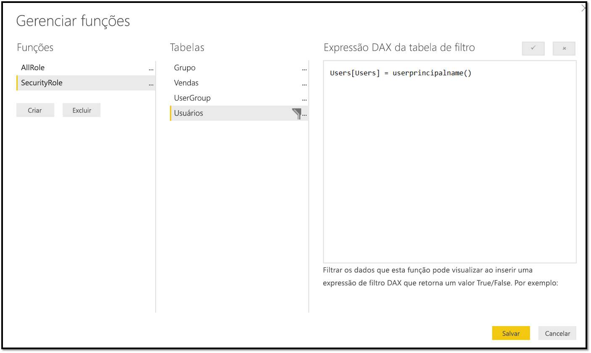

A contoso também cria outro "alrole" para seus usuários internos que podem ver tudo – essa função não tem nenhum predicado de segurança.

Depois de carregar o arquivo de área de trabalho Power BI para o serviço, a Contoso pode atribuir usuários convidados ao "SecurityRole" e aos usuários internos para a "função".

Agora, quando os usuários convidados abrirem o relatório, eles verão apenas vendas do grupo A:

Na matriz à direita, você pode ver o resultado da função USERNAME () e USERPRINCIPALNAME () retornam o endereço de email dos usuários convidados.

Agora, o usuário interno consegue ver todos os dados:

Como você pode ver, a RLS dinâmica funciona com usuários internos ou convidados.

> [!NOTE]
> Esse cenário também funciona ao usar um modelo no Azure Analysis Services. Normalmente, o serviço de análise do Azure está conectado ao mesmo Azure AD que seu Power BI-nesse caso, Azure Analysis Services também conhece os usuários convidados convidados por meio do Azure AD B2B.

## Conectando-se a fontes de dados locais

O Power BI oferece a capacidade da Contoso de aproveitar fontes de dados locais como [SQL Server Analysis Services](https://powerbi.microsoft.com/documentation/powerbi-gateway-enterprise-manage-ssas/) ou [SQL Server](https://powerbi.microsoft.com/documentation/powerbi-gateway-kerberos-for-sso-pbi-to-on-premises-data/) graças diretamente ao [Gateway de dados local](https://powerbi.microsoft.com/documentation/powerbi-gateway-onprem/). É ainda possível fazer logon nessas fontes de dados com as mesmas credenciais usadas com Power BI.

> [!NOTE]
> Ao instalar um gateway para se conectar ao seu locatário do Power BI, você deve usar um usuário criado em seu locatário. Os usuários externos não podem instalar um gateway e conectá-lo ao seu locatário. _

Para usuários externos, isso pode ser mais complicado, pois os usuários externos geralmente não são conhecidos pelo AD local. O Power BI oferece uma solução alternativa para isso, permitindo que os administradores da Contoso mapeiem os nomes de dados externos para nomes de acessados internos, conforme descrito em [gerenciar sua fonte Analysis Services](https://powerbi.microsoft.com/documentation/powerbi-gateway-enterprise-manage-ssas/). Por exemplo, [lucy@supplier1.com](mailto:lucy@supplier1.com) pode ser mapeado para [Lucy\_supplier1\_com #EXT@contoso.com](mailto:lucy_supplier1_com).

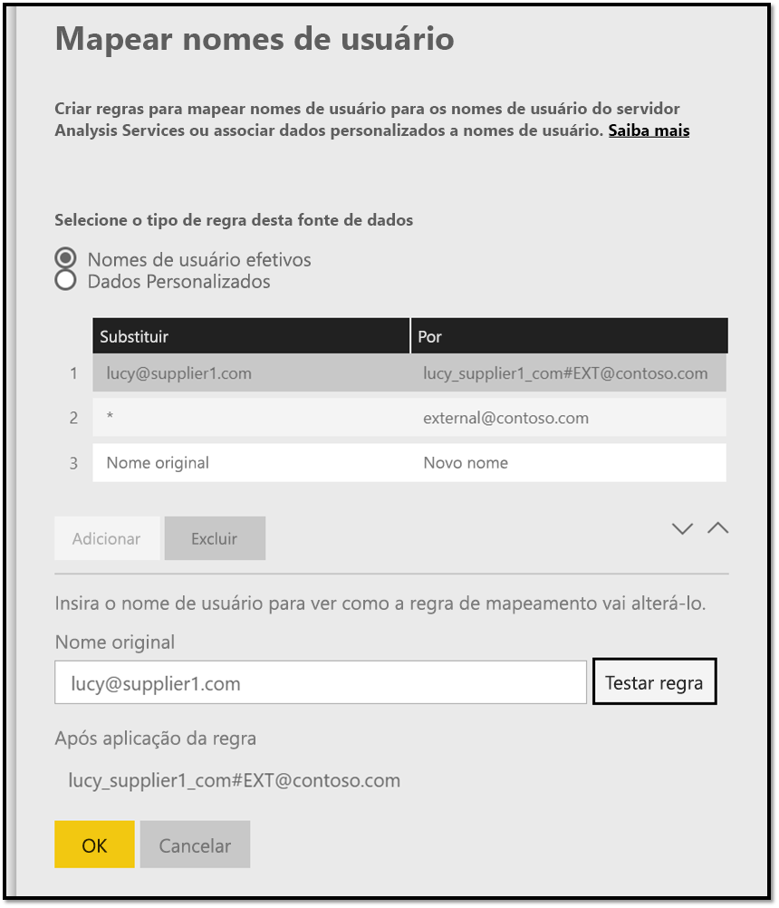

Esse método será bom se a Contoso tiver apenas alguns usuários ou se a contoso puder Mapear todos os usuários externos para uma única conta interna. Para cenários mais complexos em que cada usuário precisa de suas próprias credenciais, há uma abordagem mais avançada que usa [atributos personalizados do AD](https://technet.microsoft.com/library/cc961737.aspx) para fazer o mapeamento, conforme descrito em [gerenciar sua fonte de dados-Analysis Services](https://powerbi.microsoft.com/documentation/powerbi-gateway-enterprise-manage-ssas/). Isso permitiria que o administrador da Contoso definisse um mapeamento para cada usuário no AD do Azure (também usuários B2B externos).  Esses atributos podem ser definidos por meio do modelo de objeto do AD usando scripts ou código para que a contoso possa automatizar totalmente o mapeamento no convite ou em uma cadência agendada.

## Permitindo que usuários externos editem e gerenciem conteúdo dentro do Power BI

A Contoso pode permitir que usuários externos contribuam com o conteúdo na organização, conforme descrito anteriormente na seção de gerenciamento e edição entre organizações de Power BI conteúdo.

> [!NOTE]
> Para editar e gerenciar conteúdo dentro da Power BI de sua organização, o usuário deve ter uma licença de Power BI Pro em um espaço de trabalho diferente do meu espaço de trabalho. Os usuários podem obter licenças pro, conforme abordado em the_ _Licensing__section deste documento._

O portal de administração do Power BI fornece ao **permitir que usuários convidados externos editem e gerenciem conteúdo na** configuração da organização em configurações de locatário. Por padrão, a configuração é definida como desabilitada, o que significa que os usuários externos recebem uma experiência de somente leitura restrita por padrão. A configuração se aplica a usuários com UserType definido como convidado no Azure AD. A tabela a seguir descreve os comportamentos que os usuários enfrentam dependendo de seu UserType e como as configurações são definidas.

| **Tipo de usuário no Azure AD** | **Permitir que usuários convidados externos editem e gerenciem definições de conteúdo** | **Comportamento** |
| --- | --- | --- |
| Convidado | Desabilitado para o usuário (padrão) | Exibição somente por consumo de item. Permite o acesso somente leitura a relatórios, painéis e aplicativos quando exibido por meio de uma URL enviada ao usuário convidado. Power BI Mobile aplicativos fornecem uma exibição somente leitura para o usuário convidado. |
| Convidado | Habilitado para o usuário | O usuário externo obtém acesso a toda a experiência de Power BI, embora alguns recursos não estejam disponíveis para eles. O usuário externo deve fazer logon no Power BI usando a URL do serviço Power BI com as informações do locatário incluídas. O usuário Obtém a experiência inicial, um meu espaço de trabalho e, com base em permissões, pode procurar, exibir e criar conteúdo.    Power BI Mobile aplicativos fornecem uma exibição somente leitura para o usuário convidado. |

> [!NOTE]
> Usuários externos no Azure AD também podem ser definidos para o membro UserType. No momento, não há suporte para isso no Power BI.

No portal de administração do Power BI, a configuração é mostrada na imagem a seguir.

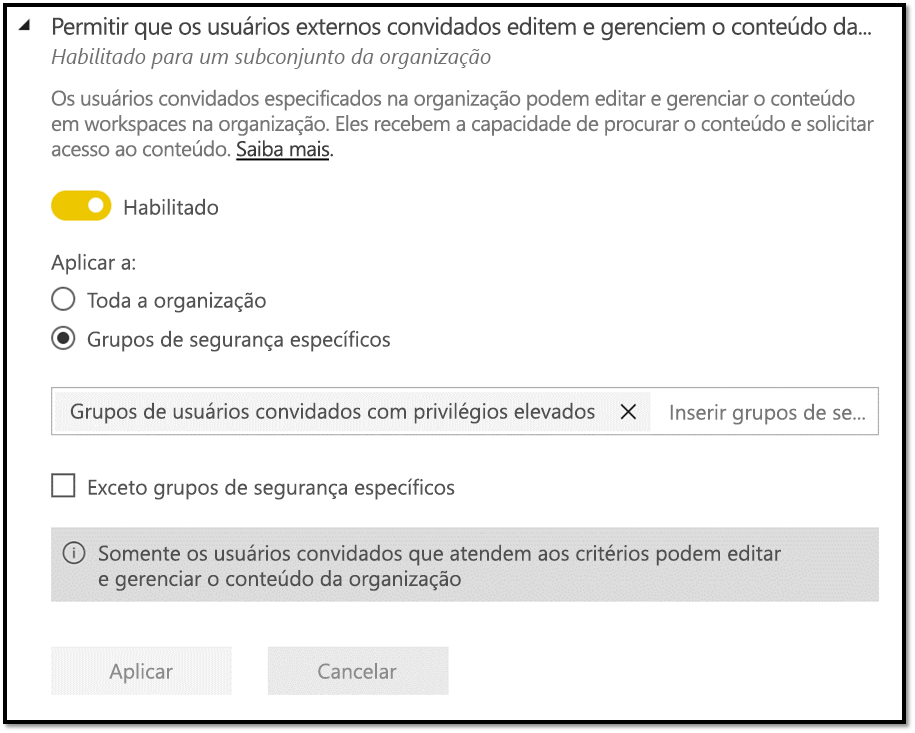

Os usuários convidados obtêm a experiência padrão somente leitura e podem editar e gerenciar conteúdo. O padrão é desabilitado, o que significa que todos os usuários convidados têm a experiência somente leitura. O administrador do Power BI pode habilitar a configuração para todos os usuários convidados na organização ou para grupos de segurança específicos definidos no Azure AD. Na imagem a seguir, o administrador da Contoso Power BI criou um grupo de segurança no Azure AD para gerenciar quais usuários externos podem editar e gerenciar conteúdo no locatário da contoso.

Para ajudar esses usuários a fazer logon no Power BI, forneça a URL do locatário. Para localizar a URL do locatário, siga estas etapas.

1. No serviço do Power BI, no menu superior, selecione ajuda ( **?** ), em seguida, **sobre Power bi**.
2. Procure o valor ao lado de **URL do locatário**. Esta é a URL do locatário que você pode compartilhar com seus usuários convidados.

    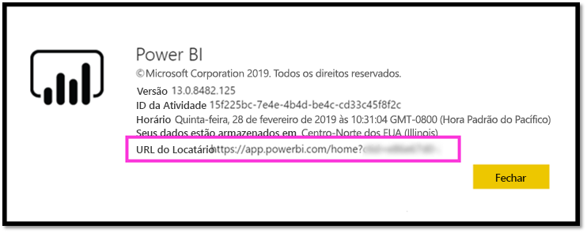

Ao usar o permitir que usuários convidados externos editem e gerenciem conteúdo na organização, os usuários convidados especificados terão acesso ao Power BI da sua organização e verão qualquer conteúdo ao qual tenham permissão. Eles podem acessar conteúdo doméstico, navegar e contribuir para espaços de trabalho, instalar aplicativos onde estão na lista de acesso e ter um meu espaço de trabalho. Eles podem ser administradores de workspaces que usam a nova experiência de workspace e até mesmo criar tais workspaces.

> [!NOTE]
> Ao usar essa opção, certifique-se de examinar a seção governança deste documento, uma vez que as configurações padrão do Azure AD impedem que os usuários convidados usem determinados recursos como seletores de pessoas, o que pode levar a uma experiência reduzida. * *

Para usuários convidados habilitados por meio do permitir que usuários convidados externos editem e gerenciem conteúdo na configuração de locatário da organização, algumas experiências não estão disponíveis para eles. Para atualizar ou publicar relatórios, os usuários convidados precisam usar a interface do usuário da Web do serviço do Power BI, incluindo obter dados para carregar Power BI Desktop arquivos. As seguintes experiências não são compatíveis:

- Publicação direta do Power BI Desktop para o serviço do Power BI
- Usuários convidados não podem usar o Power BI Desktop para se conectar a conjuntos de dados de serviço no serviço do Power BI
- Workspaces clássicos associados a Grupos do Office 365: Um usuário convidado não é capaz de criar ou ser administradores desses workspaces. Eles podem ser membros.
- O envio de convites ad-hoc para listas de acesso do workspace não é uma ação compatível
- O Power BI Publisher para Excel não é compatível com usuários convidados
- Usuários convidados não podem instalar um Power BI Gateway e conectá-lo à sua organização
- Usuários convidados não podem instalar aplicativos e publicá-los para toda a organização
- Usuários convidados não podem usar, criar, atualizar ou instalar pacotes de conteúdo organizacional
- Usuários convidados não podem usar o Analisar no Excel
- Os usuários convidados não @mentioned podem estar em comentários (essa funcionalidade será adicionada em uma versão futura)
- Os usuários convidados não podem usar assinaturas (essa funcionalidade será adicionada em uma versão futura)
- Usuários convidados que usam essa funcionalidade devem ter uma conta corporativa ou de estudante. Os usuários convidados que usam contas pessoais experimentam mais limitações devido a restrições de entrada.

## Governança

### Configurações adicionais do Azure AD que afetam experiências em Power BI relacionadas ao Azure AD B2B

Ao usar o compartilhamento B2B do Azure AD, o administrador de Azure Active Directory controla os aspectos da experiência do usuário externo. Eles são controlados na página de configurações de colaboração externa dentro das configurações de Azure Active Directory para seu locatário.

Os detalhes sobre as configurações estão disponíveis aqui:

[https://docs.microsoft.com/azure/active-directory/b2b/delegate-invitations](https://docs.microsoft.com/azure/active-directory/b2b/delegate-invitations)

> [!NOTE]
> Por padrão, a opção permissões de usuários convidados é limitada é definida como Sim, portanto, os usuários convidados dentro de Power BI têm experiências limitadas, especialmente o compartilhamento de hosts que as interfaces do usuário do seletor de pessoas não funcionam para esses usuários. É importante trabalhar com o administrador do Azure AD para defini-lo como não, conforme mostrado abaixo para garantir uma boa experiência. * *

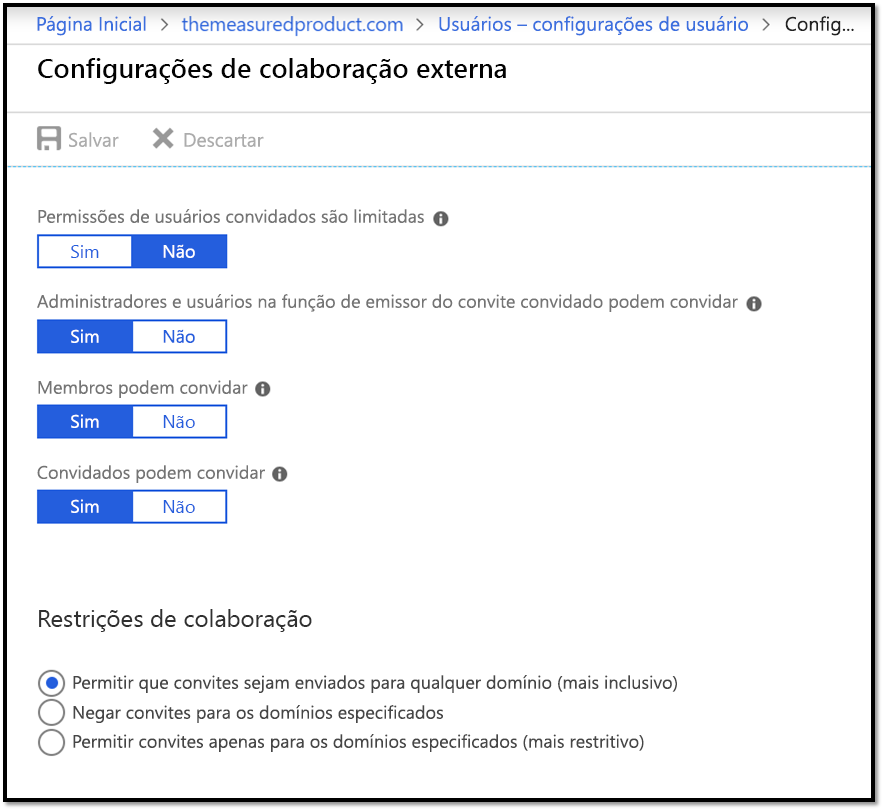

### Controlar convites de convidado

Power BI administradores podem controlar o compartilhamento externo apenas para Power BI visitando o portal de administração do Power BI. Mas os administradores de locatários também podem controlar o compartilhamento externo com várias políticas do Azure AD.  Essas políticas permitem que os administradores de locatários

- Desativar convites por usuários finais
- Somente administradores e usuários na função de convite do convidado podem convidar
- Administradores, a função emissor de convite para convidado e membros podem convidar
- Todos os usuários, incluindo convidados, podem convidar

Você pode ler mais sobre essas políticas em [convites delegados para Azure Active Directory colaboração B2B](https://docs.microsoft.com/azure/active-directory/active-directory-b2b-delegate-invitations).

Todas as ações de Power BI por usuários externos também são [auditadas em nosso portal de auditoria](https://powerbi.microsoft.com/documentation/powerbi-admin-auditing/).

### Políticas de acesso condicional para usuários convidados

A Contoso pode impor políticas de acesso condicional para usuários convidados que acessam o conteúdo do locatário da contoso. Você pode encontrar instruções detalhadas em [acesso condicional para usuários de colaboração B2B](https://docs.microsoft.com/azure/active-directory/active-directory-b2b-mfa-instructions).

## Abordagens alternativas comuns

Embora o Azure AD B2B facilite o compartilhamento de dados e relatórios entre organizações, há várias outras abordagens que são comumente usadas e podem ser superiores em determinados casos.

### Opção alternativa 1: Criar identidades duplicadas para usuários parceiros

Com essa opção, a Contoso tinha que criar manualmente identidades duplicadas para cada usuário do parceiro no locatário da Contoso, conforme mostrado na imagem a seguir. Em seguida, em Power BI, a Contoso pode compartilhar com as identidades atribuídas aos relatórios, painéis ou aplicativos apropriados.

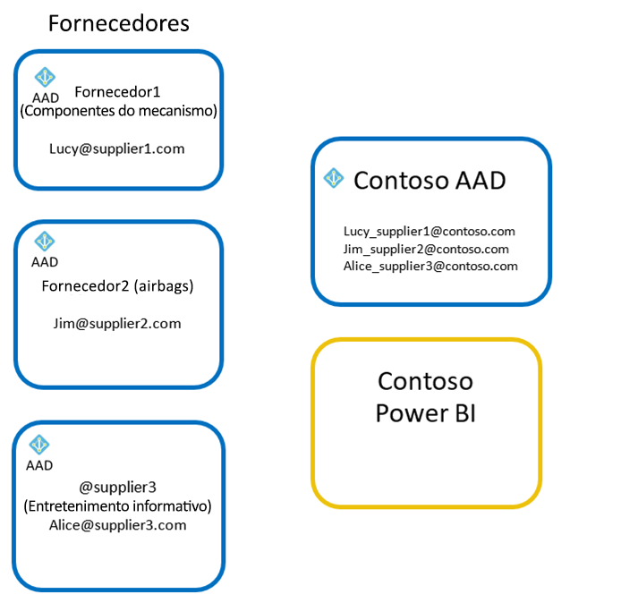

Motivos para escolher essa alternativa:

- Como a identidade do usuário é controlada por sua organização, qualquer serviço relacionado, como email, SharePoint etc., também está dentro do controle da sua organização. Os administradores de ti podem redefinir senhas, desabilitar o acesso a contas ou atividades de auditoria nesses serviços.
- Os usuários que usam contas pessoais para seus negócios geralmente são restritos de acessar determinados serviços, de modo que podem precisar de uma conta institucional.
- Alguns serviços só funcionam nos usuários da sua organização. Por exemplo, usar o Intune para gerenciar o conteúdo em dispositivos pessoais/móveis de usuários externos usando o Azure B2B pode não ser possível.

Motivos para não escolher essa alternativa:

- Os usuários de organizações parceiras devem se lembrar de dois conjuntos de credenciais – um para acessar o conteúdo de sua própria organização e o outro para acessar o conteúdo da contoso. Isso é um incômodo para esses usuários convidados e muitos usuários convidados são confundidos por essa experiência.
- A Contoso deve comprar e atribuir licenças por usuário a esses usuários. Se um usuário precisar receber emails ou usar aplicativos do Office, eles precisarão das licenças apropriadas, incluindo Power BI Pro para editar e compartilhar conteúdo no Power BI.
- A Contoso pode querer impor políticas de governança e autorização mais rigorosas para usuários externos em comparação com usuários internos. Para conseguir isso, a contoso precisa criar um nomenclatura interno para usuários externos e todos os usuários da Contoso precisam ser instruídos sobre esse nomenclatura.
- Quando o usuário deixa sua organização, ele continua a ter acesso aos recursos da Contoso até que o administrador da Contoso exclua manualmente sua conta
- Os administradores da Contoso precisam gerenciar a identidade do convidado, incluindo criação, redefinições de senha, etc.

### Opção alternativa 2: Criar um aplicativo de Power BI Embedded personalizado usando a autenticação personalizada

Outra opção para a contoso é criar seu próprio aplicativo de Power BI incorporado personalizado com autenticação personalizada ([' aplicativo possui dados '](https://docs.microsoft.com/power-bi/developer/embed-sample-for-customers)). Embora muitas organizações não tenham tempo ou recursos para criar um aplicativo personalizado para distribuir Power BI conteúdo para seus parceiros externos, para algumas organizações essa é a melhor abordagem e merece uma consideração séria.

Muitas vezes, as organizações têm portais de parceiros existentes que centralizam o acesso a todos os recursos organizacionais de parceiros, fornecem isolamento de recursos organizacionais internos e fornecem experiências simplificadas para que os parceiros ofereçam suporte a muitos parceiros e seus usuários individuais.

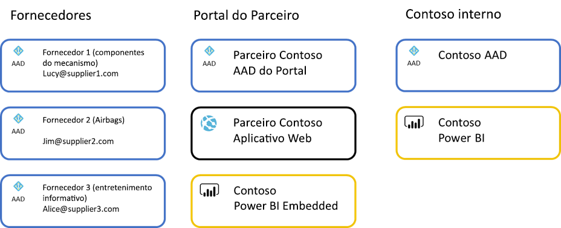

No exemplo acima, os usuários de cada fornecedor efetuam logon no portal de parceiros da Contoso que usa o AAD como um provedor de identidade. Ele poderia usar o AAD B2B, o Azure B2C, identidades nativas ou federar com qualquer número de outros provedores de identidade. O usuário faria logon e acessaria um Build do portal do parceiro usando o aplicativo Web do Azure ou uma infraestrutura semelhante.

No aplicativo Web, Power BI relatórios são inseridos de uma implantação de Power BI Embedded. O aplicativo Web simplificaria o acesso aos relatórios e a todos os serviços relacionados em uma experiência coesa, visando tornar mais fácil para os fornecedores interagirem com a contoso. Esse ambiente de portal estaria isolado do AAD interno do Contoso e do ambiente de Power BI interno da Contoso para garantir que os fornecedores não pudessem acessar esses recursos. Normalmente, os dados seriam armazenados em um parceiro separado data warehouse para garantir o isolamento dos dados também. Esse isolamento tem benefícios, pois limita o número de usuários externos com acesso direto aos dados da sua organização, limitando quais dados podem estar potencialmente disponíveis para o usuário externo e limitando o compartilhamento acidental com usuários externos.

Usando Power BI Embedded, o portal pode aproveitar o licenciamento vantajoso, usando o token do aplicativo ou o usuário mestre mais a capacidade Premium adquirida no modelo do Azure, o que simplifica as preocupações sobre a atribuição de licenças aos usuários finais e pode escalar/reduzir verticalmente com base no esperado usos. O portal pode oferecer uma experiência geral de maior qualidade e consistente, já que os parceiros acessam um único portal projetado com todas as necessidades de um parceiro em mente. Por fim, como as soluções baseadas em Power BI Embedded normalmente são projetadas para serem multilocatários, isso facilita a garantia de isolamento entre organizações parceiras.

Motivos para escolher essa alternativa:

- Mais fácil de gerenciar à medida que o número de organizações parceiras cresce. Como os parceiros são adicionados a um diretório separado isolado do diretório interno do AAD da Contoso, ele simplifica as tarefas de governança e ajuda a impedir o compartilhamento acidental de dados internos para usuários externos.
- Portais de parceiros típicos são experiências altamente marcadas com experiências consistentes entre parceiros e simplificadas para atender às necessidades de parceiros típicos. Portanto, a Contoso pode oferecer uma experiência geral melhor aos parceiros integrando todos os serviços necessários em um único portal.
- Os custos de licenciamento para cenários avançados, como a edição de conteúdo dentro do Power BI Embedded, são cobertos pela Power BI Premium comprada do Azure e não exigem a atribuição de licenças de Power BI Pro para esses usuários.
- Fornece um melhor isolamento entre parceiros, se arquitetado como uma solução multilocatário.
- O portal de parceiros geralmente inclui outras ferramentas para parceiros além de Power BI relatórios, painéis e aplicativos.

Motivos para não escolher essa alternativa:

- É necessário um esforço significativo para criar, operar e manter esse portal, tornando-o um investimento significativo em recursos e tempo.
- O tempo de solução é muito mais longo do que usar o compartilhamento B2B, já que o planejamento cuidadoso e a execução em vários workstreams são necessários.
- Quando há um número menor de parceiros, o esforço necessário para essa alternativa é provavelmente muito alto para justificar.
- A colaboração com compartilhamento ad hoc é o principal cenário enfrentado por sua organização.
- Os relatórios e os painéis são diferentes para cada parceiro. Essa alternativa introduz a sobrecarga de gerenciamento além de apenas compartilhar diretamente com parceiros.

## Perguntas Frequentes

**A Contoso pode enviar um convite que é resgatado automaticamente, para que o usuário esteja apenas "pronto para começar"? Ou o usuário sempre precisa clicar na URL de resgate?**

O usuário final sempre deve clicar na experiência de consentimento antes que possa acessar o conteúdo.

Se você estiver convidando muitos usuários convidados, recomendamos que você o delegue de seus administradores principais do Azure AD [adicionando um usuário à função de convite do convidado na organização de recursos](https://docs.microsoft.com/azure/active-directory/active-directory-b2b-add-guest-to-role). Esse usuário pode convidar outros usuários na organização parceira usando a interface do usuário de entrada, scripts do PowerShell ou APIs. Isso reduz a carga administrativa em seus administradores do Azure AD para convidar ou enviar convites a usuários na organização parceira.

**A Contoso pode forçar a autenticação multifator para usuários convidados se seus parceiros não tiverem a autenticação multifator?**

Sim. Para obter mais informações, consulte [acesso condicional para usuários de colaboração B2B](https://docs.microsoft.com/azure/active-directory/active-directory-b2b-mfa-instructions).

**Como funciona a colaboração B2B quando o parceiro convidado está usando a Federação para adicionar sua própria autenticação local?**

Se o parceiro tiver um locatário do Azure AD federado à infraestrutura de autenticação local, o SSO (logon único) local será obtido automaticamente. Se o parceiro não tiver um locatário do Azure AD, uma conta do Azure AD poderá ser criada para novos usuários.

**Posso convidar usuários convidados com contas de email do consumidor?**

O convite para usuários convidados com contas de email do consumidor tem suporte no Power BI. Isso inclui domínios como hotmail.com, outlook.com e gmail.com. No entanto, esses usuários podem enfrentar limitações além do que os usuários com contas corporativas ou de estudante encontram.
